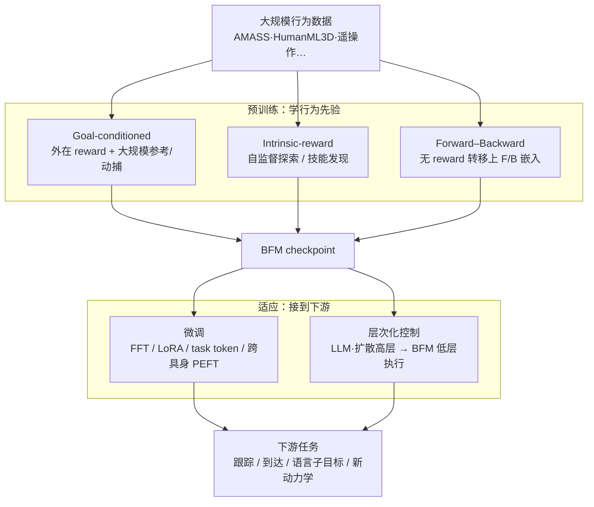

# A Survey of Behavior Foundation Model（TPAMI 2025）

**A Survey of Behavior Foundation Model: Next-Generation Whole-Body Control System of Humanoid Robots**（Yuan et al., arXiv:2506.20487，IEEE TPAMI 2025）是人形 **whole-body control（WBC）** 方向首篇以 **Behavior(al) Foundation Model（BFM）** 为中心的系统性综述。论文给出 BFM 定义、从传统控制到学习式通用ist 的演化叙事，按 **预训练三线 + 适应两线** taxonomy 梳理 40+ 篇代表工作，讨论数据集、真机部署与开放问题，并维护 [awesome-bfm-papers](https://github.com/friedrichyuan/awesome-bfm-papers) 持续更新索引。

## 一句话定义

**BFM 综述** 把「大规模行为数据预训练 → 零样本或快速适应多下游 WBC 任务」确立为人形控制的下一代范式标签，并用统一 taxonomy 连接 goal-conditioned 跟踪、无 reward 的 forward–backward 表征与层次化语言/扩散调用栈。

## 英文缩写速查

| 缩写 | 英文全称 | 简要说明 |
|------|----------|----------|
| BFM | Behavior Foundation Model | 大规模行为数据预训练的可复用全身行为先验 |
| WBC | Whole-Body Control | 人形多关节协调控制，综述核心问题域 |
| VLA | Vision-Language-Action | 操作向基础策略，与 BFM 低层执行常分层组合 |
| FEN/BEN | Forward/Backward Embedding Network | 无 reward 转移上的前向/后向嵌入网络 |
| GC | Goal-conditioned Learning | 以外在目标/参考条件化全身技能扩展 |
| TPAMI | IEEE Transactions on Pattern Analysis and Machine Intelligence | 综述发表期刊 |

## 为什么重要

- **填补 WBC 泛化叙事空白：** 任务专用 RL/IL 在 DeepMimic、AMP、HOVER 等线已能做出高难度动作，但换场景往往要重训；综述把 **一次预训练 + 适应** 上升为领域主线。
- **taxonomy 成为社区共识坐标：** [awesome-bfm-papers](https://github.com/friedrichyuan/awesome-bfm-papers) 与公众号/本库 [BFM 技术地图](../overview/bfm-41-papers-technology-map.md) 均对齐 **Fig.3 预训练三线 + 适应两线**。
- **与 VLA 分工明确：** VLA 整合视觉–语言–动作，多面向操作/相对稳定平台；BFM 主攻 **locomotion、操作、交互的全身低层控制**。
- **活索引降低跟踪成本：** 综述配套列表截至 2026-07 已增至 **42 篇论文 + 10 数据集**（较初版 41 篇新增 [Any2Any](../entities/paper-any2any-cross-embodiment-wbt.md) 跨具身微调条目）。

## 流程总览（taxonomy）

## 核心信息

| 字段 | 内容 |
|------|------|
| 机构 | 逐际动力（LimX Dynamics）、宁波东方理工大学、香港大学、EPFL、浙江大学等 |
| 期刊 | IEEE TPAMI，2025 |
| arXiv | <https://arxiv.org/abs/2506.20487> |
| 配套列表 | [awesome-bfm-papers](https://github.com/friedrichyuan/awesome-bfm-papers) |
| 本库概念归纳 | [Behavior Foundation Model](../concepts/behavior-foundation-model.md) |

## 预训练三线（Section III-A）

| 路线 | 训练信号 | 代表（awesome 列表） | 本库入口 |
|------|----------|----------------------|----------|
| **Goal-conditioned** | 外在 reward + 参考运动/目标 | SONIC、OpenTrack、AMS、BFM4Humanoid、HOVER、MaskedMimic | [SONIC](../methods/sonic-motion-tracking.md)、[BFM 论文](../entities/paper-behavior-foundation-model-humanoid.md) |
| **Intrinsic-reward** | 好奇心、多样性、覆盖 | DIAYN、RND、ICM、ProtoRL、RE3 | [BFM 概念页](../concepts/behavior-foundation-model.md) § intrinsic 线 |
| **Forward–backward** | 无 reward 转移；F/B + 测试时 reward 组合 | BFM-Zero、MetaMotivo、FB-IL 系列 | [BFM-Zero](../entities/paper-bfm-zero.md) |

## 适应两线（Section III-B）

| 路线 | 机制 | 代表 |
|------|------|------|
| **微调** | FFT、LoRA、潜空间/task token、跨具身 PEFT | Task Tokens、Fast Adaptation、Unseen Dynamics、[Any2Any](../entities/paper-any2any-cross-embodiment-wbt.md) |
| **层次化控制** | 高层 LLM/扩散 → BFM 低层 tracker | SENTINEL、BeyondMimic、LangWBC、LeVERB、CloSD、UniPhys |

## 局限与开放问题（摘要）

- **数据与 Sim2Real：** 动捕/遥操作成本、真机安全与伦理约束仍限制 scaling。
- **层次栈接口：** 语言/子目标 → 低层 BFM 的标准化协议尚未成熟。
- **评测统一：** locomotion 向「基础模型」与操作向 VLA 的 **统一 benchmark** 仍缺位。

## 评测现状（综述归纳）

综述并未提出统一榜单，而是梳理各路线沿用的评测口径与其割裂之处：

| 路线 | 常见评测口径 | 综述指出的问题 |
|------|--------------|----------------|
| **Goal-conditioned 跟踪** | 参考运动跟踪误差（MPJPE/关键点）、成功率、真机稳定性 | 数据集与动作库不统一，跨工作难横比 |
| **Intrinsic-reward** | 技能覆盖度、下游 zero/few-shot 回报 | 缺 WBC 场景下的标准探索指标 |
| **Forward–backward** | 测试时 reward 组合的 zero-shot 回报、适应速度 | 与 goal-conditioned 线口径不互通 |

- **核心结论：** locomotion 向「基础模型」与操作向 VLA 各自沿用局部 benchmark，**统一 WBC 评测协议仍缺位**，是综述反复强调的开放问题。

## 与相关工作对比

- **与 VLA/操作向基础策略：** VLA 整合视觉–语言–动作、多面向操作与相对稳定平台；BFM 主攻 **locomotion / 操作 / 交互的全身低层控制**，二者常 **分层组合**（高层 VLA/LLM → 低层 BFM 执行）。
- **与既有 WBC 综述：** 早期综述多按 **控制方法（MPC/WBC 优化/RL）** 组织；本文首次以 **预训练三线 + 适应两线** 的 **基础模型** 视角重排文献，形成社区共识坐标。
- **与本库其他入口分工：** [BFM 技术地图](../overview/bfm-41-papers-technology-map.md) 按五类问题导读、[Behavior Foundation Model 概念页](../concepts/behavior-foundation-model.md) 做机制归纳，本页保留 **综述元信息与 taxonomy 原貌**。

## 关联页面

- [Behavior Foundation Model](../concepts/behavior-foundation-model.md) — 本库 BFM 概念归纳（编译自本综述）
- [BFM 41 篇技术地图](../overview/bfm-41-papers-technology-map.md) — 五类问题导读
- [BFM（CVAE 人形 WBC）](../entities/paper-behavior-foundation-model-humanoid.md) — goal-conditioned 真机代表
- [人形 RL 身体系统栈](../overview/humanoid-rl-motion-control-body-system-stack.md)
- [Foundation Policy](../concepts/foundation-policy.md) — 与 VLA 操作向基础策略边界

## 参考来源

- [bfm_survey_arxiv_2506_20487.md](../../sources/papers/bfm_survey_arxiv_2506_20487.md)
- [awesome_bfm_papers.md](../../sources/repos/awesome_bfm_papers.md)

## 推荐继续阅读

- [A Survey of Behavior Foundation Model（PDF）](https://arxiv.org/pdf/2506.20487) — 综述全文
- [awesome-bfm-papers](https://github.com/friedrichyuan/awesome-bfm-papers) — 持续更新论文/数据集表
