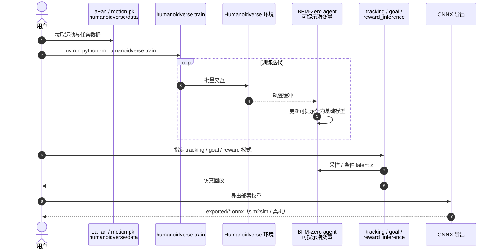

---

type: entity
tags: [paper, humanoid, rl, motion-control, body-system-stack, bfm, behavior-foundation-model, meta, cmu]
status: complete
updated: 2026-07-23
arxiv: "2511.04131"
venue: "2025 · arXiv"
code: https://github.com/LeCAR-Lab/BFM-Zero
summary: "BFM-Zero：latent prompt 统一目标姿态、奖励优化、恢复与少样本适配；在 RL 身体系统栈属参考跟踪层，在 BFM 谱系属 Forward-backward 表征。"
related:
  - ../overview/humanoid-motion-cerebellum-technology-map.md
  - ../overview/motion-cerebellum-category-05-promptable-control.md
  - ../overview/humanoid-rl-motion-control-body-system-stack.md
  - ../overview/humanoid-amp-motion-prior-survey.md
  - ../overview/bfm-41-papers-technology-map.md
  - ../overview/bfm-category-01-forward-backward-representation.md
  - ../concepts/behavior-foundation-model.md
  - ../entities/paper-behavior-foundation-model-humanoid.md
  - ../entities/paper-tech-humanoid-control.md
sources:
  - ../../sources/papers/humanoid_rl_stack_19_bfm_zero_a_promptable_behavioral_foundation_mode.md
  - ../../sources/papers/humanoid_rl_stack_42_catalog.md
  - ../../sources/papers/bfm_awesome_bfm_zero_arxiv_2511_04131.md
  - ../../sources/papers/bfm_awesome_41_catalog.md
  - ../../sources/blogs/wechat_embodied_ai_lab_humanoid_rl_motion_survey.md
  - ../../sources/blogs/wechat_embodied_ai_lab_bfm_41_papers_survey.md
  - ../../sources/papers/motion_cerebellum_64_catalog.md
  - ../../sources/blogs/wechat_embodied_ai_lab_humanoid_motion_cerebellum_survey.md
---

# BFM-Zero

**BFM-Zero**（*A Promptable Behavioral Foundation Model for Humanoid Control*，arXiv:2511.04131）训练可提示的行为基础模型，用 latent prompt 统一目标姿态、奖励优化、恢复与少样本适配。

> **同主题深读：** [paper-behavior-foundation-model-humanoid](../entities/paper-behavior-foundation-model-humanoid.md) — 同题材（人形 BFM）的另一篇论文深读页，两者并非同一工作；本页保留本文的 survey 坐标与交叉引用。

## 一句话定义

BFM-Zero 是这批论文里概念最值得单独拎出来的一篇。它的目标是训练一个 promptable behavioral foundation model for humanoid control。

## 英文缩写速查

| 缩写 | 英文全称 | 简要说明 |
|------|----------|----------|
| BFM | Behavior Foundation Model | 大规模行为数据预训练的可复用全身行为先验 |
| RL | Reinforcement Learning | 通过与环境交互最大化长期回报来学习策略的范式 |
| AMP | Adversarial Motion Prior | 用对抗判别约束状态转移接近专家运动分布的先验 |

## 为什么重要

- 在 [人形 RL 身体系统栈](../overview/humanoid-rl-motion-control-body-system-stack.md) 中属于 **02 参考跟踪 · 通用控制**（#19/42）。
- BFM-Zero 是这批论文里概念最值得单独拎出来的一篇。它的目标是训练一个 promptable behavioral foundation model for humanoid control。
- 它不是为每个任务单独训练策略，而是通过无监督强化学习学一个统一 latent space，让运动追踪、目标姿态、奖励优化等任务都能映射到同一个行为空间。
- 它的关键思想是 Forward-Backward representation。给定某类 reward 或 prompt，系统可以在 latent space 里找到对应的 z，策略再以 z 为条件执行行为。

## 核心信息（索引级）

| 字段 | 内容 |
|------|------|
| 论文 | <https://arxiv.org/abs/2511.04131> |
| 项目页 | <https://lecar-lab.github.io/BFM-Zero/> |
| 代码 | <https://github.com/LeCAR-Lab/BFM-Zero> |
| 机构 | CMU；Meta |

### 在 42 篇 RL 运动控制身体系统栈中

| 字段 | 内容 |
|------|------|
| 编号 | 19/42 |
| 系统栈层 | 02 参考跟踪 · 通用控制 |
| 索引来源 | [具身智能研究室 · 42 篇 humanoid RL 运动控制长文](https://mp.weixin.qq.com/s/hz9JXtJeUPRfUGzfD-pZuA) |

### 在 BFM 41 篇技术地图中

| 字段 | 内容 |
|------|------|
| 编号 | 01/41 |
| 分组 | 01 Forward-backward 表征 |
| 索引来源 | [awesome-bfm-papers](https://github.com/friedrichyuan/awesome-bfm-papers) |

## 核心机制（归纳）

### 1）策展导读要点

BFM-Zero 是这批论文里概念最值得单独拎出来的一篇。它的目标是训练一个 promptable behavioral foundation model for humanoid control。

### 2）策展导读要点

它不是为每个任务单独训练策略，而是通过无监督强化学习学一个统一 latent space，让运动追踪、目标姿态、奖励优化等任务都能映射到同一个行为空间。

### 3）策展导读要点

它的关键思想是 Forward-Backward representation。给定某类 reward 或 prompt，系统可以在 latent space 里找到对应的 z，策略再以 z 为条件执行行为。

### 4）策展导读要点

语言模型有 token，视觉模型有 patch，人形机器人可能也需要一种行为 token 或 latent action。上层系统不一定直接输出 29 个关节目标，而是输出“向前走、低重心、右手支撑、保持柔顺、恢复站立”这类身体意图的 latent prompt。

## 源码运行时序图

官方仓库 [LeCAR-Lab/BFM-Zero](https://github.com/LeCAR-Lab/BFM-Zero)（Humanoidverse）：训练入口 `uv run python -m humanoidverse.train`；推理分 `tracking_inference` / `goal_inference` / `reward_inference`；可导出 ONNX。LaFan 等运动数据经 Git LFS / HF 拉取。一次完整运行如下（命令以仓库 README 为准）：

- **同一模型多推理头**：训练一次，推理脚本按任务接口切换，而不是为每个下游重训整网。
- **ONNX 为部署边界**：Python 训练与导出后的仿真/真机栈解耦。

## 常见误区

1. Motion tracking 论文的泛化常指 **参考分布内**；换数据源或接触条件仍可能崩塌。

## 实验与评测

- 本页在公众号/survey **策展编译**基础上补充机制归纳；**量化 benchmark、消融与实机指标以原文 PDF / 项目页为准**（链接见 [参考来源](#参考来源)）。
- 与同栈姊妹篇对照时，请回到对应 **技术地图 / 42 篇栈 / BFM 地图 / VLN 地图** 总览中的实验段落。

## 与其他页面的关系

- RL 身体系统栈：[humanoid-rl-motion-control-body-system-stack.md](../overview/humanoid-rl-motion-control-body-system-stack.md)
- BFM 技术地图：[bfm-41-papers-technology-map.md](../overview/bfm-41-papers-technology-map.md)
- BFM 概念：[behavior-foundation-model.md](../concepts/behavior-foundation-model.md)
- 同框架 TLDR 姊妹线：[TeCH（RoboParty Lab）](./paper-tech-humanoid-control.md)
- 同实验室少样本域适应：[FADA（Planner–IDM）](./paper-fada-humanoid.md)（arXiv:2606.28476）
- AMP 姊妹篇：[humanoid-amp-motion-prior-survey.md](../overview/humanoid-amp-motion-prior-survey.md)
- Real2Sim 适配器语境：[Agentic Real2Sim](./paper-agentic-real2sim.md) — 人形适配器引用 BFM-Zero 风格运动上下文（arXiv:2607.19190）

## 参考来源

- [humanoid_rl_stack_19_bfm_zero_a_promptable_behavioral_foundation_mode.md](../../sources/papers/humanoid_rl_stack_19_bfm_zero_a_promptable_behavioral_foundation_mode.md) — 42 篇栈策展摘录
- [humanoid_rl_stack_42_catalog.md](../../sources/papers/humanoid_rl_stack_42_catalog.md) — 42 篇总表
- [bfm_awesome_bfm_zero_arxiv_2511_04131.md](../../sources/papers/bfm_awesome_bfm_zero_arxiv_2511_04131.md) — awesome-bfm 策展摘录
- [bfm_awesome_41_catalog.md](../../sources/papers/bfm_awesome_41_catalog.md) — 41+10 总表
- [wechat_embodied_ai_lab_humanoid_rl_motion_survey.md](../../sources/blogs/wechat_embodied_ai_lab_humanoid_rl_motion_survey.md) — RL 运动控制微信公众号编译导读
- [wechat_embodied_ai_lab_bfm_41_papers_survey.md](../../sources/blogs/wechat_embodied_ai_lab_bfm_41_papers_survey.md) — BFM 41 篇微信公众号编译导读
- 原始抓取：[wechat_humanoid_rl_42_survey_2026-05-26.md](../../sources/raw/wechat_humanoid_rl_42_survey_2026-05-26.md)
- 论文：<https://arxiv.org/abs/2511.04131>

## 推荐继续阅读

- [42 篇 RL 运动控制（微信公众号）](https://mp.weixin.qq.com/s/hz9JXtJeUPRfUGzfD-pZuA)
- [awesome-bfm-papers](https://github.com/friedrichyuan/awesome-bfm-papers) — 完整列表与数据集表
- [A Survey of Behavior Foundation Model](https://arxiv.org/abs/2506.20487) — TPAMI 2025 综述
- [19 篇 AMP 运动先验姊妹篇](https://mp.weixin.qq.com/s/YZsm3855iP3TNTTt1aou7w)
