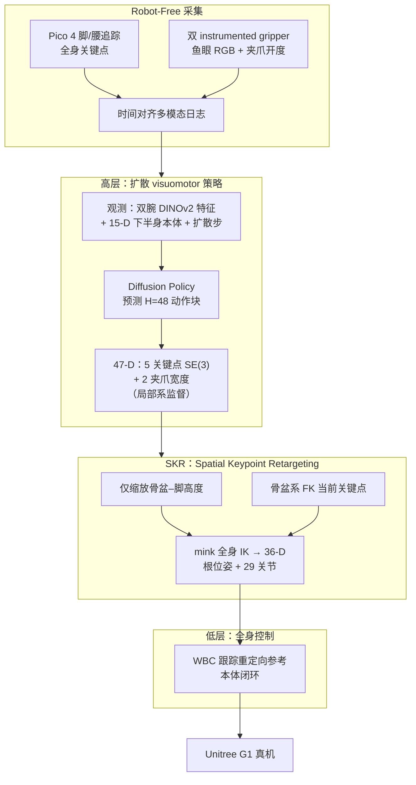

# BifrostUMI（Bridging Robot-Free Demonstrations and Humanoid Whole-Body Manipulation）

**BifrostUMI** 是 BAAI Aether 团队提出的人形 **全身 visuomotor** 数据采集与部署框架（arXiv:2605.03452，[项目页](https://baai-aether.github.io/BifrostUMI/)）：在 **Universal Manipulation Interface（UMI）** 的「无目标机器人、便携示教」思想之上，用 **VR 追踪 +  instrumented gripper** 同步记录 **稀疏关键点轨迹** 与 **双腕视觉**，训练 **扩散高层策略**，再通过 **Spatial Keypoint Retargeting（SKR）** 与 **全身控制器** 将行为迁移到 **Unitree G1**。

## 英文缩写速查

| 缩写 | 英文全称 | 简要说明 |
|------|----------|----------|
| G1 | Unitree G1 Humanoid | 宇树入门级教育科研人形平台 |
| IK | Inverse Kinematics | 满足末端/姿态约束求解关节角的运动学逆解 |
| Manipulation | Robot Manipulation | 抓取、移动、操作物体的任务总称 |
| Retargeting | Motion Retargeting | 将人体/动物动作映射到目标机器人骨架 |
| WBC | Whole-Body Control | 协调全身关节满足多任务/约束的控制基础设施 |
| GMR | General Motion Retargeting | 把人体/视频动作重定向为机器人可执行参考 |
| BFM | Behavior Foundation Model | 大规模行为数据预训练的可复用全身行为先验 |
| SDK | Software Development Kit | 软件开发工具包 |
| RGB | Red-Green-Blue | 彩色图像通道，常与深度 (RGB-D) 配合 |
| MuJoCo | Multi-Joint dynamics with Contact | 接触丰富的刚体物理仿真引擎 |
| Sim2Real | Simulation to Real | 把仿真中学到的策略迁移落地真机的工程主线 |

## 为什么重要

- **数据飞轮入口前移**：相对 [OmniH2O](https://arxiv.org/abs/2406.08858) 等 **真机 VR 遥操作**，采集阶段 **不需要人形硬件**，降低机房规模化的门槛；相对桌面 UMI，覆盖 **骨盆与双脚关键点**，面向 **loco-manipulation** 而非固定基座臂。
- **可解释的三层级**：模仿人类运动组织——**高层 visuomotor 策略**（意图/任务空间）→ **SKR**（跨形态几何桥）→ **低层 WBC**（动力学执行），便于调试「策略错」还是「重定向/WBC 错」。
- **SKR 保留度量结构**：对比 [GMR](../methods/motion-retargeting-gmr.md) 等全局缩放，SKR **只补偿身高（骨盆–脚垂直距离）**，其余关键点间 **度量关系不变**，减轻示范中的空间几何被扭曲——这对 **桌下伸身、迈步后退** 等任务很关键。
- **与 BFM 等 WBC 基础模型互补**：[BFM](./paper-behavior-foundation-model-humanoid.md) 解决「多控制接口的统一低层生成」；BifrostUMI 解决「**无机器人阶段** 如何攒全身操作示范并接到现成 WBC 上」。
- **与真机遥操作采集的分工**：论文 Related Works 将 [TWIST2](./paper-twist2.md)、CLONE、Touch Dreaming 归为 **机器人内环遥操作**（具身一致但硬件门槛高）；BifrostUMI 把采集 **前移到无 G1 阶段**，与便携全身遥操作形成 **成本–一致性** 谱系两端。

## 流程总览

## 核心机制（归纳）

### 1）Robot-Free 采集栈

| 模态 | 来源 | 用途 |
|------|------|------|
| 全身关键点 | Pico SDK，脚×2 + 腰×1，对齐机器人系 | 高层动作监督、SKR 状态 |
| 腕部 RGB | 夹爪鱼眼相机 | 高层视觉条件（与 UMI 同思路） |
| 夹爪开度 | 磁编码器 | 抓取/释放相位 |

三路 **同步记录**；训练与部署时高层仅依赖 **可机载复现** 的观测（腕部图 + 部分本体），采集阶段却 **从未需要 G1**。

### 2）高层：全身 Diffusion Policy

- **观测**：左右腕 RGB → **DINOv2**；融合 **15-D 下半身本体** 与扩散时间步，作为全局条件。
- **动作（47-D）**：**骨盆、左右 TCP、左右脚** 五个关键点，各 **3D 平移 + 6D 连续旋转**，加 **2 个夹爪标量**。
- **时序**：每步预测 **H = 48** 的 receding-horizon chunk；训练目标在 **各关键点自身局部系** 编码，减弱录制时世界系姿态差异。
- **关系**：[Diffusion Policy](../methods/diffusion-policy.md) 的 action-chunk + 多模态条件化；此处动作空间是 **稀疏任务关键点** 而非全关节角。

### 3）SKR：跨形态但不扭曲几何

- **动机**：无机器人设置下，传统重定向的全局/局部缩放常 **破坏示范中的度量空间信息**（抓取高度、伸距、脚位）。
- **做法**：用五个任务关键点表示运动；**仅** 按人–机身高差缩放 **骨盆到脚** 的垂直距离，**其余关键点相对几何保持不变**。
- **闭环接口**：从 Unitree SDK 读关节 → 骨盆系 **FK** 得当前关键点 → 与高层预测合成目标 → **mink**（MuJoCo IK）解 **36-D**（根平移/朝向 + 29 关节）→ 送低层 WBC。

### 4）低层全身控制

重定向参考由 **全身控制器** 跟踪，利用本体反馈维持动态稳定；论文展示 **杂乱桌面 pick-place** 与 **桌下全身扔垃圾**——后者需要 **屈膝、躯干前倾、迈步**，超出纯臂工作空间。

## 常见误区或局限

- **不是「端到端关节扩散」**：高层在 **稀疏关键点** 上扩散，执行质量仍依赖 **SKR + WBC** 标定；三层任一环节偏差都会表现为「看起来对但站不稳/够不着」。
- **代码未开源（截至项目页）**：复现需等待官方仓库；硬件清单（Pico + 定制夹爪）仍有一定装配成本，虽低于整机遥操作机房。
- **与 UMI 的边界**：UMI 强调 **跨臂形态迁移**；BifrostUMI 固定 **G1 + 五关键点** 表示，跨人形泛化需重新验证 SKR 与 WBC 接口。
- **仍需要部署期真机**：只是 **采集** 无机器人；策略上线仍需 G1 与控制器调参。

## 关联页面

- [Teleoperation](../tasks/teleoperation.md) — 无机器人示范 vs VR 真机遥操作谱系
- [Loco-Manipulation](../tasks/loco-manipulation.md) — 桌下全身任务与移动操作
- [Motion Retargeting](../concepts/motion-retargeting.md) — SKR 在重定向方法谱系中的位置
- [Diffusion Policy](../methods/diffusion-policy.md) — 高层策略范式
- [Whole-Body Control](../concepts/whole-body-control.md) — 低层执行
- [GMR](../methods/motion-retargeting-gmr.md) — 对比：全局缩放 vs SKR 度量保留
- [Unitree G1](./unitree-g1.md) — 实验平台
- [BFM](./paper-behavior-foundation-model-humanoid.md) — 另一路人形 WBC 多接口统一
- [TWIST2](./paper-twist2.md) — 真机便携全身遥操作 + 数据规模化对照

## 实验与评测

- 量化指标、消融与 sim2real / 实机结果见 **原文 PDF** 与 [参考来源](#参考来源)；本页正文侧重方法结构与知识库交叉引用。

## 与其他工作对比

- 正文已给出与相邻路线 / baseline 的 **定性对照**；定量表格与 ablation 见原文（[参考来源](#参考来源)）。

## 参考来源

- [sources/papers/bifrost_umi_arxiv_2605_03452.md](../../sources/papers/bifrost_umi_arxiv_2605_03452.md)
- [sources/sites/bifrost-umi-project.md](../../sources/sites/bifrost-umi-project.md)
- Yu et al., *BifrostUMI: Bridging Robot-Free Demonstrations and Humanoid Whole-Body Manipulation*, arXiv:2605.03452, 2026. <https://arxiv.org/abs/2605.03452>

## 推荐继续阅读

- [BifrostUMI 项目主页](https://baai-aether.github.io/BifrostUMI/)
- Chi et al., *Universal Manipulation Interface* (RSS 2024) — <https://umi-gripper.github.io/>
- [UMI 论文](https://arxiv.org/abs/2402.10329) — 无机器人手持示教先例
- He et al., *OmniH2O* (2024) — 真机全身 VR 遥操作对照
