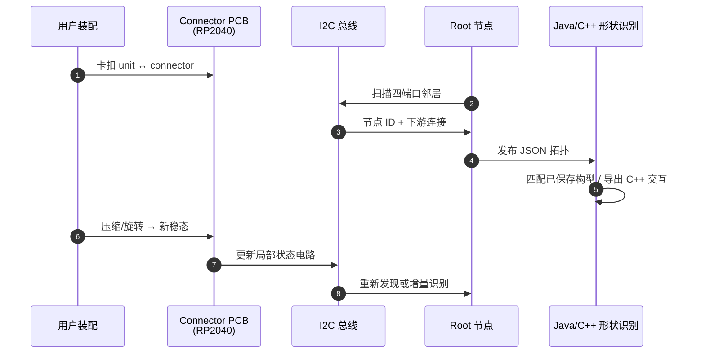

# Bifur-circuits：可 bifurcate 的交互式模块化超材料积木

**Bifur-circuits**（*Interactive and Modular Metamaterial Building Blocks Via Bifurcated Geometries*，UIST 2026）由 MIT HCIE（Stefanie Mueller 组）牵头，Marwa AlAlawi 等提出；合作机构含东京大学与密歇根大学。

## 一句话定义

**Bifur-circuits 把 auxetic kirigami 单元与内走线 connector 做成可任意组合的超材料积木：机械 bifurcation 让构型数随单元指数增长，同时内嵌 I2C 电路让结构在变形后仍能自报当前拓扑。**

## 英文缩写速查

| 缩写 | 英文全称 | 简要说明 |
|------|----------|----------|
| UIST | ACM Symposium on User Interface Software and Technology | 界面软件技术顶会 |
| I2C | Inter-Integrated Circuit | connector 间拓扑发现与状态通信总线 |
| PCB | Printed Circuit Board | RP2040 等元件贴于 connector 顶面 |
| FDM | Fused Deposition Modeling | 多材料 3D 打印制造路线 |
| TPU | Thermoplastic Polyurethane | 柔性铰链与非导电结构体 |
| RP2040 | Raspberry Pi RP2040 | connector 上使用的微控制器 |
| HCI | Human-Computer Interaction | 论文主社区；工具链面向交互原型 |

## 为什么重要

- **突破「三态 auxetic」上限：** 传统 auxetic 单元 fabrication 后通常只有固定少数稳态；bifurcation 在装配层面把可表达几何从 $O(1)$ 拉到近似 $3^{mnp}$。
- **机械与电气模块化首次统一：**  prior modular electronics（如 littleBits）与 modular mechanics 分离；Bifur-circuits 在 **无外部走线** 前提下，旋转/压缩/弯曲后仍保持 unique 有效电路。
- **对机器人研究的间接价值：** MIT News 与论文应用指向 **可重构夹爪**、模块化 soft robot 皮肤、康复辅助具与 **无 bulky 机械件的可重构天线**——适合作为「硬件即软件」原型范式，而非直接可部署的工业夹爪。
- **可制造性闭环：** Fusion 360 参数化导出 + 多材料 FDM BOM + Java/C++ 形状识别 UI，降低 HCI→硬件迭代成本。

## 核心信息

| 项 | 内容 |
|----|------|
| 机构 | 麻省理工（MIT）HCIE / CSAIL；东京大学；密歇根大学 |
| 发表 | UIST 2026 |
| 硬件 | auxetic kirigami unit + Type AB / Type C connector；Filaflex 导电 + TPU/PLA 结构 |
| 计算 | RP2040 PCB / 块；I2C 递归拓扑扫描 → JSON |
| 软件 | Fusion 360 编辑器；Java+Processing 3D 预览；C++ 交互模板导出 |
| 评测 | 10k 次压缩/反向循环电导保持；20 单元链 ~5 s 形状识别 |
| 开源 | **待发布**（2026-09-17：项目页 Open Source / PDF / DOI 按钮无 URL） |

## 流程总览

## 核心机制

### 1）双层机械可重构

- **装配级：** 增删 metamaterial unit 与 connector，沿 XYZ 搭 1D/2D/3D 拓扑。
- **构型级：** 对 assembly 施加力过 bifurcation 阈值后，单元在 open/closed 态间切换，整体分裂为新 **稳定** 构型；相邻单元 perpendicular 连接时构型组合爆炸式增长。

### 2）电气模块化与状态编码

- 每个 T-joint 8 路导电 patch（VCC/GND/SDA/SCL/R1/R2/J1/J2）；单元三态由 **哪对内缘接触** 决定 unique 局部电路。
- Connector 四端口独立 Data/Clock；root 节点询问邻居 ID 与下游连接，递归生成全局 map（$O(n)$ I2C 发现，与评测线性延迟一致）。
- 设计约束：导电铰链需 Filaflex 等柔性导体；相邻单元间绝缘防短路。

### 3）交互 affordance

论文归纳四类：**compression**、**stretching**、**rotation**、**bending**（含长宽比 >3:1 的结构挠曲与 directional compliance）。

## 源码运行时序图

**不适用**（截至 2026-09-17）：项目页「Open Source」按钮 **无 GitHub/Zenodo URL**，Fusion 360 插件与 Java/C++ 识别工具 **尚未公开发布**。下文为论文描述的 **运行时数据流**（非可复现仓库入口）：

## 实验与评测

| 维度 | 结果 / 口径 |
|------|-------------|
| 电耐久 | 10k 次 texture-analyzer 压缩（同向、反向、交替）+ 手动 10k 次；每 1k 万用表测四关节，**无 connectivity 退化** |
| 识别延迟 | 20 PCB 链（27 kΩ 模拟打印电阻）：$t \approx 256.2m - 472$ ms，$R^2=0.9727$；20 单元 ≈ **5 s** |
| 应用级 | 24 单元家具三态（茶桌 / 阅读椅+储物 / 折叠收纳）驱动门牌消息；4 态 tangible 控制器映射不同小游戏 |
| 未报机器人 benchmark | 无标准 grasp 成功率或工业夹爪对比；机器人价值来自 **可重构几何 + 自感知** 原型能力 |

## 工程实践

| 项 | 内容 |
|----|------|
| 项目页 | [hcie.csail.mit.edu/.../bifur-circuits.html](https://hcie.csail.mit.edu/research/Bifur-circuit/bifur-circuits.html) |
| 视频 | [YouTube](https://youtu.be/eCUYbfXCvME) |
| 制造 | 单元：TPU 95A + Filaflex 92A，导电 trace ≥1.5 mm；connector：PLA + Filaflex；双稳/三稳需 mid-print 插 N45 磁铁 |
| 电源 | 每块 ~62 mAh LiPo（连续感知 ~45 min）；高电阻导电 TPU 限制 **跨块供电**，I2C 仍可工作 |
| 开源状态 | **待发布** — 见 [sources/sites/bifur-circuits.md](../../sources/sites/bifur-circuits.md) 核查记录 |
| 源码运行时序图 | **不适用**（官方代码链未发布） |

## 局限与风险

- **代码与 PDF 未公开：** 截至入库日无法复现 Fusion 插件与识别 UI；lint 后续应跟进 Open Source 链。
- **识别延迟：** 全拓扑扫描随单元线性变慢；已知子集构型可减活跃 MCU 数，但通用场景 20+ 单元已达秒级。
- **供电与材料：** 3.9 Ω·cm 级电阻率使 Vcc/GND 跨长链不可靠；未来需更低阻导体或集中供电架构。
- **TPU 形状记忆：** 最近压缩构型有 12h+ 偏置，需手动「holding reset」或视为 tunable feature。
- **机器人落地 gap：** 演示为 HCI 尺度原型（家具、控制器）；**夹爪/soft robot 仍为愿景**，无负载、精度或工业接口指标。

## 结论

**Bifur-circuits 把「可 bifurcate 的 auxetic 超材料」与「无重布线电气模块化」合成一套可 3D 打印的交互积木，构型感知与 10k 次变形耐久是硬指标，但官方代码待发布、机器人端仍处原型叙事。**

- 真贡献在 **机械 bifurcation × 内走线 I2C** 的统一设计，而非单点算法。
- 10k 循环电导与线性延迟是工程选型首要依据；秒级识别限制实时 closed-loop 控制。
- 机器人读者应将其与 **可重构夹爪 / modular soft robot / 辅助具** 原型路线对齐，勿期待即插即用工业末端执行器。
- 开源链发布后需补 `sources/repos/` 与可运行 **源码运行时序图**。
- HCI 工具链（Fusion + Java/C++）发布前，仅能通过项目页与视频理解交互设计工作流。

## 与其他页面的关系

- UIST / HCI 方法参照：[SHRIMP](./paper-shrimp.md)（仿真-真机 HRI 栈）、[CPS4All](./paper-cps4all.md)（无障碍 CPS 工作坊）
- 模块化硬件制造：[Peg-in-Bench](./paper-peg-in-bench.md)（3D 打印模块化 benchmark 另一路线）
- 灵巧操作数据采集语境：[dexterous-data-collection-guide.md](../queries/dexterous-data-collection-guide.md)
- 操作任务索引：[manipulation.md](../tasks/manipulation.md)

## 参考来源

- [bifur_circuits_uist_2026.md](../../sources/papers/bifur_circuits_uist_2026.md)
- [bifur-circuits.md（项目页）](../../sources/sites/bifur-circuits.md)
- [MIT News（2026-08-27）](https://news.mit.edu/2026/mit-engineers-create-system-for-building-shape-changing-smart-devices-0827)

## 推荐继续阅读

- [Bifur-circuits 项目页](https://hcie.csail.mit.edu/research/Bifur-circuit/bifur-circuits.html) — 完整方法、BOM 与评测图
- [演示视频](https://youtu.be/eCUYbfXCvME) — 家具 morph 与 tangible 控制器
- [Meta-antenna（UIST 2025，同组前序）](https://doi.org/10.1145/3746059.3747760) — 可重构 auxetic 天线，构型仅 3 态，为本工作动机
