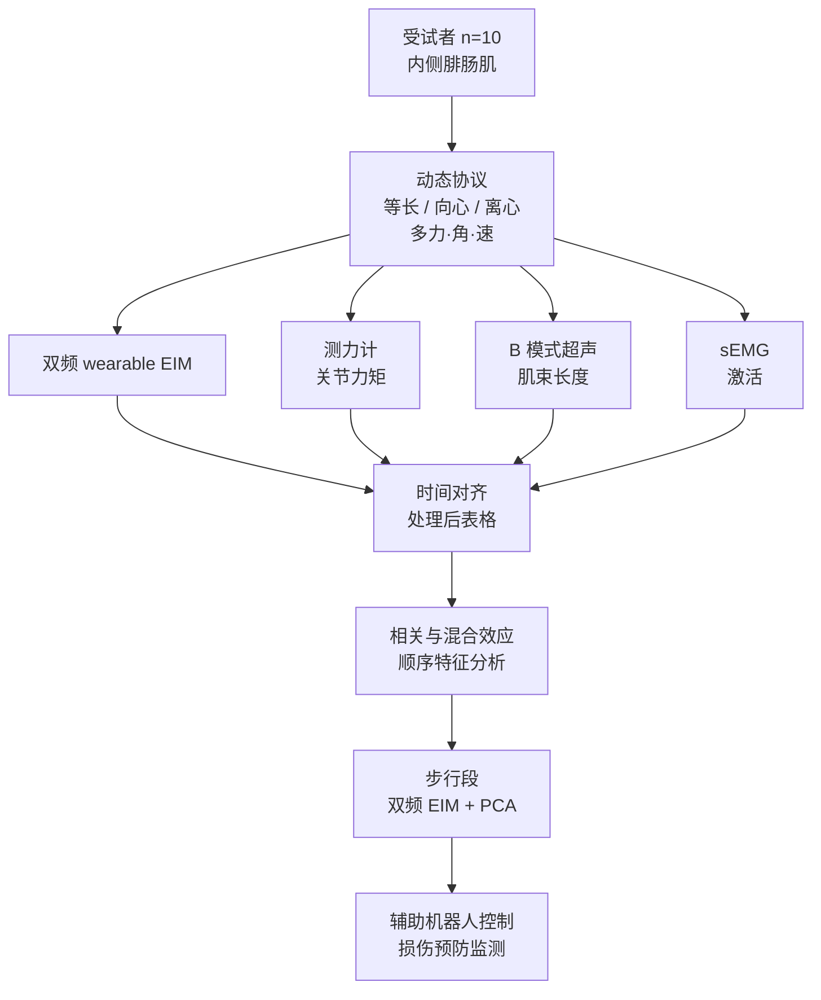
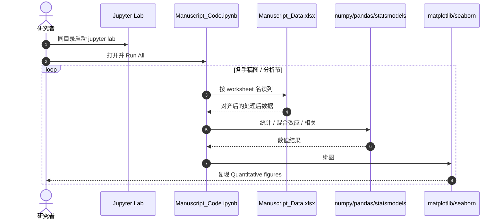

# Bioimpedance meets biomechanics（可穿戴 EIM）

**Bioimpedance meets biomechanics: Wearable electrical impedance myography encodes fascicle and activation dynamics**（Christopher J. Nichols、Nicholas Harris、H. Trask Crane 等；**佐治亚理工学院**等，**Science Robotics 2026** Vol. 11 Issue 118，[DOI:10.1126/scirobotics.aea4580](https://doi.org/10.1126/scirobotics.aea4580)）在 **功能性动态运动** 中，用生物力学金标准把 **电阻抗肌电图（EIM）** 从「黑箱估力」推进到 **可解释的肌束长度动力学 + 神经肌肉激活** 传感，并展示 **步行** 场景下 **双频 EIM + PCA** 的实时跟踪潜力。

## 一句话定义

**双频可穿戴 EIM 在多种动态收缩中与超声肌束长度、sEMG 激活普遍对齐，而关节力矩只在部分工况相关；混合效应与特征分析把 EIM 方差主因锁定为 fascicle length 与 activation，步行 PCA 进一步把该信号变成辅助机器人可用的低维生物力学状态。**

## 英文缩写速查

| 缩写 | 英文全称 | 简要说明 |
|------|----------|----------|
| EIM | Electrical Impedance Myography | 电阻抗肌电图；通过组织阻抗变化反映肌肉状态 |
| EMG | Electromyography | 肌电图；本文以表面 EMG 作激活金标准 |
| PCA | Principal Component Analysis | 主成分分析；步行段降维融合双频 EIM |
| BIA | Bioimpedance Analysis | 生物阻抗分析；EIM 属其在肌肉上的动态应用 |
| MG | Medial Gastrocnemius | 内侧腓肠肌；本文主要测量靶肌 |

## 为什么重要

- **辅助机器人缺「可穿戴、非侵入、可解释」的肌层状态：** 力矩或疲劳若只靠 EMG/力台，布线、漂移与标定成本限制日常闭环；EIM 贴片化但长期缺乏与 **肌束 kinematics** 的机理对齐。
- **纠正「EIM ≈ 关节力矩」的简单叙事：** 摘要明确力矩相关 **条件依赖**；工程上更应把 EIM 当作 **长度变化动力学 + 激活** 的并行观测。
- **与本库遥操作 / 多模态人体线衔接：** 与 [HUMAPS-4D](./paper-humaps4d.md) 的 sEMG+MoCap 互补——EIM 提供 **阻抗域** 的低负担连续信号，适合长期外骨骼或损伤预防监测。

## 核心信息

| 项 | 内容 |
|----|------|
| **机构** | 佐治亚理工学院（Georgia Institute of Technology） |
| **样本** | 10 名参与者；靶肌：**内侧腓肠肌** |
| **传感** | **双频 EIM**（可穿戴）+ 测力计 + B 模式超声 + sEMG |
| **运动** | 约束/自选等长、向心、离心；多力级、关节角、角速度 |
| **数据** | [Zenodo 10.5281/zenodo.22044875](https://doi.org/10.5281/zenodo.22044875)（CC BY 4.0） |
| **开源** | **部分开源** — 处理后 Excel + 图表复现 Jupyter；**无** GitHub 仓、硬件固件或在线控制栈（截至 2026-09-25） |

## 核心原理

### 问题与对照设计

- **EIM** 动态测量组织电阻抗；既往工作常用黑箱映射到力/疲劳，或从 **单一孤立动作** 外推至功能运动。
- 本文在 **同一套动态协议** 内并行采集：
  - **Kinetics：** 测力计 → 关节力矩
  - **Muscle architecture：** B 超 → 肌束长度变化
  - **Activation：** sEMG
  - **EIM：** 双频 wearable 测量

### 主要结论（摘要级，可操作）

| 关系 | 范围 | 工程读法 |
|------|------|----------|
| EIM ↔ 关节力矩 | **仅特定条件** 显著 | 不宜把 EIM 当作通用力矩计替代品 |
| EIM ↔ 肌 **长度变化动力学** | **全部** 运动类型 | 优先作为 **fascicle kinematics** 的 wearable 代理 |
| EIM 方差驱动 | **肌束长度 + 激活**（混合效应 + 顺序特征） | 融合模型应显式引入这两类状态，而非单标量回归 |
| 步行 | **双频 EIM + PCA** | 低维轨迹可跟踪长度与激活变化 → 适合 **gait 级** 辅助控制特征 |

### 与 sEMG / 多模态 MoCap 的分工

- **sEMG** 直接测激活，但电极放置、串扰与疲劳漂移长期困扰外骨骼。
- **EIM** 提供 **阻抗域** 连续信号，本文证明其与 **激活 + 长度** 耦合可解释；可与 sEMG **交叉验证** 或作 **降维融合输入**（步行 PCA 段）。
- [HUMAPS-4D](./paper-humaps4d.md) 代表 **实验室级** 多模态对齐；本文代表 **单点 wearable** 深度机理验证，二者在数据管线设计上可对照。

## 流程总览

## 源码运行时序图

**部分开源** — 官方复现路径为 Zenodo **离线图表重绘**（非采集或实时控制）。节点对齐 [`bioimpedance_eim_zenodo_22044875.md`](../../sources/repos/bioimpedance_eim_zenodo_22044875.md)。

## 工程实践

| 项 | 建议 |
|----|------|
| 控制特征选型 | 默认用 EIM 估计 **fascicle length dynamics + activation**；力矩仅在与论文 **相同条件族** 下才考虑 |
| 传感融合 | 步行可试 **双频 + PCA** 低维状态，再喂 assistive 控制器或安全监控 |
| 与 EMG 关系 | sEMG 作标定/监督；EIM 作低负担连续通道；避免单模态黑箱 |
| 复现 | 下载 [Zenodo](https://doi.org/10.5281/zenodo.22044875) 三文件同目录；Python 3.11 + README 依赖 |
| 硬件 | 论文 wearable 双频 EIM **未**随 Zenodo 发布固件/PCB；产品化需另寻 Inan 组后续工作或自研 |
| 源码运行时序图 | 见上 — **仅** 图表复现；非在线闭环 |

## 实验与评测

- **设计：** 受试者内多条件动态收缩 + 步行；EIM 与测力计、超声、EMG **同步** 对照。
- **统计：** 混合效应模型 + 顺序特征分析用于解释 EIM 方差；步行段评估 **PCA 轨迹** 对长度/激活变化的捕获。
- **读数：** 全文定量图可经 Zenodo notebook 从 `Manuscript_Data.xlsx` 复现；Science.org 全文在入库环境 **403**，细节以 Crossref 摘要 + 补充包为准。

## 结论

**EIM 在功能运动里首先是「肌束长度动力学 + 激活」的可穿戴窗口，而不是普适关节力矩计；双频 + PCA 把这一窗口压成适合步态辅助控制的低维状态。**

1. **别用 EIM 单通道当力矩代理** — 力矩相关 **条件性**；误用会导致 assistive 控制在部分工况系统性偏。
2. **默认建模 fascicle length + activation** — 混合效应与特征分析的主结论；与超声/sEMG 联合标定最稳。
3. **步行优先试双频 + PCA** — 摘要给出的 **可靠跟踪** 路径，适合作为外骨骼或康复设备的 **gait 特征提取** 起点。
4. **与 sEMG 互补而非替代** — EMG 给激活真值；EIM 给长期 wearable 阻抗观测。
5. **复现从 Zenodo 图表入手** — 处理后数据 + notebook；原始采集与硬件 **未开放**。
6. **对接机器人栈** — 信号应进入 [Teleoperation](../tasks/teleoperation.md) / 外骨骼数据管线，与 kinematic retargeting **解耦**：EIM 是 **人体侧** 状态，不是机器人 proprioception 替代品。
7. **损伤预防** — 同一传感框架可支持 **功能运动中** 的肌骨健康监测（摘要 application 指向）。

## 与其他工作对比

| 维度 | 本文（Sci. Robot. 2026） | [HUMAPS-4D](./paper-humaps4d.md) | [ACE 外骨骼](./paper-notebook-ace-a-cross-platform-visual-exoskeletons-system.md) |
|------|--------------------------|----------------------------------|-------------------------------------------------------------------------------------|
| 核心传感 | **双频 EIM** | MoCap + RGB + sEMG + 足底 | 视觉外骨骼 kinematics |
| 机理贡献 | EIM ↔ fascicle / activation | 多模态 4D 数据集 + benchmark | 低成本遥操作硬件 |
| 场景 | 实验室动态收缩 + **步行** | 棚拍日常动作 | 跨平台 teleop |
| 代码 | Zenodo 图表复现 | DUA 数据、无代码 | 视具体仓库 |

## 局限与风险

- **Science 付费墙：** DOI 落地页环境 **403**；机制细节以摘要 + Zenodo 处理后数据为准，精确定义需读者自行获取全文。
- **样本与部位：** n=10、**单块肌肉**；泛化到其他肌群与病理人群需再验证。
- **开源边界：** **无** 原始波形级发布与 wearable 硬件；不能从 Zenodo 直接复现 **在线** assistive 闭环。
- **力矩条件性：** 若产品宣传「EIM 测力」，与本文 **主结论** 不一致，存在过度承诺风险。

## 关联页面

- [Teleoperation](../tasks/teleoperation.md) — 人体侧传感进入数据采集与辅助控制
- [HUMAPS-4D](./paper-humaps4d.md) — sEMG + 多模态人体 4D 对照
- [Motion Data Quality](../concepts/motion-data-quality.md) — 多源对齐与信号质量
- [Imitation Learning](../methods/imitation-learning.md) — 演示数据可融合 wearable 生物力学通道

## 参考来源

- [`bioimpedance_eim_scirobotics_2026.md`](../../sources/papers/bioimpedance_eim_scirobotics_2026.md)
- [`bioimpedance_eim_zenodo_22044875.md`](../../sources/repos/bioimpedance_eim_zenodo_22044875.md)
- Nichols et al., *Bioimpedance meets biomechanics: Wearable electrical impedance myography encodes fascicle and activation dynamics*, Science Robotics, aea4580, 2026

## 推荐继续阅读

- [Zenodo 补充数据与代码](https://doi.org/10.5281/zenodo.22044875)
- [Crossref 元数据](https://api.crossref.org/works/10.1126/scirobotics.aea4580)
- Nichols / Inan 组相关 IEEE TBME、EMBC 工作 — 中期活动 **leg bioimpedance** 与 **textile 无胶电极** 可穿戴验证（ORCID 与组内发表链）
