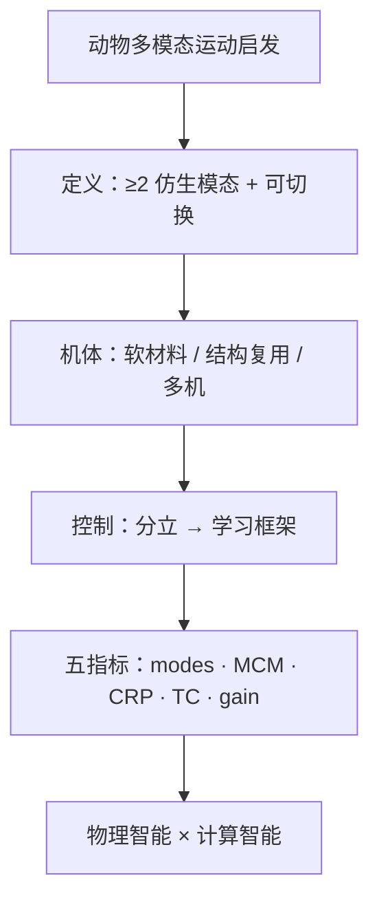

# 仿生多模态机器人综述：五项指标与软硬智能融合

**Bioinspired multimodal robotics**（Ziyu Ren、Youning Duo、Haoyuan Xu、Yihui Zhang、Xingjian Liu、Jamie Paik、Auke Ijspeert、Li Wen（文力）等；**北京航空航天大学 / 清华大学 / 大连理工大学 / EPFL**，**Science Robotics 2026** Vol. 11 Issue 116，[DOI:10.1126/scirobotics.aea7639](https://doi.org/10.1126/scirobotics.aea7639)）是一篇 **Review**：界定仿生多模态机器人，梳理历史演进与设计瓶颈，汇总软材料、结构复用与多机协作等机体路线，描述规划控制从分立模态向学习框架的迁移，并提出 **五项定量评测指标**，最后给出 **物理智能 × 计算智能** 的战略路线图。

## 一句话定义

**把「能在同一机体上整合并切换两种及以上仿生运动模态」的机器人当作一类系统来评测与设计：用模态数、边际成本、组件复用率、切换代价与性能增益五指标，衡量结构共享是否真的换来了任务级收益，并推动自适应硬件与学习控制的耦合。**

## 英文缩写速查

| 缩写 | 英文全称 | 简要说明 |
|------|----------|----------|
| MCM | Marginal Cost of Modality | 新增一种运动模态带来的质量/体积/功耗等边际成本 |
| CRP | Component Repurpose Percentage | 跨模态可复用组件占比；越高「死重」越低 |
| TC | Transition Cost | 模态切换的时间或能量代价 |
| RL | Reinforcement Learning | 控制侧从分立控制器转向的主要学习范式之一 |
| VLA | Vision-Language-Action | 综述展望中与感知–规划–控制一体相关的多模态策略方向 |
| CPG | Central Pattern Generator | 仿生节律控制传统路径；与学习框架对照的生物启发基线 |

## 为什么重要

- **把「多模态」从口号变成可比较设计问题：** 以往工作常堆模态数或展示 demo；本文给出 **MCM / CRP / TC / 性能增益** 等可操作维度，方便横比空–水、陆–水、轮–腿等异构系统。
- **对齐本库北航文力组仿生系列：** [印鱼空–水搭便车](./paper-aerial-aquatic-remora-hitchhiking-robot.md)、[深海软体三模态](./paper-miniature-deep-sea-morphable-robot.md)、[章鱼软臂](./paper-octopus-inspired-esoam-soft-arm.md) 都可被读作「结构复用 / 被动智能 / 软材料」案例，本综述提供上位评测语言。
- **控制叙事与本库主线合流：** 明确写到从图搜索 + 分立控制器 → **学习框架**（含 RL 等），与 [hybrid-locomotion](../tasks/hybrid-locomotion.md) 中「统一 RL 策略处理模态切换」一致，但覆盖更广的跨介质仿生模态。

## 核心信息

| 项 | 内容 |
|----|------|
| **机构** | 北京航空航天大学（BUAA / Beihang）；清华大学（Tsinghua）；大连理工大学（DUT）；洛桑联邦理工学院（EPFL） |
| **类型** | Science Robotics **Review**（非单一系统论文） |
| **平台** | 综述覆盖多类仿生多模态系统（走/飞/游/爬/跳及跨介质），无单一硬件 |
| **开源** | **不适用** — 综述无官方代码 / 数据集 / 项目页（截至 2026-07-25） |

## 核心原理

### 问题定义

- **仿生多模态机器人：** 整合并在 **两种及以上** 仿生运动模态之间 **过渡** 的系统。
- **成功标准不是模态越多越好：** 而是在动态、非结构化环境中，多模态组合是否带来 **可量化的任务级性能提升**，同时控制边际成本与切换代价。

### 机体设计三条主线

| 线索 | 机制 | 工程读法 |
|------|------|----------|
| **软材料 / 柔性结构** | 形变适配接触与介质 | 刚度–柔度权衡；传感与驱动在大变形下需稳定 |
| **结构复用（repurposing）** | 同一组件跨模态承担不同功能 | 直接抬高 **CRP**、压低 **MCM**；被动折叠桨 / 可变翼是典型 |
| **多机器人系统** | 用协作分担模态能力 | 单体不必堆全模态；换来通信与协调复杂度 |

模态过渡可通过 **主动** 或 **被动** 结构重配置实现；被动路径依赖环境力学触发形变（「被动智能」），主动路径依赖驱动器显式变形。

### 规划与控制范式迁移

```mermaid
flowchart LR
  subgraph classic [传统栈]
    graph["图搜索 / 离散路径"]
    fsm["分立模态控制器 + 切换逻辑"]
  end
  subgraph learn [学习栈]
    rl["RL / 策略网络"]
    vla["VLA / 世界模型等"]
  end
  body["自适应机体\n软材料 · 复用 · 多机"]
  env["非结构化环境刺激"]
  classic -->|"动力学突变处脆弱"| learn
  body --> learn
  env --> learn
  learn --> adapt["实时行为适配"]
```

- **传统栈痛点：** 模态切换伴随动力学剧变；为每模态手写控制器 + 切换图难以扩展。
- **学习栈主张：** 用数据驱动框架统一处理连续切换与感知闭环；综述展望中强调与 **物理智能机体** 共设计，而非只换算法。

### 五项评测指标（方法贡献）

| 指标 | 回答的问题 | 选型时怎么用 |
|------|------------|--------------|
| **Number of modes** | 能力覆盖多宽？ | 下限门槛；单独优化易虚高 |
| **Marginal cost of modality (MCM)** | 再加一模态贵不贵？ | 质量/体积/功耗增量是否可接受 |
| **Component repurpose percentage (CRP)** | 结构共享了多少？ | 高 CRP → 少死重；与被动/主动复用设计对齐 |
| **Transition cost (TC)** | 切换要多久/多少能量？ | 任务级可用性；界面穿越时间是特例 |
| **Performance improvement** | 相对单模态基线赚了什么？ | 最终判据；需绑定具体任务 |

## 流程总览



## 源码运行时序图

**不适用。** 本文为 Science Robotics **Review**，截至入库日（2026-07-25）**无官方可运行代码、权重或项目页**；无可对齐的训练 / 推理入口。复现路径应回到被综述的具体系统论文（如北航文力组空–水 / 深海实例页）而非本综述本身。

## 工程实践

| 项 | 建议 |
|----|------|
| 立项先写五指标草表 | 在画机构前估计 **MCM / CRP / TC** 与任务级增益，避免「模态堆叠」 |
| 优先结构复用再谈堆驱动 | 被动介质触发形变（例：[PMP 被动桨](./paper-aerial-aquatic-remora-hitchhiking-robot.md)）通常比再加一套主动机构更划算 |
| 控制不要为每模态各写孤岛 | 切换动力学突变处优先考虑统一学习策略或共享表征，对照 [hybrid-locomotion](../tasks/hybrid-locomotion.md) |
| 与软体 / 深海实例对照读 | [深海三模态](./paper-miniature-deep-sea-morphable-robot.md) 看压力等效 + 模态切换传感最小集 |
| 源码运行时序图 | **不适用**（综述无代码） |

## 实验与评测

- **本文是综述，无单一系统实验表。** 贡献是提出可复用的 **五指标评测框架**，用于填补领域标准化空白。
- **公开摘要给出的评测主张：** 用模态数、边际成本、组件复用率、切换代价、性能增益共同刻画 **设计有效性** 与 **运行性能**。
- **二手报道交叉核对：** Interesting Engineering 等对五项指标的命名与摘要一致（模态数 / 新增能力成本 / 共享组件比例 / 切换时间或能量 / 综合增益）。
- **读法：** 评别人的多模态系统时，先问 **CRP 与 TC**，再看增益是否覆盖 **MCM**；勿只比模态数。

## 结论

**多模态仿生机器人的真正门槛不是「能几种运动」，而是结构是否共享、切换是否便宜、相对单模态是否真有任务级增益；未来赢家会是自适应硬件与学习控制一起设计的系统。**

1. **先用五指标立项** — 模态数只是入口；**MCM / CRP / TC / 性能增益** 才决定能否落地。
2. **结构复用优先于机构堆叠** — 抬高 CRP、压低死重；被动环境触发形变是低成本切换手段。
3. **软材料与多机协作是另外两条减负路径** — 分别用形变适配与能力外置降低单体负担。
4. **控制侧接受范式迁移** — 模态切换动力学突变处，分立 FSM 脆弱；学习框架更匹配连续过渡。
5. **软硬共设计** — 路线图核心是 **物理智能 × 计算智能**，只堆 RL/VLA 或只堆变形机构都不够。
6. **本综述无代码** — 工程复现请落到具体系统论文；本页提供评测语言与选型清单。

## 与其他工作对比

| 维度 | 本文（Science Robotics Review 2026） | [Hybrid Locomotion 任务页](../tasks/hybrid-locomotion.md) | [Learning to Adapt（四足 bio-inspired 多步态）](./paper-learning-to-adapt-bio-inspired-quadruped-gait.md) | 北航文力组实例（印鱼 / 深海） |
|------|--------------------------------------|----------------------------------------------------------|--------------------------------------------------------------------------------------------------------|-------------------------------|
| 范围 | 跨介质仿生多模态 **领域综述** | 轮腿 / 可变形态 **任务切片** | 单形态多 gait **学习系统** | **具体硬件系统** |
| 贡献形态 | 定义 + 五指标 + 路线图 | 控制挑战与代表系统索引 | πG/BGS/πL 分层 DRL | 吸盘/被动桨、压力等效等机构创新 |
| 评测语言 | **MCM / CRP / TC** 等可横比框架 | 以任务成功与技能切换为主 | 地形成功率 / 步态切换质量 | 界面时间、降阻%、深海压力等物理指标 |
| 代码 | 无 | 指向各系统页 | 视具体仓库 | 多未开源 |

## 局限与风险

- **全文付费墙：** 入库环境对 Science.org eprint / PDF 返回 **403**；本页知识编译自 **Crossref/PubMed 开放摘要** 与公开二手报道核对，细节公式与案例表需读者自行对照原文。
- **综述无单一基线实现：** 不能当「可跑的多模态框架」使用；指标落地仍需各系统自报口径（质量如何计 MCM、复用如何计 CRP）。
- **指标尚未社区标准化：** 摘要提出框架，但领域是否采纳、如何统一测量协议仍待后续工作。
- **「学习框架万能」风险：** 模态切换数据稀缺、真机切换代价高时，纯学习可能不如结构级被动切换可靠——需与机体设计联立。
- **开源状态：** **确认无官方代码 / 项目页**（综述性质）；勿误解为可复现软件包。

## 关联页面

- [Locomotion](../tasks/locomotion.md) — 运动任务中心；多模态 / 跨介质入口
- [Hybrid Locomotion](../tasks/hybrid-locomotion.md) — 轮腿与可变形态混合运动对照
- [空–水印鱼搭便车机器人](./paper-aerial-aquatic-remora-hitchhiking-robot.md) — 结构复用 + 被动桨 + 界面穿越实例
- [深海软体可变形机器人](./paper-miniature-deep-sea-morphable-robot.md) — 软材料 + 三模态深海实例
- [章鱼仿生软臂 E-SOAM](./paper-octopus-inspired-esoam-soft-arm.md) — 北航文力组软体操作系列
- [Learning to Adapt（仿生多步态）](./paper-learning-to-adapt-bio-inspired-quadruped-gait.md) — 同「仿生」但单形态多 gait 学习对照
- [Reinforcement Learning](../methods/reinforcement-learning.md) — 控制范式迁移的方法底座

## 参考来源

- [bioinspired_multimodal_robotics_scirobotics_2026.md](../../sources/papers/bioinspired_multimodal_robotics_scirobotics_2026.md) — 本库论文归档与开源核查
- Ren et al., *Bioinspired multimodal robotics*, [Science Robotics 2026](https://doi.org/10.1126/scirobotics.aea7639)（DOI:10.1126/scirobotics.aea7639）
- [PubMed:42485442](https://pubmed.ncbi.nlm.nih.gov/42485442/) — 开放摘要
- [Interesting Engineering 解读](https://interestingengineering.com/ai-robotics/bioinspired-robotics-the-future-of-robots-that-can-walk-fly-swim-and-climb) — 五项指标与挑战的科普复述（二手）

## 推荐继续阅读

- [Science Robotics 原文](https://doi.org/10.1126/scirobotics.aea7639)
- [北航文力组：空–水印鱼机器人（2022）](./paper-aerial-aquatic-remora-hitchhiking-robot.md)
- [北航文力组：深海可变形机器人（2025）](./paper-miniature-deep-sea-morphable-robot.md)
- Ijspeert, *Central Pattern Generators for Locomotion Control in Animals and Robots: A Review*（2008）— 仿生节律控制经典综述对照
