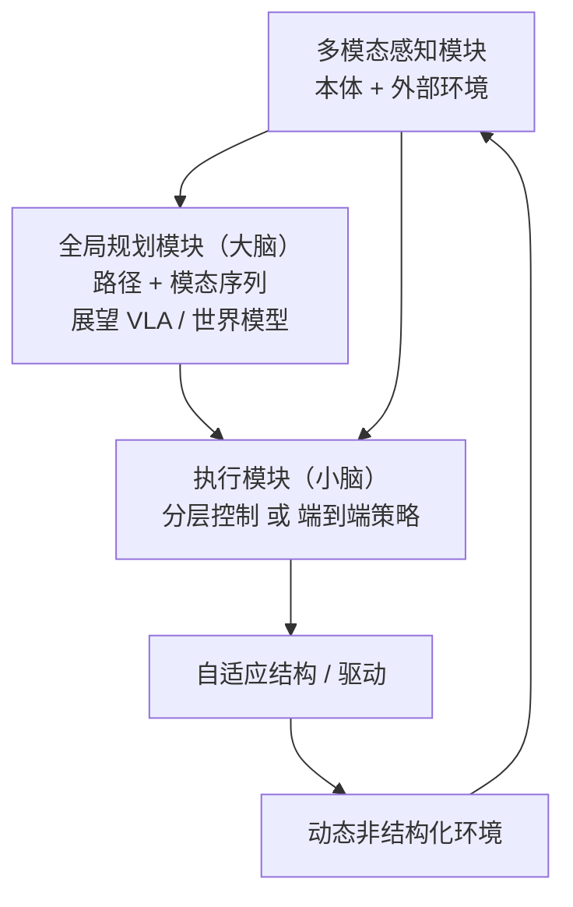
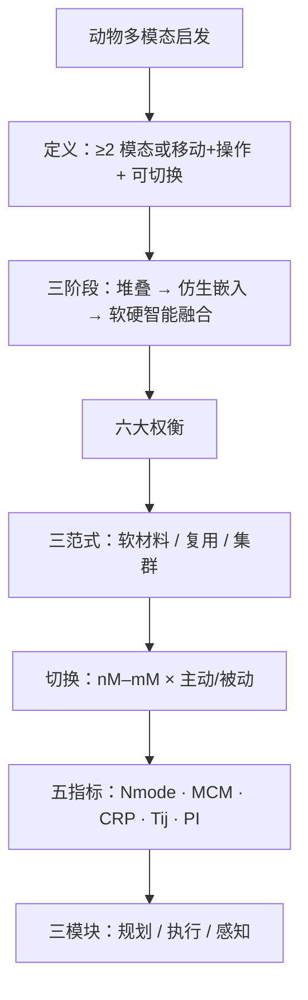

# 仿生多模态机器人综述：五项指标与软硬智能融合

**Bioinspired multimodal robotics**（共同一作：Ziyu Ren† / Youning Duo† / Haoyuan Xu†；Yihui Zhang、Xingjian Liu、Jamie Paik、Auke Ijspeert、Li Wen（文力）等；**北京航空航天大学文力团队牵头**，联合 **清华大学 / 大连理工大学 / EPFL**，**Science Robotics 2026** Vol. 11 Issue 116，[DOI:10.1126/scirobotics.aea7639](https://doi.org/10.1126/scirobotics.aea7639)）是一篇 **Review**：界定仿生多模态机器人，梳理三阶段历史与六大设计权衡，汇总软材料、结构复用与集群涌现等机体范式，给出模态切换分类与 **五项定量指标**（含样机数值），并提出 **全局规划 / 执行 / 多模态感知** 一体化架构，主张 **物理智能 × 计算智能**。

## 一句话定义

**把「同一平台上 ≥2 种运动模态（或移动+操作）、至少一种仿生、且可切换」的机器人当作一类系统来设计与评测：用 Nmode / MCM / CRP / Tij / PI 五指标衡量结构共享是否换来任务级收益，并用「大脑–小脑–感官」三模块把自适应硬件与学习控制绑在一起。**

## 英文缩写速查

| 缩写 | 英文全称 | 简要说明 |
|------|----------|----------|
| Nmode | Number of Modes | 模态数量（域×构型×运动模态）；功能多样性基准 |
| MCM | Marginal Cost of Modality | 新增一模态的边际成本（质量/体积等）；越低越划算 |
| CRP | Component Repurpose Percentage | 跨模态共享部件占比；越高死重越低 |
| Tij | Transition Cost (i→j) | 模态 i 切到 j 的时间/能量；可构成切换成本矩阵 |
| PI | Performance Improvement | 多模态协同相对单模态最佳性能的提升比；PI>1 才算互促 |
| CPG | Central Pattern Generator | 仿生节律控制传统路径；与学习框架对照 |

## 为什么重要

- **把「多模态」变成可横比的设计问题：** 五指标 + 样机数值（如 Hopcopter **PI=3.29**、ANYmal 加轮 **MCM≈0.38**）让立项可算账，而不是只堆 demo。
- **对齐本库北航文力组仿生系列：** [印鱼空–水](./paper-aerial-aquatic-remora-hitchhiking-robot.md)、[深海三模态](./paper-miniature-deep-sea-morphable-robot.md)、[章鱼软臂](./paper-octopus-inspired-esoam-soft-arm.md) 可直接读作 CRP / Tij / 软材料案例。
- **控制叙事与本库主线合流：** 明确从分立控制器 → 学习框架，并提出可对照 [hybrid-locomotion](../tasks/hybrid-locomotion.md) / [VLA](../methods/vla.md) 的三模块自主架构。

## 核心信息

| 项 | 内容 |
|----|------|
| **机构** | 北京航空航天大学（BUAA / Beihang）；清华大学（Tsinghua）；大连理工大学（DUT）；洛桑联邦理工学院（EPFL） |
| **作者角色** | 任子宇 / 朵有宁 / 徐浩原 **共同一作**；文力团队牵头（据[微信导读](../../sources/blogs/wechat_robot_lecture_bioinspired_multimodal_2026-07-25.md)） |
| **类型** | Science Robotics **Review**（非单一系统论文） |
| **平台** | 综述覆盖多类仿生多模态系统，无单一硬件 |
| **开源** | **不适用** — 综述无官方代码 / 数据集 / 项目页（截至 2026-07-25） |

## 核心原理

### 问题定义

- **仿生多模态机器人：** 同一平台集成 **至少两种运动模态**，**或** 同时具备移动与操作；**至少一种模态受生物启发**，并能在模态间切换。
- **成功标准：** 不是 Nmode 越大越好，而是多模态是否带来 **可量化的任务级增益**，同时控制 **MCM / Tij** 与刚度–驱动冲突。

### 三阶段发展历程

| 阶段 | 时间 | 特征 | 代表 |
|------|------|------|------|
| 工程化集成 | 1959–20 世纪末 | 独立驱动模块堆叠 | MOBOT Mark I、WABOT-1、Odex I |
| 仿生多模态设计 | 21 世纪初 | 形态自适应嵌入本体 | PolyBot（2000）、AZIMUT（2003，正式提出 Multimodal Robot） |
| 计算智能 + 物理智能融合 | 21 世纪初–今 | 自建模 / CPG / 分层 RL + 软体磁控等 | 连续自建模（2006）、仿蝾螈 CPG（2007）、轮足分层 RL（2024）、微型磁控软体（2018） |

### 六大设计权衡

空间分配、质量特性（跨模态死重）、模态协同（易性能抵消）、刚度矛盾、驱动冲突、变形能力——六项必须联立，不能只优化其中一项。

### 机体设计三范式

| 线索 | 机制 | 工程读法 |
|------|------|----------|
| **柔性材料与结构** | 高自由度形变 + 变刚度（如 SMP） | 变形时降刚度、负载时升刚度；抬高被动环境适配 |
| **结构复用** | 同一机构跨模态扮演不同角色 | 直接抬高 **CRP**、压低 **MCM**（例：M4 四肢兼腿/轮/桨） |
| **集群协同涌现** | 异构或同构多机协作 | 单体不必堆全模态；换来通信与协调复杂度 |

### 模态切换分类

| 轴 | 类别 | 说明 |
|----|------|------|
| 结构 | 无结构变换 | 仅改控制/步态 |
| 结构 | 结构变换 nM–mM | 0M–1M、1M–1M、1M–MM、MM–MM |
| 触发 | 主动 / 被动 | 主动驱动 vs 环境刺激触发 |

领域现状（导读统计）：现有工作集中于 **主动 + 1M–1M / 1M–MM**；**0M–1M** 与 **MM–MM** 仍是空白方向。

### 五项评测指标（方法贡献）

| 指标 | 回答的问题 | 导读样机数值例 |
|------|------------|----------------|
| **Nmode** | 能力覆盖多宽？ | Tribot = **5** |
| **MCM** | 再加一模态贵不贵？ | ANYmal 加轮质量增量 ≈ **0.38** |
| **CRP** | 结构共享了多少？ | 深海变构形 **0.4**；片状磁控软体 **1** |
| **Tij** | 切换要多久/多少能量？ | 空→水 **0.13 s**；水→空 **0.35 s**（空–水吸附机器人） |
| **PI** | 相对单模态最佳赚了什么？ | Hopcopter 续航 379→1246 s → **PI=3.29** |

选型读法：先看 **CRP / MCM / Tij**，再用 **PI** 验收；勿只比 Nmode。

### 自主规划及控制三模块

- **全局规划：** 任务目标 + 环境模型 → 最优运动序列与模态选择；复杂场景甚至可规划「改造环境」以创造通路。
- **执行：** 分层控制（可解释、可靠）vs 端到端（感知直出整机指令，泛化更强，训练与 sim2real 成本更高）。
- **感知：** 本体状态 + 地形/障碍/扰动，形成闭环。

## 流程总览

## 源码运行时序图

**不适用。** 本文为 Science Robotics **Review**，截至入库日（2026-07-25）**无官方可运行代码、权重或项目页**。复现应落到被综述的具体系统论文（如北航文力组空–水 / 深海实例页）。

## 工程实践

| 项 | 建议 |
|----|------|
| 立项先填五指标草表 | 估计 **MCM / CRP / Tij / PI**；Nmode 只作入口 |
| 优先结构复用 | 被动介质触发形变（例：[PMP 被动桨](./paper-aerial-aquatic-remora-hitchhiking-robot.md)）常比再加一套主动机构更划算 |
| 切换分类要对号入座 | 写清是 1M–1M 还是 1M–MM、主动还是被动；避免模糊「能切换」 |
| 控制选分层还是端到端 | 可靠优先 → 分层；未知动态场景 → 端到端 / RL，但预留 sim2real 预算 |
| 对照本库实例读数 | 深海页看 CRP；空–水页看界面 Tij；轮足页看 MCM |
| 源码运行时序图 | **不适用**（综述无代码） |

## 实验与评测

- **本文是综述，无单一系统实验表。** 贡献是五指标框架 + 表 1 样机对照（经[微信导读](../../sources/blogs/wechat_robot_lecture_bioinspired_multimodal_2026-07-25.md)复述）。
- **关键数值记忆：** MCM≈0.38（加轮）、CRP=0.4/1.0（深海/磁控软体）、Tij=0.13/0.35 s（空–水）、PI=3.29（Hopcopter 续航）。
- **读法：** 评别人的多模态系统时，先问 CRP 与 Tij，再看 PI 是否覆盖 MCM。

## 结论

**多模态仿生机器人的真正门槛不是「能几种运动」，而是结构是否共享、切换是否便宜、相对单模态是否真有任务级增益；未来赢家会是「大脑–小脑–感官」架构与自适应硬件一起设计的系统。**

1. **先用五指标立项** — Nmode 只是入口；**MCM / CRP / Tij / PI** 才决定能否落地。
2. **结构复用优先于机构堆叠** — 抬高 CRP、压低死重；被动环境触发是低成本切换手段。
3. **六大权衡要联立** — 空间、死重、协同、刚度、驱动、变形缺一不可。
4. **切换分类要对齐空白** — 主动 1M–1M 已拥挤；**0M–1M / MM–MM** 与被动切换仍少人做。
5. **控制用三模块而不是只换算法** — 全局规划 + 执行（分层/端到端）+ 多模态感知闭环。
6. **软硬共设计** — 物理智能 × 计算智能；只堆 RL/VLA 或只堆变形机构都不够。
7. **本综述无代码** — 工程复现请落到具体系统论文；本页提供评测语言与选型清单。

## 与其他工作对比

| 维度 | 本文（Science Robotics Review 2026） | [Hybrid Locomotion](../tasks/hybrid-locomotion.md) | [Learning to Adapt](./paper-learning-to-adapt-bio-inspired-quadruped-gait.md) | 北航文力组实例（印鱼 / 深海） |
|------|--------------------------------------|---------------------|-----------------------------------------------------------------------------|-------------------------------|
| 范围 | 跨介质仿生多模态 **领域综述** | 轮腿 / 可变形态 **任务切片** | 单形态多 gait **学习系统** | **具体硬件系统** |
| 贡献形态 | 定义 + 五指标 + 切换分类 + 三模块架构 | 控制挑战与代表系统索引 | πG/BGS/πL 分层 DRL | 吸盘/被动桨、压力等效等机构创新 |
| 评测语言 | **Nmode / MCM / CRP / Tij / PI** | 任务成功与技能切换 | 地形成功率 / 步态切换质量 | 界面时间、降阻%、深海压力等 |
| 代码 | 无 | 指向各系统页 | 视具体仓库 | 多未开源 |

## 局限与风险

- **全文付费墙：** Science.org eprint / PDF 在入库环境 **403**；细节主要编译自 **Crossref/PubMed 摘要** + [机器人大讲堂微信导读](../../sources/blogs/wechat_robot_lecture_bioinspired_multimodal_2026-07-25.md)。
- **样机数值来自导读复述：** 公式以图片形式出现在推文中；精确定义请回原文表 1。空–水 Tij 双向数字与本库印鱼页「0.35 s」主叙事并存，方向对照时注意标注。
- **综述无单一基线实现：** 指标落地仍需各系统自报口径。
- **指标尚未社区标准化：** 测量协议（质量如何计 MCM、部件如何计 CRP）仍待统一。
- **开源状态：** **确认无官方代码 / 项目页**；勿误解为可复现软件包。

## 关联页面

- [Locomotion](../tasks/locomotion.md) — 运动任务中心；多模态 / 跨介质入口
- [腿式机器人进展/挑战/机遇综述](./paper-legged-robots-advances-challenges.md) — 同刊 Issue 116：人形+四足陆地五柱与社会展望对照
- [Hybrid Locomotion](../tasks/hybrid-locomotion.md) — 轮腿与可变形态混合运动对照
- [空–水印鱼搭便车机器人](./paper-aerial-aquatic-remora-hitchhiking-robot.md) — 结构复用 + 被动桨 + 界面 Tij 实例
- [深海软体可变形机器人](./paper-miniature-deep-sea-morphable-robot.md) — 软材料 + CRP 实例
- [章鱼仿生软臂 E-SOAM](./paper-octopus-inspired-esoam-soft-arm.md) — 北航文力组软体操作系列
- [Learning to Adapt（仿生多步态）](./paper-learning-to-adapt-bio-inspired-quadruped-gait.md) — 同「仿生」但单形态多 gait 学习对照
- [Reinforcement Learning](../methods/reinforcement-learning.md) — 执行模块学习路线底座
- [VLA](../methods/vla.md) — 全局规划 / 端到端执行展望

## 参考来源

- [bioinspired_multimodal_robotics_scirobotics_2026.md](../../sources/papers/bioinspired_multimodal_robotics_scirobotics_2026.md) — 本库论文归档与开源核查
- [微信导读：仿生多模态机器人如何「七十二变」](../../sources/blogs/wechat_robot_lecture_bioinspired_multimodal_2026-07-25.md) — 指标数值、切换分类、三模块架构复述
- Ren et al., *Bioinspired multimodal robotics*, [Science Robotics 2026](https://doi.org/10.1126/scirobotics.aea7639)
- [PubMed:42485442](https://pubmed.ncbi.nlm.nih.gov/42485442/) — 开放摘要

## 推荐继续阅读

- [Science Robotics 原文 / eprint](https://www.science.org/eprint/DSWZCRX276ZXEYUWFPQN/full?activationRedirect=/doi/full/10.1126/scirobotics.aea7639)
- [微信公众号原文](https://mp.weixin.qq.com/s/U-6QiMO1Au_77R6fKDQFBg)
- [北航文力组：空–水印鱼机器人（2022）](./paper-aerial-aquatic-remora-hitchhiking-robot.md)
- [北航文力组：深海可变形机器人（2025）](./paper-miniature-deep-sea-morphable-robot.md)
- Ijspeert, *Central Pattern Generators for Locomotion Control in Animals and Robots: A Review*（2008）— 仿生节律控制经典综述对照
