# BIRDriver：BEV  informed 的 VLM 推理驾驶员

**BIRDriver**（*Bird's-Eye-View Informed Reasoning Driver*，**ICLR 2026** Poster，[OpenReview](https://openreview.net/forum?id=TuU95FWkyH)，[PDF](https://proceedings.iclr.cc/paper_files/paper/2026/file/acb18f946cde3cc29864e6df7df54d11-Paper-Conference.pdf)）由 **清华大学、华为、中国科学院大学、中科院自动化所 MAIS** 等提出：用 **单帧 BEV 图** 作为 VLM 唯一视觉输入，生成 **不超过 3 个** 相对自车的 **key intent points**，再交给 **PLUTO** 运动规划器输出闭环轨迹——在 **nuPlan InterPlan 长尾** 上取得 SOTA，并相对 PLUTO 基座在 Test14-hard 等多项 CLS 指标上稳定提升。

## 一句话定义

**把驾驶场景压成一张符号化 BEV，让 VLM 只负责「常识 + 稀疏几何意图」（≤3 key points），数值轨迹仍由 IL 规划器完成——用低成本接口把 internet 预训练接到长尾 motion planning。**

## 英文缩写速查

| 缩写 | 英文全称 | 简要说明 |
|------|----------|----------|
| BIRDriver | Bird's-Eye-View Informed Reasoning Driver | 本文分层 VLM–规划框架 |
| BEV | Bird's-Eye View | 俯视符号化驾驶场景单帧图 |
| VLM | Vision-Language Model | 视觉–语言模型；本文 Qwen2.5VL-3B |
| CLS | Closed-Loop Score | nuPlan 官方闭环综合分（0–100） |
| PLUTO | Push the Limit of IL-based Planning | 本文基座模仿学习规划器 |
| RDP | Ramer–Douglas–Peucker | 轨迹稀疏化提取 key points |
| SFT | Supervised Fine-Tuning | VLM LoRA 微调 |
| LoRA | Low-Rank Adaptation | 参数高效微调 |
| IL | Imitation Learning | 模仿学习类规划器家族 |
| CoT | Chain-of-Thought | 逐步场景理解；本文 Driving Scene Stepwise 数据集 |

## 为什么重要

- **长尾对症：** 模仿学习规划在「借道超越 stalled vehicle」等 **训练外** 场景常失败（论文 Fig. 3）；VLM 常识可补 IL 数据覆盖缺口。
- **接口极简：** 相对 [DriveVLM](./paper-drivevlm.md) 的长 waypoint 序列或 [Senna](./paper-senna.md) 的离散 meta-action，**≤3 相对 key points** 更贴近预训练 VLM 的稀疏输出能力。
- **BEV 而非多相机：** 避免相机域差异与对齐成本，符号 BEV 在 system prompt 中解释元素语义即可读。
- **工程可拆：** VLM 与 PLUTO **解耦训练**；推理时可异步/量化 VLM（论文 Limitations 讨论 onboard 负担）。

## 核心信息

| 字段 | 内容 |
|------|------|
| **机构** | 清华大学（Tsinghua）；华为（Huawei）；中国科学院大学（UCAS）；中国科学院自动化研究所 MAIS（CASIA） |
| **Venue** | ICLR 2026 Poster |
| **OpenReview** | [TuU95FWkyH](https://openreview.net/forum?id=TuU95FWkyH) |
| **VLM 基座** | Qwen2.5VL-3B（LoRA rank 16，8×H800，5 epoch） |
| **规划基座** | [PLUTO](https://github.com/jchengai/pluto)（PointEncoder + 1M split 微调，8×4090） |
| **数据** | 838,824 VLM 样本（Key Point : Spatial Loc : Scene Stepwise = **10:1:2**） |
| **开源（截至 2026-09-20）** | **BIRDriver 确认未开源**；PLUTO 与 Qwen 权重可独立获取，**非完整复现栈** |

## 核心原理

### 分层双系统

| 模块 | 输入 | 输出 |
|------|------|------|
| **VLM** | 单帧 BEV + system/user prompt | 文本形式相对 key points \((x,y,\phi)\) |
| **KeyPoint Encoder** | key points 嵌入 | 与 PLUTO query 特征融合 |
| **PLUTO decoder** | 结构化场景 + key points | 多模态轨迹 + 概率 |

**BEV 五类元素：** map（车道/人行横道/路点）、agent（自车/他车/行人/自行车 + 2s 历史绿线）、traffic light（停止线颜色）、route（可行驶区 + 参考线）、obstacle（锥桶/路障等）。

### Key point 提取（训练标签）

- 对 GT 轨迹 \((x_i,y_i,\phi_i)\) 用 **RDP**（ε=0.02）自适应稀疏化；**末点必保留**； maneuver 复杂度决定上限点数（≤3）。
- 消融：仅末点作 key point → InterPlan **34.72** CLS-R，低于 PLUTO **48.92**（Table 3）。

### VLM 微调：三任务 + 加权 SFT

1. **Key Point Dataset** — 主任务，多样问法生成 key points。
2. **Spatial Localization** — 预测随机车辆相对位姿，对齐 BEV 像素与物理距离。
3. **Driving Scene Stepwise** — 先识别场景类型再预测 key points。

**Weighted SFT：** 数字 token 按位衰减权重，符号 token 最高（α=5）；相对均匀 SFT，x/y/ϕ MAE 再降约 **8–11%**（Table 2）。

### 规划器微调

- 使用 PLUTO **PointEncoder**；训练时对 GT key points 加 \(\mathcal{N}(0,\Sigma)\)，\(\Sigma\) 对角为 VLM 预测 MAE。
- **推理时序：** 上一时刻规划末点 + 当前 VLM key points 一并送入 planner。

### 流程总览

```mermaid
flowchart TB
  nuplan["nuPlan 场景\n结构化状态"]
  bev["渲染单帧 BEV\n五类符号元素"]
  vlm["Qwen2.5VL-3B + LoRA\nsystem/user prompt"]
  kp["≤3 relative key points\n文本坐标"]
  enc["KeyPoint Encoder\n(PLUTO PointEncoder)"]
  pluto["PLUTO decoder\n+ 场景特征"]
  traj["闭环轨迹\nCLS 评测"]
  nuplan --> bev --> vlm --> kp --> enc --> pluto --> traj
  nuplan --> pluto
```

## 源码运行时序图

**不适用**（截至 2026-09-20）：论文、OpenReview 与 ICLR Proceedings **未发布** BIRDriver 官方仓库。放出后预期路径：nuPlan 场景 → BEV 渲染 → VLM 推理 key points → PLUTO 联合解码 → nuPlan 闭环仿真（CLS）。

可独立对照的相邻开源栈：[jchengai/pluto](https://github.com/jchengai/pluto)（规划器基座）。

## 工程实践

| 项 | 建议 / 论文设定 |
|----|----------------|
| **何时考虑 BIRDriver** | nuPlan/InterPlan 类 **长尾闭环规划**；已有 IL planner（PLUTO 系），希望用 VLM 补 **零样本常识** 而非重写 E2E |
| **何时不用** | 需要 **端到端可复现** 训练栈（本文未开源）； onboard **低延迟** 纯 VLM 规划（Limitations：VLM 推理是瓶颈） |
| **数据策展** | Spatial Localization 对 key point 精度提升最大；三任务比例 10:1:2 勿随意省 |
| **数值 SFT** | VLM 直接回归坐标易漂；加权 SFT 是可用低成本补丁 |
| **key point 设计** | 必须保留 **中间几何点**，仅末点会劣于 PLUTO 基线 |
| **基座选型** | Qwen2.5VL-3B 在精度与效率间平衡；7B 增益有限（Table 4） |

## 实验与评测

**Benchmark：** Test14-random（261）、Test14-hard（272）、**InterPlan**（长尾）；指标 **CLS-NR / CLS-R**（nuPlan devkit）。

**Table 1 核心（BIRDriver vs PLUTO 基座，* 表示超基线）：**

| 方法 | Test14-random CLS-NR | Test14-random CLS-R | Test14-hard CLS-NR | Test14-hard CLS-R | InterPlan CLS-R |
|------|----------------------|---------------------|--------------------|-------------------|-----------------|
| PLUTO | 91.87 | 90.03 | 80.03 | 76.92 | 48.92 |
| Diffusion Planner | 93.85 | 91.73 | 78.82 | 81.42 | 39.85 |
| **BIRDriver** | 91.46 | **91.26*** | **80.56*** | **80.33*** | **55.29*** |

- Test14-hard：相对 PLUTO，CLS-NR **+0.53**、CLS-R **+3.41**。
- InterPlan：相对 PLUTO **+13.0%**、相对 Diffusion Planner **+38.8%**（论文报告百分比）。
- VLM 基线对照：PlanAgent (VLM) InterPlan 未报；InstructDriver 等 LLM 路线整体低于 IL SOTA。

## 结论

**BIRDriver 的真贡献是「BEV + 稀疏 key points」这一 VLM–IL 接口：InterPlan 长尾涨分显著，但 Test14-random CLS-NR 仍略低于 Diffusion Planner，工程上还要等官方代码与 onboard 延迟方案。**

1. **真影响：InterPlan 长尾** — CLS-R **55.29** vs PLUTO **48.92**；借道超车等 zero-shot 场景 Fig. 3 仅本文完整成功。
2. **真影响：key point 接口** — ≤3 点 + RDP 中间点；仅末点会 **劣于** PLUTO（34.72 vs 48.92）。
3. **真影响：Spatial Localization + Weighted SFT** — key point MAE 分别再降 **11.9%/20.0%/10.2%** 与 **8–11%** 量级。
4. **次要代价：Test14-random CLS-NR** — 91.46 略低于 Diffusion Planner 93.85；common-case 未必全面碾压 IL SOTA。
5. **部署读法：** VLM 推理效率是 Limitations 主项；仿真/smart agent 可接受，车载需量化/异步/长尾检测器。
6. **工程读法：** **确认未开源**；复现需自搭 BEV 渲染 + Qwen LoRA + PLUTO 改造，与论文仍有 gap。

## 与相邻路线对比

| 路线 | 相对 BIRDriver | 取舍 |
|------|----------------|------|
| [Senna](./paper-senna.md) | meta-action 离散意图 | 粒度粗，难表达复杂几何 |
| [DriveVLM](./paper-drivevlm.md) | 长 waypoint + CoT | 更吃驾驶域微调，延迟高 |
| AsyncDriver 类 hidden state | 不可解释 | BIRDriver key points 更可审计 |
| PLUTO / Diffusion Planner 纯 IL | 常见场景强 | 长尾 InterPlan 明显弱于 BIRDriver |

## 与其他页面的关系

- E2E 技术地图：[e2e-autonomous-driving-top10-algorithms.md](../overview/e2e-autonomous-driving-top10-algorithms.md)（VLM 解耦/CoT 姊妹线）
- 模块化 AD 专辑：[autonomous-driving-core-algorithms-series.md](../overview/autonomous-driving-core-algorithms-series.md)
- VLM 方法背景：[vla.md](../methods/vla.md)

## 参考来源

- [birdriver_iclr_2026.md](../../sources/papers/birdriver_iclr_2026.md) — ICLR 2026 论文摘录、Table 1 与开源核查
- [birdriver-iclr-2026-proceedings.md](../../sources/sites/birdriver-iclr-2026-proceedings.md) — OpenReview / Proceedings 入口

## 推荐继续阅读

- [DriveVLM](./paper-drivevlm.md) — VLM waypoint + Dual 架构对照
- [Senna](./paper-senna.md) — 语言决策与数值规划解耦
- PLUTO 基座论文与代码：<https://github.com/jchengai/pluto>
- OpenReview：<https://openreview.net/forum?id=TuU95FWkyH> · [PDF](https://openreview.net/pdf?id=TuU95FWkyH)
