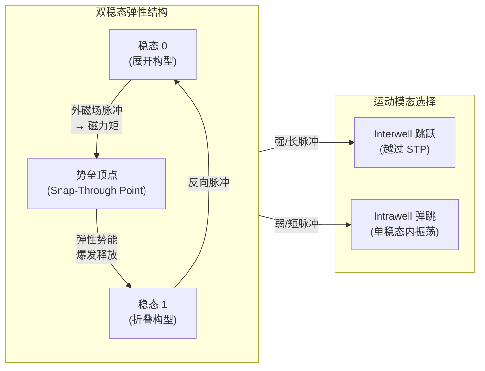

# 双稳态软跳跃机器人（Bistable Soft Jumper）

**Bistable soft jumper capable of fast response and high takeoff velocity**（Daofan Tang、Chengqian Zhang 等，ZJU 机械工程学院 + CMU Carmel Majidi 软体机器人实验室，**Science Robotics 2024**，[DOI:10.1126/scirobotics.adm8484](https://doi.org/10.1126/scirobotics.adm8484)）报告了一种 **磁场脉冲驱动、双稳态 3D 折叠结构** 的软跳跃机器人，通过 snap-through 机制爆发式释放弹性势能，在软体机器人领域同时刷新 **起跳速度**（>2 m/s）、**响应时间**（<15 ms）与 **跳跃高度**（>108 倍体高）三项记录，并在两栖管道任务中演示全向可调跳跃。

## 一句话定义

**以磁力矩触发 3D 折叠双稳态结构在两稳态间 snap-through，储存的弹性势能在毫秒内爆发释放，实现软体机器人在速度与高度上超越以往刚性跳跃机器人的级差。**

## 英文缩写速查

| 缩写 | 英文全称 | 简要说明 |
|------|----------|----------|
| SMA | Shape Memory Alloy | 形状记忆合金，其他软跳跃机器人常用驱动，响应慢 |
| PDMS | Polydimethylsiloxane | 聚二甲基硅氧烷，常见柔性基底材料 |
| DOF | Degrees of Freedom | 自由度；本文机器人为 1-DOF 翻转 + 全向调向 |
| FEA | Finite Element Analysis | 有限元分析，用于双稳态结构势能曲面建模 |
| STP | Snap-Through Point | 势垒顶点，越过后弹性能量爆发释放 |
| CMU | Carnegie Mellon University | 卡内基梅隆大学，Majidi 软体机器人实验室 |
| ZJU | Zhejiang University | 浙江大学，Zhao Peng 课题组 |

## 为什么重要

- **软体机器人的「速度天花板」被突破：** 传统软跳跃机器人（气动、SMA 热驱、水凝胶膨胀）响应时间通常 100 ms–10 s 量级，起跳速度 <1 m/s；本文 <15 ms 响应与 >2 m/s 起跳与部分刚性跳跃机器人齐平，且兼具柔性材料的 **抗冲击、顺从性优势**。
- **双稳态作为「机械储能」范式：** 区别于通过持续供能维持驱动的方案，双稳态结构把驱动能量「预存」于弹性应变，触发仅需极短脉冲磁场——这对无线/微小型无线驱动场景（如微型医疗机器人）有重要延伸价值。
- **多模态运动可控性：** 通过同一个磁场脉冲的 **强度** 和 **时间** 参数，实现 interwell（大跳）与 intrawell（小弹）两种运动模态切换，以及全向调向；无需更换机构，控制接口简单。
- **生物启发设计路线：** 昆虫（跳蚤、蚱蜢）同样利用 snap-through 类弹性蓄能机构（丝框机构、体壁弯曲）实现远超肌肉直驱力的爆发，本文为该仿生路线在软体机器人中给出了工程实证。

## 机构与机制

## 核心机制（提炼）

| 要素 | 设计 | 物理原理 |
|------|------|----------|
| **3D 折叠结构** | 四块磁性薄板 + 铰链组成立体折叠体 | 提供大变形弹性应变空间；比平面双稳态能量密度更高 |
| **磁化方向** | 各磁性面板磁化方向与预设外场方向对齐 | 外场施加时产生力矩，引导结构翻转方向 |
| **Snap-through** | 非线性弹性失稳；越过势垒后弹性能在 <15 ms 释放 | 弹性势能曲面双峰 → 中间势垒 → 触发后能量倾泻 |
| **全向控制** | 调整磁场偏转角改变起跳方向 | 磁力矩投影方向变化 → 翻转轴变化 → 跳跃角度可调 |
| **尺寸缩放** | 小尺寸起跳速度基本不变；高度受空气阻力影响 | 弹性储能随尺寸的缩放比弹道受阻力影响更稳定 |

## 性能评测与对比（相较于已有软跳跃机器人）

| 指标 | 本文 | 已有软体跳跃机器人（代表范围） |
|------|------|-------------------------------|
| 起跳速度 | **>2 m/s** | 0.3–1 m/s |
| 响应时间 | **<15 ms** | 100 ms–10 s |
| 跳跃高度 | **>108× 体高** | 10–50× 体高（典型） |
| 驱动方式 | 磁场脉冲（无线） | 气动、SMA 热驱、水凝胶、DEA 等 |
| 运动模态 | 跳跃 + 弹跳 + 全向 | 通常单一模态 |

## 局限与风险

- **外部磁场依赖：** 驱动需要外部电磁线圈提供脉冲磁场，论文演示在实验室台架环境（Helmholtz/Maxwell 线圈或永磁铁）下进行；**完全独立无线自主运动** 目前不可行（需机载磁场源，重量/体积难题）。
- **代码/设计文件未开源：** 截至入库日 **无 GitHub 仓库**；制造工艺（磁性材料、折叠模具）仅在论文 Materials and Methods 节描述；复现需材料学背景。
- **闭环控制缺失：** 演示为开环磁场脉冲触发；具备感知（力/位移/图像）的闭环反馈控制为后续工作。
- **单体独立运动局限：** 跳跃后姿态难以精准控制（软体弹性变形带来随机性）；精确落点控制是开放问题。
- **规模化制造：** 磁化方向设计对制造精度敏感；批量制造一致性待验证。

## 工程实践

- **磁场控制接口简单：** 只需控制外部磁场脉冲的 **强度**（控制是否越过势垒）和 **方向**（控制跳跃方向），适合作为 **软体跳跃 + 磁驱研究** 的设计模板。
- **医疗/管道检测应用前景：** 论文演示了 **两栖管道（陆地+水面）** 中的运动；尺寸缩小后可能用于人体内腔道检测或药物递送（ZJU 团队访谈中明确提及）。
- **仿生储能设计原则：** 双稳态 snap-through 可迁移到其他柔性系统（软体手爪快速张合、微型软体飞行器翼拍等）——论文明确写明「设计原则和驱动机制可进一步扩展到其他柔性系统」。
- **数据：** 实验数据 deposit 于 [Dryad](https://doi.org/10.5061/dryad.hdr7sqvsg)，可用于比较研究。

## 关联页面

- [Locomotion 任务页（跳跃运动分类）](../tasks/locomotion.md)
- [SoftMimic：顺从全身控制（软体/顺从控制对照）](./paper-notebook-softmimic-learning-compliant-whole-body-control.md)

## 参考来源

- [深蓝AI：近五年 Science Robotics 中国顶尖高校盘点](../../sources/blogs/wechat_shenlan_scirobotics_china_top3_2026-07-02.md)
- [双稳态软跳跃机器人论文归档（Science Robotics 2024）](../../sources/papers/bistable_soft_jumper_scirobotics_2024.md)
- Tang et al., *Bistable soft jumper capable of fast response and high takeoff velocity*, [Science Robotics 2024](https://doi.org/10.1126/scirobotics.adm8484)
- [论文配套数据（Dryad）](https://doi.org/10.5061/dryad.hdr7sqvsg)
- [Dialogue@ZJU 团队访谈](https://www.zju.edu.cn/english/2024/1028/c75130a2980568/page.htm)

## 推荐继续阅读

- [Science Robotics 论文页](https://doi.org/10.1126/scirobotics.adm8484)
- [Dryad 数据集](https://doi.org/10.5061/dryad.hdr7sqvsg)
- [ZJU 团队访谈（Dialogue@ZJU）](https://www.zju.edu.cn/english/2024/1028/c75130a2980568/page.htm)
