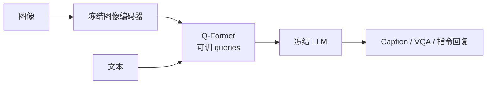
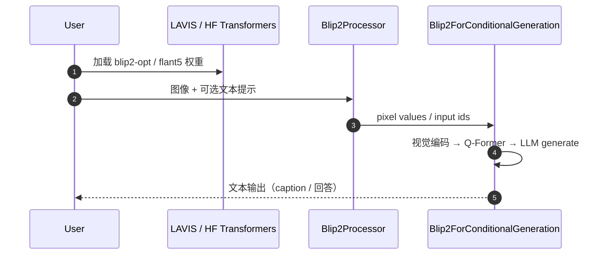

# BLIP-2

**BLIP-2**（*Bootstrapping Language-Image Pre-training with Frozen Image Encoders and Large Language Models*，[arXiv:2301.12597](https://arxiv.org/abs/2301.12597)，[LAVIS](https://github.com/salesforce/LAVIS)）由 **Salesforce Research** 提出：用轻量 **Querying Transformer（Q-Former）** 连接冻结视觉骨干与冻结 LLM，以很少可训参数完成视觉–语言对齐与条件生成。

## 一句话定义

**不微调巨大的视觉塔和语言模型，只训练一组 query 令牌把图像特征「翻译」成 LLM 能消费的语言侧表示。**

## 英文缩写速查

| 缩写 | 英文全称 | 简要说明 |
|------|----------|----------|
| BLIP-2 | Bootstrapping Language-Image Pre-training 2 | 本文方法/模型族 |
| Q-Former | Querying Transformer | 可训桥接模块 |
| LLM | Large Language Model | 冻结的语言解码器（OPT / FlanT5 等） |
| VQA | Visual Question Answering | 视觉问答评测 |
| VLM | Vision-Language Model | 视觉–语言模型总称 |
| CIDEr | Consensus-based Image Description Evaluation | Caption 常用指标 |

## 核心信息

| 项 | 内容 |
|----|------|
| **机构** | 赛富时（Salesforce）Research |
| **arXiv** | [2301.12597](https://arxiv.org/abs/2301.12597) |
| **开源** | **已开源**：LAVIS `projects/blip2` + HF `Salesforce/blip2-*` |
| **可训部分** | 主要为 Q-Former（论文强调相对端到端大幅减少可训参数） |
| **典型能力** | 零样本 caption、VQA、指令式 image-to-text、图文检索特征 |

## 为什么重要

- **具身零样本管线的「语言侧」：** 与 [SAM 3](./paper-sam3.md) 搭配时，BLIP-2 常负责 **图文匹配 / 描述 / 相关性分数**，支撑「语言指令 → 视觉证据」。
- **算力友好：** 冻结大模型使实验室在单卡/边缘侧更易做推理原型（完整 6.7B 级仍重，可选更小变体）。
- **概念教学：** Q-Former 是理解 [视觉–语言特征融合](../concepts/vision-language-feature-fusion.md) 与语义空间对齐的经典可讲实例。

## 核心原理

### 两阶段预训练

1. **表示学习（冻结图像编码器）：** Q-Former 学习抽取与文本相关的视觉 query。
2. **生成学习（冻结 LLM）：** 将 query embedding 投影为 LLM 可条件化的软提示，训练视觉条件语言建模。

## 源码运行时序图

关键复现路径：`transformers` 加载 `Salesforce/blip2-opt-2.7b` 做零样本 caption；或按 LAVIS `projects/blip2` 切换 retrieval / caption 配置。

## 工程实践

| 项 | 建议 |
|----|------|
| ObjectNav 评分 | 对候选区域裁剪图做 image-text matching 或短 caption 与指令比分 |
| 与 SAM3 | SAM3 提案实例 → BLIP-2/VLM 核验「是不是指令要的物体」 |
| 部署 | 机载可用蒸馏/小 LLM 变体；重核验可离板 |
| 别误用 | BLIP-2 **不**输出实例掩码；分割请用 SAM 族 |

## 实验与评测

- 论文报告在多种 V+L 基准上以更少可训参数达到强零样本结果；例如相对 Flamingo-80B 在零样本 VQAv2 上报告增益（以论文表为准）。
- 展示指令式零样本 image-to-text 涌现能力。

## 结论

BLIP-2 证明「冻住单模态巨塔 + 训轻桥」足以解锁实用的零样本视觉–语言能力，是具身感知栈里高性价比的图文模块。

- 需要像素级实例时用 SAM3，需要语言对齐分数时用 BLIP-2/现代 VLM。
- Q-Former 的 query 数与分辨率影响细节物体，小目标导航要做裁剪或多尺度。
- 新一代 VLM（Qwen-VL 等）可能在真机核验上更强，但 BLIP-2 仍是教学与轻量基线的清晰参照。
- 检索型 `blip2` 与生成型 `blip2_opt/t5` 用途不同，按匹配 vs 描述选型。
- 课程「SAM3 + BLIP-2 零样本」应写成 **检测/分割 + 语义核验** 两段，而不是单模型端到端。

## 局限与风险

- **幻觉与偏见：** 继承 LLM/网络数据风险，导航核验需多视角或几何一致性约束。
- **时效：** 2023 方法；生产可评估更新 VLM，但本库保留其作为融合范式经典节点。

## 与其他工作对比

| 工作 | 相对 BLIP-2 |
|------|-------------|
| CLIP | 对比双塔匹配快；生成式 VQA/指令能力弱于 BLIP-2 |
| Flamingo 族 | 更强少样本对话式 V+L，但可训/部署成本通常更高 |
| 现代指令 VLM（Qwen-VL 等） | 真机核验常更强；BLIP-2 仍是 Q-Former 对齐范式的清晰基线 |
| [SAM 3](./paper-sam3.md) | 互补：SAM3 管实例掩码，BLIP-2 管图文语义分数/描述 |

## 关联页面

- [视觉–语言特征融合](../concepts/vision-language-feature-fusion.md)
- [SAM 3](./paper-sam3.md)
- [零样本目标导航](../tasks/zero-shot-object-navigation.md)
- [VLM/VLN/VLA 分类](../comparisons/vlm-vln-vla-vlx-world-model-taxonomy.md)
- [四足×VLN 实战营总览](../overview/quadruped-vln-embodied-workshop.md)

## 参考来源

- [BLIP-2 论文摘录（arXiv:2301.12597）](../../sources/papers/blip2_arxiv_2301_12597.md)
- [LAVIS / BLIP-2 仓](../../sources/repos/lavis-blip2.md)

## 推荐继续阅读

- Salesforce 博客：<https://www.salesforce.com/blog/blip-2/>
- HF 模型卡示例：<https://huggingface.co/Salesforce/blip2-opt-2.7b>
