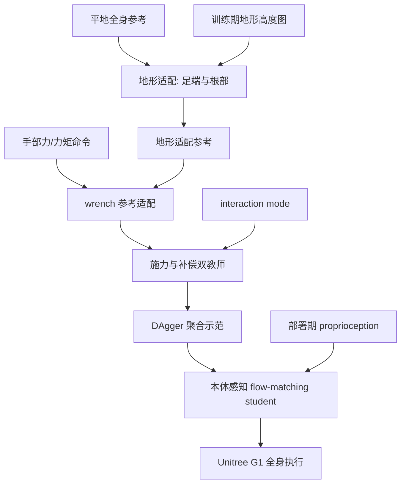

# BRACE：让全身跟踪同时适应地形与交互力

**BRACE**（*Adapting Whole-Body References for Force and Terrain Aware Humanoid Motion Tracking*）不是单纯“加个力控制器”或“识别高程图”：它先改写待跟踪的全身参考，再训练策略去跟随这个更符合地形和接触任务的目标。

## 一句话定义

把平地采集的人体轨迹变成适合机器人所在坡面、并且能产生或抵抗指定手部力的全身参考，再用一个本体感知策略完成跟踪。

## 英文缩写速查

| 缩写 | 英文全称 | 简要说明 |
|------|----------|----------|
| BRACE | Body Reference Adaptation for Contact and Elevation | 论文中对全身参考地形/力适配框架的展开 |
| WBT | Whole-Body Tracking | 给定全身轨迹并协调机器人身体跟踪 |
| Wrench | Force and Torque | 手部交互力与力矩命令 |
| DAgger | Dataset Aggregation | 通过专家纠正迭代收集学生训练数据 |
| CoM | Center of Mass | 为反作用力配置躯干支撑的质心参考 |
| G1 | Unitree G1 Humanoid | 论文验证的人形平台 |

## 核心信息

| 项目 | 内容 |
|------|------|
| 作者 | Sudarshan Harithas、Chen Yu、Juan Borbon、Shubhankar Mondal、Winston Zha、Srinath Sridhar、Dingqi Zhang、Jiuguang Wang |
| 机构说明 | 论文将项目页列作作者 affiliation link；致谢提到 Multiply Labs、Brown University、University of New Mexico |
| 论文 | [arXiv:2610.07052](https://arxiv.org/abs/2610.07052)，2026-10-05 |
| 项目页 | [BRACE](https://multiplylabs.github.io/brace/) |
| 代码状态 | 项目页 README 说明代码仓库链接待就绪；发现的 [multiplylabs/brace](https://github.com/multiplylabs/brace) 是网页源码项目，不是算法训练/部署实现 |

## 方法流程

1. **地形适配。** 根据局部高度调整足端落点和根部高度、足部朝向，再通过 IK 得到地形适配参考。
2. **力参考适配。** 对 force-exertion 模式，先检查手臂 effort limits，再为产生目标 wrench 引入手部 lead，并修正 CoM/CoP 支撑变化。
3. **分别训练两个特权教师。** Teacher-E 学习主动施力；Teacher-C 学习在外力下保持参考姿态；两者任务语义不同，不能混作一种“抗扰”策略。
4. **蒸馏统一学生。** 通过 DAgger 把教师策略蒸馏到 flow-matching student。学生接收 proprioceptive history、动作参考、interaction mode 和 wrench command，不需要部署时高度图或实测 wrench。
5. **真机使用。** 操作者仍提供平地参考和力命令；策略负责按自身地形/载荷观测跟踪。

## 实验与评测

- **机器人：** Unitree G1；论文同时报告仿真和真实机器人实验。
- **任务类型：** 力施加（如推车、插入注射器、转动绞盘）与力补偿（如承载/抵抗外力），并在坡面或不平地形上继续跟踪。
- **控制边界：** 学生部署输入为本体状态历史、运动参考、mode 和 wrench command；论文声称不需部署高度图或测得的 wrench。
- **整体结果：** 论文摘要报告了在多种姿态下施力/补偿并处理地形的能力；正文还比较全身漂移、成功率与力矩，不把定性视频当作统一的单一成功率数字。

## 源码运行时序图

**不适用（截至 2026-10-08）**：目前核实到的 GitHub 仓库是静态项目页源码，其 README 明确说 algorithm code 链接待就绪；训练/部署实现未公开，因此不画虚构的运行调用链。

## 工程实践与局限

- **不是通用视觉地形控制器。** 学生以本体状态推断坡面和载荷；论文讨论的范围包括斜坡、粗糙地面和小平台，不能泛化为任意障碍物的视觉规划。
- **教师拥有特权信息。** 高度图、仿真外力等用于参考生成/训练阶段；学生部署输入更受限。
- **适配依赖参考与命令定义。** 错误的交互模式、wrench 坐标系或参考对齐会直接改变教师目标。
- **代码与示范视频不是一回事。** 项目页可查看经过处理的演示和方法示意，但当前缺算法训练/部署代码，复现仍需等待官方 release。

## 结论

**BRACE 的方法核心是“先把目标轨迹改对，再学习怎么跟踪”：将地形与 wrench 的物理要求折进参考，并用双教师蒸馏一个本体感知 student。**

1. 地形和力命令被转换成全身参考变化，不只是 reward shaping。
2. 施力与抵抗外力分成不同 teacher，再用 mode 将其统一给学生。
3. flow-matching student 的部署输入较轻，但依赖可靠的 proprioception 和命令/参考接口。
4. 论文在 G1 上做了仿真与真机实验；数量化比较应回到各任务具体表格。
5. 项目页源码仓并非 BRACE 算法实现，不要据此宣称控制代码已开源。

## 关联页面

- [Whole-Body Control](../concepts/whole-body-control.md) — 全身控制任务组合与下游执行器
- [Humanoid Locomotion](../tasks/humanoid-locomotion.md) — 地形与全身移动基准
- [Terrain Adaptation](../concepts/terrain-adaptation.md) — 机器人对地形变化的动作适配
- [Imitation Learning](../methods/imitation-learning.md) — DAgger 教师—学生蒸馏背景

## 参考来源

- [BRACE 论文摘录](../../sources/papers/brace_arxiv_2610_07052.md)
- [BRACE 项目页归档](../../sources/sites/brace-project.md)
- [项目页仓库档案（非算法实现）](../../sources/repos/brace-project-site.md)

## 推荐继续阅读

- [arXiv:2610.07052](https://arxiv.org/abs/2610.07052)
- [BRACE 项目页与演示](https://multiplylabs.github.io/brace/)
