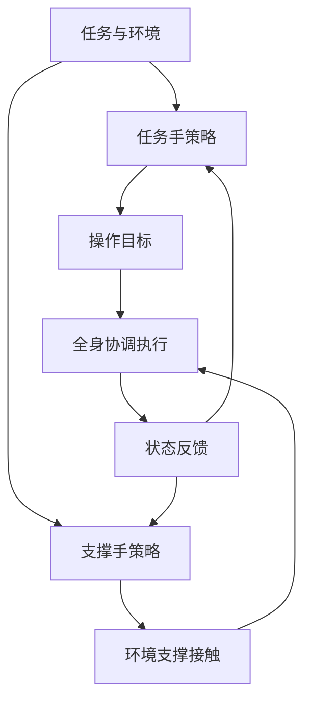

# Brace Yourself（arXiv:2609.25486）

**Brace Yourself**（*Brace Yourself: Task-Conditioned Environmental Bracing for Forceful Humanoid Manipulation*，[arXiv:2609.25486](https://arxiv.org/abs/2609.25486)）来自 [senlanke 具身运控lab 周更盘点](../../sources/blogs/wechat_senlanke_weekly_humanoid_quadruped_2026-09-21_25.md)（2026-09-21–25）。

## 一句话定义

**Supporting Hand Strategy：任务手操作、支撑手找环境支撑点；双 RL 同步；G1 最大 60 N vs 无支撑 13.5 N。**

## 英文缩写速查

| 缩写 | 英文全称 | 简要说明 |
|------|----------|----------|
| RL | Reinforcement Learning | 强化学习 |
| WBC | Whole-Body Control | 全身控制 |
| MPC | Model Predictive Control | 模型预测控制 |

## 为什么重要

- 单脚支撑限制最大操作力。

## 流程总览

以下按本页已归纳的机制与资料绘制，表示模块或阅读路径关系。

## 核心机制

| 项 | 内容 |
|----|------|
| **arXiv** | [2609.25486](https://arxiv.org/abs/2609.25486) |
| **开源** | **待发布**（步骤 2.5，2026-09-28） |
| **方法摘要** | Task-conditioned environmental bracing with dual RL policies. |

## 源码运行时序图

**不适用**（截至 2026-09-28 未发布可运行官方代码或待核实）。

## 实验与评测

- Unitree G1 强力操作（QUT 等，以 PDF 为准）。
- 读法：先对齐任务设定、传感器与成功定义，再解读 headline 数字。

## 与其他工作对比

| 维度 | 读法 |
|------|------|
| **同周对照** | 见对应 [周更盘点](../../sources/blogs/wechat_senlanke_weekly_humanoid_quadruped_2026-09-21_25.md) 映射表，勿跨任务直接比 SR |
| **开源状态** | **待发布** — 部署前以项目页/arXiv 为准 |

## 结论

**环境支撑是把反作用力卸到场景的关键人形操作技巧。**

1. 开源：**待发布**；勿凭公众号摘要臆断可复现性。
2. 指标须连同实验条件解读（仿真/真机、平台、成功阈值）。
3. 关注 arXiv 版本更新与代码发布。

## 关联页面

- [humanoid-locomotion](../tasks/humanoid-locomotion.md)
- [reinforcement-learning](../methods/reinforcement-learning.md)
- [sim2real](../concepts/sim2real.md)

## 参考来源

- [brace-yourself-environmental-bracing_arxiv_2609_25486.md](../../sources/papers/brace-yourself-environmental-bracing_arxiv_2609_25486.md)
- [wechat_senlanke_weekly_humanoid_quadruped_2026-09-21_25.md](../../sources/blogs/wechat_senlanke_weekly_humanoid_quadruped_2026-09-21_25.md)
- [arXiv:2609.25486](https://arxiv.org/abs/2609.25486)

## 推荐继续阅读

- [arXiv PDF](https://arxiv.org/pdf/2609.25486)
