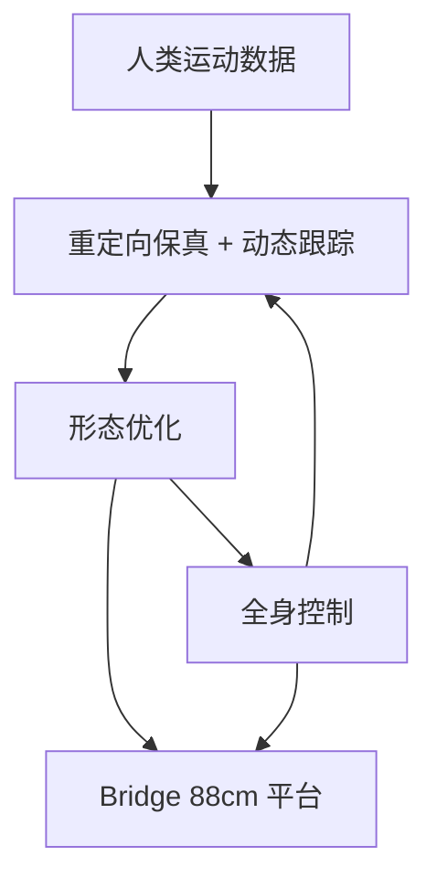

# BRIDGE：形态–控制共设计的开源人形平台

**BRIDGE**（*An Open-Source Humanoid Platform via Morphology-Control Co-Design for Physical AI*，[arXiv:2609.03497](https://arxiv.org/abs/2609.03497)，[项目页](https://sites.google.com/view/bridgerobot)）由 **卡内基梅隆大学（CMU）** Jianren Wang、Abhinav Gupta、Deepak Pathak 与 **华中科技大学**、**JoyIn AI** 等提出：能利用人类行为数据的人形是通用具身的重要载体，但传统开发把 **硬件形态** 与 **全身控制** 割裂，损害流畅性与敏捷性。作者给出数据驱动的 **morphology-control co-design**，并用同时考虑 **运动重定向保真度** 与 **动态跟踪性能** 的新指标优化更接近人类运动的形态；落地机器人为 **88 cm** 高的 Bridge，论文表格还列出约 **1500 美元**、open code / open design。

## 一句话定义

**人形开源竞争不只是代码开源，而是形态、控制与成本一起可复制。**

## 英文缩写速查

| 缩写 | 英文全称 | 简要说明 |
|------|----------|----------|
| BRIDGE | Bridge Humanoid Platform | 本文共设计落地的开源人形 |
| Co-design | Morphology-Control Co-Design | 形态与全身控制联合优化 |
| SOTA | State of the Art | 相对 Bumi / K1 / Toddlerbot 的报告位置 |
| MoCap | Motion Capture | 共设计所用人类运动数据 |

## 为什么重要

- 纳入 [九篇盘点](../../sources/blogs/wechat_embodied_station_9_papers_open_source_2026-09-04.md) 的「低成本开放硬件」支线。
- 把「买得起的研究平台」和「像人的运动」写成同一优化问题。
- 提醒：项目页存在 ≠ 仓库可 clone。

## 方法

| 项 | 内容 |
|----|------|
| **机构** | CMU、华中科技大学、JoyIn AI |
| **规格** | 88 cm；约 1.5K USD（论文/公众号） |
| **对照** | Bumi、K1、Toddlerbot |
| **开源** | **待核实**：项目页 GitHub 指向通用 `github.com/bridge` |

### 流程总览

## 评测

论文称该框架在所报指标上相对 Bumi、K1、Toddlerbot 达到 SOTA，并展示基础移动、鲁棒平衡与高动态动作。入库日以项目页与摘要为准，**不把未公开表格里的单项分数写进本页**。

## 结论

**先共设计形态与控制，再谈「开源人形」；否则开源的只是一份买不齐、控不稳的零件清单。**

1. **割裂开发是瓶颈** — 先定骨架再训策略，容易牺牲类人流畅性。
2. **指标要联合** — 只比重定向或只比跟踪都会偏科。
3. **成本是一等参数** — 约 1500 美元是研究平台叙事的核心，不是附录。
4. **宣称开源 ≠ 可 clone** — 截至 2026-09-04 未见可用官方仓。
5. **与装配唯一性互补** — 形态模块能否精确复现见 [Network Design](./paper-network-design-reproducible.md)。

## 源码运行时序图

**不适用** — 截至 **2026-09-04** 未见可运行官方控制/制造仓库。

## 工程实践

| 项 | 建议 |
|----|------|
| 跟踪入口 | 项目页 + arXiv；定期复核是否出现真实 GitHub |
| 对标平台 | Toddlerbot / K1 / Bumi，而不是只对 G1 |
| 重定向 | 对照 [Motion Retargeting](../concepts/motion-retargeting.md) 与 [UMR](./paper-umr-unified-motion-retargeting.md) |

## 局限与风险

- **仓库未落地** — 不能按论文「open code」去复现控制。
- **小尺寸人形** — 88 cm 的动力学与全尺寸工业人形不可直接外推。
- **SOTA 口径** — 对照集小，需看指标定义。

## 与其他工作对比

| 对照 | 差异读法 |
|------|----------|
| Unitree G1 等商品人形 | 闭源本体 + 开源策略生态；Bridge 宣称本体与控制一起开 |
| [Toddlerbot](https://toddlerbot.github.io/) 等桌面人形 | 同属低成本研究平台；本文强调共设计指标 |
| [UMR](./paper-umr-unified-motion-retargeting.md) | 重定向算法；Bridge 把重定向保真写进形态优化 |

## 关联页面

- [Humanoid Locomotion](../tasks/humanoid-locomotion.md)
- [Motion Retargeting](../concepts/motion-retargeting.md)
- [开源可复现性 9 篇地图](../overview/open-source-reproducibility-9-papers-technology-map.md)

## 参考来源

- [bridge_humanoid_arxiv_2609_03497](../../sources/papers/bridge_humanoid_arxiv_2609_03497.md)
- [bridgerobot 项目页](../../sources/sites/bridgerobot.md)
- [具身智能小站 2026-09-04 九篇盘点](../../sources/blogs/wechat_embodied_station_9_papers_open_source_2026-09-04.md)

## 推荐继续阅读

- [arXiv:2609.03497](https://arxiv.org/abs/2609.03497)
- [Bridge 项目页](https://sites.google.com/view/bridgerobot)
