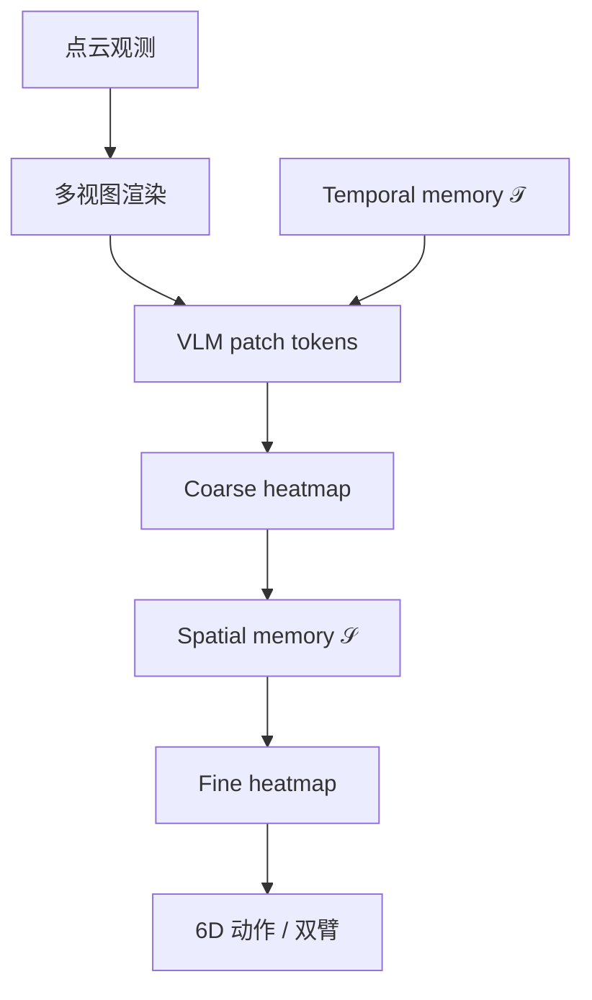
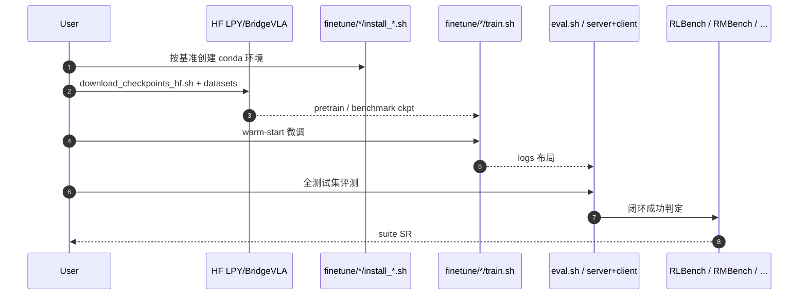

# BridgeVLA++（Memory-Augmented 3D VLA · arXiv:2608.05042）

**BridgeVLA++**（*BridgeVLA++: A Data-Efficient, Generalizable, and Memory-Augmented Vision-Language-Action Framework for 3D Manipulation*，[arXiv:2608.05042](https://arxiv.org/abs/2608.05042)，TPAMI 稿）由 **中科院自动化所 NLPR / 国科大** 等提出（李沛岩\* / 朱宇泽\* / … / 黄岩† / 谭铁牛等；吴鸿涛、马骁、孔涛贡献时隶属 **字节跳动 Seed**）：在 NeurIPS 2025 **BridgeVLA**（[2506.07961](https://arxiv.org/abs/2506.07961)）的多视图 heatmap 对齐底座上，加入 **统一时空记忆**，同时覆盖数据高效 3D 操纵、OOD 与记忆依赖任务。[项目页](https://bridgevla-plus.github.io/) · [代码](https://github.com/BridgeVLA/BridgeVLA) · [权重](https://huggingface.co/datasets/LPY/BridgeVLA)。

## 一句话定义

**点云先画成多视图图、动作先落成 heatmap——再在 VLM patch 空间插时间关键帧记忆与空间初始几何记忆，让 3D VLA 既省数据又能做「当前帧不够」的任务。**

## 英文缩写速查

| 缩写 | 英文全称 | 简要说明 |
|------|----------|----------|
| VLA | Vision-Language-Action | 本页框架族 |
| VLM | Vision-Language Model | 预训练骨干（PaliGemma 系配方） |
| 𝒯 / 𝒮 | Temporal / Spatial memory | 粗阶段历史关键帧 / 细阶段初始几何 |
| RMBench | — | 双臂记忆依赖基准（9 任务） |
| COLOSSEUM | — | 未见扰动泛化套件 |
| GemBench | — | 四级系统化泛化基准 |

## 为什么重要

- **3D VLA 的「对齐税」有解法：** 直接把点云/6D 塞进 VLM 会砸预训练分布；BridgeVLA 用 **图像↔heatmap** 保住 I/O 对齐，++ 在此上加记忆而不改动作头。
- **记忆不是附加榜，而是设计目标：** RMBench 无记忆 base **18.9% → ++ 96.0%**；同时 RLBench/COLOSSEUM/GemBench **不掉** 数据效率叙事。
- **双臂与跨本体：** 场景级记忆共享支持 bimanual；真机在 Franka 与 **held-out Dobot CR5A** 上验证。
- **可复现开源：** 五仿真基准脚本 + HF/ModelScope 权重（真机数据自采）。

## 核心信息

| 项 | 内容 |
|----|------|
| **机构** | 中国科学院自动化研究所（CASIA）NLPR；中国科学院大学（UCAS）；FiveAges；字节跳动 Seed（部分作者历史隶属） |
| **前置** | BridgeVLA（NeurIPS 2025，arXiv:2506.07961） |
| **参数增量** | **+9.2%**（+269.77M / 2.92B backbone） |
| **开源** | **已开源** — Apache-2.0；[`BridgeVLA/BridgeVLA`](https://github.com/BridgeVLA/BridgeVLA)（`main`=++） |

## 核心原理

### Part I · BridgeVLA 底座

1. **点云 → 正交多视图图像**（VLM 继续看「图」）。
2. **2D heatmap 预训练**（检测语料，语言→空间热图）。
3. **Coarse-to-fine 动作：** 多视图 heatmap 投票 waypoint，再 zoom 精修；连续 6D 旋转头。

### Part II · 统一时空记忆（++）

| 记忆 | 插入阶段 | 作用 |
|------|----------|------|
| **Temporal 𝒯** | 粗阶段 | 门控关键帧历史 → *what to do next* |
| **Spatial 𝒮** | 细阶段 | 初始较少遮挡点云按当前 zoom 重渲染 → *where exactly to act* |

两者均在 **patch-token 空间加性注入**，动作接口不变；双臂共享场景记忆。

### 流程总览

## 源码运行时序图

官方入口对齐 [`sources/repos/bridgevla.md`](../../sources/repos/bridgevla.md)：按基准装环境 → 拉权重 → train/eval。

关键路径：`download_checkpoints_hf.sh rlbench paligemma clip` → `finetune/RLBench/{train,eval}.sh`；记忆套件换 `memoryBench` / `RMBench`。

## 工程实践

| 项 | 建议读法 |
|----|----------|
| 分支 | 要原版 BridgeVLA 用 `bridgevla` 分支；++ 在 `main` |
| 磁盘 | checkpoint `all` ~120 GiB；单基准数据可到百 GB 级 |
| 延迟 | RTX 4090 **0.35→0.57 s/step**（相对观测传输与执行仍小） |
| 真机数据下限 | 项目页称 Franka 13 任务 **3 demos/task → 95.4%** |
| 调试 | 记忆任务看去 𝒯 是否崩；遮挡精密任务看去 𝒮 |

## 实验与评测

| 基准 | BridgeVLA++ | 备注 |
|------|-------------|------|
| RLBench（18） | **93.7%** | 相对前 SOTA +6.9 pt（项目页） |
| COLOSSEUM | **65.2%** | 14 设定 / 12 未见扰动轴 |
| GemBench | **51.1%** | 四级泛化 |
| RMBench（双臂记忆） | **96.0%** | base 无记忆 **18.9%** |
| MemoryBench | **99.7%** | 单臂记忆 |
| Dobot 记忆任务 basic | **93.3%** | 无记忆 20.0%；扰动均仍领先 |

**消融：** 去 heatmap 解码 RLBench **90.5→31.4**；RMBench 去 𝒯 **96.0→21.3**；去 𝒮 对 RMBench 几乎无伤、对遮挡精密任务有损。

## 结论

**BridgeVLA++ 证明：3D VLA 的记忆可以做成「不改动作头的 patch 侧插件」——时间记忆扛阶段歧义，空间记忆扛遮挡几何；代价是约一成参数与 +0.2 s/step。**

1. **先保住 heatmap 对齐，再谈记忆** — 去掉 heatmap 解码比去掉记忆更致命（−59 pt 量级）。
2. **选型先问任务是 𝒯 还是 𝒮 瓶颈** — RMBench 几乎只吃 𝒯；精密遮挡吃 𝒮。
3. **与稀疏视觉记忆对照：** [KEMO](./paper-kemo-event-driven-keyframe-memory-vla.md) / [EventVLA](./paper-eventvla-visual-evidence-memory.md) 挂 2D VLA；本文是 **3D 多视图 + 双阶段记忆**。
4. **开源可用但重** — 仿真可复现；真机数据未发，跨臂迁移需自采。

## 局限与风险

- 依赖点云 / 多视图渲染与较重仿真栈；PyRep/RLBench 许可限制分发。
- 真机数据未公开；Dobot 为 held-out 臂但数据规模有限（10 demos/指令量级）。
- 记忆增长主要增 cache，仍有 +0.22 s 推理延迟。

## 与其他工作对比

| 工作 | 差异 |
|------|------|
| [KEMO](./paper-kemo-event-driven-keyframe-memory-vla.md) / [EventVLA](./paper-eventvla-visual-evidence-memory.md) | 2D VLA 稀疏关键帧；本文 3D heatmap + 𝒯/𝒮 |
| [Chronos](./paper-chronos.md) | 全历史 SSM 紧凑态；本文显式双记忆 + 多视图 |
| [FM-VLA](./paper-fm-vla.md) | 力觉历史；阶段变化不可见时更对症 |
| [RTCF](./paper-rtcf.md) | **免训练** 检索纠偏；本文是 **可训记忆模块** |

## 关联页面

- [VLA](../methods/vla.md)
- [Manipulation](../tasks/manipulation.md)
- [KEMO](./paper-kemo-event-driven-keyframe-memory-vla.md)
- [EventVLA](./paper-eventvla-visual-evidence-memory.md)
- [Chronos](./paper-chronos.md)
- [RTCF](./paper-rtcf.md)

## 参考来源

- [BridgeVLA++ 论文归档](../../sources/papers/bridgevla_plusplus_arxiv_2608_05042.md)
- [BridgeVLA 仓库归档](../../sources/repos/bridgevla.md)
- [项目页归档](../../sources/sites/bridgevla-plus-github-io.md)

## 推荐继续阅读

- 项目页五套件与消融：<https://bridgevla-plus.github.io/>
- 原版 BridgeVLA：<https://arxiv.org/abs/2506.07961>
