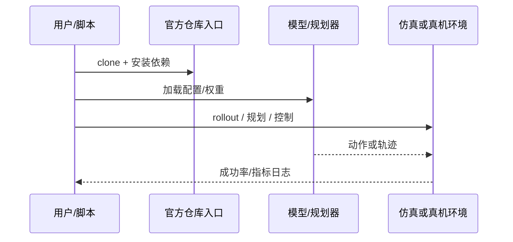

# CAP（arXiv:2609.11553）

**CAP**（[CAP: Continuously Adaptive Perception-Blind Humanoid Locomotion via Learned Denoising](https://arxiv.org/abs/2609.11553)）来自 [具身智能小站 14 篇盘点](../../sources/blogs/wechat_embodied_station_14_papers_dexterous_wm_humanoid_2026-09-11.md)。去噪世界模型 + 本体感觉 VAE 供给单一策略；Unitree G1 部分遮挡下平滑退化。

## 一句话定义

**深度坏一半时别硬切盲走——用去噪编码与连续感知退化训练实现平滑过渡。**

## 英文缩写速查

| 缩写 | 英文全称 | 简要说明 |
|------|----------|----------|
| VLA | Vision-Language-Action | 视觉-语言-动作策略 |
| VLM | Vision-Language Model | 视觉-语言多模态模型 |
| WM | World Model | 预测未来观测或表征的动力学模型 |
| IL | Imitation Learning | 模仿学习 |
| RL | Reinforcement Learning | 强化学习 |
| DoF | Degrees of Freedom | 自由度 |

## 为什么重要

- 纳入本期 **灵巧手 / 世界模型 / 人形控制 / VLA** 主线之一。
- 开源状态：**已开源**（步骤 2.5 核查，2026-09-11）。
- 与 [14 篇技术地图](../overview/dexterous-wm-humanoid-14-papers-technology-map.md) 中同类工作可横向对照。

## 核心机制

| 项 | 内容 |
|----|------|
| **arXiv** | [2609.11553](https://arxiv.org/abs/2609.11553) |
| **项目页** | https://hoshi-no-ai.github.io/CAP/ |
| **代码/资源** | https://github.com/Hoshi-No-Ai/CAP |
| **开源** | **已开源** |
| **文内指标** | Unitree G1 室内外测试验证部分遮挡下的平滑退化。 |

## 源码运行时序图

## 实验与评测

| 项 | 文内口径 |
|----|----------|
| 要点 | Unitree G1 室内外测试验证部分遮挡下的平滑退化。 |

- **读法：** 本页为索引级摘要，上表取自 [公众号盘点](../../sources/blogs/wechat_embodied_station_14_papers_dexterous_wm_humanoid_2026-09-11.md) 与项目页；具体对照方法、任务集与逐项指标以 **原文 PDF** 为准（[参考来源](#参考来源)）。

## 与其他工作对比

- **感知失效即 **硬切盲走**（proprioceptive-only 兜底策略）** — 切换瞬间步态突变、易失稳；CAP 训练 **连续感知退化**，用去噪世界模型 + 本体感觉 VAE 供给 **单一策略**，实现平滑过渡而非策略切换。
- **依赖高度图/高程图的感知式行走（见 [台阶与障碍感知行走](../tasks/stair-obstacle-perceptive-locomotion.md)）** — 假定深度可用且质量稳定；CAP 针对的是深度 **部分遮挡/坏一半** 的中间态。
- **[EVPeriscope](./paper-evperiscope.md)** — 同为「感知退化」问题，但走 **增补外部传感**（空中事件相机潜望镜）扩展可观测性；CAP 不加硬件，靠 **表征去噪与退化训练** 在既有传感下降级运行。
- **[Generative World Models](../methods/generative-world-models.md)** — 该页给出世界模型的通用用途；CAP 把它用作 **观测去噪前端** 而非规划器。
- **[机器人视觉感知栈选型闭环](../queries/robot-perception-stack-selection-loop.md)** — 该指南按「传感 → 表征 → 降级策略」分层；CAP 对应其中 **降级/冗余** 一环的学习型方案，文内以 Unitree G1 室内外测试为口径。

- **读法：** 以上为知识库内 **路线级** 对照；与原文 baseline 的逐项定量比较与消融以 **原文 PDF** 为准（[参考来源](#参考来源)）。

## 结论

**CAP 适合作为本期「已开源」边界下的快速索引页，部署前请核对仓库/README 可运行性。**

1. 核心贡献：深度坏一半时别硬切盲走——用去噪编码与连续感知退化训练实现平滑过渡。
2. 开源结论：**已开源** — 以项目页实际链接为准（入库日 2026-09-11）。
3. 横向对照见 [14 篇技术地图](../overview/dexterous-wm-humanoid-14-papers-technology-map.md)，避免与同 arXiv 重复造页。

## 关联页面

- [14 篇技术地图](../overview/dexterous-wm-humanoid-14-papers-technology-map.md)
- [VLA（Vision-Language-Action）](../methods/vla.md)
- [Generative World Models](../methods/generative-world-models.md)
- [Manipulation](../tasks/manipulation.md)
- [机器人视觉感知栈选型闭环](../queries/robot-perception-stack-selection-loop.md) — 本页的感知退化处理对应该链路的「降级/冗余」一环
- [台阶与障碍感知行走](../tasks/stair-obstacle-perceptive-locomotion.md) — 深度可用时的感知式行走对照

## 参考来源

- [cap-perception-blind-humanoid_arxiv_2609_11553.md](../../sources/papers/cap-perception-blind-humanoid_arxiv_2609_11553.md)
- [wechat 14篇盘点](../../sources/blogs/wechat_embodied_station_14_papers_dexterous_wm_humanoid_2026-09-11.md)
- [arXiv:2609.11553](https://arxiv.org/abs/2609.11553)

## 推荐继续阅读

- [arXiv PDF](https://arxiv.org/pdf/2609.11553)
- [项目页/资源](https://hoshi-no-ai.github.io/CAP/)
- [代码/资源](https://github.com/Hoshi-No-Ai/CAP)
