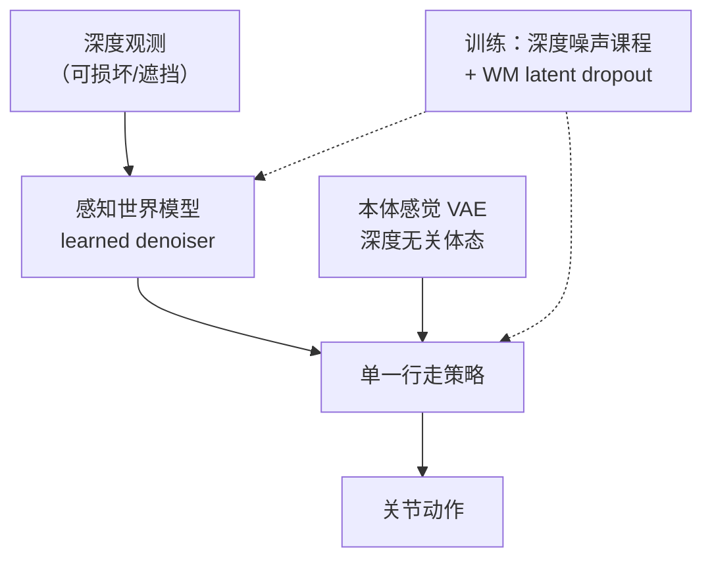

# CAP（arXiv:2609.11553）

**CAP**（*Continuously Adaptive Perception-Blind Humanoid Locomotion via Learned Denoising*，[arXiv:2609.11553](https://arxiv.org/abs/2609.11553)，[项目页](https://hoshi-no-ai.github.io/CAP/)，**CoRL 2026**）由复旦大学、TARS Robotics、哈工大、上交等提出：用 **单阶段策略** 覆盖从清洁深度到感知失效的全谱质量，而非在感知/盲走子策略间硬切换。

## 一句话定义

**深度坏一半时别硬切盲走——感知世界模型学深度去噪、本体 VAE 并行供深度无关体态，再用噪声课程 + WM 特征 dropout 训练单一策略平滑退化。**

## 英文缩写速查

| 缩写 | 英文全称 | 简要说明 |
|------|----------|----------|
| CAP | Continuously Adaptive Perception-Blind | 本文连续自适应感知-盲走统一框架 |
| WM | World Model | 此处作感知深度去噪编码器，非规划器 |
| VAE | Variational Autoencoder | 本体感觉变分编码器，供深度无关体态 |
| G1 | Unitree G1 | 论文真机平台 |
| CoRL | Conference on Robot Learning | 发表会议 |

## 为什么重要

- **感知退化是部署常态：** 深度会部分遮挡、间歇失效或带户外伪影；硬切盲走策略易造成步态突变。
- **单策略覆盖全谱：** 去噪 WM 恢复部分可救信息，并行 proprio VAE 保证深度全失时仍有体态；训练时 **深度噪声课程 + policy-facing WM latent dropout** 覆盖整条质量谱。
- **真机证据：** Unitree G1 受控试验 + 室内外部署；项目页报告清洁与部分遮挡下 **39/40** 成功（每地形×条件 5 次）。

## 核心信息

| 项 | 内容 |
|----|------|
| **机构** | 复旦大学（Fudan）、TARS Robotics、上海创智学院、哈尔滨工业大学（HIT）、上海交通大学（SJTU） |
| **平台** | Unitree G1 |
| **会议** | CoRL 2026 |
| **arXiv** | [2609.11553](https://arxiv.org/abs/2609.11553)（截至 2026-09-17 仍为 **v1**，无新版本） |
| **项目页** | <https://hoshi-no-ai.github.io/CAP/> |
| **GitHub** | [Hoshi-No-Ai/CAP](https://github.com/Hoshi-No-Ai/CAP) |
| **开源** | **待发布** — 2026-09-17 再核：README *Code release is in preparation*；训练/部署代码均未发布 |

## 核心原理

### 双通路、一策略

| 通路 | 作用 |
|------|------|
| **感知 WM 去噪器** | 从 **损坏深度** 重建清洁/稳定深度表征 |
| **本体感觉 VAE** | 高率、**深度无关** 的体态信息，与感知通路 **并行共活** |
| **单一 locomotion policy** | 消费两路 latent；训练暴露于整条感知质量谱 |

### 流程总览

## 工程实践

| 环节 | 要点 |
|------|------|
| **感知前端** | 损坏深度进 **WM 去噪器** 重建稳定表征；勿假设深度始终 in-distribution |
| **并行本体支路** | 高率 **proprio VAE** 与 WM latent **共活**，深度全失时仍供体态 |
| **训练课程** | **深度噪声课程**（输入侧）+ **policy-facing WM latent dropout**（特征侧）覆盖整条质量谱 |
| **部署读法** | 部分遮挡 / 户外伪影可平滑应对；**gap/platform** 在 full cover 下勿高估 |
| **复现入口** | 截至 2026-09-17 仅论文 PDF + 项目页视频；代码待 [Hoshi-No-Ai/CAP](https://github.com/Hoshi-No-Ai/CAP) 发布 |

## 局限与风险

- **完全遮挡：** 依赖前向深度的地形（**gap、platform**）仍会失败 — 项目页受控试验：Full cover 下 Platform/Gap/Mixed **0/5**；Stair 仍 **5/5**。
- **单策略 vs 切换：** 相对 [VB-Com](./paper-notebook-vb-com-learning-vision-blind-composite-humanoid.md) 等 **双策略路由**，CAP 赌 **连续退化训练** 能吃掉中间态；切换边界更软但 full-blind 前向地形仍难。
- **WM 角色：** 此处 WM 是 **观测去噪前端**，非规划器 — 勿与 [Generative World Models](../methods/generative-world-models.md) 里「想象 rollout」混读。
- **开源：** 训练/部署代码 **待发布** — 选型先读论文与项目页，勿假设可逐行复现。

## 源码运行时序图

**不适用**（截至 **2026-09-17** 官方仓库为占位，README Release status 未勾选 Training / Deployment code；发布后应补本图并对齐 [`sources/repos/hoshi-no-ai-cap.md`](../../sources/repos/hoshi-no-ai-cap.md)。）

## 实验与评测

### G1 受控试验（项目页，每条件 5 次）

| 感知条件 | Stair | Platform | Gap | Mixed |
|----------|-------|----------|-----|-------|
| Clean | 5/5 | 5/5 | 5/5 | 5/5 |
| Partial occlusion | 5/5 | 4/5 | 5/5 | 5/5 |
| Full cover | 5/5 | 0/5 | 0/5 | 0/5 |

- **汇总：** 清洁 + 部分遮挡共 **39/40** 成功。
- **仿真：** 深度仍有用时匹配或优于感知基线；感知恶化时相对 **二元切换基线** 退化更平滑（项目页 sweep 图）。

## 与其他工作对比

| 对照路线 | 差异 |
|----------|------|
| 感知/盲走 **子策略路由或切换** | CAP 用 **单策略 + 连续退化训练**，利用部分损坏深度中的可恢复信息 |
| [台阶与障碍感知行走](../tasks/stair-obstacle-perceptive-locomotion.md) | 假定深度稳定可用；CAP 针对 **中间退化态** |
| [EVPeriscope](./paper-evperiscope.md) | 增补外部传感扩展可观测性；CAP **不加硬件**，靠去噪与训练课程 |
| [Generative World Models](../methods/generative-world-models.md) | 通用 WM 分类；CAP 把 WM 当 **观测去噪前端** |

## 结论

**CAP 把「感知降级」从策略切换问题变成单策略表征与训练课程问题；真机部分遮挡证据强，但完全失深度时前向地形仍难。**

1. **架构读点：** 去噪 WM + 并行 proprio VAE + 双课程（输入噪声 + latent dropout）是核心三联。
2. **部署读点：** 部分遮挡与传感器伪影可平滑应对；gap/platform 类任务在 full cover 下勿高估。
3. **开源边界（2026-09-17 再核）：** GitHub 仓存在但 **代码待发布** — 选型先读论文/项目页，复现需等官方 release。
4. **arXiv：** 仍 **v1**（2026-09-10 提交），自入库无新版本。
5. **横向：** 见 [14 篇技术地图](../overview/dexterous-wm-humanoid-14-papers-technology-map.md) 与 [感知栈选型闭环](../queries/robot-perception-stack-selection-loop.md)。

## 关联页面

- [14 篇技术地图](../overview/dexterous-wm-humanoid-14-papers-technology-map.md)
- [Generative World Models](../methods/generative-world-models.md)
- [Locomotion](../tasks/locomotion.md)
- [Unitree G1](./unitree-g1.md)
- [EVPeriscope](./paper-evperiscope.md)

## 参考来源

- [cap-perception-blind-humanoid_arxiv_2609_11553.md](../../sources/papers/cap-perception-blind-humanoid_arxiv_2609_11553.md)
- [cap-github-io 项目页归档](../../sources/sites/cap-github-io.md)
- [hoshi-no-ai-cap 仓库归档](../../sources/repos/hoshi-no-ai-cap.md)
- [wechat 14篇盘点](../../sources/blogs/wechat_embodied_station_14_papers_dexterous_wm_humanoid_2026-09-11.md)

## 推荐继续阅读

- [arXiv PDF](https://arxiv.org/pdf/2609.11553)
- [项目页](https://hoshi-no-ai.github.io/CAP/)
- [YouTube 演示](https://youtu.be/GE_GassSkYM)
