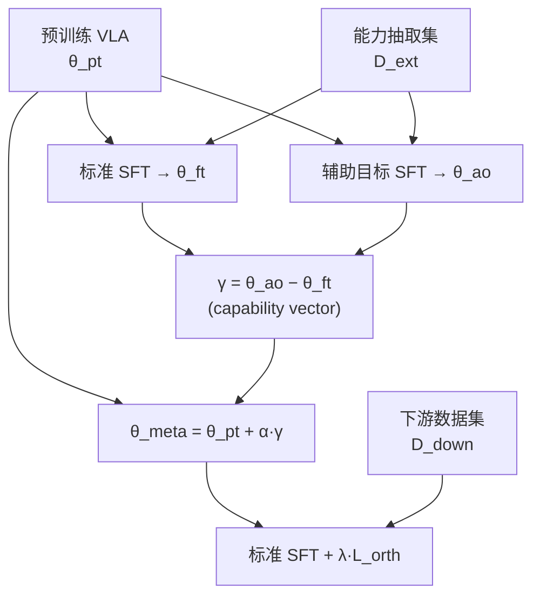

# CapVector（VLA 参数空间可迁移能力向量）

**CapVector** 是 HKUST（广州）、浙江大学、西湖大学、清华大学与北京智源等合作者的论文工作（arXiv:2605.10903，项目页 [capvector.github.io](https://capvector.github.io/)）：针对 **预训练 Vision-Language-Action（VLA）** 在下游 **标准监督微调（SFT）** 上 **增益有限、收敛偏慢**，而 **带辅助目标的 SFT**（如空间对齐、潜式链式思维）虽能改善 **基础能力与步数效率** 却 **显著增加训练时计算** 的矛盾，提出在 **同一参数空间** 内把两类训练写成的 **checkpoint 差分** 解释为 **capability vector**，再与 **预训练权重算术合并** 得到 **能力增强的 meta 初始化**；下游任务仅用 **常规 SFT** 并加一项 **轻量正交正则**，使更新方向尽量不与已注入的能力向量 **逐元素共线干扰**，从而在 **开销接近纯 SFT** 的前提下 **复现辅助微调级别的性能与训练效率**。

## 一句话定义

**用两次同分布微调（标准 SFT 与辅助目标 SFT）的参数差当「能力向量」，离线合并进预训练权重，再用正交正则保护该方向，让下游标准微调继承辅助训练的好处而不长期背负辅助前向。**

## 为什么重要

- **成本结构：** 把 **Spatial Forcing、LaRA-VLA** 等路线里 **持续在线的辅助对齐 / 额外分支** 转成 **一次性的双 checkpoint 抽取 + 合并**，适合 **多下游、反复微调** 的工程节奏。
- **与 VLA 主线的关系：** 不替换动作头或预训练目标，而是 **显式处理「通用能力提升」与「任务动作拟合」在参数更新中的可分性假设**；对 **OpenVLA 系、StarVLA、\(\pi_{0.5}\)** 等不同动作参数化给出 **横向证据**。
- **可对照概念：** 与 **task vector / model editing** 传统里「合并 specialist」不同，论文强调面向 **任意下游继续微调时的 generalist 友好初始化** 与 **防遗忘正则**。

## 核心结构

| 阶段 | 内容 |
|------|------|
| **能力抽取集 \(\mathcal{D}_{\text{ext}}\)** | 小规模多任务数据；目的不是刷下游榜，而是 **诱导** 辅助目标下的参数变化（论文示例含 LIBERO 子集、RoboTwin 子任务等）。 |
| **双路径微调** | 同设置下训练 **\(\theta_{\text{ft}}\)**（仅任务损失）与 **\(\theta_{\text{ao}}\)**（任务 + 辅助）；假设 **任务相关增量** 近似相同，取 **\(\gamma=\theta_{\text{ao}}-\theta_{\text{ft}}\)**。 |
| **合并** | **\(\theta_{\text{meta}}=\theta_{\text{pt}}+\alpha\gamma\)**，\(\alpha\) 为标量或向量权重（论文有消融）。 |
| **下游标准 SFT** | 从 \(\theta_{\text{meta}}\) 初始化，在 \(\mathcal{D}_{\text{down}}\) 上最小化动作损失，并加 **\(\mathcal{L}_{\text{orth}}\)** 约束 **\(\gamma\)** 与当前增量 **\(\Delta'_{\text{ft}}\)** 的 **逐参数乘积和**（LoRA 时论文聚焦 **A 矩阵**）。 |

### 流程总览

## 常见误区或局限

- **误区：** 把 \(\gamma\) 当成 **与任务无关的万能插件** 而不做 **下游正交正则**；论文在 **长步数训练** 上展示 **无正则时能力被冲掉** 的现象。
- **局限：** **\(\Delta_{\text{ft}}\approx\delta_{\text{ao}}\)** 是 **工作假设**，抽取集设计、学习率与权重衰减等 **任一不一致** 都会污染 \(\gamma\)；论文 §3 讨论 **何种下游更易抽到高质量向量**。
- **工程：** 需 **存两份全参或 LoRA checkpoint** 与 **合并系数调参**；超大模型上 **存储与版本管理** 仍是成本。

## 关联页面

- [VLA（Vision-Language-Action）](../methods/vla.md) — CapVector 作用的 **模型族与微调语境**。
- [StarVLA](../methods/star-vla.md) — 论文 **多骨干** 实验之一（与 LaRA-VLA 组合）。
- [RoboTwin 2.0](./robotwin.md) — **跨域迁移** 与 **能力抽取任务** 涉及的仿真基准之一。
- [Manipulation（任务总览）](../tasks/manipulation.md) — LIBERO / 桌面操作 **评测语义** 背景。

## 方法栈

见上文 **核心结构** 与 **流程总览**（`###` 小节）；完整机制与模块分工以原文为准。

## 实验与评测

- 量化指标、消融与 sim2real / 实机结果见 **原文 PDF** 与 [参考来源](#参考来源)；本页正文侧重方法结构与知识库交叉引用。

## 与其他工作对比

- 正文已给出与相邻路线 / baseline 的 **定性对照**；定量表格与 ablation 见原文（[参考来源](#参考来源)）。

## 参考来源

- [CapVector 论文摘录（arXiv:2605.10903）](../../sources/papers/capvector_arxiv_2605_10903.md)
- [capvector.github.io 项目页归档](../../sources/sites/capvector-github-io.md)
- [OpenHelix-Team/CapVector 仓库归档](../../sources/repos/openhelix_team_capvector.md)

## 推荐继续阅读

- 论文 PDF：<https://arxiv.org/pdf/2605.10903>
- 项目主页：<https://capvector.github.io/>
- 官方代码：<https://github.com/OpenHelix-Team/CapVector>
- 权重集合（HF）：<https://huggingface.co/haofuly/capvector_models_collection>
- Task vectors 经典参考：Ilharco et al., *Editing Models with Task Arithmetic*（arXiv:2212.04089，概念脉络对照用）
