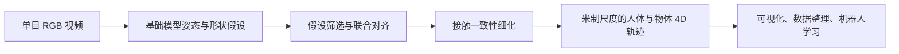
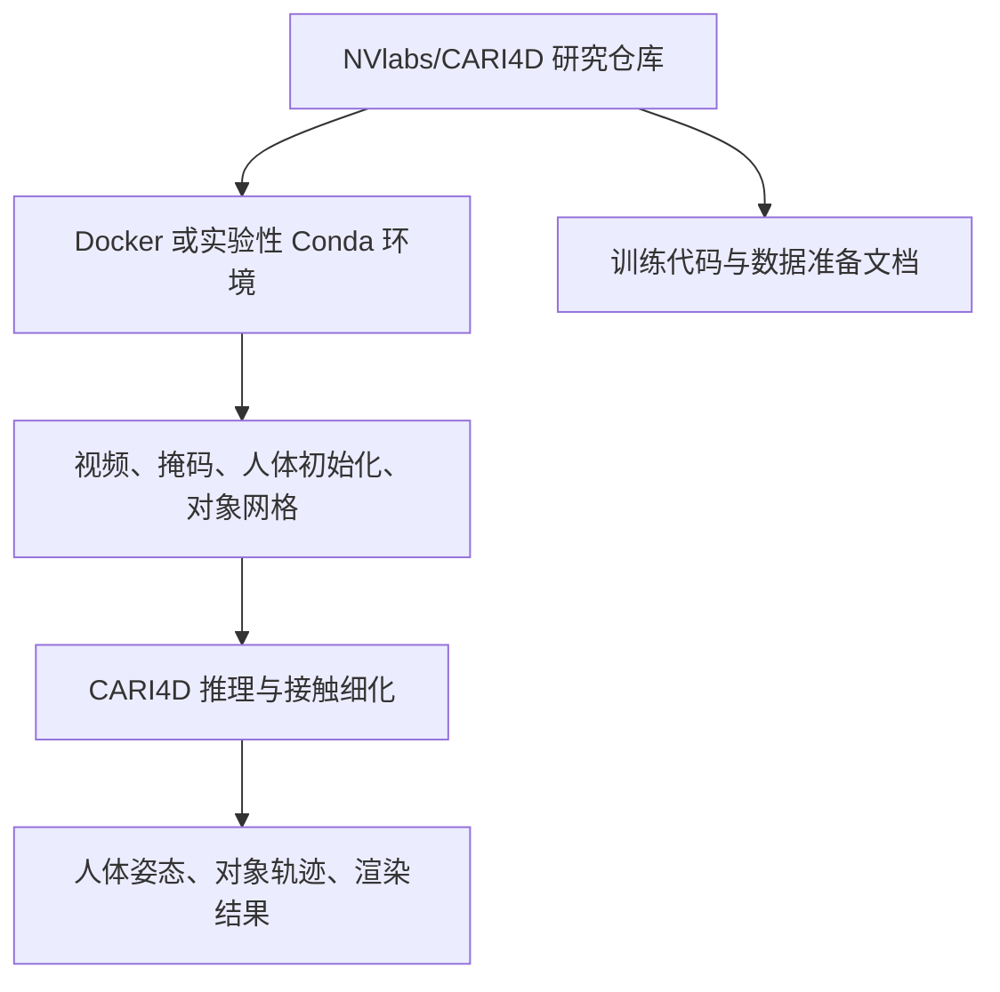
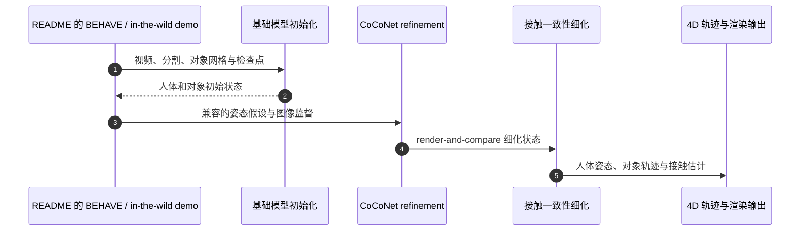

# CARI4D：类别无关的人–物交互 4D 重建

**论文：** [CARI4D: Category Agnostic 4D Reconstruction of Human-Object Interaction](https://arxiv.org/abs/2512.11988)  
**会议：** CVPR 2026 camera-ready。作者来自 NVIDIA、University of Tübingen、Tübingen AI Center 与 Max Planck Institute for Informatics。

## 英文缩写速查

| 缩写 | 英文全称 | 简要说明 |
|---|---|---|
| CARI4D | Category Agnostic 4D Reconstruction of Human-Object Interaction | 类别无关的人–物交互四维重建 |
| HOI | Human-Object Interaction | 人体与对象的时空关系 |
| RGB | Red-Green-Blue | 单目视频的彩色输入 |
| 4D | Four-Dimensional | 三维人体/对象状态随时间变化 |
| MHR | Momentum Human Rig | 后续 CoCoNet 模型采用的人体参数格式 |
| OMA | NVIDIA Open Model Agreement | 后续模型文件的访问与许可协议 |

## 研究问题与方法

单目 RGB 视频缺少真实深度和已知物体模板，遮挡与接触又使逐帧人体/物体估计容易漂移。CARI4D 从普通单目视频恢复时间、空间一致且具有米制尺度的人体与刚体物体交互轨迹，并面向未见对象类别和野外视频泛化。

方法流程：

1. 组合人体、物体形状/姿态和深度等基础模型预测，生成姿态假设。
2. 通过 pose-hypothesis selection 筛选兼容假设，再以可学习的 render-and-compare 目标联合对齐空间、时间和像素。
3. 基于人–物接触关系继续细化姿态，使结果更符合物理约束。
4. 输出人体与对象的 4D 状态，供动作分析、数据整理或机器人学习使用。

## 论文报告结果

| 项目 | 摘要报告 |
|---|---|
| 主要场景 | BEHAVE、InterCap 等人–物交互 |
| 重建误差 | 相比先前方法，分布内改善 38%，未见数据改善 36% |
| 泛化 | 可零样本处理训练类别之外的互联网视频 |

百分比指重建误差改善，不代表机器人任务成功率，也不应与 FORM-HOI 的数据规模混为一谈。

## 项目、代码与模型发布

### 研究实现

- **输入：** 视频、人体/物体分割、人体与物体初始化状态及带纹理对象网格。
- **处理：** 基础模型初始化 → CoCoNet render-and-compare refinement → 接触一致性修正。
- **公开进度：** 仓库记录代码于 2026-02-28 发布，训练代码于 2026-04-04 发布；需按 README 准备容器、权重和依赖。
- **许可：** 研究代码以仓库当前 LICENSE 和依赖条款为准；它与后续 NVIDIA 商用模型卡是不同交付。

### CoCoNet Native MHR 模型发布

NVIDIA 后续发布了 [CARI4D CoCoNet Native MHR 模型卡](https://huggingface.co/nvidia/cari4d_commercial)。模型针对 96 帧视频片段，采用双分支 RGB 与 XYZ/掩码编码和时空特征融合，输出每帧 MHR 参数、刚体对象姿态及左右手 contact logits。模型卡报告 231M 参数，并注明在 NVIDIA A100 上验证。

- 模型卡标注可用于商业或非商业计算机视觉场景，但下载受 **NVIDIA Open Model Agreement** 管理；访问文件前需接受联系信息共享条款。
- 模型用途包括视觉估计、分析、可视化、数据整理与机器人感知，明确**不用于直接自主控制或生命攸关决策**。
- contact logit 是接触估计，不是力测量或物理可行性保证。

### 与 FORM-HOI 的关系

[FORM-HOI](./dataset-form-hoi.md) 是多视角人–物数据集，提供标定、视频、人体姿态、对象轨迹和度量网格。数据卡将 CARI4D 列为 HOI 重建训练用途。CARI4D 论文以单目 RGB 为目标输入；FORM-HOI 则提供多相机重建标注，任务和观测条件不同。

## 与相邻资源的关系

- [FORM-HOI 数据集](./dataset-form-hoi.md)：多视角人–物序列与轨迹，可用于 HOI 重建训练和机器人策略 grounding。
- [HOI-Retarget](./paper-hoi-retarget.md)：把重建的人–物轨迹用于机器人动作重定向，属于下游流程。

## 源码运行时序图

图中 demo 与依赖对齐 [官方源码归档](../../sources/repos/nvlabs-cari4d.md)。这是 README 推理入口的模块级时序；归档尚未保存具体脚本名称，复现时需按上游 README 选择入口。后续 Native MHR 模型的输入与许可单独见上节。

## 局限与使用边界

单目重建会受遮挡、初始化、分割、深度和对象网格质量影响；近似对称物体也可能造成姿态歧义。接触预测是几何/运动线索，不等价于接触力、摩擦或物理可行性。下游机器人部署需独立验证轨迹与接触，不能将重建输出直接当作安全控制命令。

## 与其他工作对比

| 路线 | 需要的先验 | 输出与边界 |
|---|---|---|
| 传统类别受限 HOI 重建 | 已知对象模板或固定对象类别 | 在已知类别/模板内优化，遇到野外未知对象时泛化受限 |
| CARI4D | 单目 RGB 与基础模型生成的初始假设 | 类别无关、米制尺度的人–物 4D 重建；摘要报告分布内/未见数据误差改善 |
| FORM-HOI 多视角标注 | 四路标定 RGB-D 与对象几何 | 作为高质量轨迹数据来源，可训练/评估重建模型；它是数据而非单目重建算法 |

## 结论

CARI4D 将人体、物体与接触放在同一时空重建闭环中，面向未知类别和野外单目视频。它为机器人学习提供带对象状态的参考数据，但真实接触物理和机器人控制仍需下游验证。

- 以重建误差改善评估结果，不将其等同于机器人任务成功率。
- 复现研究结果使用官方仓库与对应检查点；后续 Native MHR 模型按其独立模型卡处理。
- 将接触估计用于机器人学习前，单独核验几何、物理可行性与控制接口。

## 关联页面

- [FORM-HOI 数据集](./dataset-form-hoi.md) — 独立多视角数据与协议。
- [HOI-Retarget](./paper-hoi-retarget.md) — 下游机器人动作重定向。

## 参考来源

- [arXiv 论文及 v3 版本](../../sources/papers/cari4d_arxiv_2512_11988.md)
- [官方代码仓库](../../sources/repos/nvlabs-cari4d.md)
- [项目页与模型发布](../../sources/sites/cari4d-project-page.md)
