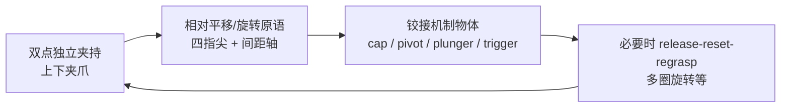
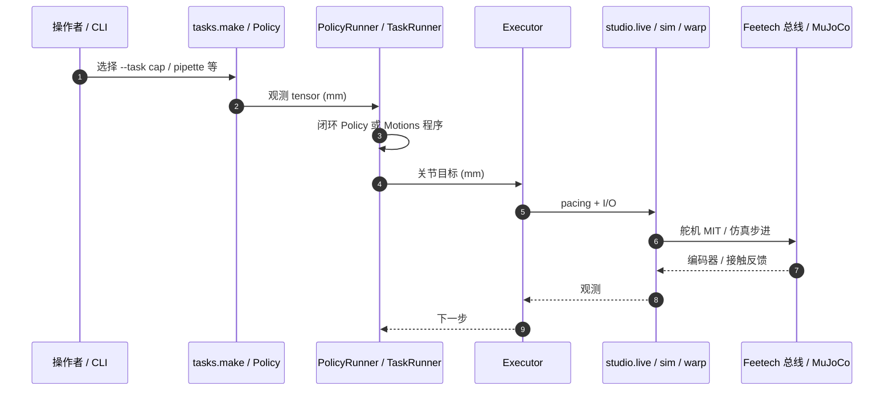

# Cartesian Hand（arXiv:2609.25696）

**Cartesian Hand**（*The Cartesian Hand: In-Hand Manipulation with All-Linear Fingers*，[arXiv:2609.25696](https://arxiv.org/abs/2609.25696)，[项目页](https://generalroboticslab.com/cartesian_handv1)）由 **杜克大学 General Robotics Lab**（Boyuan Chen 组）提出：用 **7 个棱柱关节** 在 **一个末端** 内同时提供 **两处独立平行夹持** 与 **四指尖平移**，以线性运动原语操作瓶盖、移液器、泵、扳机、螺丝刀等 **铰接机制** 物体。

## 一句话定义

**不用多指关节也能做手内操作——Cartesian Hand 用上下双夹爪 + 四平移指尖，把「相对运动」写进末端机构本身。**

## 英文缩写速查

| 缩写 | 英文全称 | 简要说明 |
|------|----------|----------|
| DoF | Degrees of Freedom | 7 个全线性（棱柱）驱动关节 |
| CAD | Computer-Aided Design | 仓内 STEP + MuJoCo 资产；制造以论文/项目页为准 |
| MuJoCo | Multi-Joint dynamics with Contact | `cartesian_hand.sim` CPU/GPU 后端 |
| IL | Imitation Learning | 与多指灵巧手 + 遥操作/学习路线对照（本文走机构简化） |

## 为什么重要

- **平行夹爪 vs 多指灵巧手之间的第三档：** 保留夹爪级可靠性，却在 **单末端** 内实现 cap/thread、pivot、plunger、trigger 等 **部件间相对运动**，减少第二夹爪、工装或臂级 re-grasp。
- **配置无关的指尖运动学：** 全部关节沿固定 Cartesian 方向滑动，**无奇异位形**；任务可拆成可复用的 **线性原语**，不必做复杂指尖 Jacobian 优化。
- **低成本可复现硬件叙事：** 论文报告 PLA/SLS 打印、约 **$500** 整手（含 7 舵机）；适合实验室工具操作与人形 **双手各装一只** 的 bimanual 场景。
- **开源控制栈已落地：** [generalroboticslab/Cartesian_Hand](https://github.com/generalroboticslab/Cartesian_Hand)（Apache-2.0）提供 studio / sim / warp 与任务库，便于在无硬件时用 MuJoCo 冒烟。

## 核心信息

| 项 | 内容 |
|----|------|
| **机构** | 杜克大学（Duke），General Robotics Lab |
| **作者** | Boxi Xia†、Bokuan Li†、Ryan Shin、Zijiang Yang、Jiaxun Liu、Boyuan Chen（† 共一） |
| **平台** | Franka Emika Panda；人形双臂各装一只做实验室 bimanual |
| **开源** | **已开源** — 见 [工程实践](#工程实践) |

## 核心原理

### 机构与 7-DoF

- **上下两层独立平行夹爪**（base / aux）：各 1 DoF 开闭 + 左右指尖各 1 DoF 沿指长方向平移。
- **第 7 DoF：** aux 夹爪沿 **z** 相对 base 平移（$q_3$）。
- **关节顺序（控制栈）：** 0 base jaw → 1–2 base 指尖 → 3 z stage → 4 aux jaw → 5–6 aux 指尖（见仓库 `docs/hardware.md`）。
- **驱动：** Feetech STS3915 + 齿条–齿轮 + 导轨；指尖行程约 **65 mm**，夹爪/间距约 **52 mm**；约 **850 g**，单夹爪静态持 **2 kg**（论文）。

### 流程总览

## 源码运行时序图

对齐 [Cartesian_Hand](https://github.com/generalroboticslab/Cartesian_Hand) README：`Policy`/`TaskRunner` 产出 mm 级命令，**Executor** 独占串口或仿真步进。

## 工程实践

| 项 | 说明 |
|----|------|
| **开源状态** | **已开源** — [Cartesian_Hand](https://github.com/generalroboticslab/Cartesian_Hand)（Apache-2.0）；含 `cartesian_hand.studio`（真机 + viser）、`cartesian_hand.sim`（MuJoCo）、`--warp` GPU 批仿真 |
| **安装** | `git clone` → `pip install -e ".[sim,studio]"`；Linux Python 3.10+；编译 `ft_servo_ext` 需 CMake + C++17 |
| **无硬件** | `python -m cartesian_hand.studio --mock`（:8081）；`python -m cartesian_hand.sim --task zero` |
| **真机** | 先在 `config.HANDS` 注册新机；**必须先 `--task zero`**；`docs/hardware.md` 列出行程未硬限位等 **Known issues** |
| **任务库** | `cartesian_hand/tasks/` 按机制分类；README **声明尚未在全部 35 物体上重跑** 转录任务 |
| **资产** | `assets/cartesian_hand/cartesian_hand.xml`、`source/cartesian_hand_sim.step` |

## 实验与评测

- **35 物体：** 实验室（移液、离心管等）、制造、家用；机制含 thread、pivot、linear guide、plunger、trigger。
- **技能：** 开闭盖、移液、泵、双手柄工具、拧螺丝、扣扳机、抓取内重定向等。
- **传感：** 论文使用 **关节反馈** 做接触检测，**不依赖视觉** 闭环。
- **迁移：** 固定基座臂 → 人形；**双手各一只** 做 bimanual 实验室操作（项目页视频）。
- **读法：** 先对齐物体机制类别与 `--task` 映射，再解读成功率；勿与多指 VLA 灵巧手在 **DoF 数** 上直接比「谁更 dexterous」。

## 与其他工作对比

| 维度 | Cartesian Hand | 典型多指灵巧手 | 单平行夹爪 |
|------|----------------|----------------|------------|
| **DoF / 复杂度** | 7 棱柱，运动学简单 | 高 DoF 旋转关节，接触协调难 | 1 DoF，几乎无手内操作 |
| **相对操作** | 双夹持 + 指尖平移，单末端内完成 | 多指接触重排 | 需第二夹爪/环境/臂 motion |
| **学习栈** | 本文强调 **原语 + 机构**；仓内 Policy 接口可接学习 | 常配合 teleop / VLA | 多为 pick-place |
| **开源** | 控制 + 仿真 + STEP **已发布** | 因平台而异 | — |

同周 [senlanke 周更](../../sources/blogs/wechat_senlanke_weekly_manipulation_2026-09-21_25.md) 入库时 GitHub 尚未链出，现已更新为 **已开源**。

## 结论

**Cartesian Hand 证明：把独立夹持与相对平移写进全线性末端，就能用简单原语覆盖大量铰接工具操作，且栈已可克隆运行。**

1. 优先读 [项目页](https://generalroboticslab.com/cartesian_handv1) 视频与 [GitHub README](https://github.com/generalroboticslab/Cartesian_Hand) 的 `--task` 表，再选 cap/pipette 等机制对齐你的物体。
2. 真机务必 **zero 校准** 并阅读 `docs/hardware.md` 的行程与 **Known issues**，避免撞限位。
3. 任务 YAML 为转录版 — 复现前在目标物体上 **自行验证** 或从 `Policy` 闭环重写。
4. 做人形 bimanual 时，把「每只手一条任务链」与臂级协调分开调试；论文展示的是 **同一原语跨 embodiment**。
5. 与 [Manipulation](../tasks/manipulation.md) 里 VLA/多指路线互补：适合 **实验室铰接工具** 与 **低 DoF 可维护** 末端选型。

## 关联页面

- [Manipulation](../tasks/manipulation.md)
- [人形机器人 (Humanoid Robot)](./humanoid-robot.md)
- [模仿学习](../methods/imitation-learning.md)

## 参考来源

- [cartesian-hand-linear-fingers_arxiv_2609_25696.md](../../sources/papers/cartesian-hand-linear-fingers_arxiv_2609_25696.md)
- [cartesian-hand-v1-generalroboticslab.md](../../sources/sites/cartesian-hand-v1-generalroboticslab.md)
- [cartesian_hand.md](../../sources/repos/cartesian_hand.md)
- [wechat_senlanke_weekly_manipulation_2026-09-21_25.md](../../sources/blogs/wechat_senlanke_weekly_manipulation_2026-09-21_25.md)

## 推荐继续阅读

- [arXiv PDF](https://arxiv.org/pdf/2609.25696)
- 仓库 [docs/hardware.md](https://github.com/generalroboticslab/Cartesian_Hand/blob/main/docs/hardware.md)、[docs/tasks.md](https://github.com/generalroboticslab/Cartesian_Hand/blob/main/docs/tasks.md)
