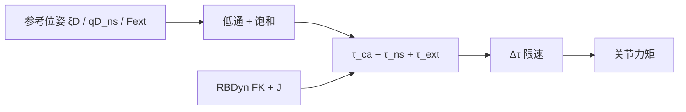
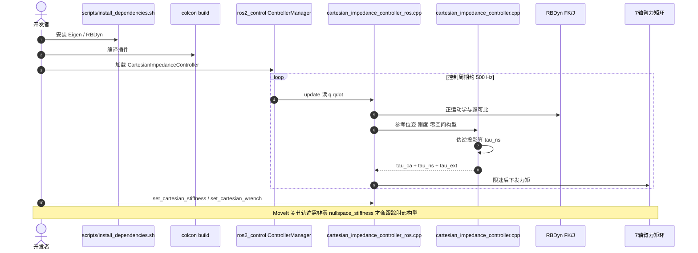

# Cartesian Impedance Controller（Mayr et al., JOSS 2024）

**Mayr & Salt-Ducaju** 的 *A C++ Implementation of a Cartesian Impedance Controller for Robotic Manipulators*（[JOSS 2024](https://doi.org/10.21105/joss.05194)，预印本 [arXiv:2212.11215](https://arxiv.org/abs/2212.11215)，[代码](https://github.com/matthias-mayr/Cartesian-Impedance-Controller)）提供可在 **任意力矩控制机械臂**上跑的笛卡尔阻抗：主任务柔顺、次级任务走雅可比零空间、并可叠加末端 wrench。真机对照是 **7 轴 Franka Panda / Research 3** 与 **KUKA iiwa7**。

## 一句话定义

**把「笛卡尔弹簧 + 零空间关节弹簧 + 期望力」写成可部署的 C++/ros2_control 包，用来补厂商示例只绑单一机型、不能在线改零空间构型的缺口。**

## 英文缩写速查

| 缩写 | 英文全称 | 简要说明 |
|------|----------|----------|
| JOSS | Journal of Open Source Software | 本文发表venue；软件论文 |
| FR3 | Franka Research 3 | README 写明的 ROS 2 真机之一 |
| TCP | Tool Center Point | YAML `end_effector` / `wrench_ee_frame` |
| PD | Proportional–Derivative | 笛卡尔与零空间阻抗的刚度/阻尼项 |
| URDF | Unified Robot Description Format | RBDyn 从 `robot_description` 读几何 |

## 为什么重要

[libfranka](../../sources/repos/libfranka.md) / `franka_ros` 已有笛卡尔阻抗 + 零空间，但**不能换到 iiwa**，也缺少统一的在线 wrench / MoveIt 轨迹接口。本包把同一公式做成基库 + 插件，并在论文里用对照表写清厂商控制器缺哪几项。对「7 轴零空间怎么落到真机」这是目前最完整的开源答案。

## 核心信息

| 项 | 内容 |
|----|------|
| **机构** | 隆德大学（Lund University）LTH；WASP |
| **平台** | Franka Panda / FR3、KUKA iiwa7；仿真 Gazebo / DART |
| **控制频率** | YAML 默认 500 Hz |
| **开源** | **已开源**（BSD-3-Clause）：基库 + ros2_control + `test/base_tests` |
| **项目页** | <https://matthias-mayr.github.io/Cartesian-Impedance-Controller/> |

## 核心原理

重力由机体补偿时：

$$
\tau_c=\tau_c^{\mathrm{ca}}+\tau_c^{\mathrm{ns}}+\tau_c^{\mathrm{ext}}
$$

- $\tau_c^{\mathrm{ca}}=J^\top(-K^{\mathrm{ca}}\Delta\xi-D^{\mathrm{ca}}J\dot q)$ — 笛卡尔阻抗（Hogan）
- $\tau_c^{\mathrm{ns}}=(I-J^\top(J^\top)^\dagger)\tau_0$，$\tau_0=-K^{\mathrm{ns}}(q-q^D)-D^{\mathrm{ns}}\dot q$ — **静力学一致**零空间关节阻抗
- $\tau_c^{\mathrm{ext}}=J^\top F_c^{\mathrm{ext}}$ — 期望末端 wrench

论文脚注（对齐 Ott 2008）：Moore–Penrose **不动力学解耦**；$\dot q\neq 0$ 时 $\tau_0$ 可能漏到笛卡尔方向。这与 [Dietrich 综述](./paper-null-space-projections-survey.md) 的 $W=I$ 列一致，也是 7 轴工程默认。

安全层：指令低通、刚度/wrench 饱和、$\|\Delta\tau\|\le\Delta\tau_{\max}$（示例 1 Nm/周期）。

### 流程总览

## 源码运行时序图

官方仓 [matthias-mayr/Cartesian-Impedance-Controller](https://github.com/matthias-mayr/Cartesian-Impedance-Controller)（归档见 [sources/repos/cartesian-impedance-controller.md](../../sources/repos/cartesian-impedance-controller.md)）：

- **最短复现路径：** clone → `scripts/install_dependencies.sh` → `colcon build` → `colcon test --packages-select cartesian_impedance_controller`（`base_tests` 无需仿真）。
- **带控制器话题：** `ros2 launch cartesian_impedance_controller minimal_mock_simulation.launch.py`，再跑 `ros_tests` / `ros_func_tests`。
- **真机：** 在 FR3 / iiwa 的 `ros2_control` YAML 里把 controller type 换成本插件，填 7 个关节名与 `end_effector`。

## 工程实践

| 检查项 | 建议 |
|--------|------|
| 零空间是否生效 | 先 $K_{\mathrm{ns}}=0$ 看 TCP；再加刚度，TCP 误差不应明显变大 |
| MoveIt | `nullspace_stiffness` 必须 > 0，否则规划的 7 轴构型被忽略 |
| 与 libfranka 选型 | 只跑 Franka、要 FCI 最低层示例 → libfranka；要 iiwa / 在线 wrench / 轨迹 → 本仓 |
| 工具重力 | 包内无工具补偿，用 `/set_cartesian_wrench` 加恒定力 |
| 奇异 | 作者称在奇异附近仍稳定；仍应监控 $J$ 最小奇异值 |

## 实验与评测

本文是 **JOSS 软件论文**，评测是功能清单而非 SOTA 表：在线改参考/刚度/wrench、零空间构型、示教、关节轨迹、多机型。作者称平移刚度用到 1000 N/m 仍稳定。定量接触任务见其后续 RL/装配论文（Skill-based industrial tasks），不在本 JOSS 主文。

## 结论

**一句话总判：7 轴零空间阻抗的生产级开源默认是「$W=I$ 投影 + 可调 $K_{\mathrm{ns}}$」；动力学一致和 HQP 是你有接触/限位硬约束之后再升级的事。**

1. **三路力矩必须分开调** — 先任务刚度，再零空间，再 wrench，否则分不清谁在拖末端。
2. **MP 投影会动态泄漏** — 快速自运动时不要指望 TCP 毫不动；这是公式性质。
3. **MoveIt 用户最容易踩坑** — 忘记设零空间刚度 = 肘部构型被丢弃。
4. **厂商示例不够跨机型** — 从 Panda 迁到 iiwa 应直接用本包，而不是改 libfranka。
5. **URDF 力矩上限是安全层** — 作者在 iiwa 上把任务力矩限到约 20 Nm 以便人手介入。

## 局限与风险

- 关节摩擦未建模；静摩擦大的关节零空间示教效果会打折。
- 笛卡尔各轴刚度解耦，不能表达轴间耦合阻抗。
- 无工具重力前馈。
- ROS 1 Pages 文档与 ROS 2 README 并存，部署前以当前默认分支 README 为准。

## 与其他工作对比

| 工作 | 关系 |
|------|------|
| libfranka `cartesian_impedance_control` | 同构公式，仅 Franka |
| KUKA FRI 笛卡尔阻抗 | 单机型；零空间能力不透明 |
| Scherzinger `cartesian_controllers` | 位置/速度臂的柔顺；力矩臂应走本包 |
| Dietrich 2015 | 理论菜单；本包实现其中 $W=I$ 静力学一致列 |
| TSID / HQP | 多接触全身；单臂 7 轴阻抗用本包更轻 |

## 关联页面

- [零空间控制](../concepts/null-space-control.md)
- [阻抗控制](../concepts/impedance-control.md)
- [零空间投影综述](./paper-null-space-projections-survey.md)
- [Franka Research 3](./franka-research-3.md)
- [Pink](./pink-ik.md)
- [WBC 工程实现指南](../queries/wbc-implementation-guide.md)

## 参考来源

- [JOSS / arXiv 归档](../../sources/papers/mayr_cartesian_impedance_joss_2024.md)
- [GitHub 仓库归档](../../sources/repos/cartesian-impedance-controller.md)
- [项目页归档](../../sources/sites/cartesian-impedance-controller-github-io.md)
- [libfranka 归档](../../sources/repos/libfranka.md)

## 推荐继续阅读

- 仓库 README：<https://github.com/matthias-mayr/Cartesian-Impedance-Controller>
- ROSCon 2022 闪电讲：<https://www.youtube.com/watch?v=YtnQLyA7_og>
- Ott, *Cartesian Impedance Control of Redundant and Flexible-Joint Robots*, 2008
