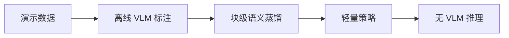

# CASD（arXiv:2609.08638）

**CASD**（*CASD: Chunk-Aligned Semantic Distillation for Multi-Stage Robot Manipulation*，[arXiv:2609.08638](https://arxiv.org/abs/2609.08638)）由 **蚂蚁集团（Ant Group）** 提出（公众号周更 ingest 见 [策展索引](../../sources/blogs/wechat_shenlan_weekly_manipulation_2026-09-14.md)）。

## 一句话定义

CASD：面向多阶段机器人操作的动作块对齐语义蒸馏 — offline VLM stage labels。

## 英文缩写速查

| 缩写 | 英文全称 | 简要说明 |
|------|----------|----------|
| CASD | Chunk-Aligned Semantic Distillation | 本文方法 |
| VLM | Vision-Language Model | 视觉语言模型 |
| IL | Imitation Learning | 模仿学习 |

## 为什么重要

多阶段操作需阶段语义；在线 VLM 推理太贵。

## 核心信息

| 项 | 内容 |
|----|------|
| **机构** | 蚂蚁集团（Ant Group） |
| **开源** | **未见/待发布**（步骤 2.5 核查：截至 2026-09-14 无可运行官方仓库） |

## 核心原理

离线用 VLM 标注阶段；训练时对每个 action chunk 蒸馏加权语义目标；推理仅跑策略网络。

### 流程总览

## 源码运行时序图

**不适用** — 截至 **2026-09-14** arXiv 与常见项目页 **未见** 官方可运行代码仓库。

## 工程实践

| 项 | 说明 |
|----|------|
| 开源状态 | 未见官方仓库；以 arXiv 为准 |
| 复现入口 | 论文方法与超参；代码发布后再补 `sources/repos/` |
| 部署注意 | 阶段标签噪声需过滤；chunk 长度与阶段边界对齐。 |

## 实验与评测

多阶段操作 benchmark；与无语义蒸馏 baseline 对比。

## 结论

CASD 离线蒸馏阶段语义到 action chunk，推理无需 VLM。

1. 多阶段任务需阶段对齐。
2. 块级加权优于帧级。
3. 推理成本低于在线 VLM。
4. 蚂蚁集团工业场景导向。
5. 标签质量决定上限。

## 与其他工作对比

| 对照 | 差异读法 |
|------|----------|
| 在线 VLM 规划 | 延迟高 |
| 纯 BC 无阶段 | 阶段混淆 |

## 局限与风险

新阶段需重新标注；VLM 偏见传入策略。

## 关联页面

- [manipulation](../tasks/manipulation.md)
- [./paper-tfgca-chunked-vla.md](./paper-tfgca-chunked-vla.md)
- [paper-robodrop-vla-post-training](./paper-robodrop-vla-post-training.md)

## 参考来源

- [casd_chunk_semantic_distillation_arxiv_2609_08638.md](../../sources/papers/casd_chunk_semantic_distillation_arxiv_2609_08638.md)
- [公众号周更策展](../../sources/blogs/wechat_shenlan_weekly_manipulation_2026-09-14.md)

## 推荐继续阅读

- [https://arxiv.org/abs/2609.08638](https://arxiv.org/abs/2609.08638)
