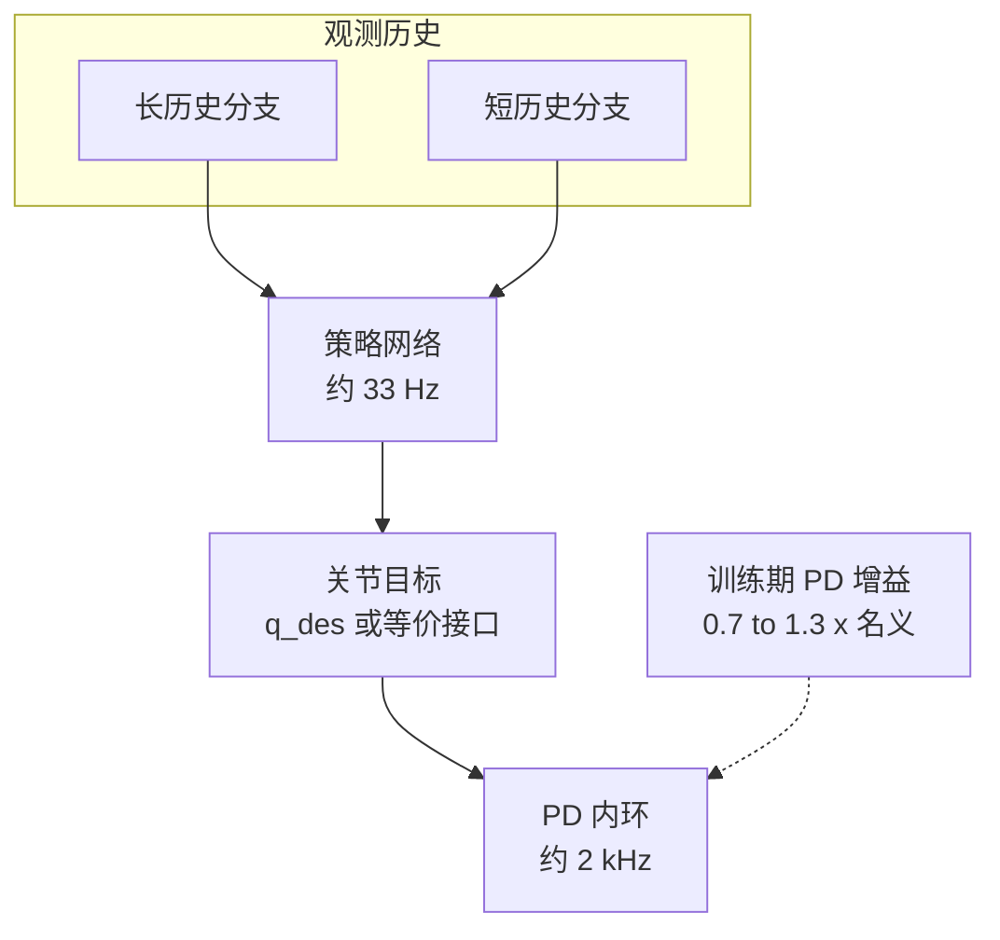

# Reinforcement Learning for Versatile, Dynamic, and Robust Bipedal Locomotion Control（Cassie）

**一句话定义**：在 Cassie 上，用 **长/短双历史** 的观测–动作序列输入统一表达周期与非周期运动，再配合 **任务层随机化**，在仿真中学会多技能并 **直接 sim2real** 到硬件。

## 为什么重要

- 把「**策略多慢、PD 多快、增益要不要随机化**」写成可对照的 **公开工程细节**：文中报告 **策略约 33 Hz**、**关节 PD 内环约 2 kHz**；训练中对名义 PD 增益做 **约 0.7–1.3 倍缩放随机化**。
- 与仓库内 [Domain Randomization 指南](../queries/domain-randomization-guide.md) 的刚度缩放示例可 **并排阅读**：一文偏 **通用 checklist**，一文偏 **双足 Cassie 实测区间**。

## 核心机制（提炼）

- **Dual-history**：长 horizon 捕获步态周期与地形缓变；短 horizon 强化触地瞬态与快扰动响应。
- **技能统一**：行走、跑步、跳跃等共享同一策略族，通过 **命令与随机化** 切换行为先验。

## 与 Kp / Kd 设置的关系

- **分频优先**：先锁「策略一步内 PD 子步数 / 真机控制循环」，再调名义 `Kp/Kd`；否则 DR 区间会对不上真实带宽。
- **随机化是结构化假设**：0.7–1.3 是 **缩放名义表** 的窄区间实践，与「±30% 标称」类宽随机化并不矛盾，服务于 **不同保守程度** 的 sim2real。

## 实验与评测

- 量化指标、消融与 sim2real / 实机结果见 **原文 PDF** 与 [参考来源](#参考来源)；本页正文侧重方法结构与知识库交叉引用。

## 与其他工作对比

- 正文已给出与相邻路线 / baseline 的 **定性对照**；定量表格与 ablation 见原文（[参考来源](#参考来源)）。

## 英文缩写速查

| 缩写 | 英文全称 | 简要说明 |
|------|----------|----------|
| Sim2Real | Simulation to Real | 把仿真中学到的策略迁移落地真机的工程主线 |
| PD | Proportional–Derivative | 关节位置/阻抗底层控制，策略输出常为其 setpoint |
| Locomotion | Robot Locomotion | 足式/人形等无轮移动能力的总称 |
| Kp | Proportional Gain | PD 控制的位置误差增益，影响刚度与响应 |
| Kd | Derivative Gain | PD 控制的速度误差增益，抑制振荡 |
| DR | Domain Randomization | 训练时随机化仿真参数以提升跨域鲁棒迁移 |
| RL | Reinforcement Learning | 通过与环境交互最大化长期回报来学习策略的范式 |

## 参考来源

- [RL+PD 动作接口与增益设计论文索引](../../sources/papers/rl_pd_action_interface_locomotion.md)
- *Reinforcement Learning for Versatile, Dynamic, and Robust Bipedal Locomotion Control*, [arXiv:2401.16889](https://arxiv.org/abs/2401.16889)

## 关联页面

- [Legged / Humanoid RL 中 Kp/Kd 设置](../queries/legged-humanoid-rl-pd-gain-setting.md)
- [Domain Randomization 指南](../queries/domain-randomization-guide.md)
- [Sim2Real](../concepts/sim2real.md)
- [Cassie 迭代式 sim2real  locomotion](./paper-cassie-iterative-locomotion-sim2real.md)

## 推荐继续阅读

- [arXiv PDF](https://arxiv.org/pdf/2401.16889.pdf)
