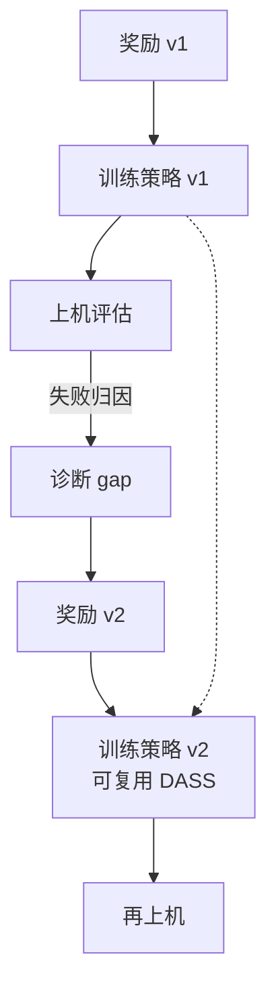

# Learning Locomotion Skills for Cassie: Iterative Design and Sim-to-Real

**一句话定义**：把 Cassie 行走 RL 从「一次性写 reward」还原成 **多轮迭代**：反复调整 **奖励、观测与动作语义**，并用 **DASS 等机制** 在奖励重写时复用旧策略数据，最终无动力学随机化也完成迁移。

## 为什么重要

- 对工程读者的价值 **高于** 许多只展示最终效果的论文：它明确写出 **接口与 reward 共同演化** 才是 sim2real 主战场。
- 与 **Kp/Kd** 的关系是间接但关键：当你改 `q_des` 缩放、默认姿态或接触奖励时，**同一组 PD 增益** 会呈现完全不同的有效动力学；不调表而只调 reward 往往白忙。

## 核心机制（提炼）

- **迭代闭环**：诊断失败模式 → 改观测/动作/奖励 → 再训练 → 再上机。
- **DASS（Deterministic Action Stochastic State tuples）**：在策略随机性下抽取确定性片段，支持 **跨版本奖励** 的迁移学习（细节以原文为准）。

## 与 Kp / Kd 设置的关系

- 若出现「仿真走得漂亮、真机抖/摔」，先检查 **动作接口是否与 PD 表同一版本文档化**，再进入增益扫描；本文是这一纪律的 **案例教材**。

## 参考来源

- [RL+PD 动作接口与增益设计论文索引](../../sources/papers/rl_pd_action_interface_locomotion.md)
- Xie et al., *Learning Locomotion Skills for Cassie: Iterative Design and Sim-to-Real*, [arXiv:1903.09537](https://arxiv.org/abs/1903.09537)

## 关联页面

- [Legged / Humanoid RL 中 Kp/Kd 设置](../queries/legged-humanoid-rl-pd-gain-setting.md)
- [Cassie 反馈控制 DRL](./paper-cassie-feedback-control-drl.md)
- [Cassie 双足多技能 RL](./paper-cassie-biped-versatile-locomotion-rl.md)
- [Sim2Real](../concepts/sim2real.md)

## 推荐继续阅读

- [PMLR CoRL 2019 页](http://proceedings.mlr.press/v100/xie20a.html)
