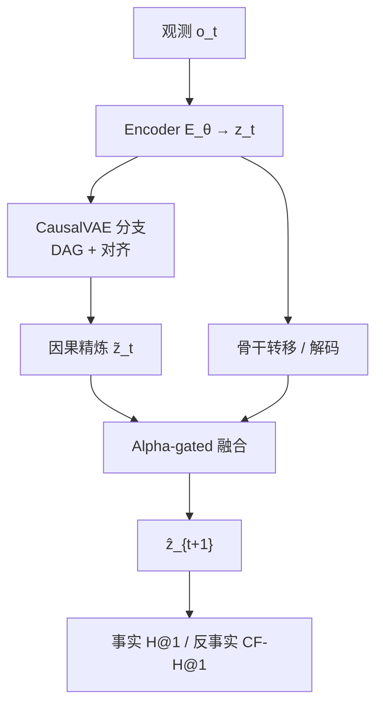
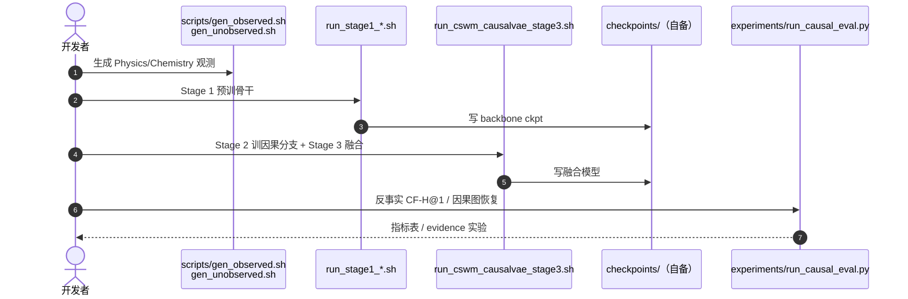

# CausalVAE：latent 世界模型的可插拔因果结构模块

**CausalVAE as a Plug-in for World Models**（[arXiv:2604.07712](https://arxiv.org/abs/2604.07712)，ECCV 2026；[代码](https://github.com/Dzyy123/CausalVAE-World-Models)）由 **清华大学深圳国际研究生院 / 香港大学**（Jiayu Chen 组）提出：在既有 encoder–transition 骨干上外挂 **CausalVAE 因果分支**，用 DAG 约束与对齐弱监督把预测 latent 重组为可干预的因果因子，**不改骨干接口**；事实检索基本保持，干预/反事实检索显著改善。

## 一句话定义

**一个可插拔的 CausalVAE 结构模块：把任意 latent WM 的 object-centric 表征经 DAG 因果层重编码后再解码回转移空间，用三阶段训练在保事实滚出的同时提升反事实一致性与分布外干预鲁棒性。**

## 英文缩写速查

| 缩写 | 英文全称 | 简要说明 |
|------|----------|----------|
| CausalVAE | Causal Variational Autoencoder | 本文因果结构分支（静态因果层 + mask） |
| WM | World Model | 学习环境前向动力学的模型 |
| DAG | Directed Acyclic Graph | 潜变量间有向无环因果图约束 |
| CF-H@1 | Counterfactual Hit@1 | 反事实检索 Top-1 命中率 |
| SCM | Structural Causal Model | 结构因果模型；支撑 do-干预推理 |
| C-SWM | Contrastive Structured World Model | 可挂载的 object-centric 骨干之一 |

## 为什么重要

- **反事实是一等公民：** 纯预测精度不足以判断因果正确性；本文用 CF-H@1/CF-MRR 与因果图恢复对齐 [world-model-physics-fidelity-outputs](../overview/world-model-physics-fidelity-outputs.md) 的干预评测轴。
- **即插即用：** 同一因果层可接 AE/VAE/GNN/Modular/C-SWM 等代表骨干，降低「为因果重写整套 WM」的成本。
- **与同组工作互补：** [SRD](./paper-state-readout-decoupling.md) 改 rollout 接口；[Traj-LeWM](./paper-traj-lewm.md) 改目标条件规划打分——CausalVAE 改 **latent 因子是否可干预识别**。

## 核心信息

| 项 | 内容 |
|----|------|
| **机构** | 清华大学深圳国际研究生院；香港大学；INFIFORCE Intelligent Technology |
| **会议** | ECCV 2026 |
| **骨干** | 可插拔；实验含 C-SWM、GNN、Modular、VAE 等 |
| **Benchmark** | Physics（3-body）、2D Shapes、3D Cubes、Chemistry |
| **关键结果** | Physics：8 配对基线 CF-H@1 平均 **+102.5%**；GNN-NLL 代表 **11.0→41.0** |
| **开源** | **已开源** MIT：[Dzyy123/CausalVAE-World-Models](https://github.com/Dzyy123/CausalVAE-World-Models)；checkpoint 未随仓 |

## 流程总览

## 核心原理

### Plug-in 因果层

编码器输出 object-centric \(z_t\in\mathbb R^{K\times d}\)。CausalVAE 分支学近似后验 \(q_\psi(\cdot\mid z_t)\)，经 **mask + DAG 无环约束** 得到因果因子，再解码回与骨干兼容的 latent 空间。转移仍由原骨干承担；因果分支提供 **干预就绪** 的结构化坐标。

### 三阶段训练

1. **Stage 1：** 预训 encoder–transition（一步预测）。
2. **Stage 2：** **冻结骨干**，只优化 CausalVAE + DAG（对齐弱监督锚定坐标）。
3. **Stage 3：** **冻结 CausalVAE**，alpha-gated fusion 精调转移头。

顺序训练避免静态因果 VAE 直接套到动作条件序列时的 compounding drift。

### 评测协议

- **事实：** H@1、MRR（检索配对未来）。
- **反事实：** CF-H@1、CF-MRR（干预后未来检索）。
- Physics 支持干净的状态级干预（位置/速度）；Shapes/Cubes 为物体级；Chemistry 为机制级。

## 源码运行时序图

官方仓 [Dzyy123/CausalVAE-World-Models](https://github.com/Dzyy123/CausalVAE-World-Models)（归档见 [sources/repos/causalvae-world-models.md](../../sources/repos/causalvae-world-models.md)）：

- **最短路径：** `conda env create -f environment_py37.yml` → 数据生成脚本 → `run_stage1_Modular_Contrastive.sh` → `run_cswm_causalvae_stage3.sh` → `run_causal_eval.py`。
- **注意：** 大 checkpoint 需自行训练或联系作者；仓内含论文表格对应的轻量 metric 文件。

## 实验与评测

- **事实检索：** +CausalVAE 通常在四域 **保持** 与骨干相近的 H@1/MRR。
- **反事实检索：** Physics 增益最大；多骨干仍可见约 **+9~+21** CF-H@1 points。
- **因果发现：** 学到的结构边与 Physics 一阶相互作用模板可对齐，支持可解释性主张。
- **局限：** 静态因果层需 staged 训练才稳定；化学/形状域增益小于 Physics；未覆盖像素端到端 JEPA 规划栈（见 LeWM 线）。

## 结论

**总判：CausalVAE 把「因果可干预」做成 WM 外挂模块，在几乎不牺牲事实预测的前提下，把反事实检索（尤其 Physics）拉到可用区间，并给出可读的潜变量因果图。**

1. 选型时先确认任务是否需要 **干预/反事实** 而不仅是 rollout MSE——若否，增益可能有限。
2. 复现从 CausalMBRL 式数据生成 + Stage 1 骨干开始；不要跳过 Stage 2 直接端到端。
3. Physics 上 CF-H@1 是主证据；其他域看趋势而非单点 SOTA。
4. 与同组 [SRD](./paper-state-readout-decoupling.md)、[Traj-LeWM](./paper-traj-lewm.md) 可组合：因果因子 + 解耦 rollout + 轨迹代价是不同切口。
5. Checkpoint 未公开——工程落地需预算自训或等权重发布。

## 局限与风险

- 三阶段与 DAG 约束增加训练与调参成本。
- 对象槽 / 图骨干假设强；真机视觉 JEPA 规划未在本论文主实验验证。
- Fork 链（C-SWM → CausalMBRL → 本仓）环境偏 Py3.7/旧栈，接入新管线需适配。

## 关联页面

- [State–Readout Decoupling](./paper-state-readout-decoupling.md)
- [Traj-LeWM](./paper-traj-lewm.md)
- [LeWM](./paper-lewm.md)
- [生成式世界模型](../methods/generative-world-models.md)
- [物理保真输出轴](../overview/world-model-physics-fidelity-outputs.md)

## 参考来源

- [CausalVAE 论文归档](../../sources/papers/causalvae_arxiv_2604_07712.md)
- [CausalVAE-World-Models 仓库归档](../../sources/repos/causalvae-world-models.md)
- 论文：<https://arxiv.org/abs/2604.07712>

## 推荐继续阅读

- [官方代码](https://github.com/Dzyy123/CausalVAE-World-Models)
- [CausalMBRL](https://github.com/dido1998/CausalMBRL)（上游环境与 benchmark）
