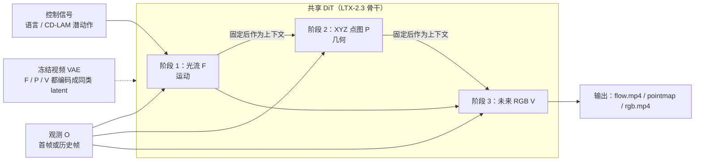
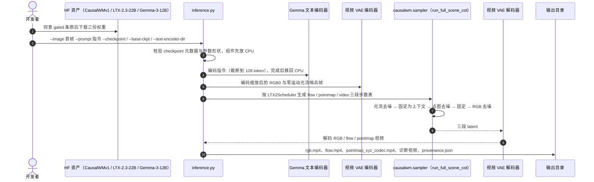

# CausalWM（因果思维链具身世界模型）

**CausalWM**（*CausalWM: Causal Chain-of-Thought Reasoning for Embodied World Model*，[arXiv:2609.23184](https://arxiv.org/abs/2609.23184)，v1 2026-09-19 / v2 2026-09-22；[官方博客](https://aetherlabs.ai/articles/causalwm-causal-chain-of-thought-reasoning-for-embodied-world-model.html) 2026-09-19；[项目页](https://aetherlabsai.github.io/CausalWM/)；[代码](https://github.com/AetherLabsAI/CausalWM)；[权重](https://huggingface.co/AetherLabs-AI/CausalWM)）是 [以太智能（Aether AI）](./aether-ai.md) 发布的第一个「具身因果世界模型」，发布版本名为 CausalWMv1，论文表格里简写 CWM。13 位作者，通讯作者为 Kun Zhou，部分作者另署 UC San Diego 和 Vanderbilt University。Aether AI 随后在 2026-10-08 发布的 [CRIS-0](./aether-cris-0.md) 系统里包含一个「Causal World Model」组件，这一组件与 CausalWM 的关系见下文「与其他工作对比」。

> 注意区分：本库另有 [Aether: Geometric-Aware Unified World Modeling](./paper-sa-2503-18945-aether-geometric-aware-unified-world-modeling.md)（arXiv:2503.18945），与本页的 Aether AI 公司无关，只是同名。

## 一句话定义

**在大规模视频扩散 Transformer 上，把「预测未来视频」拆成「先预测光流（运动）→ 再预测 3D 点图（几何）→ 最后预测 RGB」三步，用跨流因果注意力掩码保证每一步只能看观测和前面的步骤，使中间物理量既是监督目标、又是后续生成的上下文。**

## 英文缩写速查

| 缩写 | 英文全称 | 简要说明 |
|------|----------|----------|
| CWM | CausalWM | 论文表格与 TriWorldBench 榜单里的模型简称 |
| CoT | Chain-of-Thought | 思维链；本文指光流 → 点图 → RGB 的视觉中间变量序列 |
| DiT | Diffusion Transformer | 骨干网络，来自 LTX-2.3-22B |
| TI2V | Text-Image-to-Video | 单张图 + 文本指令生成视频；本次开源的推理接口 |
| VAE | Variational Autoencoder | 冻结的视频 VAE，光流和点图也编码成图像走同一个 VAE |
| AdaLN | Adaptive Layer Normalization | 注入动作条件和区分模态的方式 |
| CD-LAM | Causally Debiased Latent Action Model | 同团队的潜动作模型，从视频推出 32 维统一动作表示 |
| RL | Reinforcement Learning | Stage 3 用 DiffusionNFT 做多目标后训练 |
| GRPO | Group Relative Policy Optimization | DiffusionNFT 的组内相对优化与之类似 |
| URDF | Unified Robot Description Format | 把关节轨迹渲染成视觉控制视频 |
| TWB | TriWorldBench | 三视角动作条件世界模型基准，TWB-Score 为 19 指标汇总 |
| RO | Robot domain | PAI-Bench-G 的机器人域子集 |
| CFG | Classifier-Free Guidance | 本文评测全部关闭（guidance 1.0） |

## 为什么重要

- **把「中间物理量」从辅助损失变成推理步骤：** 以往加光流、深度的工作多把它们当辅助监督或单侧输入。CausalWM 让模型先生成这些量，再把生成结果放回上下文去生成 RGB，训练和推理用同一顺序。这是把 LLM 的 CoT 思路搬到视频世界模型的一个完整实现。
- **两个公开榜单的头部成绩（自报）：** TriWorldBench 2026-09-11 快照 36 个模型中 TWB-Score **66.04** 第 1（第 2 名 dream4act 65.66）；PAI-Bench-G 机器人域 **89.9**，与本地复测的 Cosmos3-Super（89.7）基本持平略高。两者分别覆盖动作条件多视角和语言条件单视角两种设置。
- **少步生成：** 每阶段只用 1 步去噪（全链 3 步）时 RO 仍有 88.84，相对每阶段 20 步加速约 5.16×，而且 20 步反而只有 86.54。如果这一现象可复现，显式中间量相当于用更长的上下文换更少的去噪步数。
- **视觉化的控制接口：** 任何能画成图像的控制信号（URDF 渲染的机械臂轨迹、手画的物体轨迹）都可以替换中间流，少量微调后模型就会跟随。这为把世界模型接进策略或系统（如 [CRIS-0](./aether-cris-0.md)）提供了统一入口。
- **可下载：** 发布了 TI2V 推理代码和权重，虽然只覆盖语言条件单视角版本。

## 核心信息

| 项 | 内容 |
|----|------|
| **机构** | 以太智能（Aether AI）；合作署名 UC San Diego、Vanderbilt University（实习作者） |
| **参数量** | 论文与项目页称 **16B**；骨干从 LTX-2.3-22B 初始化并去掉音频部分参数（16B 是否即去掉音频后的规模，报告未明说，**推测**如此） |
| **文本编码器** | Gemma-3-12B（冻结） |
| **CoT 变量** | 光流（SEA-RAFT 提取）→ 相机坐标系 XYZ 点图（VGGT-Omega-1B-512 估深度和内参后转换，以首帧深度中位数归一）→ 未来 RGB |
| **条件** | 语言（cross-attention）；动作（CD-LAM 32 维潜动作，经 AdaLN）；视觉上下文控制（URDF 渲染轨迹视频） |
| **数据** | 20 个来源族，采集 31,230.8 h，处理后 19,916.2 h；人类第一视角、真机演示、仿真三类 |
| **训练算力** | 预训练 128×H100 60k 步；动作条件 / 多视角变体各 32×H200（30k / 120k 步）；CoT 中训 64×H200 50k 步；RL 阶段未披露 |
| **默认推理** | 121 帧、640×480、16 FPS，每阶段 4 步，无 CFG；单张 H200 测试 |
| **开源（2026-10-10）** | **已发布**：TI2V CoT 推理代码 + `CausalWMv1.safetensors`（HF gated，LTX-2 Community License）。**未发布**：训练 / RL 代码、数据、动作条件与多视角 checkpoint |

## 核心原理（方法）

### 流程总览

每个流都可以读观测和前序流；后续流到前序流的注意力被掩码阻断，同一流内部的注意力是双向的。光流、点图、RGB 共用一个 Transformer，各自有独立的输入 / 输出投影和模态 AdaLN 嵌入（投影由预训练 RGB 分支初始化）。

### 1. 统一的上下文条件接口

骨干是支持「in-context conditioning」的 DiT：辅助特征先按观测视频的方式编码，再与视频 token 拼成一条序列，通过自注意力参与去噪。训练采用 flow matching，时间步从随 token 数平移的 logit-normal 分布采样，偏向高噪声段，并以 0.1 概率改为均匀采样。语言条件走 cross-attention，动作条件走 AdaLN。

### 2. 逐变量去噪的因果 CoT

- **训练（Stage 2）：** 每次更新均匀抽一个阶段作为目标；它之前的变量以干净真值作为上下文，当前变量加噪后用 flow matching 训练，它之后的变量被掩码。
- **推理：** 按同一顺序逐变量去噪；前序变量换成模型自己的输出，固定后再放回上下文，直到生成 RGB。
- **为什么要掩码：** 防止前面的步骤（例如光流）从后面的目标（点图或 RGB）拿到答案，使训练条件和推理时的逐步生成一致。

论文正文把深度也列为可用变量，但实现里深度只用来构造点图；发布的推理接口是「光流 → 点图 → RGB」三段。

### 3. 三阶段训练

| 阶段 | 内容 | 关键设置 |
|------|------|----------|
| **Stage 1 像素级预训练** | 语言条件未来预测；另训动作条件（CD-LAM 潜动作）和多视角（2–4 视角水平拼接）变体 | 自 LTX-2.3-22B 起训；65 帧，有效 batch 256；随机 1–8 个历史 latent 帧 |
| **Stage 2 Causal CoT 中训** | 学习 Flow → Pointmap → RGB 顺序 | 121 帧；flow / pointmap 由离线模型自动提取并缓存，监督可随数据规模扩展 |
| **Stage 3 多目标 RL 后训练** | DiffusionNFT（类 [GRPO](../methods/grpo.md) 的组内优化）：同一上下文采样一组未来，按物理一致性、时间连贯、视觉质量、任务完成打分，组内归一后更新 | 高奖励样本把速度场拉向自己，低奖励样本推开；中间 CoT 也随最终视频质量一起被优化 |

### 4. 数据流水线

长度过滤（帧率、帧数、时间戳）→ 光流统计的运动过滤（Egocentric-10K 剔除最高 30% 片段，895 万候选留下 627 万段，约 6,878 h）→ 动作质量检查（首帧要有可识别的手、臂或夹爪）→ 事件级分段和 caption 重写（统一为动词开头的祈使句，VLM / LLM 辅助）。最大单源是 Egocentric-10K；真机侧包括 [AgiBot-World 2026](./agibot-world-2026.md)、DROID、RoboMIND、RoboCOIN 等，仿真侧包括 RoboCasa365、RoboTwin 2.0、InternData-A1。

### 5. 视觉上下文控制

因为模型反复学习「把视觉中间量当上下文」，任何能画成图像的控制信号都可以替换某一中间流。TriWorldBench 上的做法是：取关节与夹爪轨迹，用 URDF 和正运动学从头部和两个腕部相机视角渲染出控制视频，拼接三视角后编码为上下文，再从三视角动作条件模型微调 34k 步。作者把这种能力称为「涌现的 in-context learning」，与 [机器人上下文学习](../concepts/robot-in-context-learning.md) 是不同层面的概念：这里指的是生成模型对新视觉条件的适配，仍需要微调。

## 源码运行时序图

官方仓库 [AetherLabsAI/CausalWM](https://github.com/AetherLabsAI/CausalWM)（`causalwm` 0.1.0）只提供 TI2V CoT 推理。以下按 `inference.py` 的 `generate()` 流程整理。

- **最短复现路径：** `uv pip install -e packages/ltx-core -e .` → 下载三份权重 → 用 `examples/inputs/` 里的首帧和 README 给的 prompt / seed 跑 `inference.py`，对照 README 的 Wan2.2 / LingBot / CausalWM 三联对比。
- **改动范围：** `NOTICE` 列出了对上游 `ltx-core` 1.1.3 的修改文件，集中在 transformer 的 attention、AdaLN、modality 和 Gemma connector，可用来定位因果掩码的实现。

## 工程实践

| 项 | 建议 |
|----|------|
| **硬件** | 官方只在单张 H200 上测过，组件按阶段搬到 GPU；没有给出更小显卡的最低显存，主机内存要放得下 22B 骨干 checkpoint 和 12B 文本编码器 |
| **版本锁定** | Python 3.11、torch 2.9.x、transformers 4.57.x；transformers 5.x 与 LTX-2 的 Gemma loader 不兼容 |
| **输出的物理含义** | 点图是相机坐标系、以首帧深度中位数归一的**相对尺度**，不是米；光流和点图都是模型生成的预测，不是测量值，不能直接当深度传感器读数用 |
| **checkpoint 适用范围** | 发布的 checkpoint 针对 PAI-Bench-G（语言条件单视角）；想复现 TriWorldBench 的三视角动作条件结果目前没有权重，也没有训练代码 |
| **去噪步数** | 默认每阶段 4 步；当前调度器要求每阶段至少 2 步，所以论文里 1/1/1 的设置不能直接用发布代码跑 |
| **许可** | 权重和代码都是 LTX-2 的衍生品，受 LTX-2 Community License 约束：年收入至少 1,000 万美元的商业实体需另签付费商用协议，其余条款使用前需自行阅读；Gemma 另有使用条款 |
| **作为策略组件** | 论文没有用 CausalWM 做策略评估或规划闭环；接入策略需自行设计。CRIS-0 博文描述了加 action module 变成策略的方向，但未公布细节 |

## 实验与评测

以下数字均为**自报**。

**TriWorldBench（动作条件、三视角，500 episode / 50 任务，2026-09-11 官方榜快照）：**

| 模型 | VLM 一致性（I–III 平均） | VQA 一致性 | 指令跟随 | 视角 | 轨迹精度 | 主体一致性 | 图像质量 | **TWB-Score** |
|------|------|------|------|------|------|------|------|------|
| [Ctrl-World](./paper-ctrl-world.md) | 64.20 | 40.90 | 38.90 | 45.15 | 6.09 | 77.05 | 18.37 | 38.98 |
| [Genie Envisioner](./paper-sa-2508-05635-genie-envisioner-a-unified-world-foundation-plat.md) | 68.15 | 36.72 | 20.20 | 87.91 | 0.84 | **91.40** | 19.36 | 40.73 |
| [Motus](./paper-sa-2512-13030-motus-a-unified-latent-action-world-model.md) | 72.82 | 45.33 | 52.28 | 44.20 | 13.77 | 77.37 | 16.08 | 42.35 |
| [DreamDojo](./paper-hrl-stack-35-dreamdojo.md) | 79.53 | 47.82 | 49.72 | 59.39 | 16.61 | 77.37 | 24.45 | 51.72 |
| Fysiverse-Video | 87.66 | 63.32 | 70.18 | 83.86 | 37.40 | 83.65 | 36.17 | 63.62 |
| XiaomiAutoWM | 86.88 | 69.27 | 66.40 | 78.28 | 42.85 | 83.61 | 33.63 | 63.94 |
| [WoVR Plus](./paper-rcl-2602-13977-wovr-world-models-as-reliable-simulators-for-pos.md) | 87.52 | 69.11 | 70.67 | 85.49 | **45.27** | 84.22 | 36.22 | 65.39 |
| BWM | 88.12 | 65.94 | 73.84 | 87.20 | 41.97 | 84.20 | 38.71 | 65.54 |
| **CausalWM** | **88.63** | **70.03** | **76.78** | **91.16** | 42.98 | 84.55 | **43.24** | **66.04** |

论文表 2 只选有技术报告或官网的 8 个基线；附录给出 36 模型全榜，CausalWM 仍为第 1，第 2 是表 2 未收录的 dream4act（65.66）。评测设置：自回归，每个 129 帧窗口以 1 帧锚点 + 8 帧历史预测后 120 帧，30 步去噪，无 CFG。

**PAI-Bench-G 机器人域（语言条件单视角，Qwen3-VL-235B-A22B-Instruct 判分）：**

| 模型 | RO | 来源 |
|------|----|------|
| LTX-Video-13B | 70.1 | 官方榜 |
| CogVideoX-5b-I2V | 74.0 | 官方榜 |
| Wan2.2-TI2V-5B | 79.3 | 官方榜 |
| Cosmos-Predict2.5-14B | 79.9 | 官方榜 |
| Wan2.1-I2V-14B-720P | 80.1 | 官方榜 |
| Wan2.2-I2V-A14B | 81.7 | 官方榜 |
| Veo-3 | 86.9 | 官方榜 |
| [Cosmos3-Super](./cosmos-3.md) | 89.7 | 作者本地评测 |
| **CausalWM** | **89.9** | 作者本地评测（改写 prompt） |

作者明确说明：本地评测无法精确复现榜单的绝对分（Cosmos 3 技术报告也遇到同样问题），CausalWM 用的是改写成预训练 caption 风格的 prompt，Cosmos3-Super 用其技术报告的设置。

**少步去噪（RO，174 prompt × 5 seed）：**

| 每阶段步数 | 20 | 10 | 8 | 4 | 2 | 1 |
|------|----|----|---|---|---|---|
| RO | 86.54 | 86.75 | 87.53 | **88.86** | 88.71 | 88.84 |
| 耗时 | 76.43 s | — | — | 24.25 s | — | 14.81 s（约 5.16×） |

**定性：** 上下文视觉控制在 TriWorldBench 三视角上跟随 URDF 渲染轨迹；三个语言条件案例（瓶子放进抽屉、从冰箱取瓶、关抽屉）对比 Wan2.2-A14B 和 [LingBot-Video](./cn-os-lingbot-video.md)，作者指出两者分别出现抓瓶盖、瓶子悬空、夹爪形变、拉开而非关上抽屉等问题。

## 结论

**CausalWM 证明了「先生成光流和点图、再生成 RGB」这条路线在 22B 级视频骨干上能跑到两个公开榜的头部，但报告没有给出同骨干、无 CoT 的对照，因此「榜单成绩来自因果 CoT」目前只是作者的解释，不是被实验隔离出来的结论。**

1. **真正的影响指标看 TriWorldBench：** 66.04 对 65.66 / 65.54 的领先只有 0.4–0.5 分，单项上视角一致性（91.16）和图像质量（43.24）优势最明显，轨迹精度（42.98）不是最好。选型时应看与自己任务相关的单项，而不是总分排名。
2. **PAI-Bench 的 89.9 对 89.7 不能当作明确胜出：** 差距只有 0.2，且双方 prompt 设置不同、都是本地评测。可以读作「与 Cosmos3-Super 同档」。
3. **少步结果是最值得复测的发现：** 20 步反而比 4 步低 2.3 分，1 步几乎不掉分。如果成立，显式中间量的主要价值可能是降低推理成本，而不只是提高质量。
4. **TriWorldBench 第 1 的模型不是发布的模型：** 榜单用的是三视角动作条件版本加 URDF 视觉控制微调，发布的是语言条件单视角 TI2V 版本。复现榜单成绩目前不可行。
5. **中间量是相对尺度的预测：** 点图归一到首帧深度中位数，光流和点图都是生成结果。把它们用于下游控制时，需要另行校准尺度和可信度。
6. **代价是上下文长度：** 三个流共用一条 token 序列，注意力和显存开销随之增加，官方只在 H200 上验证过。

## 与其他工作对比

| 对比轴 | CausalWM | [Cosmos 3](./cosmos-3.md) | [LingBot-Video](./cn-os-lingbot-video.md) | [Ctrl-World](./paper-ctrl-world.md) | [CausalVAE 世界模型](./paper-causalvae-world-models.md) |
|--------|----------|---------------------------|-------------------------------------------|-------------------------------------|----------------------------------------------------------|
| **「因果」的落点** | 固定的视觉中间变量顺序（光流 → 点图 → RGB） | 未以因果为主线 | 未以因果为主线 | 未以因果为主线 | 潜空间 DAG 因果层，面向反事实 |
| **骨干** | LTX-2.3-22B DiT | MoT 全模态 | MoE 视频基座 | SVD 初始化 | latent WM |
| **条件** | 语言 / 潜动作 / 视觉上下文控制 | 多模态 | 语言 | 帧级动作 + 位姿记忆 | 见对应页 |
| **多视角** | 三视角（TriWorldBench 版本） | 见对应页 | 见对应页 | 多视角 | — |
| **本页报告的对比** | TWB 66.04；RO 89.9 | RO 89.7（本地） | 定性案例 | TWB 38.98 | — |
| **开源** | 推理代码 + gated 权重 | 见对应页 | 见对应页 | 见对应页 | MIT 代码 |

- **与 [生成式世界模型](../methods/generative-world-models.md) 主线的关系：** 主流做法是从上下文和控制信号直接映射到未来帧，物理知识隐含在潜表示里。CausalWM 不改变「视频扩散即模拟器」的范式（参见 [视频即仿真](../concepts/video-as-simulation.md)），而是在生成之前插入可检查的中间量。
- **与 [世界动作模型（WAM）](../concepts/world-action-models.md) 的关系：** CausalWM 目前只预测世界，不输出动作；作者把「统一的 world-action 模型」列为下一步。CRIS-0 博文中描述了给 Causal World Model 加 action module 变成策略的设计，但 **博文没有点名 CausalWM**。两者同团队、描述一致，**推测** CRIS-0 的世界模型组件就是 CausalWM 或其扩展，截至 2026-10-10 无官方明确说明。
- **与几何感知世界模型的关系：** CausalWM 用 VGGT 系列的 VGGT-Omega-1B-512 离线估计深度和内参来构造点图监督；[VGGT-World](./paper-sa-2603-12655-vggt-world-transforming-vggt-into-an-autoregress.md) 等工作则把几何基础模型本身改造成世界模型。区别在于点图在 CausalWM 里是生成链中的一步，而不是并行输出的辅助模态。

## 局限与风险

- **缺少核心消融：** 没有「同骨干、同数据、去掉 CoT」的对照，也没有「只用光流」或「只用点图」的对照，CoT 对榜单成绩的贡献无法量化。
- **评测口径：** PAI-Bench 双方均为本地评测，CausalWM 用改写 prompt；TriWorldBench 是榜单快照，之后排名可能变化（截至入库日未核对最新榜单）。少步表（4 步 88.86）与主表（4 步 89.9）的差异，报告未解释，**推测**来自 prompt 或 checkpoint 不同。
- **参数量口径：** 论文称 16B，但推理需要完整的 LTX-2.3-22B checkpoint 和 Gemma-3-12B；16B 的计算口径未说明。
- **数据口径：** 摘要写 31K 小时，结论写 20K 小时，对照表 1 分别是采集量和处理后保留量，引用时应说明是哪一个。
- **开源边界：** 只有语言条件单视角推理；动作条件、多视角、URDF 视觉控制模型和全部训练代码均未发布；权重需同意条款下载，且受 LTX-2 Community License 约束。
- **作者自述局限：** 中间变量集合是预定义的，可能不足以描述更复杂环境的因果结构；更长时程和强 OOD 物理场景的泛化尚待验证；尚未与动作生成统一。
- **「因果」一词的含义：** 本文的因果指固定生成顺序加注意力掩码，作者在相关工作中也明确说不尝试从数据中识别未知因果因子。不应把它理解为因果发现或反事实推理能力。

## 关联页面

- [以太智能（Aether AI）](./aether-ai.md) — 发布机构
- [CRIS-0](./aether-cris-0.md) — Aether AI 的因果机器人系统，含 Causal World Model 组件
- [生成式世界模型](../methods/generative-world-models.md)
- [世界动作模型（WAM）](../concepts/world-action-models.md)
- [视频即仿真](../concepts/video-as-simulation.md)
- [Diffusion Transformer](../concepts/diffusion-transformer.md) — 骨干架构
- [GRPO](../methods/grpo.md) — Stage 3 组内优化的参照
- [机器人上下文学习](../concepts/robot-in-context-learning.md)
- [TriWorldBench](./paper-triworldbench.md) — 动作条件三视角评测
- [PAI-Bench](./paper-sa-2512-01989-pai-bench-a-comprehensive-benchmark-for-physical-ai.md) — 语言条件评测
- [Cosmos 3](./cosmos-3.md) — PAI-Bench 主要对手
- [LingBot-Video](./cn-os-lingbot-video.md) / [Wan 视频模型](./paper-wan-video.md) — 定性对比基线
- [Ctrl-World](./paper-ctrl-world.md) / [Genie Envisioner](./paper-sa-2508-05635-genie-envisioner-a-unified-world-foundation-plat.md) / [Motus](./paper-sa-2512-13030-motus-a-unified-latent-action-world-model.md) / [DreamDojo](./paper-hrl-stack-35-dreamdojo.md) / [WoVR](./paper-rcl-2602-13977-wovr-world-models-as-reliable-simulators-for-pos.md) — TriWorldBench 基线
- [CausalVAE 世界模型](./paper-causalvae-world-models.md) — 另一种「因果」世界模型思路
- [Manipulation](../tasks/manipulation.md) / [双臂操作](../tasks/bimanual-manipulation.md)

## 参考来源

- [CausalWM 论文归档（arXiv:2609.23184）](../../sources/papers/causalwm_arxiv_2609_23184.md)
- [CausalWM 官方博客 / 项目页 / 代码与权重核查](../../sources/sites/aether-causalwm.md)
- *CausalWM: Causal Chain-of-Thought Reasoning for Embodied World Model*, [arXiv:2609.23184](https://arxiv.org/abs/2609.23184)

## 推荐继续阅读

- 论文 — <https://arxiv.org/abs/2609.23184>（HTML：<https://arxiv.org/html/2609.23184>）
- 官方博客 — <https://aetherlabs.ai/articles/causalwm-causal-chain-of-thought-reasoning-for-embodied-world-model.html>
- 项目页 — <https://aetherlabsai.github.io/CausalWM/>
- 代码 — <https://github.com/AetherLabsAI/CausalWM>
- 权重 — <https://huggingface.co/AetherLabs-AI/CausalWM>
- TriWorldBench 榜单 — <https://triworldbench-triworldbench-space.hf.space/#leaderboard>
- CD-LAM（潜动作模型）— <https://arxiv.org/abs/2607.09185>
