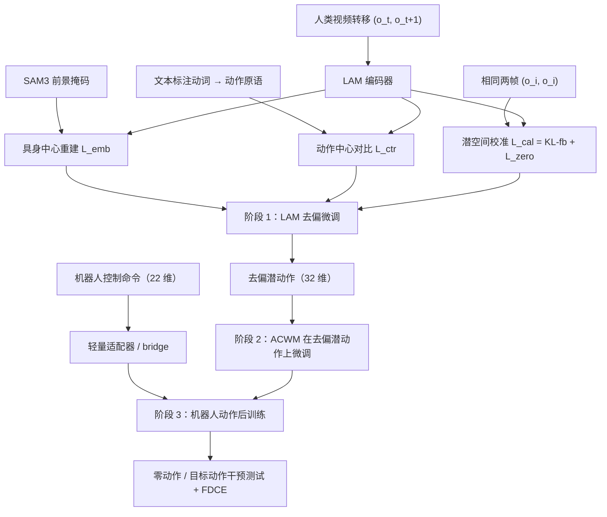
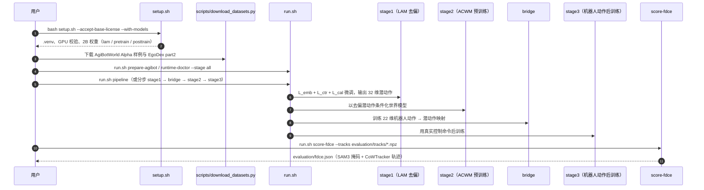

# CD-LAM（因果去偏潜动作模型）

**CD-LAM**（Causally Debiased Latent Action Model；论文 *Causally Debiased Latent Action Model for Embodied Action-Conditioned World Models*，[arXiv:2607.09185](https://arxiv.org/abs/2607.09185)，v1 2026-07-10 / **v2 2026-09-26**；[项目页](https://yufanwei.github.io/CD-LAM-project-page/)；[代码](https://github.com/AetherLabsAI/CD-LAM)；[权重](https://huggingface.co/AetherLabs-AI/CD-LAM)）由 [Aether AI（以太智能）](./aether-ai.md) 与 UCSD 的 12 位作者完成（一作 Yufan Wei，末位作者 Biwei Huang）。Aether AI 官方博客在 **2026-07-27** 发布 *CD-LAM: Causal Debiasing Gives World Models Stronger Action Control with 10x Less Post-training*（Field notes #07）。

## 一句话定义

**在潜动作模型（LAM）给人类视频打标签的那一步先做因果去偏——前景加权重建、按动作原语对比、把「无变化」锚到潜空间原点——让下游动作条件世界模型真正受动作控制，而不是凭场景线索猜下一帧。**

## 英文缩写速查

| 缩写 | 英文全称 | 简要说明 |
|------|----------|----------|
| LAM | Latent Action Model | 从无动作标签视频推断潜动作，作为世界模型预训练的伪标签 |
| CD-LAM | Causally Debiased LAM | 本文方法 |
| ACWM | Action-Conditioned World Model | 以动作为条件预测未来观测的世界模型 |
| FDCE | Foreground Displacement Chamfer Error | 本文提出的动作跟随误差：前景点位移轨迹的 Chamfer 距离 |
| PSNR / SSIM / LPIPS | Peak Signal-to-Noise Ratio / Structural Similarity / Learned Perceptual Image Patch Similarity | 视觉保真度指标 |
| SAM3 | Segment Anything Model 3 | 用于前景（机械臂 + 物体）分割 |
| KL-fb | KL divergence with free bits | 带 free-bits 的 KL 项，控制容量、防塌缩 |
| SigLIP | Sigmoid Loss for Language-Image Pre-training | 动作对比损失借用的成对 sigmoid 形式 |
| VLA | Vision-Language-Action | v2 中用 X-VLA 验证潜动作预训练对策略的作用 |

## 为什么重要

- **指出一个被画质掩盖的失败模式。** 用 LAM 伪标签训出来的世界模型可以生成很逼真的视频，但把动作置零手臂还在动、换一条动作序列画面几乎不变。作者把它定性为 **因果失败**：模型学到的是场景 → 未来，而不是动作 → 未来。
- **问题出在上游，修也在上游。** 纯重建目标从不区分画面变化来自机器人、相机还是光照，于是把这些因素都编进潜动作（**视觉混杂**），之后每一阶段都继承。CD-LAM 只改 LAM，世界模型骨干、潜动作维度、动作接口都不变，能直接插进 [DreamDojo](./paper-hrl-stack-35-dreamdojo.md) 式管线。
- **给出能测「是否听动作」的指标。** PSNR 与动作跟随误差的相关性很弱（\(R^2=0.14\)），作者提出 FDCE，并配套零动作、目标动作两个干预测试。
- **后训练省 10 倍以上。** 去偏后，机器人动作后训练约 3k 步就追平基线 50k 步；1 小时去偏视频拿到 1,000 小时约 80% 的收益（自报）。
- **完整开源。** 代码、2B 的 LAM / 预训练 / 后训练权重、FDCE 评测脚本都已公开。

## 核心信息

| 项 | 内容 |
|----|------|
| **机构** | 以太智能（Aether AI）、加州大学圣地亚哥分校（UCSD） |
| **作者** | Yufan Wei、Kun Zhou、Lingjun Mao、Ziming Xu、Shuang Liang、Zijun Zhang、Ziqiao Xi、Ruobing Han、Yuchen Yan、Xinyue Wang、Fan Feng、Biwei Huang |
| **基线** | DreamDojo-2B / 14B（同骨干、同训练设置） |
| **v2 扩展** | LTX-2.3-22B 视频骨干改造成 ACWM；X-VLA 策略用 CD-LAM 潜动作预训练 |
| **数据** | 人类视频（EgoDex 评测潜动作 rollout）；机器人数据（AgiBotWorld，留出片段评机器人动作 rollout） |
| **潜动作 / 机器人动作** | 32 维潜动作；22 维机器人动作经 checkpoint 专属 bridge 映射 |
| **开源** | 代码 Apache-2.0；HF 发布 2B 的 LAM、pretrain、posttrain；14B 权重与 14B 适配器未包含 |

## 核心原理（方法）

### 流程总览

### 三项去偏目标

\[\mathcal L_{CD}=\mathcal L_{emb}+\lambda_{ctr}(k)\,\mathcal L_{ctr}+\lambda_{cal}\,\mathcal L_{cal}\]

1. **具身中心重建 \(\mathcal L_{emb}\)：** 用 SAM3 前景掩码 \(M_t\) 给重建损失加权，\(W_t=\alpha_{fg}M_t+\alpha_{bg}(1-M_t)\)，\(\alpha_{fg}>\alpha_{bg}\)。潜动作优先解释机械臂和被操作物体的运动，背景仍保留小权重以维持整体一致。
2. **动作中心对比 \(\mathcal L_{ctr}\)：** 从视频文本标注里抽动词，归并成 pick-and-place、pour、open 等动作原语；SigLIP 式成对损失 \(\mathrm{softplus}(-y_{ij}(\tau v_i^\top v_j+b))\) 拉近同原语、推远不同原语。权重 \(\lambda_{ctr}(k)\) 随训练步变化。
3. **潜空间校准 \(\mathcal L_{cal}=\mathcal L_{KL\text{-}fb}+\mathcal L_{zero}\)：** 输入两帧相同时，「什么都没变」应对应潜空间原点；\(\mathcal L_{zero}\) 把这类潜变量的范数（用普通转移潜变量的运行 RMS 范数归一化、stop-grad）压到阈值以下。free-bits KL 控制容量、防止潜空间塌缩。

### 为什么叫「因果」

作者把动作当原因、未来帧当结果。检验因果最直接的方法是 **干预**：改原因，看结果是否跟着变。

- **零动作测试 \(do(u=0)\)：** 首帧固定、动作全置零，正确输出是静止画面。14B 单样本：DreamDojo 残余 FDCE 44.2 px，CD-LAM 3.3 px。
- **目标动作测试 \(do(u=u_{tar})\)：** 首帧固定、换入另一条轨迹的动作，正确输出应跟随新动作。

上游 LAM 编码器诊断（不涉及生成，越低越好）也指向同一个问题：

| 诊断 | DreamDojo LAM | CD-LAM |
|------|---------------|--------|
| 两帧相同时的响应（中位数） | 0.527 | **0.043** |
| 水平 / 垂直平移响应（中位数） | 0.536 / 0.529 | **0.096 / 0.064** |
| 场景捷径泄漏 | 0.151 | **0.014** |

## 源码运行时序图

复现路径：`setup.sh` 建环境并可直接拉 2B 权重；只想评测时可跳过训练，用发布的 posttrain 权重 + bridge 生成 rollout，再跑 `score-fdce`。14B 只有 YAML 记录的论文配置，没有权重与运行适配器。

## 工程实践

| 项 | 要点 |
|----|------|
| 硬件 | Linux x86-64、Ampere / Hopper GPU、PyTorch 2.7.0+cu128、约 30 GB 磁盘 |
| 接口约定 | 世界模型输入是 32 维潜动作时不需要 bridge；输入 22 维机器人动作时必须用对应 checkpoint 的 bridge |
| 换骨干 | 兼容的 2B checkpoint 可在 `configs/runtime.json` 切换；移植其他架构需要匹配的 adapter、LAM、bridge 与预处理约定 |
| 去偏数据量 | 2B 上 1 h 去偏视频即可拿到大部分收益（FDCE 均值 12.63 → 8.91；1000 h 为 7.97） |
| 动作原语标签 | \(\mathcal L_{ctr}\) 依赖视频文本标注里的动词；没有文本标注的数据需要另找原语来源 |
| 评测 | FDCE 依赖 SAM3 与 CoWTracker；可用缓存的掩码 / 轨迹 |
| 开源状态 | 代码 + 2B 权重 + 评测已开源（2026-10-10 核查）；仓库同时存在 `AetherLabsAI/CD-LAM` 与 `yufanwei/CD-LAM` 两个地址，HEAD 相同 |

## 实验与评测

### 只用潜动作条件（ACWM 去偏微调后，EgoDex 留出人类视频）

| 模型 | FDCE ↓ | PSNR ↑ | SSIM ↑ | LPIPS ↓ | 目标动作 FDCE ↓ |
|------|--------|--------|--------|---------|-----------------|
| DreamDojo-2B | 34.00 | 20.88 | 0.780 | 0.413 | 42.74 |
| **CD-LAM-2B** | **19.63（−42%）** | **24.29** | **0.827** | **0.308** | **33.81（−21%）** |
| DreamDojo-14B | 40.29 | 21.04 | 0.792 | 0.398 | 50.27 |
| **CD-LAM-14B** | **29.87（−26%）** | **23.18** | **0.814** | **0.342** | **33.22（−34%）** |

### 机器人动作后训练后（留出真机数据）

| 模型 | FDCE 均值 ↓ | FDCE 中位 ↓ | PSNR ↑ | 零动作 FDCE ↓ | 目标动作 FDCE ↓ |
|------|-------------|-------------|--------|---------------|-----------------|
| DreamDojo-2B | 12.63 | 8.15 | 19.85 | 10.71 | 24.36 |
| **CD-LAM-2B** | **8.24（−34.8%）** | **6.75** | **20.60** | **5.03（−53%）** | **22.55（−7%）** |
| DreamDojo-14B | 11.11 | 8.98 | 20.01 | 9.36 | 24.82 |
| **CD-LAM-14B** | **7.73（−30.4%）** | **5.99** | **21.01** | **2.18（−76.7%）** | **21.11（−15%）** |

- 基线从 2B 放大到 14B，漂移仍在；潜动作生成误差反而变大（34.00 → 40.29）。作者据此认为收益来自去偏而不是规模。
- **训练效率：** 14B 上 FDCE 约 3k 步、PSNR 约 4k 步追平 DreamDojo 50k 步参考（博客「>10×」，v2 写「>12×」）。

### v2 新增（arXiv 2026-09-26，自报）

- **LTX-2.3-22B → ACWM：** 合计样本暴露约为 DreamDojo-14B 的 3.2%，PSNR 20.38（对 20.01）、FDCE 中位 7.82（对 8.98），但 FDCE 均值 11.75 略差于 11.11。
- **X-VLA 潜动作预训练**（成功率 %）：

| 预训练 | LIBERO | LIBERO-Plus | RoboTwin C2R Clean | RoboTwin C2R Random |
|--------|--------|-------------|--------------------|---------------------|
| X-VLA（原始） | **98.05** | 69.74 | 85.67 | 25.00 |
| DreamDojo LAM | 95.72 | 75.69 | 84.00 | 28.83 |
| CD-LAM | 96.30 | **78.25** | **86.67** | **33.83** |

  CD-LAM 相对 DreamDojo LAM 提升 0.58–5.00 pp；但在 LIBERO 上仍低于不做潜动作预训练的原始 X-VLA。

## 结论

**CD-LAM 的核心判断是：动作条件世界模型的瓶颈不在画质而在因果性，而这个问题最便宜的修法是在 LAM 阶段去掉视觉混杂。**

- **评测世界模型要加干预测试。** 只看 PSNR 会漏掉「不听动作」；零动作残余运动和目标动作跟随误差是更直接的指标，FDCE 可直接复用。
- **最大收益在零动作测试。** 14B 残余运动降 76.7%，2B 降 53%；普通动作跟随误差降约 30%，目标动作测试的改善最小（7%–15%）。
- **省的主要是后训练。** 去偏潜动作让后训练约 3k 步追平基线 50k 步，对机器人数据少的团队价值最大。
- **少量去偏数据就够。** 1 h 视频拿到大部分收益，说明去偏是低成本的预处理步骤。
- **对策略的帮助有限且不均匀。** X-VLA 上相对 DreamDojo LAM 有 0.6–5 pp 提升，但 LIBERO 上不如不用潜动作预训练；不要把它当作通用的 VLA 提分手段。
- **可复现性分级。** 2B 可完整复现；14B 结论只能看论文。

## 与其他工作对比

| 对比轴 | CD-LAM | [DreamDojo](./paper-hrl-stack-35-dreamdojo.md) LAM | [LAPA](./paper-shenlan-wm-03-lapa.md) / [Genie](./paper-sa-2402-15391-genie-generative-interactive-environments.md) 式 LAM | [SCAR](./paper-scar-continuous-action.md) |
|--------|--------|----------------|-----------------------|------|
| LAM 训练目标 | 前景加权重建 + 原语对比 + 零转移校准 + KL | 重建 | 重建 + VQ 离散码本 | 逆-前向动力学 + KL + 本体对抗 |
| 针对的偏差 | 背景 / 相机 / 场景上下文混杂 | — | — | 本体信息泄漏 |
| 额外监督 | SAM3 掩码、文本动词 | 无 | 无 | 本体 ID |
| 下游 | 视频 ACWM + 机器人动作后训练；X-VLA | 视频 ACWM | 策略预训练 / 可交互环境 | 世界模型条件接口 |

- [What Matters for Latent Actions](./paper-latent-actions-matter.md) 系统比较了 41 种 LAM 设计，CD-LAM 补了一个它没有专门测的维度：潜动作是否被视觉混杂污染、是否响应干预。
- 在 [世界动作模型](../concepts/world-action-models.md) 与 [生成式世界模型](../methods/generative-world-models.md) 的分类里，CD-LAM 属于「动作条件接口」层的改进；与 [逆动力学模型](../concepts/inverse-dynamics-model.md) 的关系是：LAM 的编码器本质上是一个自监督 IDM。

## 局限与风险

- **博客与论文 v2 口径不同。** 博客（2026-07-27）写「>10×」「降 30% 以上」；v2 写「>12×」「最多降 42% / 35%」，并新增 LTX、X-VLA 实验。引用时注明版本。
- **单样本示例。** 零动作 44.2 px vs 3.3 px 是单个 14B 样本，均值以表格为准。
- **依赖外部模型。** 去偏用 SAM3 掩码，FDCE 用 SAM3 + CoWTracker；分割或跟踪出错会同时影响训练与评测。
- **原语对比依赖文本标注。** 没有动词标注的视频无法直接使用 \(\mathcal L_{ctr}\)。
- **只与 DreamDojo 正面对比。** 作者说明其他 ACWM 在架构、动作对齐、本体与评测上差异过大，未做横向排名。
- **14B 未开源**，14B 的数字无法独立复现。

## 关联页面

- [Aether AI（以太智能）](./aether-ai.md) — 论文机构与博客发布方
- [DreamDojo](./paper-hrl-stack-35-dreamdojo.md) — 主要基线与骨干管线
- [What Matters for Latent Actions](./paper-latent-actions-matter.md) — LAM 设计空间实证研究
- [SCAR](./paper-scar-continuous-action.md) — 同团队：跨本体潜动作表示
- [TC-WM](./paper-task-centric-world-models.md) — 同团队：任务中心世界模型状态
- [IWR（The Geometry of Contact）](./paper-geometry-of-contact.md) — 博客原文「Related」指向的同团队接触操作对比 RL 工作
- [LAPA](./paper-shenlan-wm-03-lapa.md) · [Genie](./paper-sa-2402-15391-genie-generative-interactive-environments.md) — 早期潜动作路线
- [SAM 3](./paper-sam3.md) — 前景分割来源
- [AgiBot World](./paper-sa-2503-06669-agibot-world-colosseo-a-large-scale-manipulation.md) · [EgoDex](./paper-notebook-egodex-learning-dexterous-manipulation-from-larg.md) — 训练与评测数据
- [LIBERO](./libero-benchmark.md) · [LIBERO-Plus](./paper-rcl-2510-13626-libero-plus-in-depth-robustness-analysis-of-visi.md) · [RoboTwin](./robotwin.md) — v2 X-VLA 评测基准
- [世界动作模型](../concepts/world-action-models.md)
- [逆动力学模型](../concepts/inverse-dynamics-model.md)
- [生成式世界模型](../methods/generative-world-models.md)

## 参考来源

- [Aether AI 博客：CD-LAM（2026-07-27）](../../sources/blogs/aether_cd_lam.md)
- [CD-LAM 论文归档（arXiv:2607.09185 v2）](../../sources/papers/cd_lam_arxiv_2607_09185.md)

## 推荐继续阅读

- [Aether AI 博客原文](https://aetherlabs.ai/articles/cd-lam-causal-debiasing-for-embodied-world-models.html)
- [CD-LAM 项目页](https://yufanwei.github.io/CD-LAM-project-page/)
- [arXiv:2607.09185](https://arxiv.org/abs/2607.09185)
- [GitHub：AetherLabsAI/CD-LAM](https://github.com/AetherLabsAI/CD-LAM) · [Hugging Face：AetherLabs-AI/CD-LAM](https://huggingface.co/AetherLabs-AI/CD-LAM)
