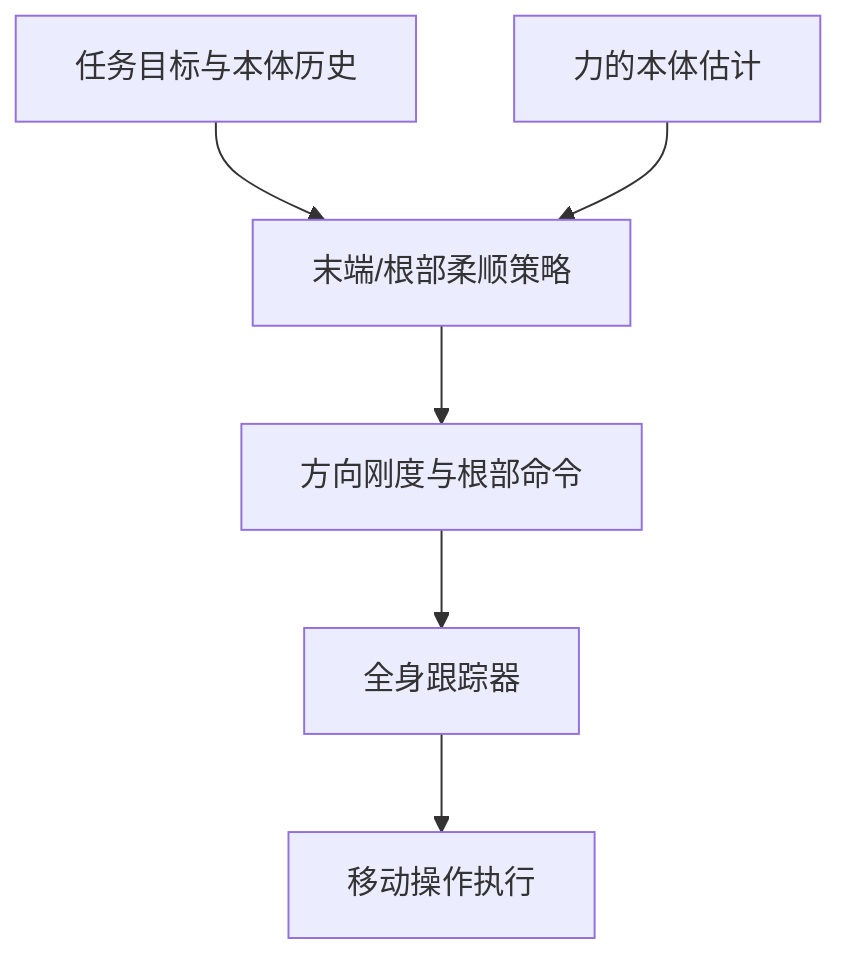

# CEER2：方向可调的人形末端与根部柔顺

## 一句话定义

CEER2 在固定全身跟踪策略上叠加分层控制，分别调节末端方向柔顺性和根部顺应行为。

## 英文缩写速查

| 缩写 | 英文全称 | 说明 |
|---|---|---|
| WBC | Whole-Body Control | 全身协调控制 |
| RL | Reinforcement Learning | 强化学习策略训练 |
| G1 | Unitree G1 Humanoid | 相关论文的真机平台 |

## 流程总览

## 方法与证据

论文提出末端方向可调刚度与根部顺应模式，由高层强化学习调节固定全身跟踪策略。文章报告方向刚度控制、在线调整和协作搬运；具体数值与配置应以论文正文为准。

## 局限与风险

结果依赖训练覆盖、机器人配置、传感器和论文中的任务协议。文章摘要可辅助定位；定量结果与代码开放状态应以论文和官方项目页为准。

## 结论

- 识别策略接收的目标和部署时实际可见的观测。
- 区分仿真评测、受控真机展示与开放场景能力。
- 结合接触、身体平衡和任务进度评估，不用单一成功率代表通用性。

## 参考来源

- [来源档案](../../sources/papers/ceer2_arxiv_2609_38709.md)
- [arXiv:2609.38709](https://arxiv.org/abs/2609.38709)

## 推荐继续阅读

- [Day 4：移动操作](../overview/humanoid-motion-intelligence-day4-loco-manipulation.md)
