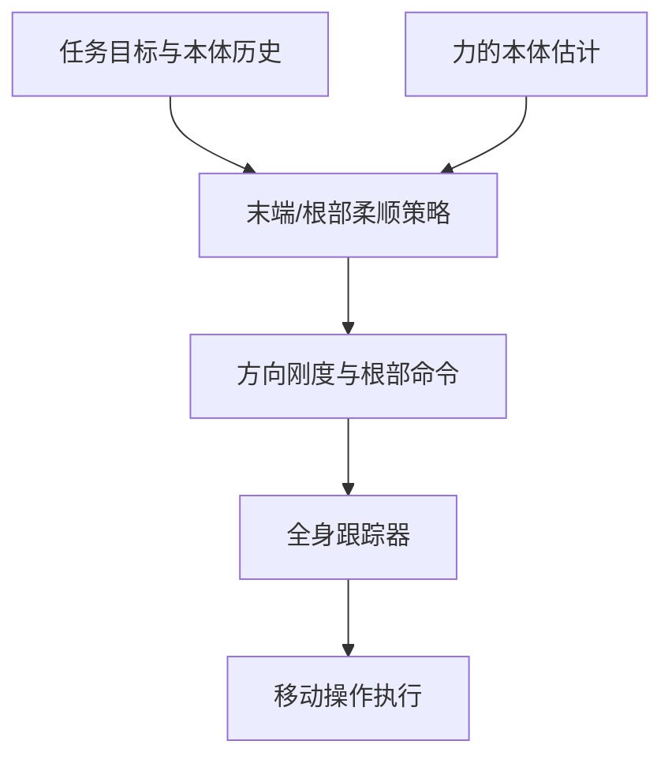

# CEER2：方向可调的人形末端与根部柔顺

## 一句话定义

CEER2 在固定全身跟踪策略上叠加分层控制，分别调节末端方向柔顺性和根部顺应行为。

## 英文缩写速查

| 缩写 | 英文全称 | 说明 |
|---|---|---|
| WBC | Whole-Body Control | 全身协调控制 |
| RL | Reinforcement Learning | 强化学习策略训练 |
| G1 | Unitree G1 Humanoid | 相关论文的真机平台 |

## 流程总览

## 方法与证据

论文采用两级分层 RL：Stage 1 训练一个固定且偏"硬"的 3-kp 低层全身跟踪策略（带 EE–root 命令接口）；Stage 2 冻结低层，训练高层残差策略修正 EE / root 命令，以在估计外力下实现目标柔顺响应。末端侧用 analytical compliance-space MoE 组合 10 个刚度专家，使 x/y/z 三轴 Cartesian stiffness 可在 100–600 N/m 内独立调节；根部侧提供 resistance 与两种 damping（B = 60 / 200 N·s/m）三种模式，可在线切换。交互力只由本体历史估计，不使用腕部力/力矩传感器。

## 实验与评测

- **训练与平台**：Isaac Sim，16,384 并行环境、8×L40S；低层 7B env steps（约 6 h），每个高层策略 5B steps（约 2 h）。真机为 Unitree G1，策略在 RTX 4080 笔记本上推理，sim-to-real 直接迁移（论文报告）。
- **低层骨干选择**：对比 CEER 与 SONIC，3-kp stiff（30 N）名义跟踪误差 0.0456 m、表观刚度中位数 621.4 N/m；CEER 为 0.1385 m / 103.3 N/m，SONIC 为 0.0955 m / 192.3 N/m（论文报告）。
- **固定刚度消融（200 N/m）**：EE 柔顺跟踪误差 Analytical MoE 0.023 m、Fixed-stiffness HL 0.028 m、Fixed-stiffness E2E 0.082 m，说明分层显著优于端到端（论文报告）。
- **全范围方向柔顺（16 种刚度配置 × 60 次 = 960 trials）**：Analytical MoE 柔顺矩阵误差 0.278、EE 误差 0.0349 m、刚度 MAPE 0.249、slope 0.764 / R² 0.779；stiffness-conditioned HL 出现范围压缩（slope 0.136、R² 0.040），E2E R² 近 0；使用真值外力的 oracle-force LL 为 slope 0.485、EE 误差 0.0459 m，仍不如 MoE（论文报告）。
- **工作空间一致性**：7 个 EE 位姿共 6,720 trials，x/y/z 平均分量误差 24.8 / 22.1 / 25.8 mm，最差为抬手 z+ 位姿 43.7 mm（论文报告）。
- **根部柔顺**：resistance 根部漂移 0.3103 m；B = 60 / 200 的表观阻尼中位数为 57.0 / 201.4，接近目标值；加入 foot / yaw 残差主要改善 resistance 模式（5-kp+yaw 漂移 0.1574 m）（论文报告）。
- **真机任务**：拉力计测得 K_y = 100 / 200 / 600 N/m 时表观刚度约 214.6 / 338.6 / 551 N/m（手工测量，误差较大）；写 "8"、受扰画直线、10° 斜面书写中，方向柔顺（低 K_z、高切向刚度）兼顾接触与轨迹精度，各向同性高刚度会弄断笔架；3 kg 负载拖拽和人机协作搬箱（EE 方向柔顺 + root B = 60）完成，各向同性软设置导致箱子滑落（论文报告，以定性为主）。

## 与其他工作对比

| 对照 | 区别 | 取舍 |
|---|---|---|
| [CEER](./paper-motion-cerebellum-ceer.md) | CEER 提供 EE + root 统一柔顺接口，但不可调刚度、无方向性；CEER2 在其上加入逐轴可调刚度与三种 root 模式 | CEER2 改用更硬的 3-kp 低层（CEER 本身偏软，名义误差更大），柔顺全部由高层残差实现 |
| [CHIP](./paper-hrl-stack-36-chip.md) | CHIP 调节标量柔顺系数 1/k（0–0.05 m/N），只作用于 EE，无方向性 | CEER2 可逐轴指定刚度并覆盖根部，但需要训练 10 个专家 + 多个 root 策略 |
| [GentleHumanoid](./paper-gentlehumanoid.md) | 以力上限（5–15 N）实现上半身柔顺跟踪，不直接命令 Cartesian 刚度 | GentleHumanoid 偏安全交互；CEER2 偏可指定的任务级刚度 |
| [SoftMimic](./paper-notebook-softmimic-learning-compliant-whole-body-control.md) | 用 IK 柔顺增强生成参考，刚度范围 40–1000 N/m，但不保留通用动作跟踪 | SoftMimic 范围更宽；CEER2 范围 100–600 N/m 但保留通用跟踪与方向性 |
| [LAC](./paper-lac.md) | 覆盖手臂 + 躯干并支持角柔顺（10–500 N/m） | LAC 有 angular compliance，CEER2 没有；CEER2 独有方向刚度与 root 柔顺 |
| SONIC（通用跟踪器） | 无显式柔顺；自然表观刚度分布宽且不可控（中位数 192.3 N/m） | 作为低层骨干对照，被 3-kp stiff 策略取代 |

## 局限与风险

论文自述：可达柔顺受低层硬跟踪器能力限制（x 向刚度不足限制 EE 刚度范围，行走能力限制根部交互）；三种 root 模式下交互仍不够平滑，机器人常出现重步、缺少有意识的落脚规划。真机刚度为手工测量，主要以任务级表现评估；代码开放状态应以官方项目页为准。

## 结论

- "冻结硬跟踪器 + 高层残差"能把柔顺与动作跟踪解耦，固定刚度下 EE 误差从 E2E 的 0.082 m 降到 0.023 m（论文报告）。
- 单一刚度条件策略会出现范围压缩，按刚度锚点组合专家（analytical MoE）是保持逐轴可调的关键。
- 方向柔顺在书写、协作搬运等任务中有实际收益；定量证据主要来自仿真，真机以定性任务演示为主。

## 关联页面

- [移动操作任务](../tasks/loco-manipulation.md)
- [CHIP：自适应柔顺控制](./paper-hrl-stack-36-chip.md)

## 参考来源

- [来源档案](../../sources/papers/ceer2_arxiv_2609_38709.md)
- [arXiv:2609.38709](https://arxiv.org/abs/2609.38709)

## 推荐继续阅读

- [Day 4：移动操作](../overview/humanoid-motion-intelligence-day4-loco-manipulation.md)
