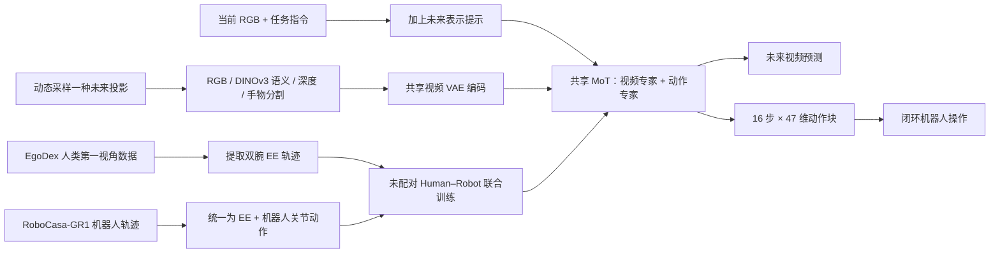

# CF-WAM：动态重想世界–动作模型的下一状态

**From World Models to World Action Models: Rethinking Next-State Prediction**（arXiv:2609.34414）提出 **Confluent Foresight WAM（CF-WAM）**。它的核心问题是：既然未来状态要服务于动作生成，为什么训练前就必须把它固定成 RGB、单一潜特征或静态多模态组合？CF-WAM 把 RGB、语义、几何和交互视作同一物理未来的不同坐标描述，在训练时动态切换监督表示，让它们对动作有用的约束共同塑造一个世界–动作模型。

- **作者：** Tingyu Yuan、Ziming Ji、Biaoliang Guan、Wen Ye、Wenrui Tian、Zhaopeng Gu、Feihong Zhang、Xu Yang、Yan Huang、Zhaowen Li、Chaoyang Zhao、Jinqiao Wang
- **单位：** 中国科学院自动化研究所、中国科学院大学、北京邮电大学、西安交通大学、武汉大学、清华大学、Yinwang Intelligent Technology
- **论文：** [arXiv:2609.34414](https://arxiv.org/abs/2609.34414) · [HTML 全文](https://arxiv.org/html/2609.34414v1) · [PDF](https://arxiv.org/pdf/2609.34414)
- **代码/数据：** 当前论文写明将在录用后公开；arXiv 页面尚未链接官方代码或权重仓库。

## 一句话理解

**不是每一步都同时预测四种未来，而是每个样本随机换一种方式描述同一个未来；动作专家从这些轮换监督中学到对控制有用、又不依赖单一本体外观的状态转移。**

## 英文缩写速查

| 缩写 | 英文全称 | 本文含义 |
|---|---|---|
| CF-WAM | Confluent Foresight World Action Model | 动态未来状态参数化的世界–动作模型 |
| WAM | World Action Model | 将未来预测与动作生成耦合的模型 |
| MoT | Mixture-of-Transformers | 视频专家和动作专家分流、逐层混合注意力 |
| VAE | Variational Autoencoder | 把不同未来视频投影编码到共享潜空间 |
| EE | End Effector | 人类双腕与机器人末端执行器的共同动作空间 |
| OOD | Out of Distribution | 与训练分布不同的测试场景 |

## 为什么重新定义“下一状态”

未来表示会决定模型保留什么、丢掉什么。论文把四种表示看作同一未来的投影：

| 投影 | 实际监督形式 | 擅长保留 | 主要遗漏 |
|---|---|---|---|
| Visual | RGB 视频 | 外观与整体可观测结果 | 冗余视觉细节可能掩盖动作关键变化 |
| Semantic | DINOv3-PCA 语义视频 | 物体身份、场景与任务结构 | 精细空间关系 |
| Geometric | 深度视频 | 三维布局与相对空间变化 | 对象语义与交互进程 |
| Interaction | 手–物体分割视频 | 接触对象与交互变化 | 全局场景上下文 |

Static Multi-State 每个更新都同时保留四种预测空间；作者认为这增加了计算，也会让不同表示争用有限的动作条件容量。CF-WAM 每个样本只训练一种投影，再跨更新切换，让表示间的互补约束逐步累积。

## 方法图

## 训练机制：变的是未来坐标，不是物理转移

1. 对每个训练样本，从 RGB、DINOv3-PCA、深度或手–物体交互分割中采一种未来表示。其余条件保持一致，同一时间对齐的当前 RGB 帧作为共同起点。
2. 将“预测深度视频”等表示提示并入原任务指令；共享的视频 VAE 与同一个 WAM 生成所选未来，不为各表示另建预测分支。
3. 视频专家和动作专家分别沿 flow-matching 路径去噪。每层把两组 Q/K/V 放入共同注意力空间进行混合注意力，但专家仍保留各自参数和残差流。
4. 动作专家预测 16 步动作块，每步 47 维：双腕 18 维末端执行器位姿，加双臂、双手和腰部的 29 维机器人专属关节控制。
5. 人类样本只监督可映射的双腕末端执行器维度；缺失的机器人专属关节维度通过来源掩码从损失中排除。这样不需要人类与机器人示范逐帧、逐任务或逐 episode 配对。

论文附录给出的规模为：Wan2.2-TI2V-5B 视频专家 + 约 1.021B ActionDiT；两路均 30 层，总计约 6.021B 参数（不含冻结 VAE 和文本编码器）。RoboCasa-GR1 主实验使用 4 个节点、每节点 8 张 NVIDIA B200、全局 batch 32、训练 100K 步，说明该结果基于较大的训练资源。

## 数据与实验设置

- **机器人经验：** NVIDIA PhysicalAI-Robotics-GR00T-Teleop-Sim-XEmbodiment-Compatible 数据中的 RoboCasa-GR1 桌面部分，24 项任务、每项 1,000 条遥操作 episode。
- **人类经验：** EgoDex 第一视角操作数据的 pick-and-place 子集；从双腕提取可映射到机器人末端执行器的动作。
- **动作对齐：** 机器人从原始关节状态回放以恢复腕部 EE 轨迹；人类双腕姿态经 ARKit 到 GR-1 坐标变换对齐。人类动作由 30 Hz 重采样到 20 Hz，机器人关节动作保留为本体专属通道。
- **RoboCasa-GR1：** 24 项 Fourier GR-1 双臂和灵巧手桌面操作任务；每项每种方法进行 50 次闭环 rollout。
- **LIBERO-Plus：** 在 LIBERO 训练后直接测量 OOD 环境，不对测试集适配；单个 B200 节点训练 80K 步。
- **真机：** 六项操作任务，每个任务、每个设置各 50 次闭环试验；包括化学瓶放置、折毛巾、整理药瓶、分拣水果、插入试管和擦拭污渍。

## 结果与对照

| 评测 | CF-WAM | 对照 | 读数 |
|---|---:|---:|---|
| RoboCasa-GR1 24 任务平均 | 82.50% | WALA 75.17% | 高 7.33 个百分点；CF-WAM 在 15/24 项任务领先 |
| RoboCasa 新颖 pick-and-place | 85.00% | WALA 73.45% | 高 11.55 个百分点 |
| LIBERO-Plus 零适配 OOD 平均 | 82.65% | FoMoVLA 80.50% | 高 2.15 个百分点 |
| 真机六任务，Interaction 固定投影 | 84.00% | π₀.₅ 62.33% | 六类真机任务中该单一投影平均最好 |
| 真机六任务，逐任务 oracle 选投影 | 87.00% | — | 依赖逐任务挑选最佳投影，不等同于免选择的统一部署 |
| 真机五种 OOD，Interaction 推理 | 79.20% | 无人类数据、Visual 45.60% | 评测设置不同，突出人类经验对 OOD 的贡献 |

消融中，动态采样所有四种表示达到 79.00%，高于最佳单表示 76.25%；静态地每次同时监督四种表示为 68.75%。这组消融和完整 82.50% 主结果有不同的训练/数据设置，不能把几个数值视作同一行排行榜。

## 与相关方法对比

| 方向 | CF-WAM 的区别 |
|---|---|
| 单一未来表示 WAM | 不在训练前固定 RGB 或 latent 未来；以一个共享模型轮换监督投影。 |
| Static Multi-State | 每次只启用一个投影，跨训练步累积互补约束；不是同时优化四个预测分支。 |
| 人类数据迁移 | 不依赖人机逐帧配对、轨迹重定向或先人类预训练再机器人微调；在人类侧只使用可共享的 EE 动作。 |
| 同一概念下其他 WAM | [EgoWAM](paper-egowam-egocentric-human-wam-co-training.md) 关注野外人类数据与 WAM 协同训练；[DiT4DiT](paper-dit4dit-video-action-model.md) 关注双 DiT 联合视频动力学和动作。CF-WAM 重点是训练时动态切换未来状态坐标。 |

## 复现与适用边界

- **论文状态：** arXiv v1 预印本，提交日期 2026-09-28。
- **代码和数据：** 论文称将在录用后公开；当前未找到官方 GitHub、权重或可直接运行的复现入口。
- **资源门槛：** RoboCasa 主结果使用 32 张 B200；不能把论文指标理解为单张消费级 GPU 的训练结论。
- **真机解释：** 真机评测是六项限定任务及固定试验协议；87% oracle 结果需要按任务选择表示。论文报告的结果不能直接推成开放环境、跨机器人通用能力。
- **数值比较：** 基线结果依论文所列设置与训练预算；RoboCasa、LIBERO-Plus、真机与消融属于不同协议，应分别比较。

## 关联页面

- [World Action Models（WAM）概念页](../concepts/world-action-models.md)
- [生成式世界模型](../methods/generative-world-models.md)
- [双臂操作任务](../tasks/bimanual-manipulation.md)
- [EgoDex 人类灵巧操作数据](paper-notebook-egodex-learning-dexterous-manipulation-from-larg.md)
- [DiT4DiT 视频–动作模型](paper-dit4dit-video-action-model.md)

## 参考来源

- [CF-WAM 论文来源归档](../../sources/papers/cf_wam_arxiv_2609_34414.md)
- [arXiv 摘要与版本信息](https://arxiv.org/abs/2609.34414)
- [arXiv HTML 全文](https://arxiv.org/html/2609.34414v1)
- [arXiv PDF](https://arxiv.org/pdf/2609.34414)

## 推荐继续阅读

- [EgoWAM](paper-egowam-egocentric-human-wam-co-training.md) — 人类视频训练 WAM 的人–机协同路径
- [DiT4DiT](paper-dit4dit-video-action-model.md) — 联合预测视频动力学与动作的双 DiT WAM
- [World Action Models 技术地图](../overview/robot-world-models-action-consequence-technology-map.md)
