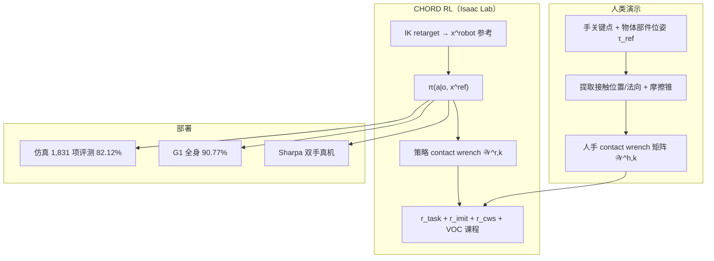

# CHORD（Contact Wrench Guidance for Dexterous Manipulation）

**CHORD**（*Contact Wrench Guidance from Human Demonstration in Robotic Dexterous Manipulation*，NVIDIA，2026 tech report）提出用 **物体中心接触力旋量空间引导** 把人类双手演示迁移到灵巧机器人策略：比较接触对物体诱导的 **力学效应**，而非仅匹配演示接触 **位置**；在 **Isaac Lab** 上联合 task tracking、motion imitation 与 CWS 奖励训练 RL，并发布 **4,739** 项双手灵巧操作 benchmark。

## 英文缩写速查

| 缩写 | 英文全称 | 简要说明 |
|------|----------|----------|
| CHORD | Contact Wrench Guidance from Human Demonstration in Robotic Dexterous Manipulation | 本文框架全称 |
| CWS | Contact Wrench Space | 物体中心力-矩（wrench）可比空间 |
| VOC | Virtual Object Controller | DexMachina 式辅助 wrench 推物体，早期探索用 |
| RL | Reinforcement Learning | 在仿真中用 PPO 类 on-policy 学习灵巧策略 |
| V2D | Video to Data | NVIDIA 人类视频→重建→Robotic Grounding 三阶段管线 |
| IL | Imitation Learning | 演示跟踪与 retarget 正则项 |
| DM | DexMachina | 接触位置+VOC 基线套件 |
| MT | ManipTrans | 演示附近接触力奖励基线 |
| SP | SPIDER | 物理感知灵巧重定向与接触课程基线 |

## 为什么重要

- **厘清「接触引导」该比什么：** 同一物体表面、不同法向与力臂可产生截然不同的物体运动；CHORD 用 **wrench 空间 support function** 比较人与机器人接触的可支持物体运动，避免 DexMachina / SPIDER 式 **位置匹配** 的物理歧义（论文 §3.1 开箱盖案例）。
- **规模化 RL 灵巧操作评测：** 作者称首个在 **1,831** 任务、**统一超参** 下评测的 RL 灵巧操作方法，平均成功率 **82.12%**；benchmark 共 **4,739** 项，覆盖刚体/关节体/多物体与更长 horizon、更密 contact events。
- **跨具身与管线衔接：** 同一 CWS 表述可比较不同手型、不同接触点数；并作为 [Video to Data](https://nvidia-isaac.github.io/video_to_data/) **Robotic Grounding** 核心算法，承接上游视频重建与 retarget。
- **全身与真机闭环：** 手部-only / 第三人称演示经 inpainting 或 force-closure 退火可达 G1+Dex3 **90.77%**；Dexmate + 双 **Sharpa** 手开环/闭环部署验证 sim-to-real。

## 流程总览

## 核心机制（归纳）

### Position vs Wrench guidance

| 引导类型 | 优化目标 | 典型失败 |
|----------|----------|----------|
| **Position**（DexMachina / SPIDER） | 机器人接触点接近演示接触区域 | 法向/力臂错 → 物体运动反向或不稳定 |
| **Wrench（CHORD）** | 机器人接触可产生的力-矩包络接近演示 | 允许不同接触位置/手型，只要物体级力学效应一致 |

### CWS 奖励（support function 比较）

1. 对每个物体部件 $k$，从演示构造 primitive wrench 矩阵 $\mathcal{W}^{h,k}$（摩擦锥多面体边力 × 力臂）。
2. 预采样单位方向 $\mathcal{B}$，计算 support $\sigma^{h,k} = \max_{\text{col}} \mathcal{B}^\top \mathcal{W}^{h,k}$；机器人侧同理得 $\sigma^{r,k}$。
3. $r_{\text{cws}}^k$ 用相对容差 $\beta$ 的双侧指数核比较 $\sigma^{r,k}$ 与 $\sigma^{h,k}$；并惩罚 **无意接触**（$\sigma^h=0,\sigma^r>0$）与 **漏接触**（$\sigma^h>0,\sigma^r=0$）。
4. 视频重建噪声大时退化为 **force-closure basis 正支撑** $r_{\text{fc}}^k$，等价于鼓励力闭合。

### 训练稳健化（相对纯 CWS）

- **VOC 课程：** 早期辅助 wrench 沿参考推物体（继承 DexMachina）；需退火，否则易陷入无效接触局部最优。
- **状态 reset：** 沿参考轨迹任意时刻重置 + 短 VOC 稳定窗，便于恢复接触。
- **扰动：** 从 $\mathcal{W}^{h,k}$ 采样 wrench 扰动物体，对齐演示力学。
- **残差动作：** retarget 运动作先验 + 残差（ManipTrans 风格）。

## 评测：Benchmark 与定量（论文 §3.3–4.1）

| 维度 | 规模 / 结果 |
|------|-------------|
| 任务库 | **4,739** simulation-ready 双手任务（开源动捕 + 自研视频重建） |
| 大规模评测 | **1,831** 任务，统一超参，平均成功率 **82.12%** |
| CWS ↔ 成功 | Pearson **r ≈ 0.80**（分集 0.76–0.89） |
| 基线（行内可比） | DexMachina AUC 0.232→**0.687**；ManipTrans MT-SR 0.428→**0.639**；Ours-1 SP-SR 0.133→**0.999** |
| 全身 | G1 + Dex3，手部-only / TPV 演示，**90.77%** |
| 真机 | Dexmate + 双 Sharpa；mocap；开环 chunk + 闭环 |

## 结论

**灵巧操作从演示学接触时，应对齐物体级力学效应（CWS），而不是对齐接触点位置。**

1. **Wrench 比 Position** — support function 比较人/机接触可支持的力-矩包络；允许不同接触位置/手型，只要物体运动效应一致。
2. **奖励仍是 shaping** — $r_{\mathrm{task}}+r_{\mathrm{imit}}+r_{\mathrm{cws}}$ + VOC 课程/状态 reset/扰动；不是纯 offline BC。
3. **规模化评测可读** — **1,831** 任务统一超参平均成功率 **82.12%**；CWS 与成功 Pearson **r≈0.80**。
4. **相对位置/力邻近基线** — DexMachina AUC、ManipTrans MT-SR、SPIDER SP-SR 行内均有大幅提升（见表）。
5. **跨具身与真机** — 同 CWS 表述可比不同手型；G1+Dex3 约 **90.77%**；Sharpa 双手开环/闭环验证。
6. **噪声演示退化** — 重建噪大时退到 force-closure basis；真机仍依赖 mocap，端到端 vision 未做。

## 与代表性方法对比（概念层）

| 方法 | 接触监督 | 数据/训练形态 | 与 CHORD 关系 |
|------|----------|---------------|---------------|
| [DexMachina](https://dexmachina.github.io/) | 接触 **位置** + VOC | 单任务/小规模 RL | CHORD 主要位置引导对照 |
| ManipTrans | 演示附近 **接触力** | 残差 RL + 力奖励 | 力邻近 vs wrench 几何 |
| [SPIDER](../methods/spider-physics-informed-dexterous-retargeting.md) | 接触位置 + 虚拟接触课程 | **重定向/数据生成** 为主 | 共享 VOC 叙事；CHORD 强调 RL 奖励在 wrench 空间 |
| [TopoRetarget](../methods/toporetarget-interaction-preserving-dexterous-retargeting.md) | 交互 mesh / Laplacian | 运动学 retarget → PPO 跟踪 | 上游参考质量路线对照 |

## 常见误区或局限

- **不是纯模仿学习：** CHORD 仍依赖 RL 探索与 VOC 课程；CWS 是 **奖励 shaping**，不是 offline BC。
- **CWS ≠ 静态力闭合：** 与既往抓取向 wrench 奖励不同，CHORD 的 metric 覆盖推、撬、滑等 **瞬态非力闭合** 长时程阶段与关节体操作。
- **资产与接触估计绑定：** benchmark 剔除部分 Isaac Lab 难仿真资产；视频重建演示需 $r_{\text{fc}}$ 退化。
- **尚未端到端 vision：** 真机依赖 mocap 位姿；论文指出 vision 部署与更噪演示为未来工作。

## 与其他页面的关系

- [Contact-Rich Manipulation](../concepts/contact-rich-manipulation.md) — 概念层；CHORD 提供 **演示→RL** 的 wrench 级监督实例。
- [Contact Wrench Cone](../formalizations/contact-wrench-cone.md) / [Friction Cone](../formalizations/friction-cone.md) — CWS 奖励的摩擦锥与力旋量数学基础。
- [Manipulation](../tasks/manipulation.md) — 灵巧操作任务总览；CHORD 覆盖双手刚体/关节体/工具使用。
- [灵巧操作数据管线](../queries/dexterous-manipulation-data-pipeline.md) — V2D 把 CHORD 嵌入「视频→重建→RL」端到端链路。
- [Isaac Lab](./isaac-lab.md) — benchmark 环境与训练宿主。
- [IL for Manipulation](../queries/il-for-manipulation.md) — 演示驱动 vs RL 探索的选型坐标。
- [具身大模型评测基准选型闭环](../queries/embodied-eval-benchmark-selection-loop.md) — 本页可归入其 ③ 策略任务成功率评测层：接触力旋量灵巧操作基准（4,739 训练 / 1,831 评测）

## 推荐继续阅读

- 项目页（含交互可视化）：<https://nvidia-isaac.github.io/video_to_data/chord/>
- Tech report PDF：<https://nvidia-isaac.github.io/video_to_data/chord/chord.pdf>
- V2D 管线文档：<https://nvidia-isaac.github.io/video_to_data/>
- 代码：<https://github.com/nvidia-isaac/video_to_data>
- 基线：[SPIDER 项目页](https://jc-bao.github.io/spider-project/)

## 参考来源

- [chord_nvidia_video_to_data_2026.md](../../sources/papers/chord_nvidia_video_to_data_2026.md) — Tech report 策展摘录
- [nvidia-isaac-video-to-data-chord-github-io.md](../../sources/sites/nvidia-isaac-video-to-data-chord-github-io.md) — 项目页交互说明与定量表

## 关联页面

- [Contact-Rich Manipulation](../concepts/contact-rich-manipulation.md)
- [Manipulation](../tasks/manipulation.md)
- [SPIDER（物理感知灵巧重定向）](../methods/spider-physics-informed-dexterous-retargeting.md)
- [灵巧操作数据管线](../queries/dexterous-manipulation-data-pipeline.md)
- [Isaac Lab](./isaac-lab.md)
- [Loco-Manipulation](../tasks/loco-manipulation.md)
- [Contact Wrench Cone](../formalizations/contact-wrench-cone.md)
