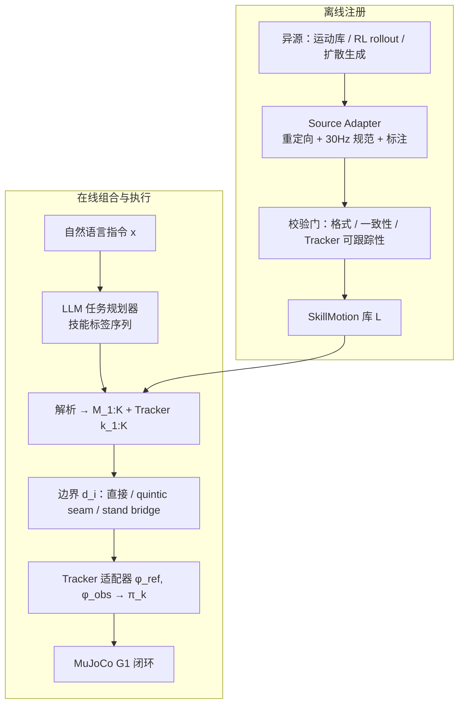

# CHOREO（Every Humanoid Skill as a Trajectory）

**CHOREO**（*CHOREO: Every Humanoid Skill as a Trajectory*，中国海洋大学 × 中国科学院大学 × 中国科学院自动化研究所，[arXiv:2609.22274](https://arxiv.org/abs/2609.22274)，[DOI:10.48550/arXiv.2609.22274](https://doi.org/10.48550/arXiv.2609.22274)）提出 **免训练（training-free）** 的人形 **异源技能组合** 框架：不把 RL 策略、MoCap 库与生成模型并入单一再训练控制器，而是把各来源的 **行为输出** 规范为可注册的 **SkillMotion** 轨迹资产，由运行时按边界相容性 **拼接、局部 quintic 过渡或插入预验证站立 bridge**，再经 **Tracker 感知适配器** 交给冻结低层跟踪器（实验主配置 **GMT @ Unitree G1 · MuJoCo**）。

## 一句话定义

**把「技能」一律当作可执行轨迹 + 边界元数据，用库增长与运行时过渡替代每加能力就重训 monolithic policy。**

## 英文缩写速查

| 缩写 | 英文全称 | 简要说明 |
|------|----------|----------|
| RL | Reinforcement Learning | 异源技能之一：仿真 rollout 产出轨迹 |
| GMT | General Motion Tracking | 论文长程与异源实验的主低层跟踪器 |
| LLM | Large Language Model | 在线任务规划：自然语言 → 有序技能标签 |
| DoF | Degrees of Freedom | G1 规范表示 **23-DoF**，库内 30 Hz |
| MuJoCo | Multi-Joint dynamics with Contact | 全部长程与 rollout 实验仿真宿主 |
| HOI | Human-Object Interaction | 技能库语义覆盖 loco-manip 等（非本文主基准轴） |

## 为什么重要

- **互补 monolithic 通才路线：** 社区持续产出独立 GMT、RL 与扩散技能；CHOREO 论证 **轨迹层接口** 可持续 **累积** 能力而 **不碰源模型梯度**。
- **与 Harness / 分层基准同频：** 类似 RoboHarness、HumanoidArena 的「模型外编排」，但聚焦 **whole-body 动态 motion** 与 **显式边界物理**（姿态/速度/接触 mismatch），而非 manipulation 工具调用。
- **工程读法：** 2950 级准入 SkillMotion + **96.7%** 切换成功率说明瓶颈在 **过渡设计**（尤其 state–entry 对齐），而非单段 tracking 本身。
- **局限要 upfront：** 全仿真、固定 130 任务、每任务单次 rollout；真机与更大 OOD 任务分布未覆盖。

## 核心信息

| 项 | 内容 |
|----|------|
| **机构** | 中国海洋大学（OUC）；中国科学院大学（UCAS）；中国科学院自动化研究所（CASIA） |
| **机体 / 仿真** | Unitree G1（23-DoF 规范）· MuJoCo |
| **低层 Tracker** | **GMT**（50 Hz 控制；库内 30 Hz 存储） |
| **SkillMotion 规模** | **2950** 条准入资产（来自运动库 + RL + 扩散；registration 共 **3069** 实例） |
| **开源（2026-09-27）** | arXiv **无** 代码/项目页链接；正文未承诺 release → **未开源** |

## 流程总览

## 核心原理

### SkillMotion 表示

每条技能 \(\mathcal{M}=(\boldsymbol{\tau},\mathbf{z},\mathbf{b}^{\mathrm{in}},\mathbf{b}^{\mathrm{out}},\mathbf{e})\)：

- \(\boldsymbol{\tau}\)：帧序列（关节 \(q,\dot q\)、根状态、足接触），统一 embodiment 与采样格式。
- \(\mathbf{z}\)：语义标签、运动属性、来源溯源。
- \(\mathbf{b}^{\mathrm{in/out}}\)：结构化入/出口窗口与 motion profile 摘要 — 供 **state–entry compatibility** 评分。
- \(\mathbf{e}\)：目标机体、Tracker 配置、接口需求与 admission 校验记录。

### 过渡策略（式 7 语义）

相邻技能对齐平面位置与航向后，计算加权边界 mismatch \(d_i\)（关节位/速、根高、根线速度、置信加权接触）。若 \(d_i<\delta\)：**局部 quintic seam** 替换短边界窗；否则插入 **预验证站立 bridge** \(\boldsymbol{\tau}_{\mathrm{st}}\) 并双 seam 拼接。长程失败往往来自 **重复边界误差累积**，而非单段跟踪精度。

### 与「再训练统一策略」的分工

| 路线 | 加技能成本 | CHOREO 对照 |
|------|------------|-------------|
| 联合训练更大 WBC / GMT | 改数据分布、重训或微调 | 源策略 **冻结**；只增库条目 |
| 单 policy 内 skill gating / graph | 需共同表示与训练 | **库外** 轨迹空间组合 |
| Switch / 技能图 RL | 图内跳转需专门训练 | **免训练** seam + bridge；依赖已有 tracker |

## 源码运行时序图

**不适用**（截至 **2026-09-27** arXiv 与公开检索 **无** 可运行官方仓库或项目页；论文为 **runtime 框架** 描述，复现需自研 Source Adapter + SkillMotion 注册与 GMT 接口）。

## 实验与评测

### 长程组合（130 序列 · 552 边界）

| 方法 | 8-Action SR | Switch SR | Fall Rate | \(\Delta q\) (rad) |
|------|-------------|-----------|-----------|-------------------|
| Direct Switching | 14.6% | 67.2% | 54.6% | 0.0449 |
| Fixed Hermite | 22.9% | 68.8% | 52.3% | 0.0178 |
| Fixed Stand Bridge | 41.7% | 72.6% | 41.5% | 0.0180 |
| Motion Matching | 31.2% | 75.2% | 44.6% | 0.0171 |
| **CHOREO** | **93.8%** | **96.7%** | **4.6%** | **0.0170** |

**读法：** 序列成功 = **全部** 技能 + **全部** 过渡完成；8-action 子集上相对最强 baseline 领先 **52.1** pp。Fixed Hermite 虽降 \(\Delta q\) 但 fall 仍 >50% — **平滑 seam  alone 不够**。

### 异源注册与 rollout

| 来源 | Import | Rollout 执行 SR |
|------|--------|-----------------|
| Motion Library | 2969/2969 | 253/256（98.8%） |
| RL Policy | 50/50 | 50/50（100%） |
| Diffusion Motion | 50/50 | 50/50（100%） |

Import 验证 **表示转换**；rollout 验证 **同一 GMT 下可执行性**。

### 过渡消融（摘要）

去掉 **compatibility 评分** → 8-action **75.0%**、fall **16.2%**（Full：**93.8%** / **5.4%**）。长序列部署应优先投资 **状态–入口匹配**，而非仅调 seam 时长。

## 结论

**Executable trajectory + 边界元数据** 可作为人形能力库的 **可扩展互操作层**，在 **不重训源模型** 的前提下把长程成功率推到 **>90%**（仿真、固定基准）。

1. **统一行为输出，不统一策略内部** — RL / 库 / 扩散均经 Adapter 进 SkillMotion；扩展行为 = **增库**，不是每次扩大联合训练集。
2. **过渡是主战场** — 96.7% switch vs 31.2% baseline 8-action 说明 **边界可行性** 与 **state–entry 对齐** 决定长程，单段 GMT 跟踪不是瓶颈。
3. **bridge + seam 组合** — 大 mismatch 用站立 bridge 改参考中间态；小 mismatch 用 quintic；勿以为单一 Hermite 或 motion matching 即可。
4. **Tracker 仍是变量** — 同一 SkillMotion 在 OpenTrack 仅 46.7% 小样本成功率；库设计不能假设「任意 GMT 等价」。
5. **仿真与单次试验边界** — 130 任务各 1 次、最长 8 动作；356/3069 rollout — 外推真机或更长 horizon 前需重复试验与 OOD 任务。
6. **开源缺口** — 截至入库日 **无** 官方代码；工程复现需自建注册管线并对齐 GMT 50 Hz 接口（可参考 [GMT 实体页](./paper-gmt.md) 已开源 sim2sim 栈作低层起点）。

## 局限与风险

- **全仿真 MuJoCo** — 未报告 sensing 延迟、接触不确定性、模型 mismatch。
- **LLM 规划冻结** — 基准禁用在线 replanning / recovery；真实部署需闭合失败检测与重规划。
- **库覆盖** — 过渡得分用手工 kinematic/contact 特征；bridge 候选集固定，OOD 边界可能缺 bridge。
- **与 Switch 不可直接比数** — Switch 在 G1 上训练 **图内 RL 切换**；CHOREO 为 **库外轨迹编排**，任务协议不同。

## 与其他工作对比

| 工作 | 关系 |
|------|------|
| **[GMT](./paper-gmt.md)** | CHOREO 长程实验 **冻结 GMT** 为执行后端；SkillMotion 经适配器喂 \(\pi_{\mathrm{GMT}}\)，与 GMT 论文「单策略跟踪广谱 MoCap」互补（组合 vs 训练）。 |
| **[HumanoidArena](./paper-humanoidarena.md)** | 同为 G1 **分层** 叙事：Arena 评 **中间 40D 动作 → GMT** 可迁移性；CHOREO 评 **异源轨迹库 → seam/bridge → GMT** 长程 **免训练** 组合。 |
| **[Switch](../methods/switch-framework.md)** | Switch **训练** 技能图 + 缓冲节点实现切换；CHOREO **不更新** 源策略，靠 **边界评分 + 过渡算子**。 |
| **RoboHarness / Harness 系（文内 Related）** | 任务级 **模型外编排** 对照；CHOREO 专精 **whole-body 动态 motion** 与 **物理边界**。 |
| **PHP / motion matching（Wu et al. 2026）** | 文内 baseline **Motion Matching**；CHOREO 在 8-action 上 **+62.6 pp** 序列成功，强调 **compatibility + bridge** 而非仅匹配 clip。 |

## 关联页面

- [Locomotion（任务）](../tasks/locomotion.md) — 长程 loco 与技能序列语境
- [Whole-Body Control](../concepts/whole-body-control.md) — 低层 tracking 与全身执行
- [GMT（论文实体）](./paper-gmt.md) — 主实验 Tracker 与开源 sim 栈
- [Unitree G1](./unitree-g1.md) — 实验平台
- [SONIC（方法）](../methods/sonic-motion-tracking.md) — 多 Tracker 兼容性对照之一
- [TWIST2（论文实体）](./paper-twist2.md) — Tracker 兼容性对照
- [Switch（方法）](../methods/switch-framework.md) — 训练式技能切换对照

## 参考来源

- [CHOREO 论文摘录（arXiv:2609.22274）](../../sources/papers/choreo_arxiv_2609_22274.md)
- 论文 PDF：<https://arxiv.org/pdf/2609.22274>

## 推荐继续阅读

- [arXiv:2609.22274](https://arxiv.org/abs/2609.22274) — 原文与 HTML 版
- [GMT 项目页](https://gmt-humanoid.github.io/) — 低层跟踪复现入口
- [HumanoidArena](https://humanoidarena.github.io/) — 分层 policy–GMT 基准对照
- [Perceptive Humanoid Parkour（PHP）](https://arxiv.org/abs/2602.15827) — motion matching 长程人形技能链参考
