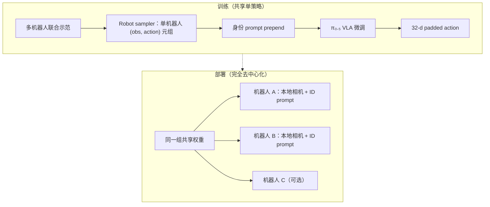

# CHORUS：单一 VLA 权重的去中心化多本体协作

**CHORUS**（*Decentralized Multi-Embodiment Collaboration with One VLA Policy*，[arXiv:2606.12352](https://arxiv.org/abs/2606.12352)，[项目页](https://chorus-model.github.io/)，CoRL 2026）由 **斯坦福大学** Ria Doshi、Tian Gao、Annie Chen、Chelsea Finn、Jeannette Bohg 提出：把 **一台预训练 VLA 骨干** 微调成 **整支异构移动操作团队的共享策略**——推理时各机 **独立副本**、只吃 **本机相机** 与 **机器人身份 prompt**，**不共享相机、本体状态或通信信道**，仍能在洗衣篮抬升、卷尺测量、图书交接等任务上形成反应式协作。

## 一句话定义

**多机协作不必在推理时拼全队观测或每机一策——共享 VLA 权重 + 身份 prompt + 本地视觉，足以让异构移动臂从部分可观测里「看见队友」并协调。**

## 英文缩写速查

| 缩写 | 英文全称 | 简要说明 |
|------|----------|----------|
| CHORUS | Decentralized Multi-Embodiment Collaboration with One VLA Policy | 本文框架简称 |
| VLA | Vision-Language-Action | 视觉–语言–动作策略 |
| π₀.₅ | pi0.5 | Physical Intelligence 开放世界 VLA 骨干；CHORUS 微调起点 |
| CTDE | Centralized Training, Decentralized Execution | 训练见全局、执行局部的 MARL 范式；与本文「训练亦共享单策略」不同 |
| DoF | Degree of Freedom | 各本体动作维不同；CHORUS 用 32 维 padded action 统一 |

## 为什么重要

- **打破集中式 VLA 的 scaling 诅咒：** 全队观测拼接使输入分布偏离预训练单机器人数据，项目页报告 CHORUS 在 **更少信息** 下仍 **优于集中式 VLA 均值成功率**。
- **打破 per-robot 去中心化的训练成本：** 单一权重覆盖 Kinova / ARX / YAM 等 **异构移动操作臂**，三机编队 **无需改架构** 即达 **90%** 任务成功率（项目页）。
- **协作来自表征而非通信：** 权重共享迫使策略在联合数据上隐式建模队友；队友扰动下反应性比 **无共享微调** 高约 **40 pp**，接近 **2×**（项目页消融）。
- **与 VLA 多本体迁移线互补：** 同用 π₀.₅ 族但问题不同——[Self-Demonstrated Control](./paper-self-supervised-control.md) 解决单机体适配遗忘；CHORUS 解决 **多机同时在线协作**。

## 核心信息

| 项 | 内容 |
|----|------|
| **机构** | 斯坦福大学（Stanford University） |
| **会议** | CoRL 2026 |
| **骨干** | 预训练 VLA **π₀.₅** |
| **平台** | Kinova、ARX、YAM 移动操作臂；二机与三机团队 |
| **推理假设** | 每机独立策略副本；**零机间通信**；异步执行 |
| **动作接口** | 32 维 padded action + 每步 **机器人身份 prompt** |
| **开源** | **截至 2026-09-13 未开源**（项目页无 GitHub / 权重） |

## 流程总览

## 核心原理

1. **Visuomotor 先验即协作先验：** 预训练 VLA 已在单机器人操控数据上学会物体与接触语义；多机数据中队友出现在视野内即可作为 **可观测状态**，减轻传统去中心化对 **显式对齐或通信** 的依赖。
2. **身份 prompt 作 embodiment 路由：** 异构动作空间与控制频率通过 **文本身份** + **动作 padding** 汇入同一头，避免 per-robot 策略集合。
3. **权重共享塑造队友模型：** 训练时同一网络见过各机视角的同一交互；无共享微调时易出现「各干各的」时序错位（如一方提前抬篮导致滑落）。
4. **相对集中式的分布优势：** 集中式 VLA 输入为全队观测拼接，**破坏** 与预训练单视角的语义对应；CHORUS 每步输入更接近预训练分布，利于保留泛化。
5. **团队规模友好：** 参数与上下文 **不随机器人数量增长**；支持异步各机执行。

## 源码运行时序图

**不适用** — 截至 **2026-09-13** 无官方仓库或可运行训练/部署入口。

## 实验与评测

| 维度 | 项目页要点 |
|------|------------|
| **vs 从零去中心化扩散** | 平均成功率 **+64 pp**；典型失败为队友时序不匹配（提前动作、卷尺配合失败） |
| **权重共享消融** | 队友扰动下恢复率 **+40 pp**；无共享时常出现 miss / runaway |
| **vs 集中式 VLA** | 条件信息更少，但 **均值成功率更高** |
| **三机扩展** | Kinova + YAM 三机搬篮 **90%**；无架构变更 |
| **任务族** | 洗衣篮对侧抬升、移动卷尺、图书交接、三机搬运；**4×** 加速视频展示 |

**读数边界：** 结果来自作者真机协议与项目页表格；独立复现前勿作硬基准。失败模式包括 **视觉遮挡队友**、**异构控制频率下的相位差**。

## 与其他工作对比

| 对照路线 | 差异 |
|----------|------|
| 集中式多机 VLA（全队观测拼接） | 理论上信息更全，但输入分布偏离预训练；CHORUS 项目页报告均值成功率反而更低 |
| Per-robot 去中心化策略 | 训练与部署成本随团队线性涨；CHORUS 单权重 + 身份 prompt |
| 从零训练去中心化扩散策略 | 无 VLA 先验，易出现队友时序错位；CHORUS **+64 pp**（项目页） |
| [CTDE vs 完全去中心化 MARL](../comparisons/ctde-vs-decentralized-marl.md) | MARL 范式强调训练期全局信号；CHORUS 是 **模仿学习式单策略微调**，非 RL CTDE |
| [Self-Demonstrated Control](./paper-self-supervised-control.md) | 同 π₀.₅ 族，但解决 **单机体微调遗忘**，非多机同时协作 |
| [人形多机协调](../concepts/humanoid-multi-robot-coordination.md) | 该页侧重足球/群控与通信预算；CHORUS 是 **移动操作臂 + VLA + 零通信** 的另一条协作线 |

## 结论

**CHORUS 表明：预训练 VLA 的 visuomotor 先验足以支撑异构移动臂的去中心化协作，关键是用共享权重与身份 prompt 把「队友」写进表征，而不是在推理时拼观测或开通信。**

1. **单策略多本体** — 32 维 padded action + 身份 prompt 可覆盖 Kinova / ARX / YAM 异构团队，三机无需改架构。
2. **零通信部署** — 协调完全依赖本地视觉看队友；适合带宽受限或隐私场景。
3. **共享权重 > 共享观测** — 集中式 VLA 未必更强；输入分布与预训练对齐是隐藏变量。
4. **先验战胜从零扩散** — 无 VLA 时去中心化扩散易出现时序错位；**+64 pp** 差距主要在「会不会等队友」。
5. **反应性可消融** — 去掉权重共享，队友扰动恢复率掉 **~40 pp**；协作不是偶然涌现。
6. **复现待代码** — CoRL 2026 可引用结论与任务设定；工程复现需跟踪官方仓库发布。

## 工程实践

| 项 | 建议 |
|----|------|
| 何时引用 | 异构 **移动操作臂** 团队协作、**去中心化 VLA**、推理期 **禁止通信** 的部署约束 |
| 数据收集 | 需多机联合 teleop 示范；robot sampler 按单机器人视角采样 |
| 骨干选型 | 论文用 **π₀.₅**；换骨干需验证 visuomotor 先验是否足够 |
| 与集中式选型 | 若算力允许全队传感融合且分布可对齐，集中式仍可能占优；CHORUS 赌 **预训练分布保留** |
| 开源跟进 | 盯 [项目页](https://chorus-model.github.io/) |

## 局限与风险

- **视觉依赖：** 队友不在视野即部分可观测恶化；无通信时无法主动请求同步。
- **任务覆盖：** 项目页任务以协调搬运/测量为主，未覆盖长视界导航或大规模编队。
- **确认未开源：** 截至入库日无法复现训练管线与超参；π₀.₅ 权重与多机数据协议未公开。
- **异构控制频率：** 移动基座与固定臂组合对 **异步执行** 仍敏感，需低层控制器兜底。

## 关联页面

- [VLA](../methods/vla.md)
- [π0 Policy](../methods/π0-policy.md)
- [Manipulation](../tasks/manipulation.md)
- [人形多机协调](../concepts/humanoid-multi-robot-coordination.md)
- [π₀.₅](./paper-pi05-open-world-vla.md)

## 参考来源

- [`chorus_arxiv_2606_12352.md`](../../sources/papers/chorus_arxiv_2606_12352.md)
- [`chorus-model.md`](../../sources/sites/chorus-model.md)
- [arXiv:2606.12352](https://arxiv.org/abs/2606.12352)

## 推荐继续阅读

- [CHORUS 项目页](https://chorus-model.github.io/)
- [原文 PDF](https://arxiv.org/pdf/2606.12352)
- [Hugging Face Papers 条目](https://huggingface.co/papers/2606.12352)
