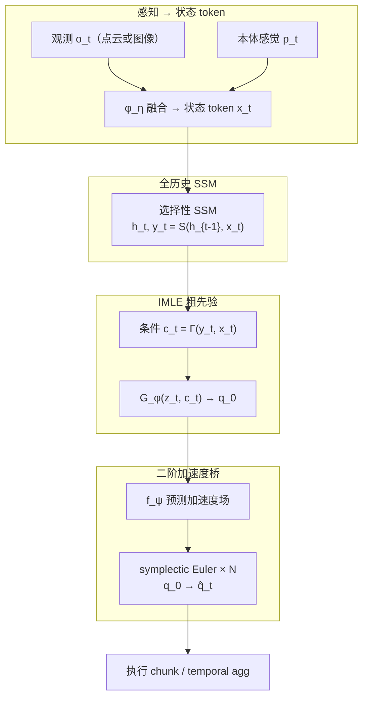
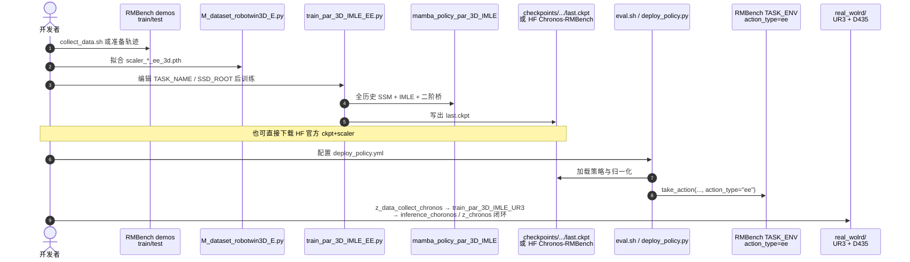

# Chronos（Physics-Informed Full-History Framework for Non-Markovian Long-Horizon Manipulation）

**Chronos**（arXiv:[2606.30318](https://arxiv.org/abs/2606.30318)，[项目页](https://chronos-manipulation.github.io/)，[代码](https://github.com/yulinzhouZYL/Chronos)，华中科技大学）提出面向 **记忆依赖长程操作** 的物理启发模仿学习框架：把 **观测历史升格为策略动力学的潜状态**，而非挂在 Markovian VLA 上的辅助上下文。每物理控制步融合观测与本体感觉为 **一个状态 token**，用 **选择性 SSM** 全轨迹因果传播；历史条件 **IMLE** 生成多模态粗动作先验，再经 **二阶 Schrödinger 启发加速度桥** 精炼。在 **16 项仿真 + 4 项真机** 上，RMBench 平均 **73.6%**（相对 π₀.₅ **+62.4 pt**、相对 Mem-0 **+22.8 pt**，参数约 **0.3B**），真机双臂平均 **78%**。

## 一句话定义

用 **一 token / 物理步的全历史 SSM** 承载任务相位，再用 **IMLE 粗先验 + 加速度场二阶桥** 生成平滑动作 chunk，专门解决观测别名下的非马尔可夫长程操作。

## 英文缩写速查

| 缩写 | 英文全称 | 简要说明 |
|------|----------|----------|
| Chronos | Physics-Informed Full-History Framework | 本文全历史 + 二阶桥操作策略框架 |
| SSM | State Space Model | 选择性状态空间模型（Mamba 式线性时间递推） |
| IMLE | Implicit Maximum Likelihood Estimation | 隐式最大似然，生成多模态粗动作先验 |
| SB | Schrödinger-inspired Bridge | 二阶 Schrödinger 启发加速度桥精炼模块 |
| VLA | Vision-Language-Action | 大规模视觉-语言-动作策略基线族 |
| RMBench | Memory-Dependent Robotic Manipulation Benchmark | 记忆依赖操作评测套件 |
| EE | End-Effector | 开源 RMBench 策略使用 16D 双臂末端位姿+夹爪动作 |

## 为什么重要

- **把「历史」写成状态，而不是上下文：** 观测别名时，放大 VLM 语义容量无法凭空恢复缺失相位；Chronos 让可用过去成为策略动力学的原生输入。
- **小模型打赢记忆 VLA：** 0.3B 在 RMBench 上超过 **>3.3B** 的 π₀.₅ 与 **>10B** 的 Mem-0，说明时间结构可替代部分参数缩放。
- **动作生成升到二阶：** 相对 diffusion score / flow velocity，加速度场经速度再积到位置，抑制接触接近与插入阶段的抖动；ALOHA 消融把日程边界条件也拆开验证。
- **可复现主线已开源：** RMBench 训推评测、真机 UR3 管线与 [HF ckpt](https://huggingface.co/yulinzhouZYL/Chronos-RMBench) 已发布（ALOHA / RoboTwin2.0 清理版仍 Coming soon）。

## 核心信息

| 项 | 内容 |
|----|------|
| **机构** | 华中科技大学（HUST）机械科学与工程学院 |
| **规模** | 约 **0.3B** 参数（相对 π₀.₅ **10×** 更少、相对 Mem-0 **30×+** 更少） |
| **仿真** | ALOHA 精密插入；RoboTwin 2.0 Easy（点云）；RMBench 7 任务（点云） |
| **真机** | 双 **UR3** + 单 **RealSense D435** RGB；冻结 ResNet18 + 可训 adapter |
| **开源** | **已开源（部分）**：MIT 仓 + HF RMBench ckpt；ALOHA / RoboTwin2.0 清理代码待发 |

## 流程总览

## 核心原理

### 方法栈

| 模块 | 机制 | 要点 |
|------|------|------|
| **状态 token** | $\bm{x}_t=\phi_\eta(o_t,p_t)$ | 序列长 = 轨迹物理长 $L$；空间 token 与时间轴解耦 |
| **因果记忆** | 选择性 SSM 发射历史上下文 $\bm{y}_t$ | 训练端到端时间信用分配；相对 MTIL 不做 detached hidden |
| **粗先验** | 历史条件 IMLE，$z\sim\mathcal{N}(0,I)$ | 保留多模态可行模式，供下游精炼 |
| **二阶桥** | Madelung + Kostin 启发加速度目标 | 立方参考路径 + **四次 bell** $\sigma(s)$（端点 $\sigma=\dot\sigma=0$） |
| **推理** | 时序相关 latent + 3–5 步积分 | 相关 $z_t$ 减轻逐步独立采样造成的先验跳变 |

### 损失与部署读法

- **训练：** $\mathcal{L}=\mathcal{L}_{\mathrm{IMLE}}+\lambda_{\mathrm{acc}}\mathcal{L}_{\mathrm{acc}}+\lambda_{\mathrm{bc}}\mathcal{L}_{\mathrm{BC}}$。
- **感知分块：** 高维骨干按 chunk $C$ 编码，再对全长 token 跑 SSM，降低 naive 全轨迹视觉反传显存。
- **基准感知差异：** ALOHA 用冻结 DINOv2+adapter；RoboTwin/RMBench 用可训 PointNet 式点云；真机因 D435 小物体深度噪改用单 RGB ResNet18。

## 源码运行时序图

官方仓 [yulinzhouZYL/Chronos](https://github.com/yulinzhouZYL/Chronos) 提供 RMBench 仿真与真机 UR3 两条可运行主线（归档见 [sources/repos/chronos.md](../../sources/repos/chronos.md)）：

- **最短仿真复现：** 装 RMBench 依赖 → scaler → 训练或 HF ckpt → `bash eval.sh <task> demo_clean Chronos …`（EE 控制，勿当 qpos replay）。
- **真机路径：** `real_wolrd/` 下采数 → `train_par_3D_IMLE_UR3.py` → `MyInferenceModel` 输出 pose10d 风格动作。

## 工程实践

| 项 | 建议 |
|----|------|
| 动作接口 | 官方 RMBench ckpt 为 **16D 双臂 EE+夹爪**；评测必须 `action_type="ee"` |
| scaler | 与 ckpt **同次训练** 配对；HF 已按任务提供 `scaler_*_ee_3d.pth` |
| 训练配置 | 当前脚本多用文件内常量（`TASK_NAME` / `SSD_ROOT`），非纯 CLI |
| 推理步数 | ALOHA 上 **N=3–5** 最优；更多步无额外收益 |
| temporal_agg | `deploy_policy.yml` 可开时序聚合平滑执行 |
| 真机目录 | 仓库拼写为 **`real_wolrd/`** |
| 基线环境 | π₀.₅ / Mem-0 等请跟 [RoboTwin-Platform/RMBench](https://github.com/RoboTwin-Platform/RMBench) |
| 开源边界 | ALOHA / RoboTwin2.0 **清理代码尚未发布** |

## 实验与评测

### ALOHA 双臂插入（动作头消融，同历史编码器）

| 配置 | 成功率 |
|------|--------|
| ACT / MTIL | 50% / 76% |
| Chronos + diffusion / flow | 66% / 72% |
| Chronos w/o SB（仅 IMLE） | 86% |
| Chronos + 一阶噪声日程 | 72% |
| **Chronos（IMLE + SB + 四次日程）** | **90%** |

### RoboTwin 2.0 Easy（8 任务平均）

| 方法 | 平均成功率 |
|------|------------|
| DP / ACT / RDT-1B | 35.1% / 30.6% / 35.8% |
| π₀ / DP3 | 48.8% / 59.5% |
| **Chronos (0.3B)** | **70.0%** |

作者将本基准读作 **一般操作 / 当前几何充分** 评测，而非记忆专项；唯一低于 DP3 的任务为 Put Bottles Dustbin。

### RMBench（记忆依赖，7 任务）

| 方法 | 平均成功率 |
|------|------------|
| DP / ACT | 5.8% / 7.4% |
| π₀.₅ / X-VLA | 11.2% / 11.1% |
| Mem-0 | 50.8% |
| **Chronos** | **73.6%** |

代表任务：Rearrange / Put Back / Swap Blocks / Cover Blocks 上 Chronos **96–99%**；Battery Try 全场偏低（接触脆性）；Press Button 仅 **2%**（缺 OCR + 数据覆盖）。

### 真机双臂（50 trials/任务）

| 任务 | 记忆依赖 | π₀.₅ | Chronos |
|------|----------|------|---------|
| Put Back Blocks | 是 | 0% | **98%** |
| Swap T | 否 | 28% | **96%** |
| Swap T-Mem | 是 | 0% | **98%** |
| Cover Blocks | 是 | 0% | **20%** |
| **全部 / 记忆子集** | — | **7% / 0%** | **78% / 72%** |

## 结论

**非马尔可夫长程操作的关键不是更大的 Markovian VLA，而是把全历史写成策略状态，并用二阶加速度结构把粗多模态先验收成可执行平滑运动；0.3B Chronos 在 RMBench 与真机记忆任务上对此给出强证据。**

1. **先问有没有观测别名** — 有则优先全历史 / 记忆机制；无则强几何 Markov 策略（如 DP3）仍可能够用。
2. **显式记忆模块 ≠ 端到端相位状态** — Mem-0 已大幅高于 π₀.₅，但仍落后 Chronos **22.8 pt**。
3. **动作头要对物理阶次** — 同编码器下 diffusion/flow 与一阶噪声日程明显掉点；看 ALOHA 表再选型。
4. **失败模式会换挡** — Chronos 残差多为几何/接触误差，而非「按错阶段 / 重复已完成动作」。
5. **感知接口会吃掉记忆收益** — 真机 Cover Blocks 的点云→单 RGB 切换是主要落差来源。
6. **复现从 RMBench+HF 起步** — EE ckpt 与 `eval.sh` 已齐；勿等 ALOHA/RoboTwin 清理版才开始验证记忆主线。

## 与其他工作对比

| 对照 | 差异读法 |
|------|----------|
| [π₀.₅ / VLA](../methods/vla.md) | 强语义、常当前帧/短窗；观测别名时相位欠定 |
| [Mem-0 / MemoryVLA](./paper-eventvla-visual-evidence-memory.md) | 显式锚点/滑动或稠密记忆挂到大 VLA；Chronos 把记忆内化进 SSM 状态 |
| [EventVLA](./paper-eventvla-visual-evidence-memory.md) / [KEMO](./paper-kemo-event-driven-keyframe-memory-vla.md) | **稀疏关键帧视觉证据** 注入现成 VLA；Chronos 是 **紧凑专用策略** + 全历史递推 |
| [FM-VLA](./paper-fm-vla.md) | 进度写在 **接触力** 上时用 Force-VAE；Chronos 主打视觉/几何历史相位 |
| [Diffusion Policy](../methods/diffusion-policy.md) / flow | 一阶 score/velocity 生成；Chronos 用加速度场 + 端点速度为零的日程 |
| MTIL | 同族全历史 SSM 思路；Chronos 强调非 detached 训练 + IMLE/SB 动作头 |

## 局限与风险

- **Press Button / Battery Try** 仍接近全场失败：缺专用 OCR、接触插入脆性，不全是记忆问题。
- **真机 Cover Blocks 仅 20%**：作者归因为 ResNet18 平移容忍特征弱化遮挡后颜色–位置绑定，而非 SSM 失效。
- **基线多为 Reported**：大 VLA 未在同一随机种子/编码器下全量重训；读表作基准级对照。
- **开源部分缺口：** ALOHA 与 RoboTwin 2.0 **清理代码 Coming soon**；跨基准一键复现尚不完整。
- **非通用开放词汇 VLA：** 面向示教模仿与记忆基准，不声称 web-scale 语义泛化。

## 关联页面

- 任务：[Manipulation](../tasks/manipulation.md)、[Bimanual Manipulation](../tasks/bimanual-manipulation.md)
- 方法谱系：[VLA](../methods/vla.md)、[Imitation Learning](../methods/imitation-learning.md)、[Action Chunking](../methods/action-chunking.md)、[Diffusion Policy](../methods/diffusion-policy.md)
- 平台 / 基准：[RoboTwin](./robotwin.md) — RoboTwin 2.0 与 RMBench 语境
- 相邻记忆路线：[EventVLA](./paper-eventvla-visual-evidence-memory.md)、[KEMO](./paper-kemo-event-driven-keyframe-memory-vla.md)、[FM-VLA](./paper-fm-vla.md)

## 参考来源

- [chronos_arxiv_2606_30318.md](../../sources/papers/chronos_arxiv_2606_30318.md)
- [chronos-manipulation-github-io.md](../../sources/sites/chronos-manipulation-github-io.md)
- [chronos.md](../../sources/repos/chronos.md)

## 推荐继续阅读

- Zhou et al., *Chronos: A Physics-Informed Full-History Framework for Non-Markovian Long-Horizon Manipulation* — <https://arxiv.org/abs/2606.30318>
- [Chronos 项目页](https://chronos-manipulation.github.io/) — 方法动画、ALOHA/真机对比视频
- [yulinzhouZYL/Chronos](https://github.com/yulinzhouZYL/Chronos) — 代码与复现说明
- [Chronos-RMBench（Hugging Face）](https://huggingface.co/yulinzhouZYL/Chronos-RMBench) — 官方仿真 checkpoint
- Chen et al., *RMBench* — <https://arxiv.org/abs/2603.01229>
- Zhou et al., *MTIL*（全历史 Mamba 模仿前作）— 见论文引用 [70]
