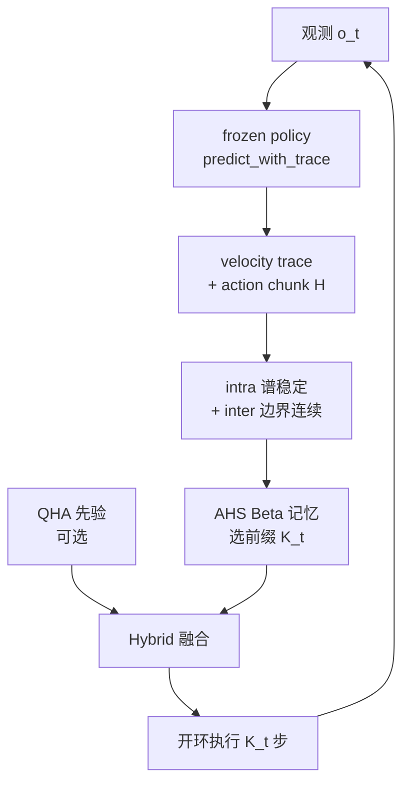
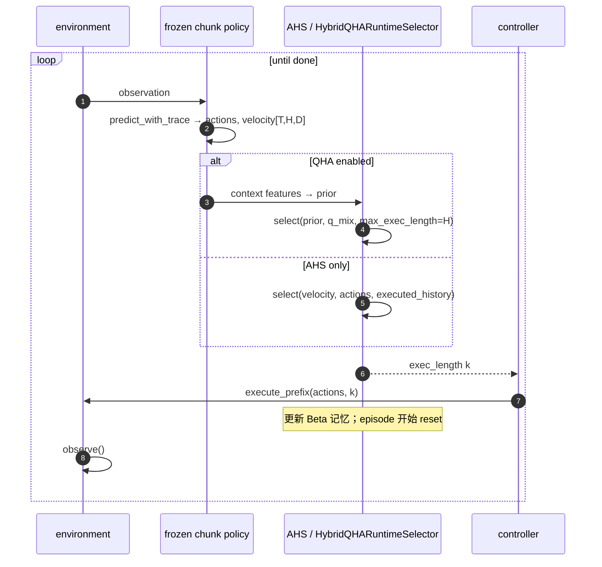

# ChunkTrust（arXiv:2609.39754）

**ChunkTrust: Adapting Execution Horizons for Robot Policies with Action-Expert Evidence**（[arXiv:2609.39754](https://arxiv.org/abs/2609.39754)，[项目页](https://hf618.github.io/ChunkTrust.github.io/)）由 **清华大学**、**北京智源人工智能研究院（BAAI）**、**中国人民大学** 等联合提出：把 **execution horizon** 从固定超参变为 **由 action-expert 内部证据推断的隐变量**，在 **不改 base policy 权重** 的前提下自适应「何时再观测」。

## 一句话定义

**别用固定 K 开环跑 chunk**——读去噪轨迹的速度谱是否稳定、预测前缀是否与已执行运动连续，再叠 episode-local Beta 记忆（与可选 QHA 先验），在接触段缩短 horizon、在稳定运输段拉长 horizon。

## 英文缩写速查

| 缩写 | 英文全称 | 简要说明 |
|------|----------|----------|
| VLA | Vision-Language-Action | 视觉–语言–动作基础策略 |
| WAM | World-Action Model | 世界–动作联合生成策略（如 Fast-WAM） |
| AHS | Action-aware Horizon Selector | 训练-free 在线 horizon 选择器 |
| QHA | Query-based Horizon Adapter | 从冻结特征学习 horizon 先验的轻量头 |
| RH | Receding Horizon | 只执行 chunk 前缀再 replan 的滚动协议 |
| FFT | Fast Fourier Transform | 沿 action horizon 轴分析 velocity 谱 |

## 为什么重要

- **与固定 horizon 的系统性错配：** [Action Chunking](../methods/action-chunking.md) 与 [滚动预测执行](../concepts/receding-horizon-policy-execution.md) 都承认 \(K_t \le H\)，但 VLA/WAM 部署常 **固定 K**；同一 episode 内 grasp / handover / place 对反馈频率需求不同。
- **证据来自 action expert 本身：** 相对 attention / entropy 单信号方法，ChunkTrust **配对**（i）chunk 内 **去噪速度 prefix 的高频谱漂移** 与（ii）**executed history 与候选前缀边界** 的速度连续性——失败 rollout 上双信号同时升高时失败率极高（项目页 / 论文 Fig.2）。
- **训练-free 与可学习先验分层：** **AHS** 零训练、作 evaluation wrapper；**QHA** 只训小 head，摊销跨 episode 的 horizon 偏好，并与在线 Beta 记忆 **一次融合**，避免「双重 posterior 更新」。
- **跨 policy family 验证：** π0 / π0.5、Fast-WAM、GR00T N1.5/N1.6、Qwen3GR00T 等在 RoboTwin 2.0 与 RoboCasa GR1 Tabletop 上 **每个评测配置的任务平均成功率均提升**；真机四任务 process score **+7.1 pp**。

## 核心信息

| 项 | 内容 |
|----|------|
| **机构** | 清华大学；北京智源人工智能研究院（BAAI）；中国人民大学；深圳技术大学；合肥工业大学；江南大学；重庆大学；香港中文大学 |
| **arXiv** | [2609.39754](https://arxiv.org/abs/2609.39754) |
| **项目页** | <https://hf618.github.io/ChunkTrust.github.io/> |
| **代码** | [hf618/ChunkTrust](https://github.com/hf618/ChunkTrust)（MIT） |
| **QHA 权重** | [Niugan/ChunkTrust](https://huggingface.co/Niugan/ChunkTrust) |
| **开源** | **已开源**（AHS 库 + 集成文档 + QHA checkpoint）；base VLA 权重走各 benchmark 原分发 |
| **主 backbone** | [π0.5](./paper-pi05-open-world-vla.md)、π0、Fast-WAM、GR00T 系列、Qwen3GR00T 等（冻结） |

## 核心原理

### 双证据（每个 replan 候选前缀 \(k\)）

1. **Intra-chunk spectral stability：** 记录 flow/denoising 各步的 velocity prefix；沿 **action horizon 维** FFT，跟踪高频能量比例在采样步间的波动 → 生成过程不稳定时缩短可信前缀。
2. **Inter-chunk motion continuity：** 将候选 \(k\) 步前缀与 **已执行 history** 拼接，度量边界附近动作速度变化 → 与当前轨迹不连续时倾向更早 replan。
3. **Phase-aware memory：** 证据经归一化后写入 **horizon-indexed Beta 状态**，带 **kernel forgetting**，episode 内积累阶段偏好、episode 间 reset。

### QHA（可选）

- 输入：冻结 policy 的 **context tokens** 与 **action-expert latents**。
- 输出：与 AHS 候选基 **一致** 的 dense horizon 先验；部署经 `HybridQHARuntimeSelector` 与当前 `q_mix` **单次** 决策并更新记忆（见仓库 `docs/integration.md`）。

### 流程总览

## 源码运行时序图

对齐 [ChunkTrust integration 文档](https://github.com/hf618/ChunkTrust/blob/main/docs/integration.md) 与 `examples/quickstart.py` 的同步接口：

图下说明：真实异步控制器可在终止或错误时 **提前停止** 于 \(k\)；未执行步 **不得** 写入 executed history。QHA 部署须与 checkpoint 的 **candidate basis** 严格对齐。

## 实验与评测

### 仿真（项目页 Table 1 要点）

| 设置 | Base → ChunkTrust | 方法 |
|------|-------------------|------|
| RoboTwin 2.0，π0.5，50 tasks | 56.70% → **63.50%** | AHS |
| RoboTwin 2.0，π0.5，8 tasks | 29.63% → **39.06%** | AHS+QHA |
| RoboCasa GR1，Qwen3GR00T，24 tasks | 47.83% → **57.50%** | AHS |
| 多 backbone（π0、Fast-WAM、GR00T 等） | 各配置 task-average SR **均上升** | 主要为 AHS |

### 真机（AgileX COBOT Magic，π0.5）

- 四家务任务（fold towels、bread to plate、drink to basket、duck to drawer）；clean / randomized 布局。
- Equal-task mean **normalized process score**：50.4% → **57.5%**（AHS）。
- 可视化：grasp / handover 附近 **K 缩短**，稳定运输段 **K 拉长**。

## 与其他工作对比

| 维度 | ChunkTrust | 邻近读法 |
|------|------------|----------|
| **信号** | 速度谱（intra）+ 边界速度（inter） | [AutoHorizon](./paper-autohorizon.md) 用 **action self-attention** |
| **训练** | AHS **零训练**；QHA 只训小 head | DEHP / BCP 等 RL 训 horizon head |
| **是否改动作** | **否**（只选前缀） | VLA-Corrector 等可改执行动作 |
| **减 policy call** | 稳定段 **拉长** K（可能减 call） | [Action Upcycling](./paper-action-upcycling.md) **复用 tail** 减 call |
| **上下文** | 不改 \(T_o\) | [Revisiting Open-Loop](./paper-revisiting-open-loop-action-chunking.md) 加长观测窗 |

## 工程实践

| 项 | 说明 |
|----|------|
| **安装** | `conda env create -f environment.yml`；`pip install -e .` |
| **Smoke** | `python examples/quickstart.py`；`pytest -q` |
| **对接自有 VLA** | 实现 `predict_with_trace` 返回 `[T,H,D]` velocity + `[H,D]` actions；坐标系与 normalizer 与训练一致（`docs/integration.md`） |
| **QHA 权重** | `python scripts/download_asset.py qha_pi05_8task_step5000 --destination ...` |
| **开源状态** | **已开源** — 见 [chunktrust.md](../../sources/repos/chunktrust.md) 与 [Niugan/ChunkTrust](https://huggingface.co/Niugan/ChunkTrust) |
| **复现状态** | 官方 HF 模型卡记录了已发布结果与稿件之间两处尚未解决的差异，并明确说明没有重新跑完整 benchmark；复现时应核对仓库 manifests、episode outcomes 和对应策略版本。QHA head 必须搭配匹配的冻结 base policy。 |

## 局限与风险

- **需要 generation trace：** 仅 final chunk、无逐步 velocity 的 API **无法直接接 AHS**；需改 inference 钩子记录 flow 中间量。
- **Flow / denoising 假设：** 论文叙事与实验围绕 **action expert 去噪轨迹**；离散 FAST token 或单步回归策略需单独验证证据定义。
- **QHA 候选基绑定：** checkpoint 与 `candidate_horizons` 配置不匹配会导致 silent 次优或无效先验。
- **Base 权重外部依赖：** RoboTwin / RoboCasa / OpenPI 等环境搭建成本仍由 benchmark 决定，非「单 pip 端到端权重」。
- **结果复现边界：** 官方 HF 模型卡披露结果记录与稿件之间有两处尚未解决的差异，且未声称对完整 benchmark 做过新一轮重跑；引用论文结果时应保留这一限定。

## 结论

**ChunkTrust 把 execution horizon 变成 action-expert 可观测量的在线推断问题，AHS 作零训练 wrapper 即带来跨仿真与真机的一致增益，QHA 进一步摊销阶段偏好而不动 base VLA。**

1. **优先试 AHS：** 若已用固定 K 跑 π0.5 / GR00T 等 chunk policy，先包一层 **trace + AHS**，再扫 K 网格。
2. **双信号缺一不可：** 消融表明 intra / inter 与 Beta 记忆分别贡献；仅模仿单指标 heuristic 可能复现不了 Table 1 幅度。
3. **QHA 按协议选 checkpoint：** 8-task augmentation vs 6+2 held-out 对应不同 RoboTwin 评测；勿混用 candidate 表。
4. **与 AutoHorizon 正交选型：** attention-native vs **velocity-spectrum + continuity**；可并列作 flow VLA replan 层 baseline。
5. **真机读 process score：** 成功率之外，论文强调 **阶段对齐的 horizon 曲线**——部署调试可看 grasp 段 K 是否系统性缩短。
6. **集成防坑：** 同一 episode 一个 hybrid selector；**禁止** 先更新 AHS posterior 再把采样分数喂给第二个 posterior（仓库 integration 明确警告）。
7. **权重缓存：** 内网部署时一并镜像 **Niugan/ChunkTrust** QHA 与所用 base checkpoint。

## 关联页面

- [滚动预测执行](../concepts/receding-horizon-policy-execution.md)
- [Action Chunking](../methods/action-chunking.md)
- [VLA](../methods/vla.md)
- [AutoHorizon](./paper-autohorizon.md)
- [RoboTwin 2.0](./robotwin.md)
- [VLA 部署指南](../queries/vla-deployment-guide.md)

## 参考来源

- [chunktrust_arxiv_2609_39754.md](../../sources/papers/chunktrust_arxiv_2609_39754.md)
- [chunktrust-project.md](../../sources/sites/chunktrust-project.md)
- [chunktrust.md](../../sources/repos/chunktrust.md)
- [arXiv:2609.39754](https://arxiv.org/abs/2609.39754)
- [ChunkTrust Hugging Face 模型卡（权重与复现状态）](https://huggingface.co/Niugan/ChunkTrust)

## 推荐继续阅读

- [ChunkTrust 项目页](https://hf618.github.io/ChunkTrust.github.io/)
- [GitHub: hf618/ChunkTrust](https://github.com/hf618/ChunkTrust)
- [AutoHorizon 项目页](https://hatchetproject.github.io/autohorizon/)
