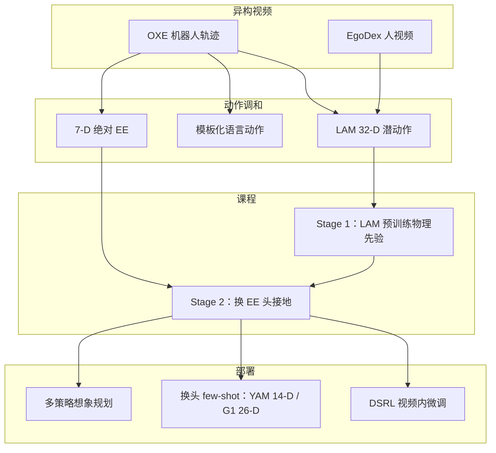
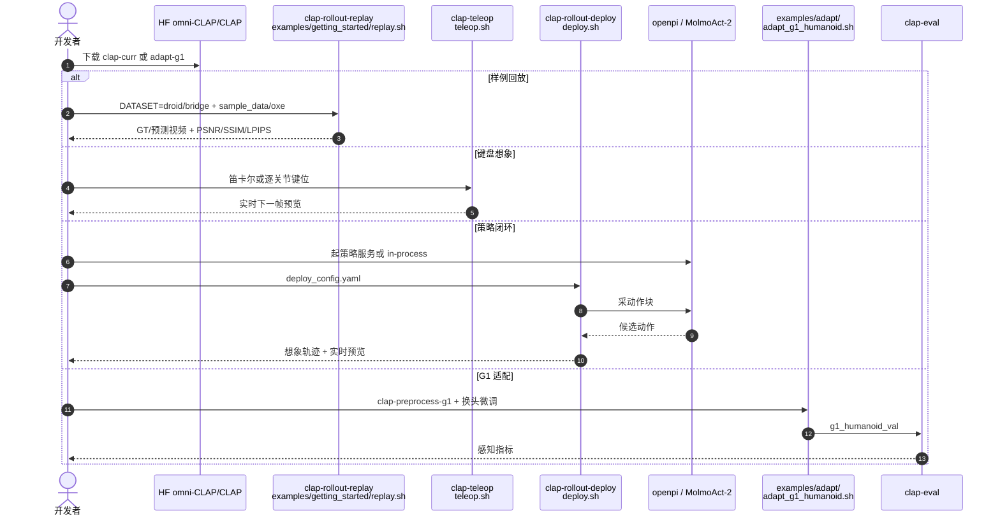

# CLAP：跨本体视频世界模型当零样本物理模拟器

**CLAP**（*Cross-Embodiment Video World Models are Zero-Shot Physical Simulators*，[arXiv:2608.27406](https://arxiv.org/abs/2608.27406)，[项目页](https://omni-clap.github.io/)，[代码](https://github.com/omni-CLAP/clap)）由 **普林斯顿大学（Princeton）IRoM** 提出：用 **末端位姿 / 语言 / 潜动作** 调和人与机器人视频，再以 **LAM→EE 课程** 得到可直接部署的跨本体动作条件世界模型，并 few-shot 适配双臂 YAM 与 **Unitree G1**。

> 名称易与音频–文本 **CLAP**（Contrastive Language-Audio Pretraining）及足球定位模块撞名；本页专指 **omni-CLAP 视频世界模型**。

## 一句话定义

**先从无标签视频学潜动作物理先验，再换成 7-D 末端条件做零样本规划；新本体只换动作头、保留视频骨干。**

## 英文缩写速查

| 缩写 | 英文全称 | 简要说明 |
|------|----------|----------|
| CLAP | Cross-embodiment Learning for Action-conditioned Prediction | 本文跨本体视频 WM 框架（仓库/项目名） |
| EE | End-Effector | 7-D 笛卡尔位姿 + 夹爪；跨本体默认条件 |
| LAM | Latent Action Model | 32-D 连续潜动作，从帧对自监督 |
| OXE | Open X-Embodiment | 跨本体机器人视频主数据 |
| SVD | Stable Video Diffusion | 视频 U-Net 骨干 |
| DSRL | Diffusion Steering via Reinforcement Learning | 在视频 WM 里微调扩散策略 |

## 为什么重要

- **跨本体不是「把数据拼起来」：** 关节维数不同、人视频无标签。CLAP 把统一表示拆成 EE / 语言 / 潜动作，再用课程克服各自短板。
- **对照 Ctrl-World：** 同属 SVD 动作条件视频 WM，但 Ctrl-World 锁 DROID 单本体；CLAP 用更少域内样本在 DROID 上接近或超过 Ctrl-World，再用后训练全面超过该单本体基线。
- **可复现栈：** MIT 许可仓 + HF 全套检查点，含 **`adapt-g1`（26-D）**；推理 **<12 GB**，消费级卡可回放。
- **用途是沙盒，不是像素策略：** 推理时规划与视频内 RL，用来抬 \(\pi_{0.5}\) / MolmoAct-2，而不是替代 VLA。

## 核心信息

| 项 | 内容 |
|----|------|
| **机构** | 普林斯顿大学（Princeton IRoM） |
| **数据** | OXE（DROID 采样权重 75%）+ EgoDex（LAM / 课程） |
| **骨干** | SVD 时空 U-Net；历史 6 / 未来 5 帧；多视角竖向拼接 576×320 |
| **训练** | 100K step，batch 64，约 8×H100/H200、2–3 天 |
| **开源** | **已开源** MIT：[omni-CLAP/clap](https://github.com/omni-CLAP/clap)；权重 [omni-CLAP/CLAP](https://huggingface.co/omni-CLAP/CLAP) |

## 核心原理（方法）

| 变体 | 条件 | 长处 | 短板 |
|------|------|------|------|
| CLAP-EE | 绝对 7-D EE，按本体归一化到 \([-1,1]\) | 连续精度、可零样本上真机 | 必须有动作标签 |
| CLAP-LANG | 相对 EE 写成 `x=, y=, ...` 文本 + CLIP | 接口简单、保预训练语义 | 离散化损精度，长程易累积误差 |
| CLAP-LAM | 32-D 潜动作（帧对 VAE） | 能吃无标签人视频 | 部署要对齐几何动作 |
| CLAP-CURR | 先 LAM 再换 EE 头联合微调 | 缩放 + 零错配部署 | 两阶段训练 |

相对动作在 **EE 条件** 上更差（DROID LPIPS 约差 14.6%，长程累积误差），在 **语言条件** 上更好（离散 token 更吃得下窄区间）。人视频不能替代多本体机器人数据：DreamDojo-Human 在 DROID 上 LPIPS 至少差 **61%**。

### 流程总览

## 源码运行时序图

节点对齐 [`sources/repos/omni-clap.md`](../../sources/repos/omni-clap.md) 与 README CLI。

- **最短复现：** `uv pip install -e .` → `replay.sh`（仓内 `sample_data/oxe/`，无需全量 OXE）。
- **默认权重：** `clap-curr`（LAM→EE 课程）；新本体适配从它换头。
- **显存：** 仅 CLAP 约 9.7 GB；in-process openpi 峰值约 24–26 GB。稳态 `predict_chunk` 在 H200 约 **1.49 s**（11 帧 / 25 步；论文默认采样 50 步）。

## 工程实践

| 项 | 建议 |
|----|------|
| 选型 | 要跨本体先验 + 开源权重 → `clap-curr`；只要 DROID 闭环 → 先比 [Ctrl-World](./paper-ctrl-world.md) |
| 条件 | 部署用 **绝对 EE**；语言条件只适合短程可视化 |
| 规划 | 多策略各采少量块，用 VLM 打分首末帧；单策略加噪覆盖差 |
| 双臂零样本 | 按动作块幅值选臂；精细双臂应走 `adapt-yam` |
| G1 | 用 `adapt-g1` + `clap-preprocess-g1`，不要把 7-D EE 头硬接到 26-D 关节 |
| 幻觉 | 规划仍会被错误未来帧带偏；作者把不确定性量化列为后续 |

## 实验与评测

- **跨 vs 单本体：** 同容量、同 100K step、更少 DROID 样本，CLAP 在 DROID 接近或超过 Ctrl-World；Bridge 略低于新训 Bridge-Base，定性差距小。
- **后训练：** 从跨本体 ckpt 微调到 DROID/Bridge，几乎所有感知指标超过从零 / 从 SVD·WAN 训的单本体。
- **零样本规划：** Franka（DROID 配置）五任务上匹配或超过 \(\pi_{0.5}\) 与 MolmoAct-2 基线；磁带 / 龙虾等语义脆弱任务靠「选对策略」补。
- **视频内 RL：** DSRL 胡萝卜入碗 **80%→88%**，叠毛巾不掉点。
- **新本体：** `adapt-yam` / `adapt-g1` 在各自数据上给出高保真未来帧；YAM 运动更慢、分数更高，G1 视觉更难。

## 结论

**CLAP 的可迁移主张是「跨本体视频先验 + 课程接地」，不是又一个单机 DROID 生成器；开源权重让 G1 / 双臂适配从换头开始，而不是从 SVD 重训。**

1. **部署条件用绝对 EE** — 相对 EE 在跨本体连续控制上更易漂；语言条件留给短程。
2. **课程比单独 LAM 或 EE 更可上真机** — LAM 能缩放，EE 能零错配；对齐层会伤保真。
3. **人视频不能替代机器人多本体数据** — 先验有用，迁移仍要机器人轨迹。
4. **规划增益来自多策略提案** — WM 负责在语义脆弱任务上选更一致的块，不负责单独变成 SOTA VLA。
5. **新本体只换动作头** — YAM 14-D、G1 26-D；骨干先验保留。
6. **推理是秒级视频块** — 适合离线/准在线规划，不适合 30 Hz 控制环。

## 与其他工作对比

| 对照 | 差异读法 |
|------|----------|
| [Ctrl-World](./paper-ctrl-world.md) | 同 SVD、帧级动作、多视角；Ctrl-World 锁 DROID + 合成 SFT；CLAP 加跨本体课程与开源多 ckpt |
| [CurrentWorld-0](./current-robotics-currentworld.md) | 产业跨本体交互模拟器，**不统一**低层动作、含力触觉；**确认未开源** |
| [ForeTime-VLA](./paper-foretime-vla.md) | WAM 未来码蒸馏进 \(\pi_{0.5}\)；CLAP 把 WM 留在推理环当模拟器 |
| LAPA / Genie | 潜动作统一异构空间；CLAP 用课程避免部署再对齐 |

## 局限与风险

- **视频幻觉** — 接触、遮挡、长程语义仍会编造；规划被错误高分轨迹选中。
- **训练偏单臂** — 双臂 / 人形主要靠适配，不是主混合的一等公民。
- **墙钟** — 25 步约 1.5–3.2 s/块；演示脚本还常把步数降到 25（论文默认 50）。
- **项目页 BibTeX 未定稿** — 引用用 arXiv:2608.27406，不要复制页上的 Coming soon。

## 关联页面

- [Generative World Models](../methods/generative-world-models.md) — 视频 WM 方法谱系
- [Ctrl-World](./paper-ctrl-world.md) — 单本体多视角闭环对照
- [虚拟沙盒路线](../overview/world-models-route-03-virtual-sandbox.md) — 想象规划 / RL 微调
- [Video-as-Simulation](../concepts/video-as-simulation.md) — 视频即仿真
- [\(\pi_{0.5}\)](./paper-pi05-open-world-vla.md) — 被规划 / 对比的 VLA
- [VLA](../methods/vla.md) — 策略侧接口

## 参考来源

- [clap_arxiv_2608_27406.md](../../sources/papers/clap_arxiv_2608_27406.md) — 论文摘录
- [omni-clap.md](../../sources/repos/omni-clap.md) — 仓库入口
- [omni-clap-github-io.md](../../sources/sites/omni-clap-github-io.md) — 项目页核查
- [wechat_embodied_station_clap_9_papers_open_source_2026-08-31](../../sources/blogs/wechat_embodied_station_clap_9_papers_open_source_2026-08-31.md) — 九篇盘点 ingest

## 推荐继续阅读

- 论文 — <https://arxiv.org/abs/2608.27406>
- 项目页 — <https://omni-clap.github.io/>
- 代码 — <https://github.com/omni-CLAP/clap>
- 权重（含 `adapt-g1`）— <https://huggingface.co/omni-CLAP/CLAP>
