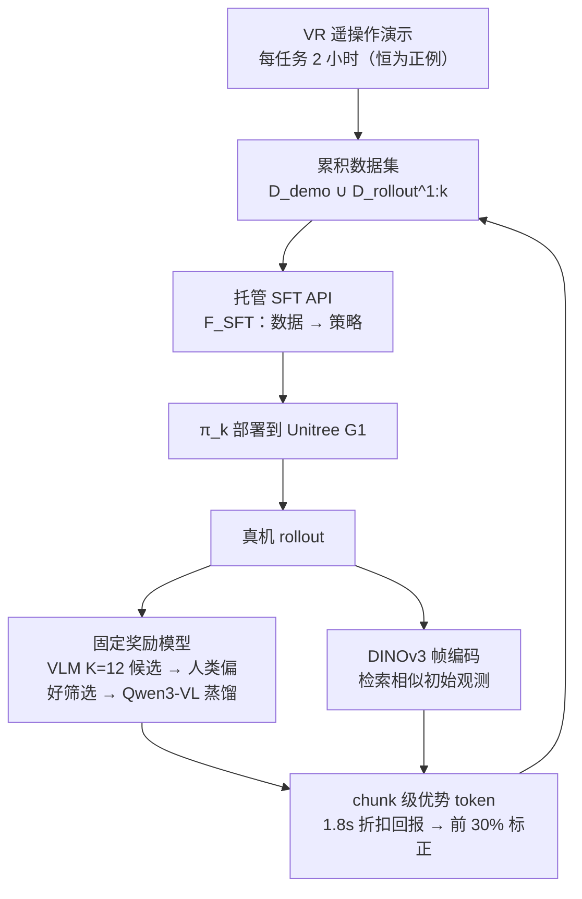

# CLIFT：不打开模型盒子的闭环迭代微调

**CLIFT**（*Closed-Loop Iterative Fine-Tuning*；论文 *CLIFT: Turning Gemini Robotics On-Device into Humanoid Specialists via Non-Invasive Closed-Loop Iterative Fine-Tuning*，[arXiv:2607.29172](https://arxiv.org/abs/2607.29172)，[项目页](https://thomaschen98.github.io/clift)）由 **UC Berkeley / Google DeepMind / NVIDIA Research** 提出：在只暴露**托管 SFT API** 的闭权重机器人基础模型上，做出等效于闭环改进的效果。

## 一句话定义

**当你只能"交数据、拿策略"、拿不到权重梯度 loss 时，把部署期的奖励信号编码进训练数据本身（chunk 级优势 token），让纯模仿的 API 也能跑出自改进飞轮。**

## 英文缩写速查

| 缩写 | 英文全称 | 简要说明 |
|------|----------|----------|
| CLIFT | Closed-Loop Iterative Fine-Tuning | 本文方法：API 兼容的闭环飞轮 |
| GROD | Gemini Robotics On-Device | 被适配的闭权重基础 VLA，仅经托管 API 访问 |
| SFT | Supervised Fine-Tuning | 托管 API 唯一开放的训练形式 |
| VLA | Vision-Language-Action | 视觉-语言-动作策略族 |
| VLM | Vision-Language Model | 用于生成候选奖励序列并蒸馏为奖励模型 |
| FiLM | Feature-wise Linear Modulation | 侵入式条件注入基线所用的架构手段 |

## 为什么重要

- **它给「新的访问层」建了模。** 托管 SFT API 是介于闭源与开放权重之间的中间态（GROD、Physical Intelligence partner API 都是这个形态）；它让你用得上强模型，代价是**只能纯模仿**——RL 和任何依赖内部训练信号的闭环方法都被排除。
- **这个限制对人形操作尤其致命。** 敏捷、接触丰富的双臂任务里，策略输出与实际部署行为差距大（新状态、动作跟踪动力学、时延、控制器特有失败模式），演示数据补不上这段。
- **技术核心是一句话：把优势信号搬到输入侧。** 不改 loss、不动架构，用一个二值 token 表示「这个 chunk 在相似状态里算不算好」——这就绕开了 API 的全部限制。
- **它给出一个反直觉但重要的结论：** 受限 API 下的强模型（GROD）**胜过**对较弱开放权重模型（π₀.₅）做侵入式适配。选型时「访问权限自由度」和「基础模型强度」要一起权衡，不能只挑能改的。

## 核心信息

| 项 | 内容 |
|----|------|
| **机构** | 加州大学伯克利分校（UC Berkeley）、谷歌 DeepMind（Google DeepMind）、英伟达（NVIDIA Research） |
| **被适配模型** | **GROD**（Gemini Robotics On-Device），Gemma 主干，闭权重，仅托管 SFT API |
| **机器人** | Unitree G1 人形，双灵巧臂 + 多指手，头部两路 RGB |
| **控制分层** | 上半身（臂 / 手关节角）+ 下半身（平面速度 + 偏航），由 RL 学到的全身控制器跟踪 |
| **数据** | 全身 VR 遥操作，每任务 **2 小时**演示 |
| **任务** | Box Packing / Cup Insertion / Bimanual Plate Handover（均接触丰富、需全身平衡） |
| **开源** | **宣称将开源**：项目页列出 Code 条目但**截至 2026-08-04 无可用链接**，论文标 `coming_soon` |

## 核心原理

### 托管 SFT API 是什么约束

形式化为黑箱算子 \(\mathcal F_{SFT}\)：训练数据集 → 微调后的策略。**不暴露**权重、梯度、loss、动作 likelihood。因此：

- 能做的：换数据、换标注、换配比。
- 不能做的：策略梯度、值函数、KL 正则、任何要读内部量的东西。

CLIFT 的设计目标就是**把闭环信号压进「数据」这一个可控自由度里**。

### 三个组件

**1）偏好校准的稠密奖励模型（select-then-distill）**

两个朴素做法都不行：VLM 零样本打分可扩展但**标定差**；逐步人工标注**太贵**。CLIFT 的折中：

1. 对每个 rollout **对**，提示 VLM 生成 **K=12** 条候选逐步奖励序列；
2. 只保留**诱导排序与人类成对偏好一致**的候选（用 100 组人工比较校准）；
3. 把保留的候选**蒸馏**成一个可复用的生成式奖励模型（基于 Qwen3-VL）。

该奖励模型**训练一次后固定**，不随飞轮更新。

**2）基于检索的优势条件（retrieval-based advantage conditioning）**

给每个 action chunk 一个**二值 token**（正 / 负），含义是「它的回报是否高于**视觉相似状态下**的同侪 chunk」：

1. 冻结 **DINOv3** 编码全部帧；
2. 对查询 chunk，检索初始观测余弦相似度 > \(\delta\) 的 chunk 组成比较集；
3. 用奖励模型在 **1.8 秒前瞻窗口**内算折扣回报；
4. 回报落在比较集**前 30%** 则标正。

关键性质：**门槛随状态难度自适应**——难状态里表现「还行」的 chunk 也能被标正，从而**从失败 episode 里回收可用片段**。

**3）迭代飞轮**

第 k 轮：部署 \(\pi_k\) → 收 rollout → 打分与优势标注 → 并入累积数据集 \(\mathcal D_k=\mathcal D_{demo}\cup\mathcal D^{1:k}_{rollout}\) → 提交托管 API 得 \(\pi_{k+1}\)。**演示数据始终标正。**

### 流程总览

## 源码运行时序图

**不适用。** 项目页列出 Code 条目但截至入库日（2026-08-04）**无可用链接**，论文标 `coming_soon`，无可辨识的训练 / 推理 / 部署入口可对齐。

更重要的是：即使代码发布，复现的真实门槛也**不在代码**——需要 **GROD 托管微调 API 的访问权**、**Unitree G1 真机**与**全身 VR 遥操作栈**，其中第一项对社区基本不可得。归档见 [sources/sites/thomaschen98-clift.md](../../sources/sites/thomaschen98-clift.md)。

## 工程实践

| 项 | 建议 |
|----|------|
| 何时考虑这条路 | 你的最优策略来自**闭权重 API**，且演示数据训完仍够不到部署级掌握 |
| 奖励模型别裸用 VLM | 零样本 VLM 打分标定差；用 select-then-distill：K=12 候选 + ~100 组人工成对偏好筛选，再蒸馏成固定模型 |
| 标注粒度选 chunk 不选 episode | episode 级筛选在最难任务上落后约 12 pp（~84% vs 96%）；chunk 级能从失败 rollout 里回收好片段 |
| 优势门槛要自适应 | 用「视觉相似状态的同侪集前 30%」而非全局阈值，否则难状态里全是负例 |
| 演示数据怎么标 | **恒为正例**，并保留在每一轮累积数据集里 |
| 飞轮几轮够 | 论文两轮即接近饱和（100% / 98% / 96%）；每轮都要真机 rollout，成本与安全是主约束 |
| 选型顺序 | 先比**基础模型强度**再比访问自由度——GROD 走受限 API 仍胜过 π₀.₅ 的侵入式 FiLM 适配 |

## 实验与评测

| 方法 | Box Packing | Cup Insertion | Bimanual Plate Handover |
|------|------------|---------------|-------------------------|
| **GROD + CLIFT（稠密优势条件）** | 93% → **100%** | 70% → **98%** | 53% → **96%** |
| GROD + 高回报 episode 筛选 | ~93% → ~98% | ~68% → ~94% | ~53% → ~84% |
| π₀.₅ + CLIFT（同一管线） | 59% → 76% | 50% → 56% | 5% → 30% |
| π₀.₅ + 侵入式 FiLM 适配 | ~70% | 48% | 40% |

**对照设置：** π₀.₅（PaliGemma 主干）套**完全相同**的 CLIFT 管线（同奖励模型、同 rollout 预算、同优势标注）做受控比较；另测一个把偏好信号经 FiLM 式架构条件直接注入的**侵入式**基线。

**定性发现：** 两轮后出现演示中不存在的**涌现行为**——预操作调整与失败重试。

## 结论

**"拿不到模型内部"不等于"只能纯模仿"；把闭环信号编码进数据，就能在托管 API 的约束内跑出自改进飞轮。**

1. **托管 SFT API 是一个值得单独建模的访问层** — 它比闭源好用、比开放权重受限，且正在成为强模型的主流交付形态。
2. **优势信号搬到输入侧是关键技巧** — 二值 chunk token 不需要改 loss / 架构 / 采样，因此天然 API 兼容。
3. **chunk 级 > episode 级**，差距集中在最难任务（双臂交接 96% vs ~84%）：价值在于**从失败 rollout 里回收良好片段**。
4. **奖励模型必须校准** — 零样本 VLM 打分不够；select-then-distill 用少量人类偏好（~100 组比较）就能把可扩展性与标定兼顾。
5. **基础模型强度可能压过访问自由度** — 受限 API 的 GROD 胜过可任意改的 π₀.₅，这对"是否为了可改性而选弱模型"是直接反驳。
6. **两轮飞轮接近饱和**，并涌现出演示里没有的重试 / 预操作行为。
7. **主要代价是真机 rollout** — 每轮都要上真机，贵且涉及安全；论文自己把「control-aware world model 减少物理 rollout」列为未来方向。

## 与其他工作对比

| 对照 | 差异读法 |
|------|----------|
| [Gemini Robotics](./gemini-robotics.md) | 被适配对象所属模型族；本文关注的是**它的 on-device 版本 + 托管微调接口**这一交付形态，而非模型能力本身 |
| [π₀.₅](./paper-pi05-open-world-vla.md) | 论文中的开放权重对照；同管线下明显落后，且侵入式 FiLM 适配也没能补上 |
| [WCM](./paper-wcm-world-critic-model.md) | 同样想给 VLA 做 RL 式改进，但 WCM **需要**梯度与 critic（开放权重路线）；CLIFT 是**同一目标在无梯度约束下**的解法 |
| [ActFovea](./paper-actfovea.md) | 都在「模型不可见」的现实下工作：ActFovea 做运行时**防护**，CLIFT 做训练期**改进** |
| [真机安全微调](../concepts/safe-real-world-rl-fine-tuning.md) | CLIFT 每轮都要真机 rollout，属于同一类风险；但它不做在线策略更新，安全暴露集中在数据采集阶段 |

## 局限与风险

- **每轮都要真机 rollout**：成本高、涉及安全；论文提出用 control-aware world model 减少物理 rollout 作为未来方向。
- **只对比了一个开放权重模型（π₀.₅）**，「API 强模型 > 可改弱模型」的结论外推需谨慎。
- **强依赖不可得的访问权**：GROD 托管 API + G1 真机 + VR 遥操作栈，社区难独立复现；代码未发布。
- **奖励模型固定不更新**：策略行为分布随飞轮漂移后标定是否仍有效，论文未做消融。
- **三个任务、单一本体**：均为 Unitree G1 上的桌面级接触丰富操作，未覆盖移动 / 全身 loco-manipulation。
- **成功率读法**：93% → 100% 这类提升在几十次试验量级上，置信区间未报告。

## 关联页面

- [Gemini Robotics](./gemini-robotics.md) — 被适配模型族与其 on-device 形态
- [Unitree G1](./unitree-g1.md) — 实验本体
- [真机安全 RL 微调](../concepts/safe-real-world-rl-fine-tuning.md) — 真机闭环改进的风险面
- [双臂操作](../tasks/bimanual-manipulation.md) — 三个任务所在的任务方向
- [奖励设计](../concepts/reward-design.md) — select-then-distill 奖励模型的上位议题
- [π₀.₅ 开放世界 VLA](./paper-pi05-open-world-vla.md) — 开放权重对照
- [WCM](./paper-wcm-world-critic-model.md) — 有梯度时的 RL 后训练对照
- [ActFovea](./paper-actfovea.md) — 模型不可见约束下的运行时防护

## 参考来源

- [clift_arxiv_2607_29172.md](../../sources/papers/clift_arxiv_2607_29172.md) — 论文摘录与开源核查
- [thomaschen98-clift.md](../../sources/sites/thomaschen98-clift.md) — 项目页归档
- [arXiv:2607.29172](https://arxiv.org/abs/2607.29172) — 原文（Submitted 2026-07-31）

## 推荐继续阅读

- [CLIFT 项目页](https://thomaschen98.github.io/clift) — 飞轮示意图与演示视频
- [Gemini Robotics On-Device 官方介绍](https://deepmind.google/discover/blog/gemini-robotics-on-device-brings-ai-to-local-robotic-devices/) — 被适配模型的官方说明
