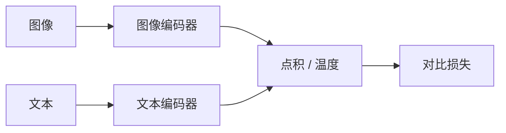
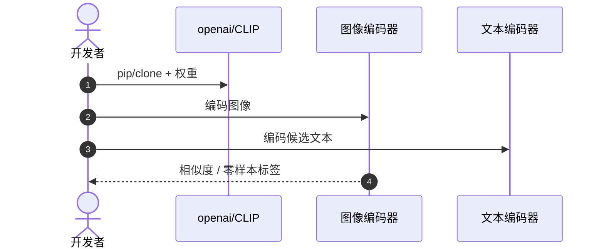
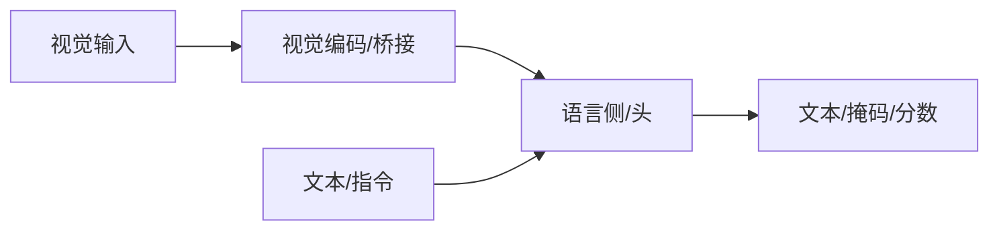

# CLIP：自然语言监督下的可迁移视觉模型

**CLIP**（*Learning Transferable Visual Models From Natural Language Supervision*，[arXiv:2103.00020](https://arxiv.org/abs/2103.00020)，[代码](https://github.com/openai/CLIP)）由 **OpenAI** 提出：用超大规模图文对做 **对比学习**，让匹配图像与文本在嵌入空间靠近。模型/工程实体见 [clip](#项目资源与工程补充)；**本页是论文 canonical 节点**。

## 一句话定义

**先把「看见」和「读到」拉到同一空间，VLA 才谈得上用语言条件化视觉。**

## 英文缩写速查

| 缩写 | 英文全称 | 简要说明 |
|------|----------|----------|
| CLIP | Contrastive Language-Image Pre-Training | 本工作 |
| VLM | Vision-Language Model | 后续多模态模型族 |
| ZS | Zero-shot | 无任务微调的分类/检索 |
| SigLIP | Sigmoid Language-Image Pretraining | 语言对齐后继 |

| InfoNCE | InfoNCE Loss | 对比损失形式 |
| ViT | Vision Transformer | 常用视觉塔 |
| Text Enc | Text Transformer | 文本编码器 |

## 为什么重要

- 纳入 [VLA/WM 阅读路线](../../sources/blogs/wechat_embodied_ai_lab_vla_wm_reading_roadmap_2026-09-02.md) 的视觉–语言基座。
- 几乎所有早期 VLA 都直接或间接用 CLIP / 其变体作视觉塔。
- 零样本识别支撑「训练未见物体」叙事（见 [RT-2](./paper-rt-2.md)）。
- **已开源** 推理接口。

## 核心信息

| 项 | 内容 |
|----|------|
| **机构** | 开放人工智能（OpenAI） |
| **结构** | 图像编码器 + 文本编码器 |
| **损失** | 双向对比交叉熵 |
| **能力** | 零样本分类与开放词汇检索 |
| **开源** | **已开源** [openai/CLIP](https://github.com/openai/CLIP) |

### 流程总览

## 评测

- 零样本 ImageNet 等分类接近有监督基线（原文表）。
- 机器人侧价值是 **开放词汇对齐**，不是操作成功率。
- 几何细节常弱于 [DINOv2](./paper-dinov2.md)。

## 结论

**VLA 阅读从 CLIP 开始：没有图文对齐，语言指令只是字符串。**

- 对比学习比在图像标签上监督学习更适合开放世界
- 零样本能力解释「为何能认出训练没见过的杯子」
- 操作还要几何特征，单 CLIP 塔往往不够
- [OpenVLA](./paper-openvla.md) 用 SigLIP+DINOv2 补齐

## 源码运行时序图

## 局限与风险

- **空间弱：** 深度、接触、细粒度几何不是 CLIP 训练目标。
- **偏见与数据：** 网页图文噪声进入下游 VLA。
- **不是策略：** 不能当动作模型用。

## 与其他工作对比

| 工作 | 相对本页 |
|------|----------|
| [DINOv2](./paper-dinov2.md) | 自监督几何特征更强 |
| [LLaVA](./paper-llava.md) | 冻结 CLIP + 投影 + LLM 指令微调 |
| [OpenVLA](./paper-openvla.md) | 双塔消费 CLIP 后继 |
| [RT-2](./paper-rt-2.md) | 把对齐后的 VLM 接到动作 |

## 项目资源与工程补充

### 核心原理

双塔分别编码图像与文本，同一配对拉近、非配对推远；推理时用文本提示当分类器权重。

### 工程实践

| 项 | 建议 |
|----|------|
| 权重 | 优先官方或 Hugging Face 发布 |
| 微调 | 指令数据质量优先；可用 LoRA |
| 机器人 | 明确延迟预算；重模型可云端核验 |

### 局限与风险

幻觉、错误 grounding、许可与安全过滤必须单独评估；开源状态以项目页为准，部署前核查权重协议。

## 关联页面

- [LLaVA 论文实体](./paper-llava.md)
- [DINOv2](./paper-dinov2.md)
- [OpenVLA](./paper-openvla.md)
- [VLA/WM 14 篇路线](../overview/vla-wm-reading-roadmap-14-papers-technology-map.md)

- [VLA 方法](../methods/vla.md)
- [多模态基础](../concepts/multimodality-basics.md)
- [多模态 LLM 路线](../overview/multimodal-llm-development.md)
- [BLIP-2](./paper-blip2.md)
- [Transformer CV 课程策展](../entities/transformer-cv-curriculum.md)

## 推荐继续阅读

- [arXiv:2103.00020](https://arxiv.org/abs/2103.00020)
- [openai/CLIP](https://github.com/openai/CLIP)

## 参考来源

- [clip_arxiv_2103_00020](../../sources/papers/clip_arxiv_2103_00020.md)
- [具身智能研究室 VLA/WM 阅读路线](../../sources/blogs/wechat_embodied_ai_lab_vla_wm_reading_roadmap_2026-09-02.md)
- [openai-clip](../../sources/repos/openai-clip.md)

- [Transformer 视觉应用课程大纲](../../sources/courses/transformer_cv_applications_syllabus.md)
