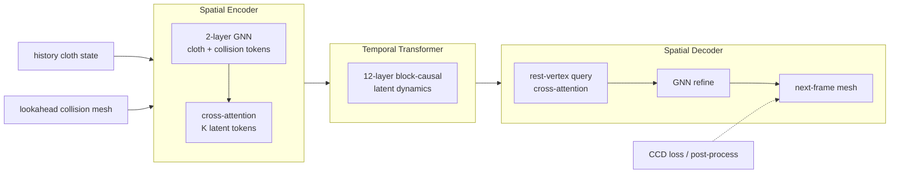

# ClothTransformer（Unified Latent-Space Cloth Simulation · arXiv:2605.27852）

**ClothTransformer**（*ClothTransformer: Unified Latent-Space Transformers for Scalable Cloth Simulation*，[arXiv:2605.27852](https://arxiv.org/abs/2605.27852)，NTU S-Lab / Feeling AI / Oxford / 上海 AI Lab 等，[项目页](https://yucrazing.github.io/clothtransformer/)）将 **布料仿真** reformulate 为 **潜空间自回归序列建模**：**单一 Transformer** 在 **人体着装、机器人抓取布料、布料–刚体自由落体碰撞** 三类交互下 **联合训练、无需 per-scenario 微调**；以 **cross-attention 固定 latent token** 使时序计算与网格分辨率解耦，并用 **GIPC 生成的 ~493.4k 帧无穿透数据集** 支撑 **可微 CCD 训练 + 推理 CCD 后处理**。

## 一句话定义

**把任意分辨率布料 mesh 压成固定 latent token，用统一 Transformer 自回归预测下一帧——同时解决场景专一、分辨率瓶颈与 DCD 穿透三大神经布料仿真痛点。**

## 英文缩写速查

| 缩写 | 英文全称 | 简要说明 |
|------|----------|----------|
| CCD | Continuous Collision Detection | 扫掠帧间轨迹的连续碰撞检测，抑制 tunneling |
| DCD | Discrete Collision Detection | 仅检查离散时刻的碰撞检测，快运动易漏检 |
| GNN | Graph Neural Network | 沿 mesh 边 message passing 的神经仿真主流范式 |
| GIPC | GPU Incremental Potential Contact | 论文 GT 数据所用无穿透 GPU 布料求解器 |
| IPC | Incremental Potential Contact | 变分接触框架，保证无穿插的传统 CG 求解路线 |
| MAT | Manifold-Aware Transformer | 论文基线之一，per-face token + 流形约束注意力 |
| MVE | Mean Vertex Error | 顶点位置均方误差（论文主精度指标，cm） |
| PBS | Physically Based Simulation | 传统物理仿真（FEM/IPC 等）对照语境 |
| SMPL | Skinned Multi-Person Linear Model | Human Garment 子集的人体驱动动画来源 |

## 为什么重要

- **embodied AI 与 VFX 共享瓶颈：** 高保真布料对 **影视/游戏沉浸** 与 **机器人抓布、叠衣仿真** 均关键；传统 PBS（IPC/GIPC）单帧仍可达 **数十秒**，难以实时。
- **突破「一模型一场景」：** 既往 HOOD / ContourCraft 系 GNN 与 UV/face token Transformer 多 **仅人体着装** 验证；本文 **单模型** 覆盖 **操纵 + 碰撞**，对 **可变形体 sim 资产与操作闭环** 有参考价值。
- **分辨率与实时性解耦：** latent 压缩使核心动力学为 \(O(N_{latents}^2)\)（默认 1024 tokens），**40k 顶点测试** 仍快于 mesh-coupled 基线——利于 **高分辨率推理** 与 **下游 WM/规划** 耦合。
- **CCD 训练需要干净 GT：** 公开布料数据常含残余穿透，阻碍严格 CCD 监督；本文 **493.4k 帧无穿透集** 可服务 **接触丰富可变形仿真** 研究（与 [Deform360](./paper-deform360-deformable-visuotactile-dataset.md) 真实布绳数据 **互补**：本文偏 **仿真 GT + 神经求解器**）。

## 核心结构与方法

| 模块 | 机制 |
|------|------|
| **问题形式** | 给定 \((X_t, V_t)\)、rest shape \(X_{rest}\) 与 lookahead 碰撞体 \(C_{t+1}\)，自回归预测 \(\hat X_{t+1}\) |
| **Spatial Encoder** | 2 层 GNN → cloth 顶点 token + 碰撞三角形 token → **learnable query cross-attention** → 固定 \(K\) latent tokens |
| **Temporal Transformer** | 12 层、768 dim、SwiGLU FFN；block-causal masking 演化 \(Z_t \to Z_{t+1}\) |
| **Spatial Decoder** | rest 顶点 query latent → cross-attention → GNN 细化 → 3D 坐标 |
| **CCD** | 训练：Self-VF / Self-EE **detect-then-regress** 可微 loss；推理：五类 primitive **CCD 后处理** |
| **损失与日程** | Pretrain \(\mathcal{L}_{mse}+\mathcal{L}_{contact}\) 160k steps → Finetune 加 \(\mathcal{L}_{ccd}\) 40k steps；rollout 1→5 步课程 |

### 流程总览

### 无穿透数据集（三场景）

| 子集 | 内容 | 序列数 | 帧数 |
|------|------|--------|------|
| **Human Garment** | SMPL 着装 T 恤/裙，走跑跳舞等 | 56 | 13.4k |
| **Robotic Manipulation** | 1000+ 布料网格 + 夹爪抓取抬起 | 1000 | 240k |
| **Diverse Object Collision** | 布料自由落体至 Objaverse 刚体 | 1000 | 240k |
| **合计** | GIPC 仿真，240 帧/seq，60 Hz | 2056 | **493.4k** |

布料 mesh 约 **1k–4k 顶点**；碰撞体 **0.6k–5.1k faces**。

### 实验要点（索引级）

| 轴 | 报告口径 |
|----|----------|
| **vs 基线** | SOTA GNN（HOOD/ContourCraft 骨干）、MAT、LayersNet；**单统一模型** 三场景 test MVE **~6.5–15 cm**，最强基线 **~31–149 cm**（约 **4–9×** 误差比） |
| **CCD 消融** | DCD only → +CCD loss → +CCD post. 逐步消除布–物与自碰撞伪影 |
| **Latent 压缩** | \(K=1024\) 默认：**~4.9 ms/frame** 推理，精度–效率折中最优（Human Garment 50k-step 消融） |
| **跨分辨率** | ~3.6k 训练 → **40k 顶点测试** 仍优于基线；核心 Transformer 耗时随分辨率增长慢于 GNN/MAT |
| **训练算力** | 约 **300 NVIDIA H200 GPU·h**（160k+40k steps，batch 32） |

## 工程实践

| 项 | 说明 |
|----|------|
| **默认架构** | \(N_{latents}=1024\)；Encoder GNN hidden 1024；AdamW lr \(10^{-4}\) cosine 至 \(10^{-7}\) |
| **数据获取** | [Hugging Face `YuCrazing1/ClothTransformer-dataset`](https://huggingface.co/datasets/YuCrazing1/ClothTransformer-dataset)（2026-07-17 发布） |
| **代码入口** | [GitHub `YuCrazing/ClothTransformer`](https://github.com/YuCrazing/ClothTransformer) — **截至 2026-07-20 仅 README**，训练/推理待补 |
| **GT 复现** | 论文用 **GIPC** 生成无穿透序列；自研数据需同等 **IPC 级无穿透保证** 方可启用严格 CCD 监督 |
| **机器人下游** | Robotic Manip. 子集提供 **夹爪–布料** 神经仿真先验，可对接 **操作规划 / sim2real**（论文未报真机闭环） |

### 开源状态（2026-07-20 项目页核查）

- **已发布：** ~493.4k 帧数据集（Hugging Face）。
- **部分 / 待补全：** GitHub 仓 **无训练推理实现与预训练权重**；复现需跟踪仓库更新或联系作者。
- 归档：[`sources/sites/yucrazing-clothtransformer-github-io.md`](../../sources/sites/yucrazing-clothtransformer-github-io.md)、[`sources/repos/YuCrazing-ClothTransformer.md`](../../sources/repos/YuCrazing-ClothTransformer.md)。

## 局限与风险

- **材质隐式：** 刚度等物理参数 **未显式条件化**，艺术向可控性弱于参数化 PBS。
- **自回归误差累积：** 极端非线性动态下单步 AR 仍可能漂移；论文提及 **chunked 多步预测** 为后续方向。
- **拓扑固定：** **不支持撕裂** 等拓扑变化；仅固定 mesh 连接关系下变形。
- **操纵场景边界：** Robotic Manip. 为 **仿真夹爪抓取**，非真机触觉/滑移；与 [Flying Knots](./paper-flying-knots.md) 等 **真机可变形体 IL** 路线不同层。
- **碰撞率解读：** 低碰撞率若伴随 **布料整体漂移** 可能为退化解；需同时看 MVE 与视觉（论文 Table 2 脚注已警示）。

## 与其他工作对比

| 工作 | 关系 |
|------|------|
| **HOOD / ContourCraft（GNN）** | 人体着装 SOTA 骨干；**单场景或统一训练均劣于** ClothTransformer latent  formulation |
| **MAT / LayersNet** | Transformer 基线；mesh/UV 耦合分辨率，泛化与速度受限 |
| **[Deform360](./paper-deform360-deformable-visuotactile-dataset.md)** | **真实** 布/绳视触觉数据 + WM；本文偏 **仿真神经求解器 + 无穿透 GT** |
| **[Flying Knots](./paper-flying-knots.md)** | **真机绳操纵 ILC**；本文 Robotic Manip. 为 **仿真可变形体动力学** |
| **GIPC / IPC（PBS）** | 高精度慢速 **教师仿真器**；ClothTransformer 学习其轨迹分布以求 **更快推理** |

## 关联页面

- [Manipulation](../tasks/manipulation.md) — 机器人抓取/操作可变形体任务语境
- [Contact Dynamics](../concepts/contact-dynamics.md) — 接触约束与碰撞检测基础
- [Deform360](./paper-deform360-deformable-visuotactile-dataset.md) — 可变形体（含布）真实数据与 WM 对照
- [Generative World Models](../methods/generative-world-models.md) — 学习式物理/动态预测更广脉络
- [Flying Knots](./paper-flying-knots.md) — 可变形体真机操纵对照

## 推荐继续阅读

- [ClothTransformer 论文（arXiv:2605.27852）](https://arxiv.org/abs/2605.27852)
- [ClothTransformer 项目页](https://yucrazing.github.io/clothtransformer/)
- [ClothTransformer 数据集（Hugging Face）](https://huggingface.co/datasets/YuCrazing1/ClothTransformer-dataset)
- Li et al., *GIPC: GPU-Accelerated Incremental Potential Contact* — 论文 GT 仿真器
- Bian et al., *ContourCraft* — DCD 后处理多衣穿透 SOTA 对照

## 参考来源

- [ClothTransformer 论文归档（arXiv:2605.27852）](../../sources/papers/clothtransformer_arxiv_2605_27852.md)
- [ClothTransformer 项目页](../../sources/sites/yucrazing-clothtransformer-github-io.md)
- [YuCrazing/ClothTransformer 仓库](../../sources/repos/YuCrazing-ClothTransformer.md)
