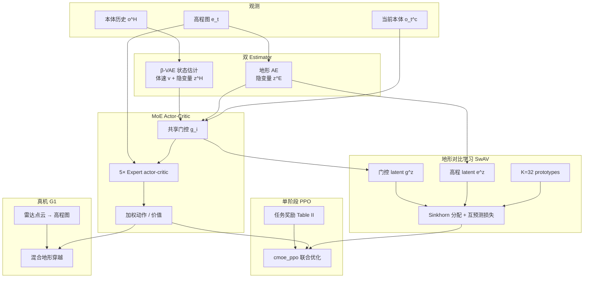
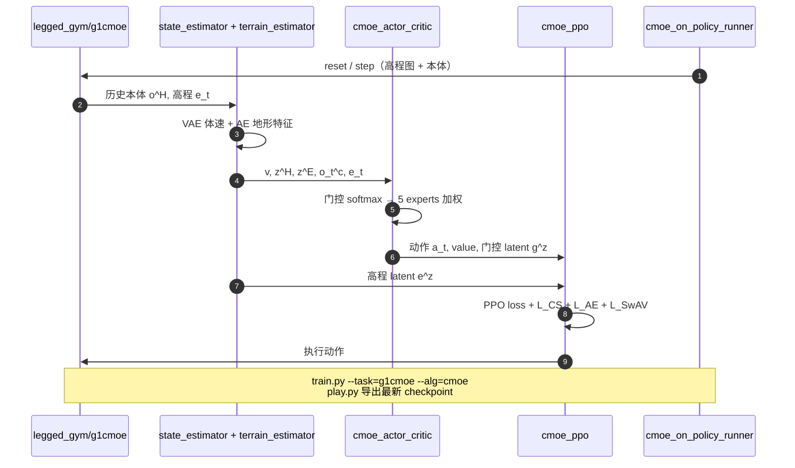

# CMoE：对比学习混合专家的人形运动控制与地形适应

**CMoE**（*Contrastive Mixture of Experts for Motion Control and Terrain Adaptation of Humanoid Robots*，复旦大学，[ICRA 2026](https://arxiv.org/abs/2603.03067)；[项目页](https://hoshi-no-ai.github.io/CMoE/)）针对 **Vanilla MoE 在多地形的 lazy gating**——门控对各专家输出近乎均匀权重、专家无法按地形分化——提出 **单阶段强化学习**：在 MoE actor-critic 上叠加 **地形对比学习**，使 **同地形内** 专家激活分布一致、**跨地形** 互斥，从而把专家专精到坡/楼梯/沟/栏等不同地表。在 **Unitree G1** 上用雷达点云构造高程图，真机验证连续 **20 cm** 台阶、**80 cm** 沟、**30 cm** 栏与混合跑酷。

## 一句话定义

**不是再训一个更大的 MoE，而是用 SwAV 式对比损失把门控输出钉到高程 latent 的地形聚类上，让专家在单阶段 PPO 里真正按环境切换。**

## 英文缩写速查

| 缩写 | 英文全称 | 简要说明 |
|------|----------|----------|
| CMoE | Contrastive Mixture of Experts | 本文：MoE + 地形对比学习防门控塌缩 |
| MoE | Mixture-of-Experts | 门控 softmax 加权多专家 actor/critic |
| RL | Reinforcement Learning | 单阶段 on-policy 训练 |
| PPO | Proximal Policy Optimization | 底层策略优化算法 |
| VAE | Variational Autoencoder | 本体历史 β-VAE 估计体速与隐状态 |
| AE | Autoencoder | 高程图自预测特征提取 |
| SwAV | Swapping Assignments between Views | 无负样本的 prototype 聚类对比（本文地形对比骨架） |
| G1 | Unitree G1 Humanoid | 仿真与真机评测平台 |
| ICRA | IEEE International Conference on Robotics and Automation | 发表会议 |

## 为什么重要

- **点名 MoE 人形线的真实痛点：** 与 [MoRE](./paper-amp-survey-08-more.md)（两阶段 + gait 命令 MoE）、[Hiking in the Wild](./paper-hiking-in-the-wild.md)（单阶段 MoE + 深度）不同，CMoE 把贡献集中在 **门控是否随地形分化**——Vanilla MoE 的 t-SNE 与专家权重曲线是硬证据。
- **单阶段 vs 两阶段蒸馏：** 相对「单地形预训 + 第二阶段蒸馏」路线，八类地形 **同相位联合训练** + 课程学习，降低管线长度；mix1/mix2 成功率相对 Vanilla MoE 提升明显（0.767 vs 0.605）。
- **高程图 + 对比门控：** 与 [TRAMP](./paper-tramp-vision-assisted-bipedal-locomotion.md)（深度 + MoE + AMP）形成感知模态对照；CMoE 押 **LiDAR/雷达高程图** 与 **无 AMP 的纯任务奖励**。
- **极限数字可核对：** gap 0.974、真机 80 cm 沟、20 cm 连续台阶在论文 Table III 与 §V-E 有出处；适合作为 [楼梯/障碍感知 locomotion](../tasks/stair-obstacle-perceptive-locomotion.md) 选型表的一行。

## 核心信息

| 项 | 内容 |
|----|------|
| **机构** | 复旦大学（Fudan）智能机器人与先进制造学院 |
| **作者** | Shihao Ma、Hongjin Chen、Zijun Xu 等；通讯 Zhongxue Gan、Wenchao Ding |
| **发表** | ICRA 2026；[arXiv:2603.03067](https://arxiv.org/abs/2603.03067) |
| **平台** | Unitree G1 **12-DoF 下肢**（`g1_12dof.urdf`）；仿真 Isaac Gym Preview 4 |
| **感知** | 仿真特权/噪声高程图 0.7 m × 1.1 m；真机 **雷达点云 + 定位 → 高程图** |
| **专家数** | 5（论文 §IV-A） |
| **训练规模** | 4096 并行环境，20k epoch，RTX 4090 |
| **开源（截至 2026-08-29）** | **已开源** [`Hoshi-No-Ai/CMoE`](https://github.com/Hoshi-No-Ai/CMoE)；**无公开 checkpoint**。`Fudan-MAGIC-Lab/CMoE` 是**空占位**，勿克隆。mjlab 移植见 [senlanke/mimic `CMoE-G1`](./smp-g1-mjlab.md) |

## 流程总览

> 图示依据 arXiv §III 与官方 README 归纳；critic 特权观测细节以正文为准。

## 核心原理（归纳）

### 方法栈

| 模块 | 作用 |
|------|------|
| β-VAE 状态估计 | 从历史本体预测体速与 \(z^H\)，缓解部分可观测（式 3–4） |
| 地形 AE | 高程图自预测 MSE，提取 \(z^E\)（式 5） |
| MoE actor-critic | 5 专家 + **共享门控**；输出 softmax 加权（式 6） |
| 地形对比 SwAV | \(g^z\) 与 \(e^z\) prototype 分配互预测；同轨迹为正、跨轨迹为负（式 7–8） |
| 课程学习 | 八类地形分简单/复杂；复杂地形上速度命令课程 |
| 域随机化 | 关节/摩擦/电机、外力扰动；高程图延迟/高斯/椒盐/倒角（式 9） |

### 训练地形（Table I 摘要）

坡 0–20°、楼梯 0.05–0.23 m、沟 0.1–0.8 m、栏 0.2–0.4 m、离散凸起、两种台阶+沟混合（mix1/mix2）。

## 源码运行时序图

训练入口：`legged_gym/legged_gym/scripts/train.py`；算法实现在 `rsl_rl/rsl_rl/algorithms/cmoe_ppo.py`。真机部署需自建雷达→高程图节点，仓库未提供独立 onboard 包。

## 工程实践

| 项 | 建议 |
|----|------|
| 复现入口 | 克隆 [`Hoshi-No-Ai/CMoE`](https://github.com/Hoshi-No-Ai/CMoE)；**勿**换上游 rsl_rl/legged_gym；**勿**克隆空仓 `Fudan-MAGIC-Lab/CMoE` |
| 环境钉死 | Isaac Gym Preview 4 + PyTorch 1.13.1/cu117（README 测试栈） |
| 对比损失 | `num_prototype=32`, `temperature=0.2`；去掉后应回到 Vanilla MoE 行为 |
| 专家数 | 论文用 5；改专家数需同步改门控与对比维度 |
| 高程图噪声 | 真机前必须在仿真启用椒盐+倒角随机化（§IV-B） |
| Checkpoint | README 仅写 `legged_gym/logs/`；无 HF 权重需自训 |
| 真机感知 | 官方指向 [elevation_mapping_humanoid](https://github.com/smoggy-P/elevation_mapping_humanoid)（单 MID-360）；需自对齐分辨率/FOV |
| 真机部署 | 官方写明叠在 [rl_sar](https://github.com/fan-ziqi/rl_sar) 上（见 [robot_lab](./robot-lab.md) 部署链）；须改观测、动作、关节序与频率 |
| 只要 mjlab | [senlanke/mimic](./smp-g1-mjlab.md) 任务 `CMoE-G1`：77 点扫描 + 同结构五专家；**无**论文 Table III / 真机数字 |

## 实验与评测

### 仿真（3 m × 18 m，0.8 m/s，20 s，Table III）

| 方法 | slope | stair↑ | stair↓ | discrete | gap | hurdle | mix1 | mix2 |
|------|------:|-------:|-------:|---------:|----:|-------:|-----:|-----:|
| **CMoE** | 0.991 | 0.886 | 0.905 | 0.991 | **0.974** | 0.987 | **0.767** | **0.747** |
| Vanilla MoE | 0.957 | 0.798 | 0.908 | 0.987 | 0.818 | 0.970 | 0.605 | 0.662 |
| Base（无 MoE） | 0.966 | 0.481 | 0.483 | 1.000 | 0.221 | 0.779 | 0.276 | 0.388 |

平均行进距离上 CMoE 在 gap、mix 等地形亦领先（如 gap **14.876 m vs 11.980 m**）。

### 专家行为（§V-C）

- Vanilla MoE：各专家激活在小范围内波动，**不随地形切换**。
- CMoE：Expert 1 在上坡/栏等 **抬腿上行** 段激活升高；Expert 2 在 **下行** 段升高。
- **消融：** 去掉 Expert 1 输出 → 上楼失败、下楼仍可走，验证专家分工。

### 真机（§V-E）

| 地形 | 结果 |
|------|------|
| 沟 | 最大 **80 cm**（文献对比称最大之一） |
| 台阶 | 连续 **12 / 15 / 20 cm** 均可 |
| 栏 | **30 cm** |
| 坡 | **17°** |
| 混合 | 15 cm 台阶 + 60 cm 沟 + 30 cm 栏 + 上坡串联 |
| 鲁棒 | 未训练户外台阶边缘、拖拽与碰撞扰动下仍稳定 |

## 结论

**一句话总判：人形多地形 MoE 的瓶颈往往不是专家不够多，而是门控看不见地形——CMoE 用对比学习把门控和高程绑在一起，单阶段就能拉出可解释的专家分工与更高 gap/mix 上限。**

1. **先查门控 t-SNE 再看成功率** — 对比学习的主要收益是专家按地形聚类；Table III 里 gap/mix1 拉开最大。
2. **不是 AMP 论文** — 自然性靠任务奖励与接触塑形，别和 [MoRE](./paper-amp-survey-08-more.md)/[TRAMP](./paper-tramp-vision-assisted-bipedal-locomotion.md) 的对抗先验混谈。
3. **感知栈是高程图** — 与深度端到端（TRAMP/Hiking）选型时先定传感器：LiDAR/雷达 vs 深度相机。
4. **Expert 1 ≈ 上行专精** — 部署或剪枝时勿默认专家可互换；消融表明上楼依赖单一专家。
5. **开源训得动、权重得自训** — 代码完整但无官方 checkpoint；复现预算要含 Isaac Gym + 20k epoch。
6. **真机数字绑定 G1 + 社区高程图/部署栈** — 80 cm 沟/20 cm 台阶勿直接外推；落地路径是 `elevation_mapping_humanoid` + `rl_sar`，不是仓内 onboard 包。
7. **mjlab 移植 ≠ 官方数字** — [senlanke/mimic `CMoE-G1`](./smp-g1-mjlab.md) 只保证结构对齐；要对论文成功率仍跑官方 Isaac Gym。

## 与其他工作对比

| 对照 | 差异读法 |
|------|----------|
| [MoRE](./paper-amp-survey-08-more.md) | 两阶段深度 base + residual MoE + 多判别器 AMP + **gait 命令**；CMoE 单阶段、无 AMP、专攻门控-地形对齐 |
| [TRAMP](./paper-tramp-vision-assisted-bipedal-locomotion.md) | 同为单阶段 MoE；TRAMP 用 **深度 + 地形相关 AMP**，未解决 MoE 均匀激活 |
| [Hiking in the Wild](./paper-hiking-in-the-wild.md) | 同族单阶段 MoE + 感知；Hiking 用 **RGB 深度 + 边缘/足端软约束 + AMP 风格项** |
| [ParkourFormer](./paper-parkourformer.md) | Transformer + 未来两步监督；非 MoE 门控路线 |
| [Explicit Stair Geometry](./paper-explicit-stair-geometry-humanoid-locomotion.md) | 显式楼梯几何 token；CMoE 用 **隐式高程 AE + 对比门控** |
| [senlanke/mimic CMoE-G1](./smp-g1-mjlab.md) | 同结构五专家迁到 mjlab；官方仓仍是 Isaac Gym + 真机数字来源 |
| [AME](./paper-ame-attention-based-map-encoding.md) | 注意力选 foothold，非 MoE 门控；senlanke/mimic 里 AME 仍未验证 |

## 局限与风险

- **Isaac Gym 依赖：** Preview 4 已停更；社区 mjlab 移植见 [smp-g1-mjlab](./smp-g1-mjlab.md)，不是作者维护的官方第二栈。
- **无公开权重：** 复现真机数字需完整自训 + 感知对齐，周期较长。
- **高程图单点故障：** 雷达/定位失效则策略失明；无深度盲走回退。官方只给社区高程图指针，不随仓提供雷达节点。
- **对比超参敏感：** prototype 数与温度在 §IV-A 固定为 32/0.2，换地形课是否仍稳未充分报告。
- **全身跑酷未覆盖：** 结论节称未来扩展到 whole-body parkour；当前以下肢穿越为主。
- **专家数固定为 5：** 更多地形类型是否需更多专家，论文未系统扫描。

## 关联页面

- [楼梯/障碍感知 locomotion](../tasks/stair-obstacle-perceptive-locomotion.md) — 感知穿越枢纽
- [Humanoid Locomotion](../tasks/humanoid-locomotion.md) — 人形运动任务
- [Locomotion](../tasks/locomotion.md) — 腿式任务中心
- [地形适应](../concepts/terrain-adaptation.md) — 多地形策略概念
- [MoRE](./paper-amp-survey-08-more.md) — 两阶段 MoE + AMP 对照
- [TRAMP](./paper-tramp-vision-assisted-bipedal-locomotion.md) — 单阶段 MoE + AMP 对照
- [Hiking in the Wild](./paper-hiking-in-the-wild.md) — 单阶段 MoE + 深度跑酷
- [Unitree G1](./unitree-g1.md) — 硬件平台
- [senlanke/mimic CMoE-G1](./smp-g1-mjlab.md) — mjlab 移植
- [AME](./paper-ame-attention-based-map-encoding.md) — 注意力高程对照
- [robot_lab](./robot-lab.md) — `rl_sar` 部署链入口

## 参考来源

- [CMoE 论文归档](../../sources/papers/cmoe_contrastive_mixture_of_experts_icra_2026.md)
- [CMoE 项目页归档](../../sources/sites/cmoe-github-io.md)
- [CMoE 官方代码归档](../../sources/repos/cmoe.md)
- [senlanke/mimic 归档](../../sources/repos/senlanke_mimic.md) — mjlab `CMoE-G1` 移植

## 推荐继续阅读

- [arXiv:2603.03067](https://arxiv.org/abs/2603.03067) — 论文全文
- [CMoE 项目页](https://hoshi-no-ai.github.io/CMoE/) — 视频与框架图
- [GitHub: Hoshi-No-Ai/CMoE](https://github.com/Hoshi-No-Ai/CMoE) — 训练与 play 脚本
- [YouTube 演示](https://www.youtube.com/watch?v=Q95Ssg1FP7A) — 真机混合地形
- [elevation_mapping_humanoid](https://github.com/smoggy-P/elevation_mapping_humanoid) — 官方指向的 MID-360 高程图
- [rl_sar](https://github.com/fan-ziqi/rl_sar) — 官方指向的 G1 真机部署框架
