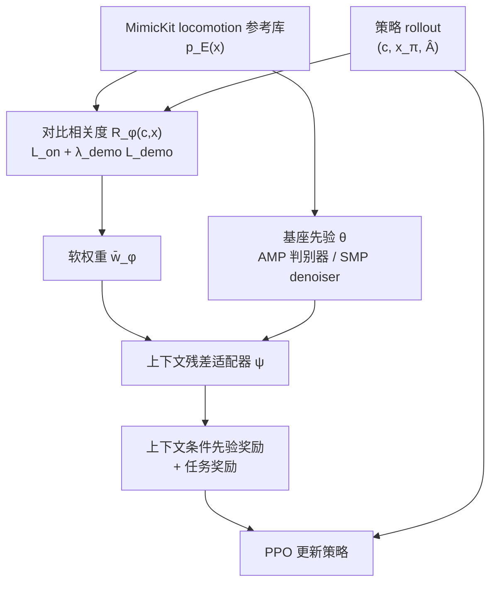

# CMP：上下文感知运动先验

**CMP**（*Context-Aware Motion Priors*；论文 *Learning Context-Aware Motion Priors for Humanoid Control*，[arXiv:2608.03234](https://arxiv.org/abs/2608.03234)）由 **香港科技大学广州校区（HKUST-GZ）** 提出：不切数据集、不先做 skill discovery，而是在下游 RL 中学习「任务上下文 ↔ 参考 clip」相关度，软重权参考侧监督，并用轻量残差适配器把 [AMP](../methods/amp-reward.md) / [SMP](../methods/smp.md) 从任务无关先验改成上下文条件先验。

## 一句话定义

**异构参考库里「看起来像人」≠「对当前目标有用」——用优势信号学相关度，再软重权 AMP/SMP 的参考监督，让先验跟着上下文走。**

## 英文缩写速查

| 缩写 | 英文全称 | 简要说明 |
|------|----------|----------|
| CMP | Context-Aware Motion Priors | 本文框架：上下文相关度 + 残差适配器 |
| AMP | Adversarial Motion Prior | 主实例化底座：对抗判别风格先验 |
| SMP | Score-Matching Motion Prior | 扩展实例化：冻结扩散 denoiser 先验 |
| GAE | Generalized Advantage Estimation | Online 分支用标准化优势筛正样本 |
| BCE | Binary Cross-Entropy | CMP-AMP 适配器的参考/策略侧分类损失 |

## 为什么重要

- **指出先验盲区：** [AMP](./paper-amp-survey-01-amp.md) / [SMP](../methods/smp.md) 回答「动作是否像参考分布」；CMP 补「在当前目标/命令/物体状态下，哪段参考更该监督」。
- **工程路径轻：** 不引入固定 skill latent、不手工切库；基座先验训练流程不变，只加对比编码器 + 残差适配器。
- **读数清晰：** 相对 AMP 在五任务上回报与样本效率双升；行走 clip ×100 失衡时 AMP 掉 11.5%、CMP-AMP 仅掉 2.8%；附录 E 在模拟 [G1](./unitree-g1.md) 上复现同趋势。

## 核心信息

| 项 | 内容 |
|----|------|
| **机构** | 香港科技大学广州校区（HKUST-GZ）；通讯 Renjing Xu |
| **作者** | Yunyang Mo、Yi Gu、Yangchen Zhou（共同一作）、Hanyang Cao、Renjing Xu |
| **平台** | MimicKit 人形控制任务；附录 E 额外报告模拟 Unitree G1 |
| **数据** | 与 AMP 同款 locomotion 参考集（[MimicKit](./mimickit.md) 分发）；无任务专用 demo / 技能标签 |
| **任务** | Target Location、Steering、Trajectory Following、Dodgeball、Dribbling |
| **开源** | **未列可运行入口**（截至 **2026-08-06** abs/HTML 无 GitHub / 项目页） |

## 核心原理

### 重权视角

任务无关先验的参考项是 \(\mathbb{E}_{x\sim p_E}[\ell^{\mathrm{ref}}(x)]\)。CMP 学 \(R_\phi(c,x)\)，诱导

\[
q_\phi(x\mid c)=w_\phi(c,x)\,p_E(x),\qquad
w_\phi(c,x)\propto\exp(\alpha R_\phi(c,x)).
\]

实践中用 minibatch softmax + clip 得 \(\bar{w}_\phi\)，以 `stop-gradient` 权重训练上下文残差适配器 \(\psi\)；\(\phi\) 与基座 \(\theta\) 不吃适配器梯度。

### 对比相关度（无标签）

余弦相似度 \(R_\phi=f_{\phi_c}(c)^\top g_{\phi_x}(x)\)（\(\ell_2\) 归一）。

| 分支 | 正样本 | 作用 |
|------|--------|------|
| Online \(\mathcal{L}_{\mathrm{on}}\) | \(\hat A>0\) 的策略 motion，按优势加权 | 抓「当前任务上有用」的上下文–运动对 |
| Demo \(\mathcal{L}_{\mathrm{demo}}\) | 同批上下文下的参考 clip；rollout 作负 | 把 query 钉在参考支撑上，防漂移 |

消融：去掉 \(\mathcal{L}_{\mathrm{demo}}\) 时检索质量变差（远目标可能漂到库外）；Uniform Adapter / Shuffled Relevance 说明**有适配器容量 ≠ 有正确相关度**。

### AMP / SMP 适配

| 底座 | 适配形式 | 部署期先验奖励 |
|------|----------|----------------|
| AMP | \(l_{\theta,\psi}=\mathrm{sg}[l_\theta]+\lambda_{\mathrm{res}}\Delta l_\psi(c,x)\) | \(-\log(1-\sigma(l_{\theta,\psi}))\) |
| SMP | \(\hat\epsilon=\mathrm{sg}[\epsilon_\theta]+\lambda_{\mathrm{res}}\Delta\epsilon_\psi\)；denoiser 冻结 | 用适配后误差替代原 SMP reward |

### 流程总览

## 源码运行时序图

**不适用** — 截至入库日（2026-08-06）公开材料**无**官方仓库或项目页 URL；正文提及 clip manifest「included in the code」，但未给出可克隆入口。若后续开源，应按「MimicKit 任务 + AMP/SMP 基座 → 训相关度与适配器 → 五任务评测」补 `sequenceDiagram`。

## 工程实践

| 项 | 做法 |
|----|------|
| 参考库 | 与 AMP 相同 locomotion 集；**不要**为五任务另切技能标签 |
| 相关度模型 | 上下文 / 运动各 256→128 MLP，\(\ell_2\) 归一后点积；运动输入与 AMP 同款 10 帧 clip |
| AMP 适配器 | motion/context 双支路 256-d，拼接后融合成标量 \(\Delta l\)；输出层**零初始化**以冷启动对齐基座 |
| 权重稳定 | minibatch 归一化后 clip；适配损失 detach 权重，避免相关度与适配器互相拖垮 |
| 读曲线 | 主看 test return +「达基线 80% 最终回报的 env steps」；勿只比最终曲线高度 |
| 失衡场景 | 行走类 clip 过采样时优先上 CMP，而非继续堆均匀 AMP |

## 实验与评测

**主表（Table 1）：** CMP-AMP 五任务回报全面高于 AMP（如 Steering 299→480、Trajectory 184→302、Dribbling 319→456）；CMP-SMP 增益更小但一致。样本效率上 CMP-AMP 多数任务显著更早达阈，Steering 与 AMP 持平。

**可解释性：** Target Location 上相关度权重随训练从「全局偏行走」演化为「近走、远远跑、侧/后偏转向跑」；带 \(\mathcal{L}_{\mathrm{demo}}\) 时近/远/后目标分别检索到走、跑、制动类 clip。

**消融（Dodgeball / Dribbling）：** Uniform Adapter 与 Shuffled Relevance 无法稳定复现全方法的效率；Online-only 最终回报可接近，但更慢。

**G1（Appendix E）：** 模拟 G1 上 CMP-AMP 五任务回报与达阈样本全面优于 AMP（Dribbling 294→467，达阈 10.1→2.9×10⁸）。

## 结论

**在异构运动先验上，上下文相关度重权比「换一个更大的任务无关先验」更能同时抬回报与样本效率；demo 锚定防止相关度漂出参考支撑，是稳训的第二杠杆。**

1. **先验选型：** 已有 AMP/SMP 基线、任务上下文变化大（目标/命令/物体）时，优先试 CMP，而不是先上 ASE/CALM 式独立 skill 空间。
2. **读主指标：** 同时看最终 return 与「达基线 80% 的 samples」；Steering 上回报大涨但达阈样本持平，说明增益形态因任务而异。
3. **失衡库：** 行走过采样会明显伤 AMP；CMP 把掉点压到约 3% 内——数据清洗前可先当缓解手段。
4. **消融优先级：** 学对相关度 ≫ 只加上下文适配器容量；\(\mathcal{L}_{\mathrm{demo}}\) 主保检索可信与样本效率。
5. **底座差异：** AMP 上增益更大；SMP 上一致但更小——适配器收益依赖基座如何把监督变成策略梯度。
6. **部署边界：** 全文为仿真；无真机、无运动质量独立评分；复现前先核是否放出代码与 clip manifest。

## 与其他工作对比

| 维度 | CMP | ASE / CALM / C·ASE | 标准 AMP / SMP |
|------|-----|--------------------|----------------|
| 多样性建模 | 原参考空间软重权 | 先学 latent skill 再选 | 整库均匀先验 |
| 何时适配 | 下游 RL 在线 | 常先 skill 阶段再冻结 | 不按任务上下文改参考权重 |
| 标签需求 | 无技能标签 | 常需结构/条件化训练 | 无 |
| 侵入性 | 轻量适配器，基座目标保留 | 引入中间技能接口 | 基线 |
| 代码（本库核查） | **无 URL** | 各有公开实现 | MimicKit / 社区复现 |

## 局限与风险

- 参考库**支撑外**的行为无法「变出来」；相关度只重权已有 clip。
- 依赖优势估计：critic 偏、探索不足会污染 online 正样本。
- 评测限于结构化上下文与仿真人形；高维感知、真机、独立运动质量指标未做。
- SMP 增益小于 AMP，说明方法有效性绑定底座表征方式。
- 开源缺口：选型复现前先核实仓库是否上线。

## 关联页面

- [AMP（论文实体）](./paper-amp-survey-01-amp.md) — 任务无关对抗先验源流
- [AMP 方法页](../methods/amp-reward.md) — 风格奖励工程读法
- [SMP](../methods/smp.md) — CMP 的第二实例化底座
- [AMP / ADD / SMP 对比](../comparisons/amp-add-smp-motion-prior-variants.md) — 变体选型表；CMP 可视为「上下文适配层」
- [人形 AMP 综述坐标](../overview/humanoid-amp-motion-prior-survey.md) — 分布约束线扩展阅读
- [MimicKit](./mimickit.md) — 参考数据与实验栈入口
- [Unitree G1](./unitree-g1.md) — 附录 E 形态验证平台
- [人形运动跟踪方法选型](../queries/humanoid-motion-tracking-method-selection.md) — 先验路线选型轴

## 参考来源

- [sources/papers/cmp_arxiv_2608_03234.md](../../sources/papers/cmp_arxiv_2608_03234.md) — 本次 ingest 归档
- [arXiv:2608.03234](https://arxiv.org/abs/2608.03234) — 论文与附录

## 推荐继续阅读

- Peng et al., *AMP: Adversarial Motion Priors* ([arXiv:2104.02180](https://arxiv.org/abs/2104.02180))
- Mu et al., *SMP: Reusable Score-Matching Motion Priors* ([arXiv:2512.03028](https://arxiv.org/abs/2512.03028))
- Peng, *MimicKit* ([arXiv:2510.13794](https://arxiv.org/abs/2510.13794))
