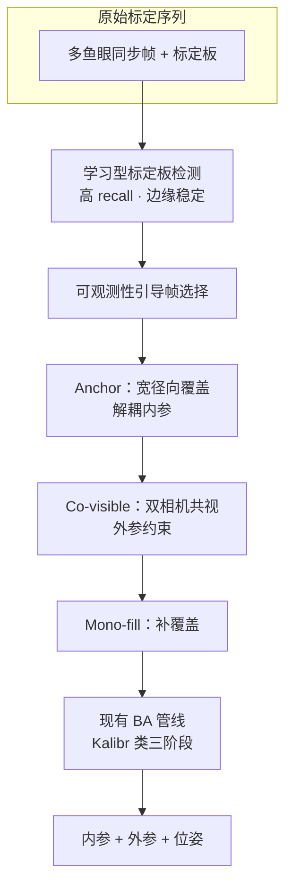

# CO-Calib（多鱼眼标定 · 观测质量）

**CO-Calib**（*Observation Quality Matters: Robust Multi-Fisheye Calibration via Failure-Oriented Analysis*，Liu et al.，arXiv:[2607.05777](https://arxiv.org/abs/2607.05777)，[代码即将开源](https://github.com/HKUST-Aerial-Robotics/CO-Calib)）由 **Peize Liu、Zhe Tong、Chen Feng（通讯）、Shaojie Shen**（香港科技大学电子与计算机工程系）提出。论文用 **failure-oriented 分析** 系统回答：多鱼眼标定何时 **well-conditioned**、何时在初始化阶段崩溃；并给出 **不改 BA 后端** 的 **plug-in 标定数据构造框架**，显著提升宽 FoV 与多相机配置下的成功率与外参精度。

## 一句话定义

**多鱼眼标定的关键不是「检测到更多角点」或「图像上更均匀撒点」，而是为内参初始化提供径向覆盖充分、参数方向可分离的观测序列——CO-Calib 用学习型检测 + 可观测性引导选帧实现这一点。**

## 英文缩写速查

| 缩写 | 英文全称 | 简要说明 |
|------|----------|----------|
| CO-Calib | Coverage- and Observability-aware Calibration | 本文 plug-in 标定数据构造框架 |
| BA | Bundle Adjustment | 联合优化内参、外参与标定板位姿的非线性最小二乘 |
| FoV | Field of View | 视场角；论文评测 180°–240° 鱼眼 |
| GT | Ground Truth | 合成数据中的真值角点/参数，用于隔离失败机制 |
| SR | Success Rate | 标定 trial 正常结束且重投影误差有界的比例 |
| LM | Levenberg-Marquardt | 非线性最小二乘常用求解策略（标定管线典型后端） |

## 为什么重要

- **多鱼眼是机器人感知标配：** 移动平台与数据采集 rig 用 **大 FoV 鱼眼** 提升状态估计、深度与环视覆盖；标定失败会直接污染 [VIO/SLAM](../concepts/state-estimation.md) 与 [视觉伺服](../methods/visual-servoing.md) 的外参链。
- **经验采集规则不可扩展：** 不同 rig 需定制轨迹、每相机采样与专用 target；轻微流程变化即可导致 **重复工程与平台间不可复用**。
- **纠正常见直觉：** 论文定量表明 **低边缘 recall** 与 **图像平面分布失衡** 可见但 **非主因**；甚至 **全 GT 观测** 反而降低成功率（暴露优化病态）。工程上应关注 **内参初始化条件数** 与 **焦距–投影形状解耦**，而非单纯堆帧数。
- **Plug-in 落地路径清晰：** 与 Kalibr / Basalt 等 **分阶段 BA 管线** 兼容；Hex-Fisheye 实机 Kalibr **0/10**、CO-Calib **10/10**，适合作为现有工具链 **前置观测构造** 模块。

## 核心信息

| 字段 | 内容 |
|------|------|
| 作者 | Peize Liu, Zhe Tong, Chen Feng（通讯）, Shaojie Shen |
| 机构 | 香港科技大学（HKUST）电子与计算机工程系 |
| 出处 | arXiv:2607.05777（2026-07） |
| 代码 | <https://github.com/HKUST-Aerial-Robotics/CO-Calib>（即将开源） |
| 对比基线 | Kalibr、Basalt；相关 TartanCalib、MC-Calib |

## 失败机制与 CO-Calib 结构

| 模块 | 作用 |
|------|------|
| **Failure-oriented 分析** | 16 组合成配置（4 FoV × 4 双目 yaw）；定位失败于 **内参初始化**；排除 recall / 平面分布主因；揭示 **focal–projection coupling** |
| **学习型标定板检测** | 在线物理 grounded 训练；畸变边缘区 **recall 与定位** 优于几何检测（240°：**0.926 vs 0.684** recall） |
| **Projective isotropy $s_{\mathrm{iso}}$** | 单应 Jacobian 奇异值比；筛除位姿初始化退化帧 |
| **Directed radial span $s_{\mathrm{drs}}$** | 径向覆盖直径归一化分数；分离焦距与投影形状参数 |
| **三阶段选帧** | **Anchor**（初始化 anchor）→ **Co-visible**（多相机共视外参）→ **Mono-fill**（补弱约束区域） |

### 流程总览

## 实验要点（论文报告摘要）

| 设置 | 指标 | Kalibr | CO-Calib |
|------|------|--------|----------|
| **合成 16 配置合计** | SR / 外参 $t$/$r$ | 68.1% / 0.54 mm · 0.029° | **99.3%** / **0.18 mm · 0.021°** |
| **同规模随机子集** | SR | — | 30.9%（证明非「少帧」本身） |
| **去掉 initialization** | SR | — | 13.5%（初始化不可替代） |
| **Hex-Fisheye 实机** | SR | 0/10 | **10/10** |
| **标准双目各 yaw** | SR | 5/5 | 5/5（外参一致性可比或更稳） |

**检测改进（Table IV 摘要）：** 180°–240° FoV 下学习型检测 recall **~0.93**、均值像素误差 **~0.78–0.83 px**，均优于几何法。

## 工程实践

1. **采集前：** 确认标定板在单帧内能跨越 **足够径向范围**（勿只在中部小区域晃动板子）。
2. **接入 CO-Calib：** 作为 **Kalibr 等工具的前置** — 输出筛选后的帧序列与检测，再进入原有 BA。
3. **阈值（论文默认）：** $s_{\mathrm{iso}}=0.3$；$s_{\mathrm{drs}}=110/\mathrm{FoV}$（FoV 可用厂商粗值）；Co-visible / Mono-fill 阶段 criteria × **0.6** 放宽。
4. **调试信号：** 若初始化失败，检查 **Schur 条件数轨迹** 与 anchor 帧的 $s_{\mathrm{drs}}$，而非先 blame 检测器 recall。
5. **与 [AprilTag](../entities/april-tag.md) / 棋盘格：** 框架面向 **标定 target 角点**；需与下游 BA 的 target 模型一致。

## 与其他工作对比

| 方法 | 改动范围 | 观测构造 | 宽 FoV 鲁棒性 | 与现有 BA 关系 |
|------|----------|----------|---------------|----------------|
| **Kalibr** | 完整 BA 管线 | 几何检测 + 经验采集 | 220°+ SR 陡降（合成 68.1%） | 基线工具箱 |
| **Basalt** | 完整 BA 管线 | 几何检测 | Hex-Fisheye 4/10；extrinsic std 较大 | 独立求解栈 |
| **TartanCalib** | 中间模型预测未检角点 | 补 peripheral 覆盖 | 依赖中间模型质量 | 增强检测后仍走原 BA |
| **MC-Calib** | Richer target + 分阶段 | 结构化多 target | 改善约束但缺 failure 分析 | 同类 BA 框架 |
| **CO-Calib** | **仅前置数据构造** | 学习检测 + 可观测性选帧 | 合成 **99.3%**；Hex **10/10** | **Plug-in**，不改 BA 后端 |

## 常见误区或局限

- **误区：「边缘检测不到所以标定失败」。** 论文用 GT 观测反证；问题是 **参数不可分**，不是 **点数不够**。
- **误区：「多拍几帧 / 更均匀覆盖图像就行」。** 随机同规模子集 SR 仅 **30.9%**；需要 **可观测性对齐** 的帧序，而非数量或均匀性 alone。
- **误区：「换更强 BA 求解器可跳过初始化」。** BA-only 两阶段 SR **13.5%**；宽 FoV 下 **分阶段线性化初始化** 仍是关键路径。
- **局限：** 代码 **即将开源**（ ingest 时尚未验证 API）；论文聚焦 **标定板 + 分阶段 fisheye BA**，未覆盖 IMU–相机 **时空标定**（参见 [Ultra-Fusion 类 OSC](../entities/paper-ultra-fusion-multi-sensor-slam.md) 语境）；对非鱼眼 pinhole 多相机系统的直接迁移需另验证。

## 关联页面

- [三维坐标变换（视觉–机器人）](../formalizations/3d-coordinate-transforms-vision-robotics.md) — 内参 $K$、外参与手眼标定链
- [AprilTag](../entities/april-tag.md) — 标定板 / fiducial 检测与标定入口
- [VINS-Fusion](./vins-fusion.md) — 同 **HKUST Aerial Robotics** 生态的多传感器 VIO
- [OpenVINS](./open-vins.md) — 含离线/在线标定工具链的 VIO 研究平台
- [Visual Servoing](../methods/visual-servoing.md) — 标定误差对 PBVS/IBVS 的敏感性
- [Levenberg-Marquardt](../methods/levenberg-marquardt.md) — BA 类非线性最小二乘求解背景

## 参考来源

- [CO-Calib 论文摘录（arXiv:2607.05777）](../../sources/papers/co_calib_observation_quality_fisheye_arxiv_2607_05777.md)
- [CO-Calib 仓库索引（即将开源）](../../sources/repos/co_calib.md)

## 推荐继续阅读

- 论文 PDF：<https://arxiv.org/pdf/2607.05777>
- Kalibr 多相机标定工具箱（ETH）：<https://github.com/ethz-asl/kalibr>
- HKUST Aerial Robotics：<https://github.com/HKUST-Aerial-Robotics>
