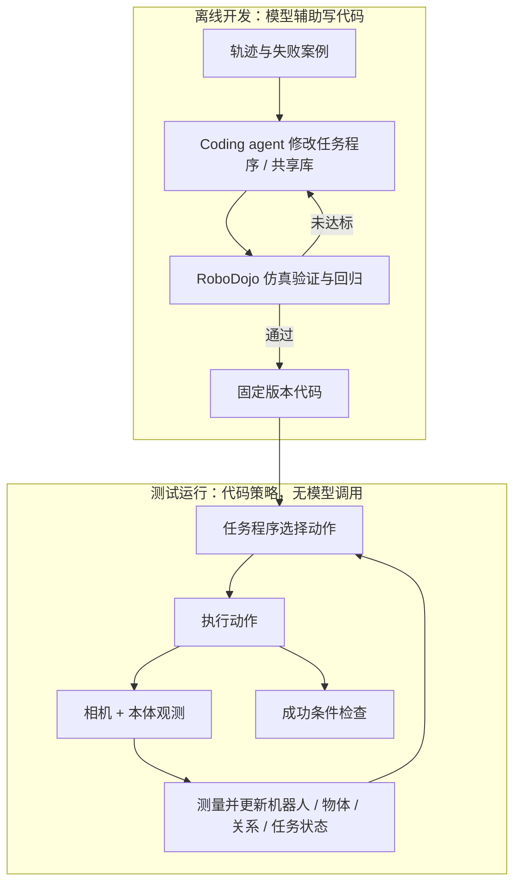

# COAP：具身图灵机与代码策略

## 一句话定义

**COAP（Code-Only-as-Policy）** 将策略表示为执行状态测量、任务逻辑与动作选择的可读程序，并将 coding agent 的代码改进环限定在离线开发阶段；部署运行时由固定代码闭环执行，论文报告不调用大模型。

## 英文缩写速查

| 缩写 | 英文全称 | 简要说明 |
|------|----------|----------|
| COAP | Code-Only-as-Policy | 以显式程序代码直接构成机器人策略 |
| ETM | Embodied Turing Machine | 将机器人与环境状态类比为可持续更新的纸带、策略类比为程序 |
| RSI | Recursive Self-Improvement | 通过检查结果、修改策略并重新验证来迭代改进 |
| VLA | Vision-Language-Action | 视觉-语言-动作模型；COAP 测试运行时不依赖它 |
| VLM | Vision-Language Model | 视觉语言模型；可用于离线代码开发而非 COAP 运行时策略 |
| SR | Success Rate | 任务成功率；需与评测集、种子和布局协议一并解读 |

## 论文与项目身份

- **论文：** [Embodied Turing Machines: Stateful Code for Robot Recursive Self-Improvement](https://arxiv.org/abs/2610.12369)，arXiv:2610.12369，v1 于 2026-10-08 提交。
- **作者：** Kairui Hu、Siyuan Hu、Fangzhou Hong、Zhaoxi Chen、Ziwei Liu。
- **作者单位：** 南洋理工大学（NTU）；论文作者信息另标注 Ropedia。
- **方法名称：** Code-Only-as-Policy（COAP）。COAP 是论文提出的方法，不是另一个已公开项目/仓库。
- **项目页与代码：** 截至 2026-10-10，arXiv 记录和全文未列独立项目页或官方公开代码仓库。相关实现状态按“未提供公开入口”记录，不推断为开源。

## 为什么重要

传统端到端策略通常把感知、记忆和动作压进模型参数，调试时不易定位错误。COAP 把状态测量、任务逻辑和动作选择展开为普通代码，使程序可读、可局部修改、可共享，并让错误更容易归因为感知、接触状态、任务逻辑或代码结构。

它真正改变的是模型的职责边界：coding agent 可以在离线阶段读失败轨迹并提出代码改动；但每个测试 episode 的动作由已编译好的代码执行。因而“运行时无模型”不等于“开发过程中没有模型”，也不等于论文公开了可复现的 COAP 源码。

## 方法：显式状态、共享代码与离线改进

论文采用具身图灵机的解释：机器人—环境联合状态相当于一条不断变化的“纸带”，程序读取当前状态、执行动作，再根据新的观测更新状态。COAP 的状态类别覆盖机器人、物体、环境、对象关系和任务进度。其感知过程利用相机观测、本体状态及已知几何/相机模型构造状态表示；遮挡期间可沿用已有状态，需要时再测量更新。

方法可分成两个严格不同的阶段：

1. **离线开发循环：** coding agent 检查代码、状态轨迹和失败案例，修改任务程序、感知/操作例程或共享库，再交由 RoboDojo 仿真验证及回归。改进的产物是版本化代码，而不是部署时持续采样的大模型动作。
2. **运行时控制循环：** 相机与本体观测进入状态测量模块；任务程序据状态选择动作，执行后再次观测、更新状态并判断是否完成。该循环由固定代码完成。

论文报告约 83% 的代码可跨新任务复用。这个比例体现共享代码库的迁移，而非成功率、零样本适应率或开源程度。

## 评测：RoboDojo 42 项双臂仿真任务

作者在 [RoboDojo](./robodojo.md) 的 42 项双臂仿真任务上评估 COAP。论文给出的协议是每任务 3 个随机种子、每种子 50 个布局。下表是论文报告的 COAP 成功率，属于作者报告的仿真结果：

| 任务维度 | 任务数 | COAP 成功率 |
|----------|--------|------------:|
| Memory | 6 | 89.9% |
| Precision | 8 | 75.1% |
| Open | 8 | 64.1% |
| Generalization | 12 | 65.7% |
| Long-Horizon | 8 | 56.4% |
| **总体** | **42** | **70.24%** |

论文另报告 progress score 为 75.45。横向比较中，作者将 COAP 的 70.24% 与其表中最佳 Agent Harness 基线 PhysicalRSI 的 31.38% 比较，差值约 **38.86 个百分点**。该对比依赖论文所列评测设置与版本，不能将百分点差写成相对百分比提升，也不等同于 RoboDojo 官方榜单认证结果。

## 与其他工作对比

| 策略范式 | 策略载体 | 状态 / 记忆 | 测试运行时是否调用大模型 | 主要工程权衡 |
|----------|----------|-------------|--------------------------|--------------|
| VLA / VLM 策略 | 学得的参数化模型 | 多由网络隐式编码 | 常见设置会周期性或逐步调用模型 | 可端到端学习，但诊断与状态持久化不透明 |
| Agent Harness | 模型 + 工具 / 控制接口 | 由模型上下文、工具和外部记忆共同维持 | 通常调用模型进行规划 | 灵活但有推理延迟与运行成本 |
| **COAP** | 显式任务程序与共享代码库 | 由代码显式测量、更新并持久化 | **论文报告不调用模型** | 可读可调试、低运行时模型开销；依赖高质量状态测量与任务代码覆盖 |

COAP 的可迁移性来自可组合的程序库和显式状态操作，不能简单等同于学习到的通用策略。其表现对场景资产/几何先验、状态估计质量、代码覆盖和离线开发投入敏感；与 VLA 或 Agent Harness 的数字比较必须固定任务、评测器、布局和运行设置。

## 局限与复现边界

- **仿真证据：** 论文的主要结果来自 RoboDojo 仿真，不能据此宣称真机部署或 sim-to-real 能力。
- **资产先验：** 评测环境可用的场景/几何信息会影响状态测量难度；部署到未知环境需要重新核查这一假设。
- **泛化并不均匀：** 论文报告 Generalization 维度低于标准场景成绩；随机布局上的结果尤其提示代码策略对布局变化仍敏感。具体值及划分须以论文对应表格为准。
- **开发成本：** 模型调用虽然从测试运行时移到离线阶段，但代码构建、失败分析和回归验证仍需时间与工程工具。
- **源码状态：** 截至 2026-10-10 未找到论文官方项目页或公开可运行仓库；目前可复核论文方法与结果，不能独立重跑 COAP 策略。

## 结论

**判断：** COAP 是一种把模型推理从在线控制环移至离线代码开发环的可解释策略路线；RoboDojo 仿真成绩有启发性，但源码缺席和仿真边界意味着现阶段应把它视作论文报告的方法结果，而非可直接复现的开放项目。

- 复核结果时先对齐 RoboDojo 任务子集、种子、布局数与成功判据，再看 70.24% 总分。
- 把 38.86 个百分点视为论文表内差值，不解读为真机优势或相对提升百分比。
- 将“运行时无模型调用”与“离线 coding agent 参与开发”分开记录。
- 评估迁移时单独审计状态测量、遮挡更新、几何先验与代码覆盖率，不能只看可读性。
- 在官方源码发布前，不把论文描述标为开源实现或可运行基线。

## 源码运行时序图

**不适用：** 截至 2026-10-10，论文记录和全文未提供可下载的官方代码仓库或 README 运行入口，因此没有可准确映射到源码文件的运行时序图。上方 Mermaid 图只概括论文描述的系统流程，不是代码调用图。

## 关联页面

- [RoboDojo](./robodojo.md) — COAP 的 42 项双臂仿真评测基准；COAP 策略与基准仓库是不同项目。
- [具身评测基准选型闭环](../overview/hub-embodied-eval-benchmark.md) — 将 COAP 放在策略成功率评测层解读。
- [AI Agent 评估](../concepts/ai-agent-evaluation.md) — coding agent 离线改进与在线 agent 执行边界。
- [VLA 方法](../methods/vla.md) — 与参数化视觉-语言-动作策略比较。

## 参考来源

- [COAP 论文归档](../../sources/papers/coap_embodied_turing_machines_arxiv_2610_12369.md) — 论文摘录、评测结果与开放状态核查。
- [RoboDojo 论文归档](../../sources/papers/robodojo_arxiv_2607_04434.md) — 基准任务与评测背景。
- [RoboDojo 官网与长期评测入口归档](../../sources/sites/robodojo-benchmark.md) — 官网、协议与公开基准代码状态。

## 推荐继续阅读

- [论文摘要与版本记录](https://arxiv.org/abs/2610.12369)
- [论文 HTML 全文](https://arxiv.org/html/2610.12369v1)
- [RoboDojo 官网与评测协议](https://robodojo-benchmark.com/)
