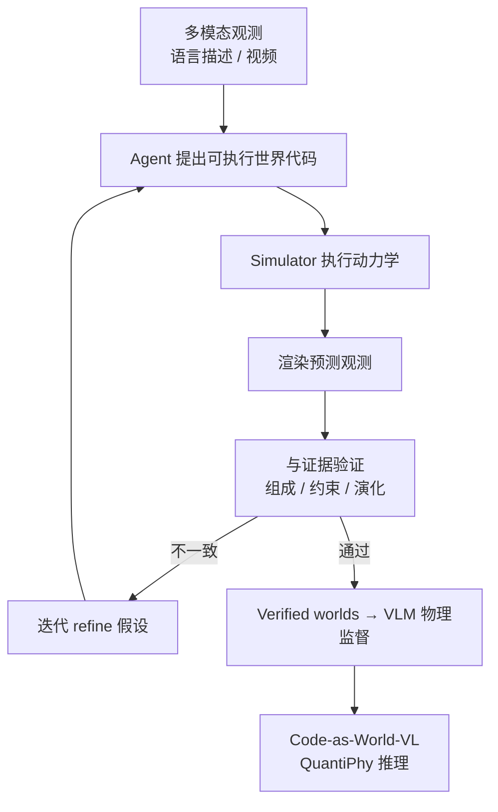
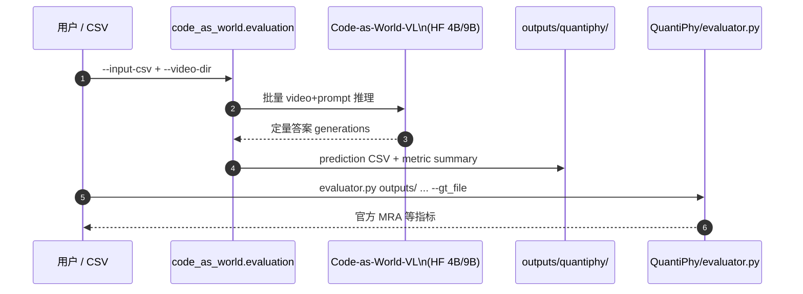

# Code-as-World（Executable World Representations for Physical Reasoning）

**Code-as-World**（*Code as Worlds: Agentic Discovery of Executable World Representations for Physical Reasoning*，[arXiv:2608.27549](https://arxiv.org/abs/2608.27549)，[项目页](https://mirros-lab.github.io/code-as-world/)，[GitHub](https://github.com/MirroS-Lab/Code-as-World)）由 **MirroS Lab** 提出：用 **可执行代码** 作为物理世界的 compact 本体——实体、状态、动力学、相机与渲染均可 **组合、执行、干预**；并通过 **agentic abductive discovery loop** 从自然语言或视频 **提出–执行–渲染–验证–迭代** 可执行世界假设。verified executable worlds 提供 **scalable 定量物理监督**，训练 **Code-as-World-VL** 在 **QuantiPhy** 上达到 SOTA 并报告超越 leading proprietary models。

## 一句话定义

**把物理世界表示成可执行代码，用 agent 循环发现/验证仿真世界，再以 verified worlds 监督 VLM 做定量物理推理。**

## 英文缩写速查

| 缩写 | 英文全称 | 简要说明 |
|------|----------|----------|
| VLM | Vision-Language Model | 视觉–语言多模态模型 |
| CaW | Code-as-World | 本文范式与模型族 |
| MRA | Mean Relative Accuracy | QuantiPhy 主指标 |
| RL | Reinforcement Learning | 本文不主打，但物理推理可接决策栈 |
| WM | World Model | 本文强调 **executable** 而非像素 rollout |
| API | Application Programming Interface | vLLM OpenAI-compatible Serving |

## 为什么重要

- **ontology vs evidence：** 像素/视频是 **evidence**；机制（状态、参数、动力学）需 **explicit、可检验** 表示 — 与纯 VLM 描述性物理推理划界。
- **四性质可运维：** **Abstraction**（概念级实体/关系）、**Compositionality**（对象/环境/动力学可重组）、**Executability**（simulator 可跑）、**Controllability**（参数/初值/规则可编辑做 counterfactual）。
- **Agentic discovery 可扩展监督：** 自动 propose–verify 降低人工写物理场景成本，为 **Code-as-World-VL** 提供大规模 **quantitative** 训练信号。
- **QuantiPhy SOTA + 开源权重：** 4B/9B HF 权重与官方 eval 脚本降低复现门槛；规模 4B→9B→27B MRA **50.6→55.4→58.6** 显示 scaling。

## 核心方法结构

| 模块 | 作用 |
|------|------|
| **Executable world code** | 物体、环境、关系、初态、动力学、相机、渲染的 **代码化** 表示 |
| **Agentic discovery loop** | 提出假设 → 执行仿真 → 渲染观测 → 与多模态证据比对 → refine |
| **Verification** | 一致性检验 **世界组成、约束、演化**，非 pixel-level 复制 |
| **Code-as-World-VL** | 在 verified worlds 上训练的 VLM，服务 **定量物理推理** |
| **QuantiPhy eval** | 官方 `code_as_world.evaluation` 对接 validation CSV + videos |

### 流程总览

## 源码运行时序图

图下说明：最小复现路径为 **HF 权重 + QuantiPhy validation 集 + `python -m code_as_world.evaluation {4b|9b}`**；simulation 示例走 `python -m code_as_world.simulation`（MuJoCo）。

## 主要结果

| 模型规模 | QuantiPhy avg MRA ↑ |
|----------|---------------------|
| Code-as-World-VL **4B** | **50.6** |
| Code-as-World-VL **9B** | **55.4** |
| Code-as-World-VL **27B** | **58.6** |

- 论文/report 称 **SOTA on QuantiPhy**，并 ** surpass leading proprietary models**（以项目页/论文表格为准）。

## 工程实践

| 项 | 内容 |
|----|------|
| **机构** | 镜界（MirroS Lab） |
| **环境** | Python 3.10/3.11 + CUDA；推理 `requirements/inference.txt` |
| **权重** | [HF 4B](https://huggingface.co/MirroS-Lab/Code-as-World-VL-4B)、[HF 9B](https://huggingface.co/MirroS-Lab/Code-as-World-VL-9B) |
| **评测** | `python -m code_as_world.evaluation 4b|9b --input-csv ... --video-dir ...` |
| **Serving** | vLLM OpenAI-compatible；Qwen3.5 no-think chat template |
| **Simulation 示例** | `pip install -r requirements/simulation.txt` → `python -m code_as_world.simulation` |
| **开源状态** | **已开源（推理/eval）** — 见下节 |

## 局限与风险

### 开源状态（步骤 2.5，2026-09-21）

| 资源 | 状态 |
|------|------|
| GitHub | **已开源** — 推理、QuantiPhy eval、simulation 示例 |
| HF 4B/9B | **已发布** |
| 完整 agentic discovery 训练流水线 | **部分** — 论文/报告描述 loop；公开仓以 **推理侧** 为主 |
| 27B 权重 | 项目页报分；HF 链以 4B/9B 为主（以官方为准） |

- **Discovery 质量瓶颈：** agent 提出代码的错误会传导到 supervision；依赖仿真器与验证器设计。
- **与像素 WM 互补：** 强项是 **定量、可编辑** 机制表示，非高保真自由形态视频 rollout。
- **QuantiPhy 外推：** MRA 提升是否迁移到真机/VLA 闭环需单独验证。

## 与其他工作对比

同样问「VLM 能不能做物理推理」，三条路线的分歧在 **机制放在哪里**：

| 维度 | Code-as-World（本文） | [LLMPhy](./paper-sa-2411-08027-llmphy-complex-physical-reasoning-using-large-la.md) | [LaST-HD](./paper-last-hd-latent-physical-reasoning.md) |
|------|------------------------|--------------------------------------------------------------------------------------|----------------------------------------------------------|
| 世界表示 | **可执行代码**（实体/状态/动力学/相机/渲染） | LLM 链式推理 + 外部物理引擎调用 | **latent** 物理状态 rollout |
| 可检验性 | 高：执行→渲染→与证据比对，可做 counterfactual | 中：依赖 LLM 推理链是否正确 | 低：latent 不直接可读 |
| 监督信号 | verified worlds 提供 **定量** 物理监督 | 以任务答案为主 | 以重建/预测损失为主 |
| 典型失效 | agent 提出的代码错了会污染监督 | 链式推理断裂 | latent 与真实物理量脱钩 |

- **与像素世界模型是互补而非竞争：** 本文强项是 **定量、可编辑的机制表示**，不是高保真自由形态视频 rollout；要评视频保真度应走 [Generative World Models](../methods/generative-world-models.md) 与 [评测闭环](../queries/embodied-eval-benchmark-selection-loop.md) 的 ② 层，两者指标不可互换。
- **与 [WorldBench](./paper-sa-2601-21282-worldbench-disambiguating-physics-for-diagnostic.md) 的关系：** 后者是诊断式物理基准（出题方），本文是解题方 + 训练数据生成方；读 QuantiPhy 分数时不要当成 WorldBench 上的结论。
- **横比的硬边界：** 4B/9B/27B 的 MRA **50.6 / 55.4 / 58.6** 是同一评测协议下的 scaling 证据；与其他工作横比前需确认 QuantiPhy 划分与 evaluator 版本一致，且 **MRA 提升是否迁移到真机/VLA 闭环仍未验证**。

## 结论

**Code-as-World 把「物理世界」从 VLM 的隐式描述推进到可执行、可验证的代码本体，并以开源 VL + QuantiPhy 工具链给出可复现的 quantitative SOTA 证据。**

1. **范式** 是 executable code + agentic verify，不是更大 VLM 死记物理 QA。
2. **QuantiPhy scaling** 清晰（4B/9B/27B），适合作为 physical reasoning VLM 选型参考点。
3. **官方 eval 脚本** 已对齐 QuantiPhy evaluator，复现路径明确。
4. **Discovery 训练环** 开源程度有限，深度复现 discovery 需读 report + 自搭仿真栈。
5. **与 LaST-HD / LLMPhy 等** 同属 physical reasoning，但 CaW 强调 **code-as-simulator** 而非 latent rollout 或纯 LLM 链式推理。
6. **部署：** 优先 vLLM serving + 16-frame video 配置（见 README）。

## 关联页面

- [Generative World Models](../methods/generative-world-models.md)
- [VLA](../methods/vla.md)
- [Video-as-Simulation](../concepts/video-as-simulation.md)
- [LLMPhy](./paper-sa-2411-08027-llmphy-complex-physical-reasoning-using-large-la.md)
- [WorldBench](./paper-sa-2601-21282-worldbench-disambiguating-physics-for-diagnostic.md)
- [LaST-HD](./paper-last-hd-latent-physical-reasoning.md)

## 参考来源

- [code_as_world_arxiv_2608_27549.md](../../sources/papers/code_as_world_arxiv_2608_27549.md)
- [code-as-world 项目页归档](../../sources/sites/code-as-world-project.md)
- [code-as-world 官方仓库归档](../../sources/repos/code-as-world.md)
- [arXiv:2608.27549](https://arxiv.org/abs/2608.27549)

## 推荐继续阅读

- [项目页](https://mirros-lab.github.io/code-as-world/)
- [GitHub README](https://github.com/MirroS-Lab/Code-as-World)
- [QuantiPhy](https://quantiphy.stanford.edu/)
- [MirroS Blog — Representing Physical World](https://mirros.ai/blog/representing-physical-world)
