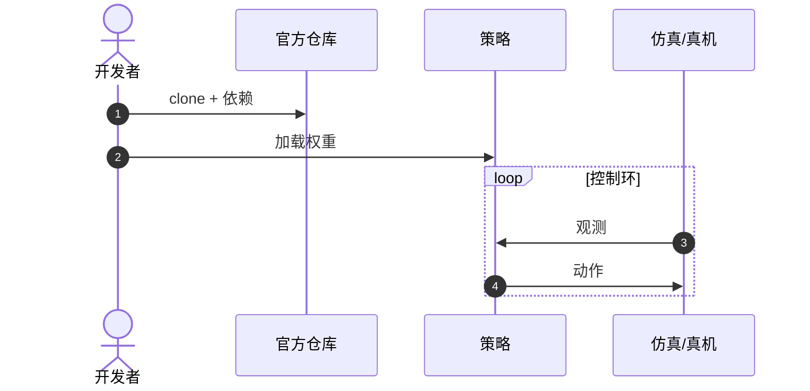

# CogACT

**CogACT**（[arXiv:2411.19650](https://arxiv.org/abs/2411.19650)，[代码](https://github.com/microsoft/CogACT)）收录于 Lumina [Embodied-AI-Guide 微信专辑](../../wiki/overview/embodied-ai-guide-wechat-album-curator.md)。本页为独立详情节点；实验数字以原文为准。

## 一句话定义

**VLM 语义主干 + 专用扩散动作专家。**

## 英文缩写速查

| 缩写 | 英文全称 | 简要说明 |
|------|----------|----------|
| VLA | Vision-Language-Action | 视觉–语言–动作策略 |
| LLM | Large Language Model | 大语言模型 |
| IL | Imitation Learning | 模仿学习 |
| BC | Behavior Cloning | 行为克隆 |

## 核心信息

| 项 | 内容 |
|----|------|
| **机构** | 清华大学 / 微软亚洲研究院（THU / MSRA） |
| **arXiv** | [2411.19650](https://arxiv.org/abs/2411.19650) |
| **开源** | **已开源** |

## 结论

CogACT 是 2024 末大 VLM + 扩散动作头代表。

- 扩散动作头影响接触任务
- 官方 GitHub 可复现
- 与 OpenVLA 自回归对照

## 源码运行时序图

官方仓库提供训练/推理入口；节点对齐 README。

## 关联页面

- [paper-pi0](./paper-pi0.md)
- [paper-openvla](./paper-openvla.md)
- [paper-diffusion-vla](./paper-diffusion-vla.md)
- [vla](../methods/vla.md)

## 参考来源

- [wechat_lumina_vla_survey_part1_2026-09-20.md](../../sources/blogs/wechat_lumina_vla_survey_part1_2026-09-20.md)

## 推荐继续阅读

- [arXiv:2411.19650](https://arxiv.org/abs/2411.19650)
