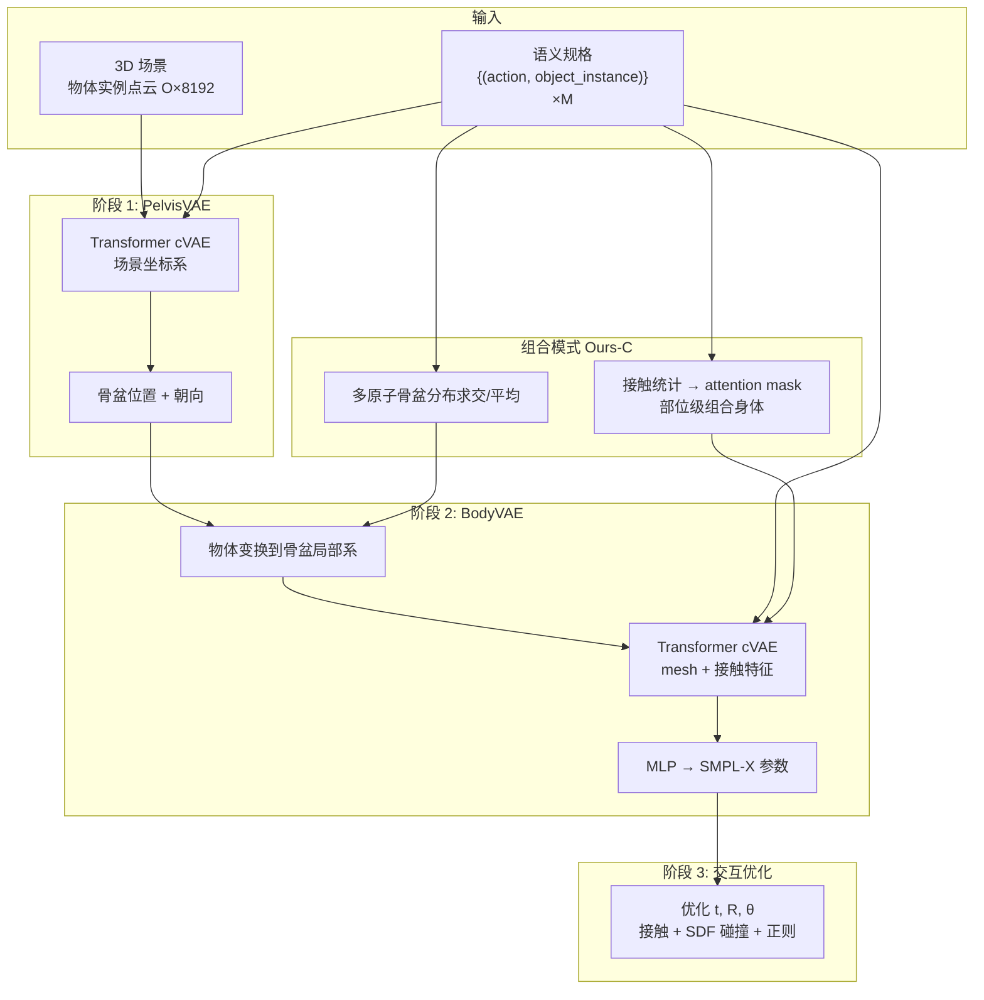

# COINS（Compositional Human-Scene Interaction Synthesis with Semantic Control）

**COINS**（*Compositional Human-Scene Interaction Synthesis with Semantic Control*，Zhao et al.，ECCV 2022，arXiv:[2207.12824](https://arxiv.org/abs/2207.12824)，[项目页](https://zkf1997.github.io/COINS/index.html)）研究如何在给定 **3D 室内场景** 与 **高层语义规格**（动作类别 + **具体物体实例**，如「sit on **the chair**」）下，生成 **自然、物理合理** 的 **SMPL-X 虚拟人体** 与场景交互。核心是把交互语义建模为 **可组合的原子 (action, object) 对**，用 **Transformer 条件 VAE** 分阶段生成骨盆与身体，并能在 **仅原子交互训练数据** 上合成 **复合交互**（如「坐沙发 + 摸桌子」）。

## 英文缩写速查

| 缩写 | 英文全称 | 简要说明 |
|------|----------|----------|
| COINS | COmpositional INteraction Synthesis | 本文方法：语义可控的组合式人–场景交互合成 |
| cVAE | conditional Variational Auto-Encoder | 以 action–object 对为条件的变分生成器 |
| SMPL-X | SMPL eXpressive | 带手/脸的参数化人体 mesh 模型 |
| PROX | Proximal Interaction | 人–场景交互 MoCap + 3D 场景约束数据集 |
| SDF | Signed Distance Field | 有符号距离场，用于场景碰撞惩罚 |
| VAE | Variational Auto-Encoder | 学习潜变量分布的生成模型 |

## 为什么重要

- **从「几何邻近」到「语义可控」：** 先前 PSI / PLACE / POSA 等多优化 **人体–场景几何关系**；COINS 显式接受 **「做什么 + 对哪个物体」** 的规格，适合游戏、AR/VR 与 **合成感知训练数据**。
- **实例级而非仅类别级：** 同场景多把椅子时，语义必须绑定 **物体实例**（点云几何），避免「sit on chair」歧义。
- **组合泛化：** 人类可同时与多物体交互；COINS 用 **骨盆分布求交 + 部位级 attention 组合**，避免为每种复合交互单独收集指数级数据。
- **数据贡献：** **PROX-S** 在 PROX 上补充 **实例分割** 与 **逐帧 action–object 语义**，成为后续人–场景方法（含 [CRISP](../methods/crisp-real2sim.md) 所引 PROX 生态）的重要扩展。

## 流程总览

## 核心机制（归纳）

### 组合交互表示

- 交互 $\mathbf{I}=(\mathbf{B},\{(a^{i},o^{i})\}_{i=1}^{M})$：**人体 mesh** + $M$ 个 **原子** (动作, 物体实例)。
- **原子交互** 不可再分（「sit on sofa」）；**复合交互** 由多个原子组成（「sit on sofa and touch table」）。
- 物体为 **8192 点 oriented point cloud**（位置/颜色/法向），支持 **开放集** 物体几何而非预定义类别表。

### Transformer cVAE（PelvisVAE / BodyVAE）

| 设计选择 | 意图 |
|----------|------|
| 人体/物体均为 **transformer token** | 统一处理无拓扑点云与 mesh 顶点 |
| 动作 embedding **加到配对物体 token**（非独立 token） | 「sit on」只调制沙发 token，不泄漏到桌子 |
| PointNet++ → 256 keypoints | 物体几何压缩 |
| Body 模板 + 个性化 shape | 控制胖瘦等体型，泛化不同人体 |
| 辅助 **二值接触特征** | 强语义线索（如 touch → 手部接触） |

### 三阶段合成

1. **PelvisVAE：** 在场景坐标系下，由 action–object 对采样 **骨盆帧分布**。
2. **BodyVAE：** 物体变换到骨盆局部系，生成 **655 顶点 mesh + 接触图**，并联 MLP 回归 **SMPL-X**。
3. **交互优化：** 以生成参数为初值，最小化 **语义接触** + **场景 SDF 碰撞** + **偏离初值正则**。

### 组合推理（无需复合训练数据）

- **组合骨盆：** 各原子 PelvisVAE 解码 → 优化使多骨盆帧空间一致 → **平均** 得复合骨盆。
- **组合身体：** 由原子交互 **接触统计** 构造 transformer **attention mask**，在 **身体部位级** 组合多个原子语义。

## PROX-S 数据集

| 字段 | 内容 |
|------|------|
| 场景分割 | per-mesh-vertex **实例 ID** + **mpcat40** 类别 |
| 交互标注 | 逐帧 **SMPL-X** + **action–object 对列表** |
| 来源 | PROX + PROX-E 扩展；Google Drive 发布（见 [仓库 README](https://github.com/zkf1997/COINS)） |

## 实验要点

| 基线 | COINS 相对优势 |
|------|----------------|
| **PiGraph-X** | 关节独立建模 → 姿态不自然、接触差、易穿透 |
| **POSA-I** | 场景放置优化易陷局部极小 → 语义不准 |
| **PiGraph-X-C**（组合） | Ours-C 语义准确度与 **无碰撞率** 更高；采样效率远优于 25K 级基线采样 |

- **感知研究：** 二元强制选择中 COINS 显著优于 PiGraph-X / POSA-I。
- **项目页补充：** 未见 action–object 组合、极端体型、噪声分割物体等定性案例。

## 常见误区或局限

- **静态姿态合成，非时序运动：** COINS 生成 **单帧/静态交互姿态**，不建模连续 locomotion 或动态 manipulation 轨迹；与 [TokenHSI](./paper-bfm-38-tokenhsi.md) 等人形 **控制** 路线问题设定不同。
- **依赖 SMPL-X 与 PROX 场景资产：** 部署需下载 SMPL-X、POSA `mesh_ds`、PROX 场景 SDF 等；工程栈偏 **图形学**（PyTorch3D、离屏渲染）。
- **组合身体略牺牲语义接触分：** 论文承认部分复合 action–object 在场景中 **几何上难以同时自然接触**（如同时 touch 墙与地板）。
- **与机器人控制的距离：** 输出为 **虚拟人 mesh**，不直接产生关节力矩或 RL 策略；可作为 **合成数据 / 场景先验**，但需额外管线接到 [Sim2Real](../concepts/sim2real.md) 或跟踪控制器。

## 与其他工作对比

| 路线 | 语义控制 | 实例级物体 | 复合交互 | 典型输出 |
|------|----------|------------|----------|----------|
| **POSA / PLACE** | 弱/几何 | 部分 | 难 | 场景中放置人体 |
| **PiGraph** | 类别级 verb–noun | 弱 | 需复合数据 | 骨架姿态 |
| **NSM / SAMP** | 动作类 | 单物体或整场景 | 有限 | 运动序列 |
| **COINS** | **action + 实例** | **强（点云）** | **原子训练即可组合** | SMPL-X 静态交互 |
| **CRISP** | 间接（视频恢复） | 平面原语场景 | N/A | **可仿真** 人形运动+场景 |
| **PhysHSI** | RL 任务奖励 | 仿真物体 | 多技能 | **真实人形** 搬箱/坐躺 |

## 关联页面

- [CRISP（Real2Sim）](../methods/crisp-real2sim.md) — 共享 PROX 基准语境；COINS **前向填充**，CRISP **后向重建**
- [TokenHSI](./paper-bfm-38-tokenhsi.md) — 人–场景交互 **task token** 化的人形控制对照
- [PhysHSI（AMP 调查）](./paper-amp-survey-15-physhsi.md) — 人形 **仿真** 人–场景交互（搬箱/坐躺）
- [Sim2Real](../concepts/sim2real.md) — 合成交互数据可作为 sim 侧资产上游

## 推荐继续阅读

- [COINS 项目页](https://zkf1997.github.io/COINS/index.html) — 交互 demo 与 loft 场景填充视频
- [POSA 项目页](https://posa.is.tue.mpg.de/index.html) — COINS 对比基线与 mesh 下采样依赖
- [PROX 数据集](https://prox.is.tue.mpg.de/index.html) — 原始人–场景交互 MoCap
- [CRISP OpenReview](https://openreview.net/forum?id=xlr3NqxUqY) — 同在 PROX 评测语境的 Real2Sim 路线

## 参考来源

- [coins_arxiv_2207_12824.md](../../sources/papers/coins_arxiv_2207_12824.md) — 论文摘录与 wiki 映射
- [coins-zkf1997-github-io.md](../../sources/sites/coins-zkf1997-github-io.md) — 项目页归档
- [coins.md](../../sources/repos/coins.md) — 官方代码仓库索引
