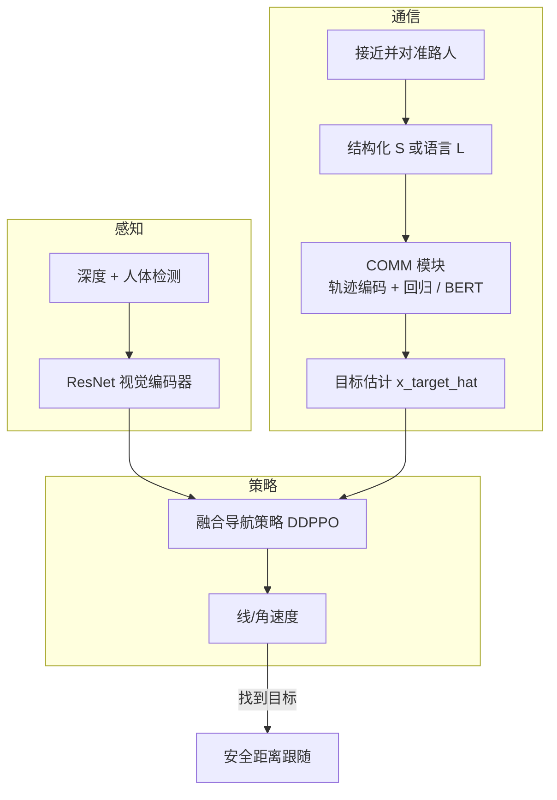

# CommNav（通信使能社交导航）

**CommNav**（*Robots Ask the Way: Communication-Enabled Social Navigation*，[arXiv:2607.01044](https://arxiv.org/abs/2607.01044)，IROS 2026）来自 **罗马第一大学（Sapienza University of Rome）**：在多居住者室内环境中，机器人**主动询问非目标路人**以定位目标个体，而非仅做避障或穷举搜索。作者扩展 Habitat 3.0 为 **Habitat 3.0c**，并在 DDPPO 导航骨干上接入预训练 **COMM** 模块，把稀疏结构化或自然语言线索回归为类 PointGoal 的目标估计；相对开启交互但无专用模块的基线，Episode Success **+10 个百分点**。口语人类指令（20 人研究）与完美结构化数据在 ES 上统计接近。

## 一句话定义

**别只会躲人——会开口问「见过她吗？」**——把路人线索压成目标位置估计，再喂给无地图社交导航策略。

## 英文缩写速查

| 缩写 | 英文全称 | 简要说明 |
|------|----------|----------|
| CommNav | Communication-enabled Social Navigation | 本文提出的任务：主动通信找人 |
| COMM | Communication Module | 把 \(\mathcal{S}\) 或语言映射为 \(\hat{\mathbf{x}}_{\text{target}}\) 的模块 |
| Habitat 3.0c | Habitat 3.0 Communication extension | 多人体 + 信息交换协议的仿真扩展 |
| DDPPO | Decentralized Distributed PPO | 本文导航策略训练框架 |
| ES | Episode Success | 找到并在安全距离跟随目标足够步数 |
| S / CR / \(\mathrm{CR}_T\) | Finding Success / Collision Rate / Target Collision Rate | 找到率、任意碰撞率、与目标碰撞率 |
| SDA | Social Dynamics Adaptation | 基线：编码可见人体轨迹的社交动力学（Scofano et al., ICLR 2025） |
| ORCA | Optimal Reciprocal Collision Avoidance | Habitat 3.0c 中人体运动/避障模型 |

## 为什么重要

- **社交导航从「躲」扩到「问」：** 传统方法强调碰撞与 proxemics；CommNav 把人当作**任务相关信息源**，贴近家居/办公/照护助理找人场景。
- **稀疏交互是难点，不是附赠传感器：** 仅打开 interaction 的 DDPPO **零增益**；需要 COMM 代理任务预训练才能吃进偶发线索。
- **语言落地有证据链：** 从结构化 \(\mathcal{S}\) → QWEN 合成指令 → 真人口语，ES 与定位误差椭圆表明策略对口语欠指定**足够鲁棒**。
- **仿真栈可挂靠 Habitat 生态：** 建立在 [Habitat-Sim](./habitat-sim.md) / Habitat 3.0 之上，便于与 Social Nav、PointGoal 文献对照；但 **3.0c 与 COMM 代码尚未放出**。
- **与「找人记忆」分工清晰：** [HUMEMBR](./paper-humembr.md) 做多日例行与身份库；本文做**即时单轮问路**的 mapless 搜索。

## 核心信息

| 字段 | 内容 |
|------|------|
| 机构 | 罗马第一大学（Sapienza University of Rome） |
| 发表 | IROS 2026（官方仓 bibtex）；arXiv [2607.01044](https://arxiv.org/abs/2607.01044) |
| 代码 | <https://github.com/S4b3/CommNav> — **待发布**（README under preparation，截至 2026-08-09） |
| 仿真 | Habitat 3.0 → **Habitat 3.0c**（多人、通信、ORCA；\(p=0.25\) 忽略机器人） |
| 策略 | DDPPO；视觉 ResNet（深度 + 人体检测）；动作线/角速度 |
| 通信内容 \(\mathcal{S}\) | \(x_h\)（见过否）、\(x_t\)（多久前）、\(\mathbf{x}_l\)、\(\mathbf{x}_d\)、\(\mathbf{x}_p\)（100 点轨迹）；说话者相对坐标 |
| 训练规模 | COMM 代理：~2.4M 实例 / ~60M 步；策略：200M 步、4×A100 ~6 天；评测 400 ep / 12 未见场景 |
| 主要基线 | DDPPO（Habitat 3.0）、SDA；消融各 \(\mathcal{S}\) 分量与更长训练 |

## 核心原理

### 输入 / 输出

| 侧 | 内容 |
|----|------|
| 视觉 | egocentric depth + humanoid detector |
| 通信（偶发） | 接近并对准路人时收到 \(\mathcal{S}\) 或自然语言 \(\mathcal{L}\) |
| COMM 输出 | \(\hat{\mathbf{x}}_{\text{target}}\)（类 PointGoal 额外传感器） |
| 策略输出 | 线速度 / 角速度；识别目标并同意后进入跟随 |

### 流程总览

### 关键机制（压缩）

1. **触发通信：** 机器人在视野内、距离足够近且朝向人体时接收消息；是否走向路人由策略端到端学习。
2. **COMM 预训练：** 回归当前目标真值位置；结构化路径用 ST-MLP 编码 \(\mathbf{x}_p\) 后与标量/向量线索拼接；语言路径用冻结 BERT。
3. **策略两阶段：** 先无通信学视觉导航，再接入（常冻结）COMM 微调；无消息时占位，不破坏自主性。
4. **语言桥接：** QWEN3-8B 把 \(\mathcal{S}\) 译成短句（刻意避免「厨房」等地名，强制相对空间推理）；人体研究收集口语欠指定指令做压力测试。

## 源码运行时序图

**不适用**：截至 **2026-08-09**，官方仓 [S4b3/CommNav](https://github.com/S4b3/CommNav) 仅含 README；正文写明 *under preparation*，训练/评测、Habitat 3.0c 配置、COMM 实现与生成数据均 **coming soon**，无可对齐的运行入口。待正式 release 后按 README 补 `sequenceDiagram` 与复现路径。详见 [仓库归档](../../sources/repos/commnav.md)。

## 工程实践

| 项 | 建议 / 论文设定 |
|----|----------------|
| 复现现状 | **代码未发布**；仅能作任务定义与对照，见 [仓库归档](../../sources/repos/commnav.md) |
| 仿真依赖 | Habitat 3.0 生态 + 本文 3.0c 扩展（配置待开源） |
| 训练技巧 | 先训无通信 DDPPO，再 **Fine-tune + 冻结 COMM**（Table IV：优于从零带 COMM 训） |
| 通信设计 | egocentric、相对说话者；勿依赖语义地名 grounding |
| 指标读法 | 主看 **ES / S / CR / \(\mathrm{CR}_T\)**；\(S_{\text{steps}}\) 已含问路绕行代价 |
| 真机缺口 | 文述需人分割/识别等模块；仿真假设无噪声传感与完美 egocentric |
| 伦理 | 交互限于同意主体；部署需同意、隐私与通信策略约束 |

## 实验与评测

| 设置 | 结果要点（以论文 Table I–IV 为准） |
|------|-----------------------------------|
| 单人 Habitat 3.0 | DDPPO/SDA ES ≈ **0.40 / 0.43**（复现对照） |
| 多人 3.0c 无通信 | ES 掉到 **0.14 / 0.16** |
| DDPPO + Interaction | ES 仍 **0.14**（不会用通信） |
| **COMM** | S **0.78**、ES **0.24**、CR **0.51**、\(\mathrm{CR}_T\) **0.23** |
| \(\text{COMM}_{\mathcal{L}}\) | S 0.78、ES **0.20**（语言略损 episode 级可靠性） |
| \(\text{COMM}_{\mathcal{L}(Human)}\) | ES **0.23±0.01**（与结构化接近；S 方差更大） |
| 消融 | 去 \(x_h\) 或 \(\mathbf{x}_p\)：ES → 0.19 / 0.18（最大跌幅） |
| 三人半速 | COMM ES **0.29** vs DDPPO/SDA 0.21/0.24 |
| 训练长度 | 加长 DDPPO 到 270M 仅 ES 0.14→0.16；增益来自 COMM 设计而非更久训 |

## 结论

**多智能体找人的瓶颈往往不是「多训几步避障」，而是把偶发、异构的人际线索变成策略可用的目标估计——COMM 代理预训练是关键阀门。**

1. **读指标优先 ES + S，其次 CR/\(\mathrm{CR}_T\)** — +10 pp ES 才是「会问路」的证据；SPS 略降是合理绕行税。
2. **有 interaction ≠ 会通信** — 裸接通信传感器的 DDPPO 零增益；必须有专用模块与预训练。
3. **口语够用** — 人体研究指令欠指定，但定位误差与结构化/LLM 路径接近，ES 不崩。
4. **\(x_h\) 与说话者轨迹最值钱** — 消融里对 ES 打击最大；设计传感器/话术时勿砍这两项。
5. **训练配方：视觉先稳，再挂 COMM** — Fine-tune 冻结 COMM 优于从零联合训，并省算力。
6. **选型边界** — 相对 [iCrowdNav](./paper-icrowdnav.md)（拥挤绕行不问路）、[PioneeR](./paper-notebook-learning-social-navigation-from-positive-and-neg.md)（正负示范舒适性）、[HUMEMBR](./paper-humembr.md)（多日记忆找人），本文专攻 **即时信息寻求型找人**；代码未开源前只作对照。

## 局限与风险

- **代码待发布：** 无法复现 Habitat 3.0c episode 或核对 COMM 超参。
- **仿真假设强：** 无噪声传感、完美 egocentric、oracle 级人体检测；真机需额外感知栈（见 [Sim2Real](../concepts/sim2real.md)）。
- **单轮交互：** 无多轮澄清/对话管理；复杂指代与纠错留给后续。
- **场景拥挤饱和：** 三人全速时碰撞本就难避；通信增益在半速/更大可通行空间更明显。
- **伦理与隐私：** 问路隐含对他人行踪的采集；文内强调同意与政策约束，部署不可省略。
- **误区：** 把 CommNav 当成 VLN（见 [VLN](../tasks/vision-language-navigation.md)）——目标是**找特定人并跟随**，不是执行自然语言路线指令；语言只是通信模态之一。

## 与其他工作对比

| 路线 | 人扮演角色 | 核心机制 | 开源/复现 |
|------|------------|----------|-----------|
| **DDPPO / SDA Social Nav** | 动态障碍 / 轨迹线索 | 避障 +（SDA）可见轨迹编码 | Habitat 3.0 文献栈 |
| **iCrowdNav** | 需绕行的人群 | BEV + 姿态意图 PPO | 仓占位待发布 |
| **PioneeR 正负示范** | 舒适性示范源 | 密度奖励 + 规则 + teacher | 未开源 |
| **HUMEMBR** | 多日例行目标 | 身份库 + LLM 记忆检索 | 代码已开源 |
| **VLN / 语言指令导航** | 指令下达者 | 语言→路径/动作 | 任务族不同 |
| **CommNav（本文）** | **信息提供者（非目标路人）** | **COMM 线索→目标估计** | **仓占位，代码待发布** |

## 关联页面

- [Habitat-Sim](./habitat-sim.md) — 底层仿真与 Habitat 3.0 社交设定入口
- [iCrowdNav](./paper-icrowdnav.md) — 视觉人群导航（不问路）对照
- [社会导航（正负示范）](./paper-notebook-learning-social-navigation-from-positive-and-neg.md) — 舒适性/规则另一范式
- [HUMEMBR](./paper-humembr.md) — 人中心多日记忆找人对照
- [强化学习](../methods/reinforcement-learning.md) — DDPPO / 策略训练语境
- [Sim2Real](../concepts/sim2real.md) — 仿真→真机感知缺口
- [导航·SLAM·自动驾驶开源栈总览](../overview/navigation-slam-autonomy-stack.md) — 学习型社交层坐标
- [视觉–语言导航](../tasks/vision-language-navigation.md) — 语言条件导航任务边界
- [导航纵深路线](../../roadmap/depth-navigation.md) — Stage 3 学习型导航入口

## 参考来源

- [CommNav 论文摘录（arXiv:2607.01044）](../../sources/papers/commnav_arxiv_2607_01044.md)
- [CommNav 仓库归档](../../sources/repos/commnav.md)

## 推荐继续阅读

- Sacco, Scofano, Spinelli, Galasso — *Robots Ask the Way: Communication-Enabled Social Navigation* — [arXiv:2607.01044](https://arxiv.org/abs/2607.01044)
- [GitHub 占位仓（跟进代码发布）](https://github.com/S4b3/CommNav)
- Puig et al., *Habitat 3.0* — [arXiv:2310.13724](https://arxiv.org/abs/2310.13724)
- Scofano et al., *Following the Human Thread in Social Navigation*（SDA）— ICLR 2025
