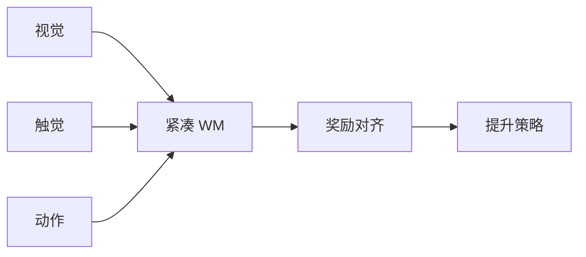

# Compact Visuotactile WM（arXiv:2609.09597）

**Compact Visuotactile WM**（*Compact Visuotactile World Models for Lifting: Prediction, Reward Alignment, and Force Constraints*，[arXiv:2609.09597](https://arxiv.org/abs/2609.09597)）由 **莱斯大学（Rice University）** 提出（公众号周更 ingest 见 [策展索引](../../sources/blogs/wechat_shenlan_weekly_manipulation_2026-09-14.md)）。

## 一句话定义

用于抓取提升的紧凑视觉触觉世界模型 — ~650k param action-conditioned visuotactile WM。

## 英文缩写速查

| 缩写 | 英文全称 | 简要说明 |
|------|----------|----------|
| WM | World Model | 世界模型 |
| BC | Behavior Cloning | 行为克隆 |
| IQL | Implicit Q-Learning | 隐式 Q 学习 |

## 为什么重要

抓取提升需力与触觉；小模型是否足够、WM 是否优于 BC/IQL 需实证。

## 核心信息

| 项 | 内容 |
|----|------|
| **机构** | 莱斯大学（Rice University） |
| **开源** | **未见/待发布**（步骤 2.5 核查：截至 2026-09-14 无可运行官方仓库） |

## 核心原理

action-conditioned visuotactile WM 预测下一触觉/视觉；对比 WM、BC、IQL、力反馈；强调 reward alignment 与 force constraints。

### 流程总览

## 源码运行时序图

**不适用** — 截至 **2026-09-14** arXiv 与常见项目页 **未见** 官方可运行代码仓库。

## 工程实践

| 项 | 说明 |
|----|------|
| 开源状态 | 未见官方仓库；以 arXiv 为准 |
| 复现入口 | 论文方法与超参；代码发布后再补 `sources/repos/` |
| 部署注意 | 650k 参数适合边缘部署；力约束防压碎/滑落。 |

## 实验与评测

提升任务成功率；预测 MSE vs 策略回报解耦分析。

## 结论

紧凑视觉触觉 WM 可行，但策略成功依赖奖励对齐而非单纯预测精度。

1. ~650k 参数即可建模抓取提升。
2. WM 预测误差与策略回报可脱节。
3. 力约束不可或缺。
4. IQL/BC 对照揭示范式差异。
5. Rice 真机/仿真混合验证。

## 与其他工作对比

| 对照 | 差异读法 |
|------|----------|
| 大模型 WM | 部署重 |
| 纯 BC | 缺力约束易失败 |

## 局限与风险

任务限于 lifting；泛化到新物体形状待验。

## 关联页面

- [manipulation](../tasks/manipulation.md)
- [generative-world-models](../methods/generative-world-models.md)
- [./paper-wm-craftnet.md](./paper-wm-craftnet.md)

## 参考来源

- [compact_visuotactile_wm_lifting_arxiv_2609_09597.md](../../sources/papers/compact_visuotactile_wm_lifting_arxiv_2609_09597.md)
- [公众号周更策展](../../sources/blogs/wechat_shenlan_weekly_manipulation_2026-09-14.md)

## 推荐继续阅读

- [https://arxiv.org/abs/2609.09597](https://arxiv.org/abs/2609.09597)
