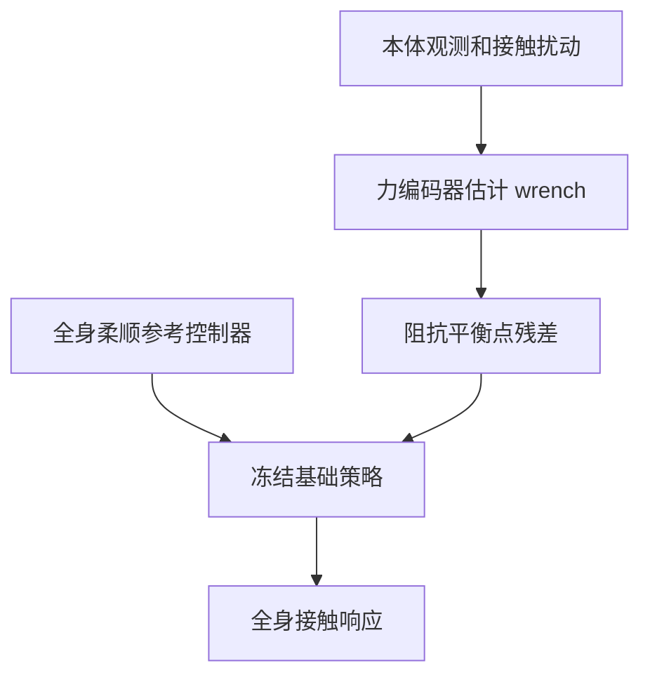

# CompliantWBC：重型人形的全身柔顺

## 一句话定义

CompliantWBC 估计外力 latent，并以有界阻抗目标残差调节冻结的全身策略，实现多身体接触位置的柔顺响应。

## 英文缩写速查

| 缩写 | 英文全称 | 说明 |
|---|---|---|
| WBC | Whole-Body Control | 全身协调控制 |
| RL | Reinforcement Learning | 强化学习策略训练 |
| G1 | Unitree G1 Humanoid | 相关论文的真机平台 |

## 流程总览

## 方法与证据

论文用多点全身阻抗控制器指导基础策略，再以受限残差调整各部位阻抗平衡点。项目页和 arXiv 报告约 70 kg 人形的受力响应、擦板、负重下蹲和协作搬运；真机平台的结果不等于任意人形负载保证。

## 局限与风险

结果依赖训练覆盖、机器人配置、传感器和论文中的任务协议。文章摘要可辅助定位；定量结果与代码开放状态应以论文和官方项目页为准。

## 结论

- 识别策略接收的目标和部署时实际可见的观测。
- 区分仿真评测、受控真机展示与开放场景能力。
- 结合接触、身体平衡和任务进度评估，不用单一成功率代表通用性。

## 关联页面

- [移动操作任务](../tasks/loco-manipulation.md)
- [SoFTA：温和行走与末端稳定](./paper-gentlehumanoid.md)

## 参考来源

- [来源档案](../../sources/papers/compliantwbc_arxiv_2609_33310.md)
- [arXiv:2609.33310](https://arxiv.org/abs/2609.33310)

## 推荐继续阅读

- [Day 4：移动操作](../overview/humanoid-motion-intelligence-day4-loco-manipulation.md)
