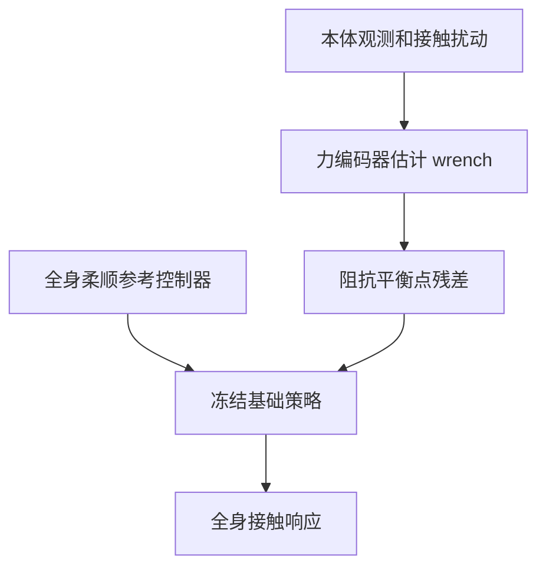

# CompliantWBC：重型人形的全身柔顺

## 一句话定义

CompliantWBC 估计外力 latent，并以有界阻抗目标残差调节冻结的全身策略，实现多身体接触位置的柔顺响应。

## 英文缩写速查

| 缩写 | 英文全称 | 说明 |
|---|---|---|
| WBC | Whole-Body Control | 全身协调控制 |
| RL | Reinforcement Learning | 强化学习策略训练 |
| G1 | Unitree G1 Humanoid | 多数先前柔顺工作的平台（约 35 kg） |

## 流程总览

## 方法与证据

论文用多点全身阻抗参考控制器（centroidal-momentum balance + 任意 link 的 Cartesian impedance）的虚拟目标构造 compliance-fidelity reward，两阶段训练：Stage 1 联合训练力编码器（gradient barrier 隔离 PPO 梯度，含 wrench 重建、对比聚类、KL 瓶颈与时间平滑）和基础策略；Stage 2 在冻结基础策略上训练有界残差，只修改各 link 的阻抗平衡点（而非电机指令或增益）。Phong 加权的受力位置采样器配合轴向解耦的骨盆锚点，把扰动覆盖到骨盆、髋、膝等下肢部位。平台为自研约 70 kg 人形（对比多数先前工作所用 35 kg 的 Unitree G1）。

## 实验与评测

- **仿真设置**：100 组 paired rollouts，扰动施加于手腕、肘、躯干、骨盆、髋、膝；所有变体共享训练配方、环境预算与随机种子。
- **基线与消融**：stiff 全身跟踪器 [TWIST2](./paper-twist2.md)、按本机重实现的上肢柔顺 [GentleHumanoid](./paper-gentlehumanoid.md)；消融为「无骨盆受力采样」和「无残差策略」。
- **指标**：自由跟踪误差 E_cmd^free、柔顺保真度 E_imp（受扰 link 位姿与真值 wrench 解析阻抗响应的距离）、近饱和关节比例 ρ_τ、下肢参与度 R_LB、成功率 S。
- **主结果（论文报告，Table II）**：Ours (full) E_imp = 2.58（其他基线与消融均 ≥ 3.81），ρ_τ = 0.93×10⁻²，R_LB = 0.31，S = 0.98；TWIST2 自由跟踪最好（E_cmd^free 2.18 vs 本文 4.65），但 S 仅 0.59、E_imp 最差 6.79；GentleHumanoid S = 0.91 而 R_LB 最低（0.14）。
- **力估计（论文报告，242k 样本）**：方向中位误差从 1–5 N 区间的 33° 降到 >100 N 的 19°；幅值比中位数 2.35 → 0.97 → 0.80，在 10–25 N 附近校准、重载时低估。
- **残差消融（论文报告，Table III）**：估计 wrench 下开启残差使 E_imp 3.81 → 2.58 cm、ρ_τ 1.56 → 0.93，回收 oracle wrench 差距约 90%（oracle 无残差 2.44 cm）；oracle 下残差增益仅 0.13，平衡点平均修改量从 2.1 cm 降到 0.4 cm，支持「残差补偿估计误差」的解释。
- **真机**：经遥操作部署于五个任务——静态受力响应、动态受力响应、协作搬运（交接 100 N 横杆）、擦板、负重下蹲；论文仅给出定性描述，称与仿真结果一致，未报告真机定量指标。

## 与其他工作对比

| 对照 | 区别 | 取舍 |
|---|---|---|
| [TWIST2](./paper-twist2.md) | stiff 全身跟踪，无受力感知目标 | 自由跟踪更准，但受扰时对抗外力，仿真成功率 0.59 |
| [GentleHumanoid](./paper-gentlehumanoid.md) | 柔顺仅限上肢链 | 上肢放松即可达到 S = 0.91，但下肢几乎不参与，无法处理骨盆/下肢受力 |
| [SoftMimic](./paper-notebook-softmimic-learning-compliant-whole-body-control.md) | 柔顺可扩展到下肢，但按单个动作做增强 | 本文面向工作空间内任意构型，代价是依赖解析参考控制器与两阶段训练 |
| [FALCON](./paper-loco-manip-161-109-falcon.md) / [CHIP](./paper-hrl-stack-36-chip.md) | 末端执行器柔顺（CHIP 残差作用于 hindsight goal） | 末端接口简单，但不覆盖躯干、骨盆等多点接触 |
| [ResMimic](./paper-resmimic.md) / [ASAP](./paper-notebook-asap-aligning-simulation-and-real-world-physics.md) | 残差作用于参考动作或动作输出 | 本文残差只改阻抗平衡点，保留解析控制器的物理含义与有界性 |
| 经典 operational-space 阻抗/导纳 | 解析 QP 分配质心 wrench | 有稳定性保证但需精确动力学、手工任务层级与接触模式推理；本文部署时不跑 QP |

## 局限与风险

结果依赖训练覆盖、机器人配置、传感器和论文中的任务协议。文章摘要可辅助定位；定量结果与代码开放状态应以论文和官方项目页为准。

## 结论

- 部署策略只看本体观测和运动指令，外力 wrench 靠力编码器 latent 估计；估计方向较准、幅值有偏，残差正是补这部分误差。
- 主要定量证据来自仿真（Table II/III）；真机五个任务为受控遥操作展示，仅有定性描述。
- 评测同时看 E_imp、ρ_τ、R_LB 和成功率，不以单一成功率或跟踪误差代表柔顺能力。

## 关联页面

- [移动操作任务](../tasks/loco-manipulation.md)
- [GentleHumanoid：上肢柔顺的全身运动跟踪](./paper-gentlehumanoid.md)

## 参考来源

- [来源档案](../../sources/papers/compliantwbc_arxiv_2609_33310.md)
- [arXiv:2609.33310](https://arxiv.org/abs/2609.33310)

## 推荐继续阅读

- [Day 4：移动操作](../overview/humanoid-motion-intelligence-day4-loco-manipulation.md)
