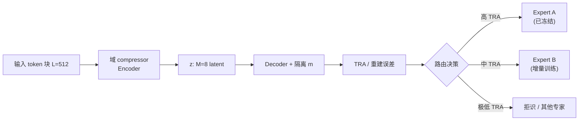

# Compression is Routing（重建误差作模块化 LLM 内在路由信号）

**Compression is Routing**（*Reconstruction Error as an Intrinsic Signal for Modular Language Models*，[arXiv:2512.16963](https://arxiv.org/abs/2512.16963)，2025；[ScienceStack 索引](https://www.sciencestack.ai/paper/2512.16963)）由 **Zhongpan Tang**（独立研究者）提出：在 **「Compression is Intelligence」** 前提下，把 **域专用 compressor 的 token 重建准确率（TRA）** 当作 **Intrinsic Distribution Fingerprint**，用于 **无需显式 gating 网络** 的专家调度，并同时指向 **64×  latent 序列压缩** 缓解超长上下文 KV VRAM。

## 一句话定义

**训练端到端语言自编码器做 64× 序列压缩，用 in-domain / semi-OOD / OOD 上 TRA 的断崖式差异，直接当模块化 LLM 的路由与增量扩展信号。**

## 英文缩写速查

| 缩写 | 英文全称 | 简要说明 |
|------|----------|----------|
| TRA | Token-level Reconstruction Accuracy | 逐 token 精确匹配比例，本文主指标 |
| MoE | Mixture-of-Experts | 混合专家；传统路线需显式门控 |
| OOD | Out-of-Distribution | 分布外数据；本文分 Semi-OOD 与 Full-OOD |
| AE | Autoencoder | 自编码器；本文为 Transformer AE |
| ID | In-Domain | 训练域（codeparrot 代码） |
| KV | Key-Value cache | 自回归推理缓存；压缩后可降 VRAM |
| CL | Continual Learning | 持续学习；本文主张冻结旧 compressor、挂载新专家 |

## 为什么重要

- **路由可解释：** MoE 门控常为黑箱；重建误差与 **「能否用该域 compressor 无损压回」** 直接对应，三级 TRA（**99.47% / 47.76% / 0.57%**）给出清晰阈值语义。
- **模块化演进：** 新域（如私域代码库）可 **只训新 compressor** 而不动旧专家，减轻单体全量微调 + Replay 的迭代成本与 **灾难性遗忘**。
- **与机器人栈的间接接口：** 长时日志/指令/代码混合 prompt 的 **上下文压缩**、[VLA 技能路由](../methods/vla.md)（如 AtomicVLA SG-MoE）与 **持续加技能** 都可把本文当作 **信息论侧** 对照——虽非具身论文，但问题结构同构。

## 核心信息

| 字段 | 内容 |
|------|------|
| 作者 | Zhongpan Tang（独立研究者） |
| arXiv | [2512.16963](https://arxiv.org/abs/2512.16963) |
| 模型规模 | **87M** 参数 Transformer AE |
| 压缩比 | **512 token → 8 latent（64×）**；\(d_{model}=512\) |
| 训练数据 | codeparrot/codeparrot-clean（GPT-2 tokenizer） |
| 开源（截至 2026-09-28） | **确认未开源** — 无官方 GitHub/权重/项目页 |

## 核心原理

### 信息流与物理隔离

\[
x \to \text{Encoder} \to z \to [z,m] \to \text{Decoder} \to \hat{x}
\]

- \(x\)：长度 \(L=512\) 的 token 序列。
- \(z\)：长度 \(M=8\) 的 latent 序列（**64:1** 序列长度压缩）。
- \(m\)：与 \(x\) 等长但 **不含 \(x\) 内容** 的辅助输入；Decoder **不能访问** 原始 \(x\)，迫使 \(z\) 成为唯一语义瓶颈。

### 「Compression is Routing」机制

1. 每个域（或任务流形）维护一个（或一组）compressor expert。
2. 对输入块计算 TRA；**高 TRA** → 当前 expert **正匹配**；**中等 TRA** → 触发 **增量专家**（域重叠，如 code↔Wiki）；**极低 TRA** → **拒识/换 expert**。
3. Latent 几何（UMAP/t-SNE）显示 code 与 Wiki **全局几乎正交**，路由可近似 **线性可分**，无需复杂门控 MLP。

### 流程总览

## 评测与结果

### Tab. 1：跨分布 TRA（主结果）

| 数据分布 | 验证 token 量 | TRA | 路由语义 |
|----------|---------------|-----|----------|
| In-Domain（Code） | 3,170,816 | **99.47%** | 强正匹配 |
| Semi-OOD（WikiText-103） | 320,512 | **47.76%** | 结构偏置 / 增量专家 |
| Full-OOD（随机 token） | 3,170,816 | **0.57%** | 强拒识 |

### 消融与几何（摘要级）

| 发现 | 含义 |
|------|------|
| \(M=8\) 为近无损最小 latent 长度 | \(M=2,4\) 明显信息丢失 |
| Code intrinsic dim \(\approx 200\) | 512 维 latent 大量冗余被压掉 |
| 无 harness 式隔离则易走捷径 | 与 agentic 论文不同，此处是 **输入隔离** 防 identity mapping |

### Harness 对照（概念层，非机器人实验）

论文未在 VLA/机器人 benchmark 上评测；具身读者应把数字读作 **压缩–路由可行性验证**，而非 sim 成功率。

## 与其他工作对比

| 维度 | Compression is Routing | 传统 MoE LLM | ICAE / Gist / CompLLM | [AtomicVLA](./paper-atomicvla.md) |
|------|------------------------|--------------|------------------------|-----------------------------------|
| 路由信号 | **重建 TRA**（无门控参数） | 训练 gating 网络 | 上下文压缩，非专家调度 | **Routing encoder + SG-MoE** |
| 压缩位置 | latent 序列 **64×** | 通常不压缩 KV | 4× 量级 prompt 压缩等 | 不主打 KV 压缩 |
| 持续学习 | 冻结旧 compressor、挂新模块 | 易遗忘 / 全量微调 | 多为推理 trick | 持续扩 **技能 expert** |
| 代码 | **未发布** | 各开源 MoE | 部分开源 | **MIT 已开源** |

## 源码运行时序图

**不适用。** 截至 **2026-09-28**，arXiv 与 ScienceStack **均未列出** 可运行仓库或训练脚本；报告定位为 **架构物理有效性验证**，邀请社区在大算力下扩展 scaling law。

## 工程实践（机器人 / VLA 读者）

| 项 | 建议 |
|----|------|
| 何时参考 | 设计 **多域 prompt 压缩**、**技能/本体 expert 调度**、或 **长上下文 KV 预算** 时，用作 **无门控路由** 的理论对照 |
| 勿过度迁移 | 固定 **512 token 块** 对 **交错域**（操作日志+代码+自然语言）有滞后；机器人多模态流需 **可变块长或层次路由** |
| 与 VLA 对照 | 需要 **可复现 robot 指标** 时优先 [GSR/ParaVLA](./paper-gsr-paravla.md)、[AtomicVLA](./paper-atomicvla.md)；本文 **无开源实现** |
| RAG 侧 | 与 [RAG context compression](../concepts/retrieval-augmented-generation.md) 同属 **减上下文** 族，但本文强调 **误差作路由** 而非仅减 token |

## 局限与风险

- **块级滞后：** 块内域突变时 \(z\) 受前段主导，切换点 TRA 异常。
- **灰色带：** 单块混合 code+自然语言时 TRA 难二分，需更细粒度或层次 compressor。
- **规模与消融：** 87M、单 code 预训练；独立研究者算力限制，**无** 大规模 MoE 系统实证。
- **未验证下游 LM 质量：** 报告验证 **compressor 物理性质**，未端到端证明替换 GPT 层后的任务 SOTA。

## 结论

**Compression is Routing 用 99.47% / 47.76% / 0.57% 三级 TRA 证明「重建误差 = 域指纹」可行，为无门控模块化 LLM 与 64× KV 压缩提供信息论起点，但代码未开源且固定块长限制真实混合域部署。**

1. **主结果读数** — Code TRA **99.47%**，Wiki **47.76%**，随机 **0.57%**。
2. **路由不必训 gating** — latent 流形 **正交/线性可分** 时，路由成本接近 **零额外网络**。
3. **增量专家叙事** — 中等 TRA 对应 **流形重叠**，适合挂 **增量 compressor** 而非重训单体。
4. **VRAM 副收益** — 512→8 latent 序列，理论 **64×** KV 占用下降（需与下游 LM 集成验证）。
5. **开源边界** — **无官方代码**；复现需自训 87M AE + codeparrot。
6. **机器人映射** — 对照 **VLA MoE 路由** 与 **长时 WAM 记忆压缩**，勿当作已验证的 loco-manip 方法。
7. **下一步** — 社区可在更大模型/多域上检验 \(M\)–\(L\) scaling 与 **交错域** 路由协议。

## 关联页面

- [VLA 方法总览](../methods/vla.md) — MoE / routing / 持续扩技能语境
- [AtomicVLA](./paper-atomicvla.md) — 显式 routing encoder + SG-MoE
- [GSR / ParaVLA](./paper-gsr-paravla.md) — 联合 V-L 路由脆弱性
- [MemoryWAM](./paper-memorywam.md) — gist token 长历史压缩
- [RAG](../concepts/retrieval-augmented-generation.md) — context compression 族

## 推荐继续阅读

- Delétang et al., *Language Modeling Is Compression*（arXiv:2309.10668）
- Ge et al., *In-context Autoencoder*（ICAE，arXiv:2307.06945）
- arXiv PDF：<https://arxiv.org/pdf/2512.16963.pdf>

## 参考来源

- [Compression is Routing 论文归档（arXiv:2512.16963）](../../sources/papers/compression_is_routing_arxiv_2512_16963.md)
- [ScienceStack 索引页归档](../../sources/sites/sciencestack-2512-16963.md)
